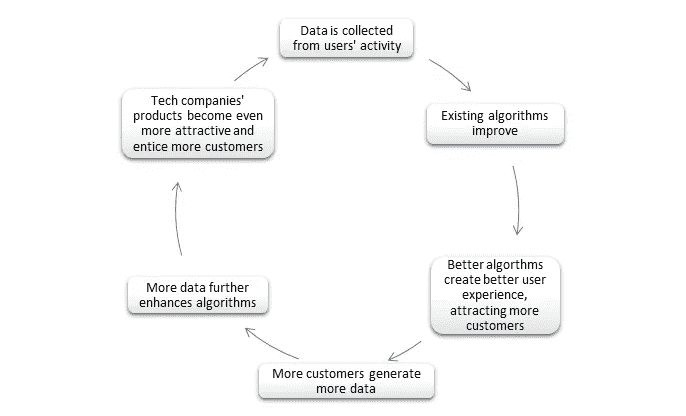

# 人工智能驱动的垄断和新的世界秩序

> 原文：<https://towardsdatascience.com/ai-powered-monopolies-and-the-new-world-order-1c56cfc76e7d?source=collection_archive---------13----------------------->

Photo by [Christian Wiediger](https://unsplash.com/@christianw?utm_source=medium&utm_medium=referral) on [Unsplash](https://unsplash.com?utm_source=medium&utm_medium=referral)

## 大技术、大数据、人工智能

## 人工智能对数据的依赖将如何赋能科技巨头并重塑全球秩序

人工智能和新技术无疑会带来巨大的变化，既有积极的，也有消极的。它们将对我们的日常生活、工作、安全和价值观产生深远的影响。

人工智能可以说是人类有史以来最危险的挑战，因为它将导致大规模的社会动荡，从长远来看，危及人类的本质。

当普通人听到人工智能对人类的威胁时，他们通常会想到两个问题:**大规模失业**和机器人完全取代人类，以及**算法将完全主宰我们**甚至可能灭绝人类的未来。然而，还有其他威胁在很大程度上被人们忽视了，因为媒体大多关注第一个挑战(失业)，而好莱坞则关注机器人将取代人类的遥远未来。

由于对这两个问题的过度关注，有必要考察人工智能出现的另一个经常被忽视的后果。这一过程已经开始，而且不太可能停止——人工智能驱动的垄断的形成。

## 企业权力的崛起

即使现在，媒体和监管机构对跨国公司在权力和影响力上盖过民族国家越来越不满。马库齐和泰尔齐正确地注意到

> 在民主政府满足其公民期望的能力正在下降的时候，企业正在积聚巨大的力量，不仅是在金钱方面，最重要的是在数据方面。

这些公司包括所谓的**黑手党-G** (微软、苹果、脸书、IBM、亚马逊、谷歌)，以及三家中国科技巨头(百度、阿里巴巴、腾讯)，或 **BAT** 。

如今，跨国公司不仅在提供基本服务和促进创新方面发挥着巨大作用，而且在日益重要的网络空间保护我们，这项工作过去是由政府承担的。

> 苹果公司拥有将近 2400 亿美元的储备，理论上可以启动一个两倍于马歇尔计划规模的投资项目(以今天的美元计算)。

以干涉选举为例。如今，监管社交媒体、打击错误信息和宣传的是推特和脸书，而不是美国政府。另一个巨头，[谷歌](https://www.politico.eu/article/google-plan-to-protect-european-elections-transparency-rules-political-ads/)已经站出来保护欧盟免受恶意影响，在欧洲议会选举前禁止非欧盟来源购买政治广告，因为欧盟缺乏防止网络干预的统一框架。

> 这些并不是跨国公司设计和执行自己的公共政策的唯一例子。微软最近承诺投资 5 亿美元扩大西雅图经济适用房的供应，这通常是美国住房和城市发展部以及其他州和联邦公共机构的工作。在去年 11 月的巴黎和平论坛上，微软、谷歌、脸书和其他科技巨头与 50 个政府签署了新的多边网络安全协议。值得注意的是，美国、俄罗斯和中国政府没有出席。项目辛迪加

说到钱，企业已经比中等国家更强大了。例如，如果将苹果的收入与各州的预算相比，它在全球最大收入排行榜上是第**第 23 位，领先于比利时、俄国、印度和墨西哥。**

**苹果拥有将近 2400 亿美元的储备，理论上可以启动一个两倍于马歇尔计划的投资项目(以今天的美元计算)。**

**根据世界银行的数据，如果我们制作一份前 100 名经济体的备选名单，将会有 69 家公司和 31 个国家。超过三分之一的世界贸易只是同一家公司的不同部门之间的交易，而不是民族国家之间的交易。**

**毫不奇怪，最激动人心和不朽的项目，如殖民火星或借助太阳能无人机和卫星群为世界提供普遍的互联网接入，来自私营公司而不是政府——SpaceX、脸书和亚马逊。**

## **人工智能行业的垄断**

**然而，人工智能和新技术已经让大型科技变得比以往任何时候都更加强大。**这是因为人工智能行业自然倾向于垄断。****

**决定一个 AI 算法好坏的关键因素有两个:数据和计算能力。当数据被输入所谓的神经网络时，人工神经元会识别数据中的模式，并产生算法。随着更多的数据和大量的计算能力(在识别模式时需要执行大量的计算)，算法变得越来越复杂，并给出更好的结果。**

**正如著名人工智能专家李开复在他的书*中所说的那样，人工智能的超能力***

> **一个网络接触到的给定现象的例子越多，它就能越准确地挑选出模式并识别现实世界中的事物。**

**人工智能驱动的经济的问题是，由于人工智能对数据的依赖所产生的正反馈循环，行业自然倾向于垄断。如果一家使用人工智能的特定公司胜过其竞争对手，将很难抵制垄断的自我延续循环。**

****

**Credit: Author**

**这样的公司，得益于已经庞大的数据集，将拥有先进的算法。先进的算法意味着更好的用户体验和更多的功能，从而吸引更多的客户。更多的客户，反过来，产生更多的数据，这进一步改善了现有的算法，使公司的产品更有吸引力，最终导致更大的客户群，无止境。**

## **数据是新的电力**

**自从工业革命以来，土地的重要性一直在下降，因为工厂和机器——经济的命脉——不需要太多的空间。今天，机器和工厂仍然是全球经济的支柱，而且值得注意的是，今天最强大的国家不一定是最大的国家，例如日本、英国、德国和韩国，因为土地起着次要作用。**

**然而，在当今时代，数据将超越土地和机器，成为最重要的资产，战争将不是为了石油或土地，而是为了控制数据流。数据将是经济的主要驱动力。**

**获取数据的竞赛已经开始。目前，科技巨头通过免费服务和信息吸引我们的注意力来获取数据。**

**从短期来看，这些数据被用于为企业盈利的定向广告；然而，从长远来看，越来越多的数据最终会完善算法，以至于不再需要广告——因为算法会非常了解我们，从而为我们做出选择。**

> **普通人类会觉得很难抗拒这个过程。目前，人们很乐意放弃他们最有价值的资产——他们的个人数据——来换取免费的电子邮件服务和有趣的猫视频。这有点像非洲和美洲土著部落不知不觉地将整个国家卖给欧洲帝国主义者，以换取彩色珠子和廉价饰品。如果后来普通人决定尝试阻止数据流动，他们可能会发现越来越难，特别是当他们可能会依赖网络来做出所有决定，甚至是他们的医疗保健和身体生存。Y. N .哈拉里**

**不管是好是坏，科技巨头们会随着越来越多的数据积累起巨大的力量。**

**如果政府控制数据是否会更好，这是值得怀疑的。毕竟，大多数人更愿意把自己的数据交给脸书和谷歌，而不是一个独裁的强人。**

> **然而，在当今时代，数据将超越土地和机器，成为最重要的资产**

**我们将可能被迫彻底重新定义当前的政治、社会和经济体系，因为“政府乌龟跟不上技术兔子”。我们今天生活的系统是在蒸汽机和工厂时代设计出来的。它没有适应信息技术定义的时代，我们可以从美国和欧洲日益加剧的不平等和停滞不前的工资中看到这一点。正如共产主义的出现是对普通工人生活条件恶化的回应一样，人工智能的出现很可能会创造出前所未有的新意识形态和运动。**