# 人工智能驱动的外星智能搜索——分析无线电望远镜数据

> 原文：<https://towardsdatascience.com/ai-powered-search-for-extra-terrestrial-intelligence-analyzing-radio-telescopic-data-c9e46741041?source=collection_archive---------14----------------------->

## 人工智能造福社会系列—第 2.1 部分

## 从 SETI 了解射电望远镜信号数据


Photo by [Ambir Tolang](https://unsplash.com/@gorkhe1980?utm_source=unsplash&utm_medium=referral&utm_content=creditCopyText) on [Unsplash](https://unsplash.com/?utm_source=unsplash&utm_medium=referral&utm_content=creditCopyText)

# 介绍

在这个由两部分组成的系列文章中，我们将看看人工智能(AI)如何与开源工具和框架的力量相结合，来解决非常规领域中一个非常有趣的问题——寻找外星智能！

也许你们中的许多人已经熟悉了 [***SETI(搜寻外星智能)研究所***](https://www.seti.org/)*，该研究所专注于试图找出宇宙中是否存在外星智能，正如其使命所暗示的那样*“探索、理解和解释宇宙中生命的起源和性质以及智能的进化”*。最近，我在 Kaggle 上看到了 SETI 的一个开放数据集，其中谈到 SETI 专注于几个公共倡议，这些倡议以过去发生的比赛形式在他们的数据集上利用人工智能。虽然竞争现在已经停止，但是这些数据的子集仍然可以用于分析和建模，这是本系列文章的主要重点。*

*我们将着眼于分析 SETI 获得的数据，作为他们过去倡议的一部分，ML4SETI 机器学习 4 寻找外星智慧。这项计划的数据是基于无线电信号的模拟数据，目标是让数据科学家找到一种可靠的信号分类算法，用于寻找外星人无线电通信的任务。这里的重点是能够准确地对不同类型的信号进行分类。*

# *动机和意义*

*SETI 研究所致力于研究和工作方法，以提高他们对外星智慧的搜索。他们加速这一搜索的关键仪器之一是艾伦望远镜阵列(ATA)，它位于加利福尼亚州拉森峰以北的喀斯喀特山脉的哈特克里克天文台*

**

*The Allen Telescoping Array ([https://www.seti.org/ata](https://www.seti.org/ata))*

*艾伦望远镜阵列有助于基于无线电信号的搜索，并将 SETI 目标搜索的速度提高了至少 100 倍。这里应用人工智能或深度学习的动机可能是多方面的。*

*   *为区分不同信号而优化的深度学习模型可以减少搜索时间*
*   *效率，甚至可能是新的更好的方法来发现外星智慧，因为他们观察来自恒星系统的信号*

*虽然我们将在这里使用的数据是基于无线电信号的模拟数据，但它们与 SETI 的无线电望远镜设备捕捉的真实数据非常一致。我们现在将简要地看一下这个。*

# *理解 SETI 数据*

*这里提供的信息是基于我从研究 SETI 数据的细节中收集的见解，当时他们与 IBM 合作举办了这场比赛。挑战的细节在 [*这里*](https://github.com/setiQuest/ML4SETI) 呈现给可能感兴趣的人，关于设置和数据的许多背景信息在 [*这篇有用的文章*](https://medium.com/@gadamc/using-artificial-intelligence-to-search-for-extraterrestrial-intelligence-ec19169e01af) 中提到。*

## *艾伦望远镜阵列体系结构*

*艾伦望远镜阵列(ATA)由几个相对较小的碟形天线(天线)组成，延伸约 1 公里。这提供了非常高质量的光束形状(天空中望远镜最敏感的点)。ATA 实际上经过优化，覆盖 1000 MHz 至 15000 MHz 之间的频率。ATA 使用一种称为*“波束形成”的过程来组合来自不同碟形天线的信号。*通常使用这一过程，ATA 观察来自天空中非常小的窗口的关于特定恒星系统的无线电信号。在高层次上，ATA 有四个主要的概念系统，如 [*官方页面*](https://www.seti.org/ata-technical-overview) 中所述。*

*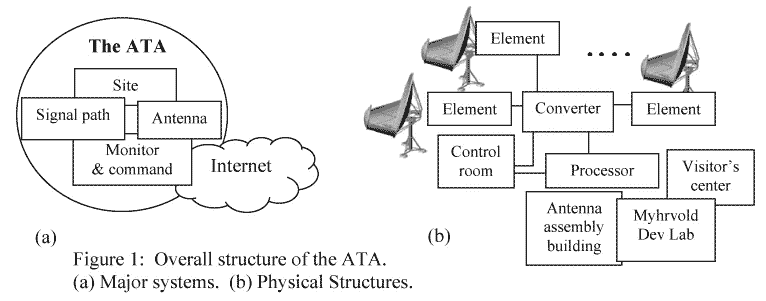*

*ATA architecture ([https://www.seti.org/ata-technical-overview](https://www.seti.org/ata-technical-overview))*

*   *天线收集来自太空的辐射；*
*   *信号路径将来自馈源(位于天线焦点处)的辐射带回给用户*
*   *监控和命令系统允许精确地移动碟形天线，并控制信号路径*
*   *该网站包括整体天线配置，以及其他基础设施。*

*ATA 将允许远程用户通过安全的互联网连接访问和使用仪器。*

## *射电望远镜时间序列信号*

*从使用的角度来看，可以同时观察到三个独立的光束，并一起使用来决定观察智能信号的可能性。*

*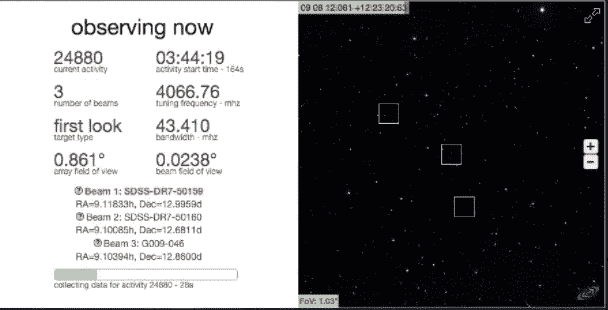*

*控制数据采集系统的软件，实时分析该无线电信号时间序列数据并将数据写入磁盘。它叫做索纳塔(**S**ETI**on**the**ATA**)。*

*为了找到相关信号，SonATA 软件将信号功率作为频率和时间的函数进行计算，并重点关注持续时间超过几秒钟的功率大于平均噪声功率的信号。将功率表示为频率和时间的函数的最佳方式是通过[频谱图](https://en.wikipedia.org/wiki/Spectrogram)，或“瀑布图”。*

*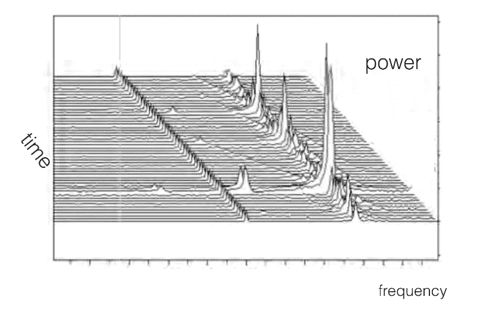*

*下图描绘了来自 ata 的真实无线电信号数据的样本频谱图。这是所谓的*“窄带”*信号的经典例子，这是索纳塔主要在数据中搜索的内容。*

**

*Signal observed at the Allen Telescope Array from the Cassini satellite while orbiting Saturn on September 3, 2014 (Source: [https://medium.com/@gadamc/using-artificial-intelligence-to-search-for-extraterrestrial-intelligence-ec19169e01af](https://medium.com/@gadamc/using-artificial-intelligence-to-search-for-extraterrestrial-intelligence-ec19169e01af))*

*信号的功率用黑白刻度表示。y 轴是时间，x 轴是频率(Hz)。您可以清楚地看到，信号开始于大约 8429245830 Hz，经过 175 秒的观察，漂移至 8429245940 Hz。*

## *分析无线电信号数据的需要*

*SETI 捕获这些数据并在信号中搜索特定模式的原因是因为这是我们用来与太空中的卫星通信的信号。因此，如果一个看似先进的外星文明试图引起我们的注意，他们可能会向我们发送信号，这是有希望的！*

# *获取模拟 SETI 数据*

*现在我们已经有了足够的关于 SETI 及其数据的背景信息。让我们尝试获取将用于训练深度学习模型的数据集。不幸的是，ML4SETI 的竞争早已结束，但幸运的是，我们仍然可以获得一部分数据。请随时查看 ML4SETI [***【入门】***](https://github.com/setiQuest/ML4SETI/blob/master/GettingStarted.md) 页面，了解如何获取数据集。如果你想在没有阅读背景信息的情况下直接进入数据，只需前往 [***这个 Jupyter 笔记本***](https://nbviewer.jupyter.org/github/setiQuest/ML4SETI/blob/master/tutorials/Step_1_Get_Data.ipynb#Direct-Data-URLs-if-you-are-working-from-outside-of-IBM-Data-Science-Experience) ！获取这个数据集的一个更简单的方法是从 [**Kaggle**](https://www.kaggle.com/tentotheminus9/seti-data/home) **。***

*由于处理真实数据存在挑战，因此构建了一组模拟信号来近似真实信号数据。典型地，SETI 研究所的研究人员经常观察到许多信号类别。对于这个数据集，总共有七个不同的类。*

*   ***亮像素***
*   ***窄带***
*   ***窄带宽***
*   ***噪音***
*   ***方波脉冲窄带***
*   ***波浪线***
*   ***squigglesquarepulsednarrowband***

*类名基本上是描述它们在光谱图中的样子。*

# *主要目标*

*既然我们有了所有的背景资料和数据，就很容易确定我们的主要目标。给定总共七个不同的无线电信号类别，包括噪声和每个类别总共 1000 个样本，利用深度学习模型建立准确的分类器。虽然我们将在本系列的第二部分构建深度学习模型，但在本文的剩余部分，我们将更深入地研究数据集，以更好地理解我们正在处理的内容。*

# *分析模拟 SETI 数据*

*我们使用原始格式的小型 SETI 数据`**primary_small_v3**`只是为了展示如何加载和处理数据。记住，处理信号数据时，您将需要开源的`**ibmseti**`包。你可以用`**pip install ibmseti**`安装它。在进行一些基本的处理和分析之前，让我们先加载原始数据集。*

```
***7000***
```

*这告诉我们，我们的数据集中总共有 7000 个信号样本。让我们尝试处理和可视化其中一个信号。*

*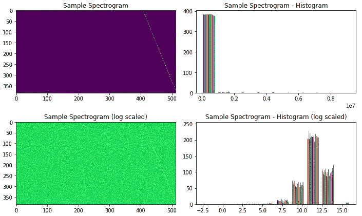*

*因此，基于上面的视觉效果，我们已经成功地将一个`narrowband`信号在可视化之前处理成一个声谱图。让我们看看每类信号样本的总数。*

```
***brightpixel                       1000
narrowbanddrd                     1000
squiggle                          1000
narrowband                        1000
squigglesquarepulsednarrowband    1000
noise                             1000
squarepulsednarrowband            1000
Name: signal_classification, dtype: int64***
```

*就像我们之前提到的，我们每门课总共有 1000 个样本，坦白地说并不是很多！稍后会详细介绍。让我们用光谱图来处理和可视化一些样本信号。*

*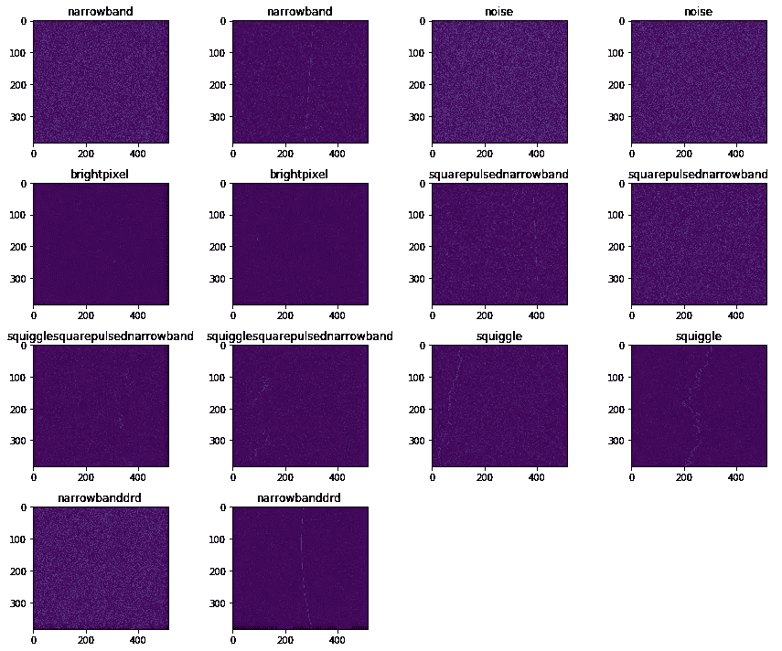*

*这给了我们不同信号的样子。你可以看到，这些信号并不总是很容易区分，因此这是一个更艰巨的分类挑战。*

# *加载已处理的 SETI 数据*

*现在，对于本文的剩余部分和本系列的下一篇文章，您可以手动利用`**ibmseti**`包将每个信号处理成频谱图，或者只需下载并使用 [**Kaggle**](https://www.kaggle.com/tentotheminus9/seti-data/home) 中可用的数据集中已经处理过的频谱图文件。记住，处理过的数据集在`**primary_small**`文件夹中。解压其内容后，这就是目录结构的样子。*

*我们总共有 7 个类，每个类有 800 个训练样本，100 个验证样本和 100 个测试样本。现在让我们看一些样本处理过的声谱图信号文件。*

## *使用 Keras 加载和可视化光谱图*

*Keras 框架有一些优秀的工具来处理包含这些光谱图的图像文件。下面的片段展示了一个样本频谱图。*

*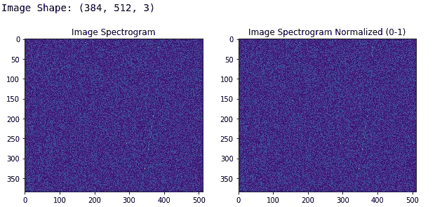*

## *用 OpenCV 加载和可视化光谱图*

*有很多 OpenCV 爱好者喜欢使用这个框架来满足他们所有的图像处理需求。你也可以用它来处理光谱图。请记住，OpenCV 默认以 BGR 格式而不是 RGB 格式加载这些图像。我们在下面的代码中展示了同样的内容。*

*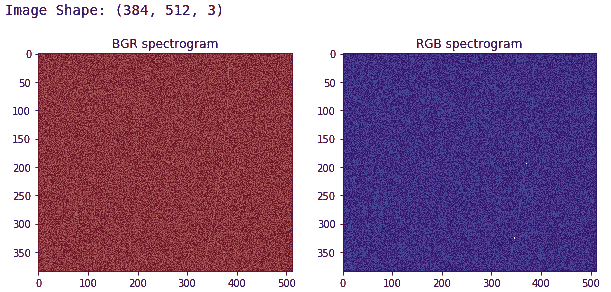*

# *可视化处理过的 SETI 样本数据*

*现在让我们来看一下从处理过的数据集中选择的七个不同的样本信号，我们稍后将使用它们进行分类。*

*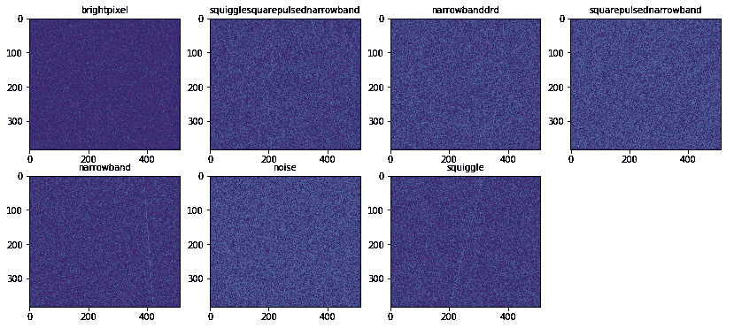*

*这向我们展示了数据集中不同类型的无线电信号，这些信号已经过处理，随时可以使用。*

# *了解无线电信号模拟数据*

*这里所有的模拟信号都是由信号和噪声背景之和产生的。以下关于信号的背景资料，已从 [*这篇精彩的文章*](https://medium.com/@gadamc/using-artificial-intelligence-to-search-for-extraterrestrial-intelligence-ec19169e01af) 中整理出来，以更详细地了解每个信号*

*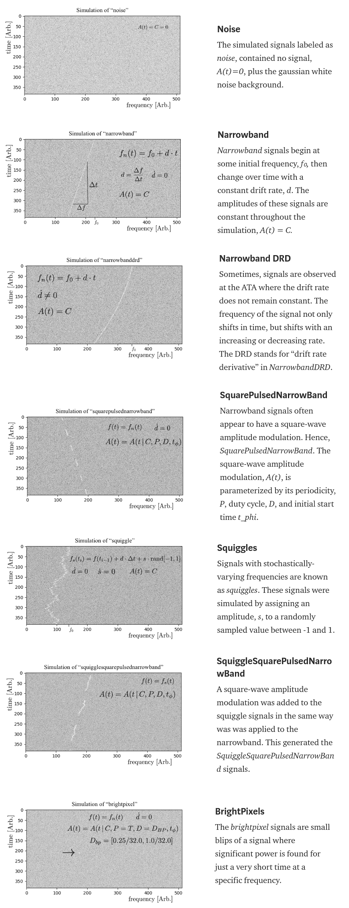*

# *SETI 数据上的深度学习*

*假设我们有七个信号类别的光谱图图像，我们可以利用基于视觉的深度学习模型来构建鲁棒的图像分类器。在本系列的下一篇文章中，我们将利用卷积神经网络来了解如何构建准确的分类器来区分这些信号类别！*

# *卷积神经网络简介*

*最受欢迎的用于计算机视觉问题的深度学习模型是卷积神经网络(CNN)！*

**

*Source: becominghuman.ai*

*CNN 通常由多个卷积和池层组成，这些层有助于深度学习模型从图像等视觉数据中自动提取相关特征。由于这种多层体系结构，CNN 学习了特征的健壮层次，这些特征是空间、旋转和平移不变的。*

*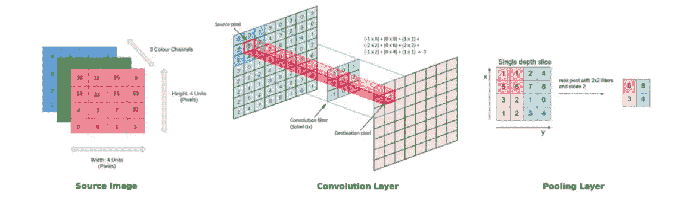*

*CNN 模型中的关键操作如上图所示。任何图像都可以表示为像素值的张量。卷积层有助于从该图像中提取特征(形成特征地图)。网络中较浅的层(更接近输入数据)学习非常普通的特征，如边、角等。网络中更深的层(更靠近输出层)学习与输入图像相关的非常具体的特征。下图有助于总结任何 CNN 模型的关键方面。*

*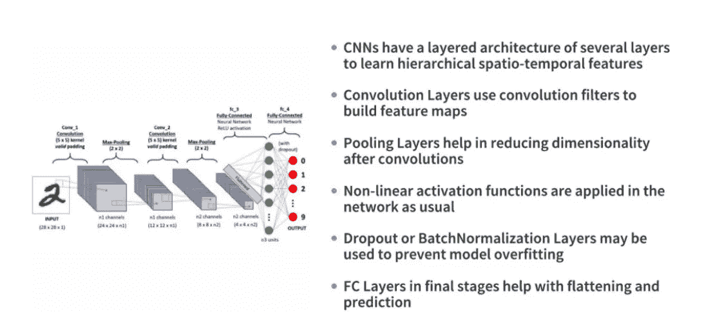*

*我们将利用迁移学习的力量，其中我们使用预先训练的深度学习模型(已经在大量数据上训练过)。在下一篇文章中会有更多的介绍！*

# *后续步骤*

*在下一篇文章中，我们将基于 CNN 构建深度学习分类器，以准确分类 SETI 信号。敬请期待！*

*本文使用的代码可以在这个 [**资源库**](https://github.com/dipanjanS/data_science_for_all) 中的 [**my GitHub**](https://github.com/dipanjanS) 上获得。*