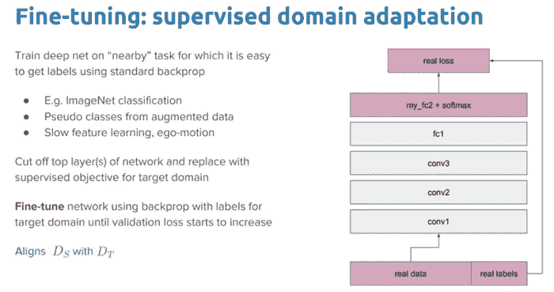

# 人工智能驱动的外星智能搜索——深度学习信号分类器

> 原文：<https://towardsdatascience.com/ai-powered-search-for-extra-terrestrial-intelligence-signal-classification-with-deep-learning-6c09de8fd57c?source=collection_archive---------22----------------------->

## 人工智能造福社会系列—第 2.2 部分

## 基于深度学习的 SETI 射电望远镜信号分类


Photo by [Donald Giannatti](https://unsplash.com/@wizwow?utm_source=unsplash&utm_medium=referral&utm_content=creditCopyText) on [Unsplash](https://unsplash.com/?utm_source=unsplash&utm_medium=referral&utm_content=creditCopyText)

# 介绍

欢迎(或者欢迎回来！)到 AI for social good 系列！在这个由两部分组成的系列文章的第二部分，我们将看看人工智能(AI)如何与深度学习等开源工具和技术的力量相结合，帮助我们进一步寻找外星智能！

在 [***这个两部分系列的第一部分***](/ai-powered-search-for-extra-terrestrial-intelligence-analyzing-radio-telescopic-data-c9e46741041) 中，我们制定了我们做这个项目背后的主要目标和动机。简而言之，我们正在观察来自 SETI(搜寻外星智慧)研究所*数据模拟的不同射电望远镜信号。我们利用技术将无线电信号处理、分析和可视化为频谱图，频谱图基本上是原始信号的可视化表示。*

**

*Signal observed at the Allen Telescope Array from the Cassini satellite while orbiting Saturn on September 3, 2014 (Source: [https://medium.com/@gadamc/using-artificial-intelligence-to-search-for-extraterrestrial-intelligence-ec19169e01af](https://medium.com/@gadamc/using-artificial-intelligence-to-search-for-extraterrestrial-intelligence-ec19169e01af))*

*在本文中，我们的重点将是尝试使用深度学习为总共七种不同类型的信号构建一个强大的无线电信号分类器！*

# *加载 SETI 信号数据*

*就像我们在上一篇文章中讨论的那样，模拟的 SETI 无线电信号数据集在 [**Kaggle**](https://www.kaggle.com/tentotheminus9/seti-data/home) 中可用。记住，处理过的数据集在`**primary_small**`文件夹中。解压缩其内容后，这就是目录结构的样子。*

**

*我们总共有 7 个不同的信号类别要分类，每个类别总共有 800 个样本用于训练，100 个样本分别用于验证和测试。考虑到噪声已被添加到模拟信号数据中，再加上每类样本数量较少，这是一个很难解决的问题！在我们开始之前，让我们加载我们将用于构建模型的必要依赖项。这里我们将利用 TensorFlow 的`**tf.keras**` API。*

```
***./data/train
./data/valid
./data/test***
```

# *可视化样本 SETI 信号*

*回顾一下上一篇文章，看看我们正在处理的不同类型的信号，我们可以使用下面的代码来可视化它们的频谱图。*

**

*对于我们正在处理的不同信号样本，一切看起来都很正常！*

# *数据生成器和图像增强*

*由于我们每个类的训练样本数量很少，因此获得更多数据的一种策略是使用图像增强来生成新数据。图像增强背后的想法就像它的名字一样。我们从训练数据集中加载现有图像，并对其应用一些图像变换操作，如旋转、剪切、平移、缩放、翻转等，以产生现有图像的新的、改变的版本。*

**

*由于这些随机变换，我们每次得到的图像并不相同。基于我们正在解决的问题，我们需要小心增强操作，这样我们就不会过度扭曲源图像。*

*我们将对我们所有的训练数据进行一些基本的转换，但保持我们的验证和测试数据集不变，只是对数据进行缩放。现在让我们构建我们的数据生成器。*

*我们现在可以构建一个样本数据生成器，以便了解数据生成器和图像增强是如何工作的。*

**

*给定我们总共有 7 个类，标签是一次性编码的，因此每个标签是大小为 7 的一次性编码向量。*

# *基于 CNN 的深度迁移学习*

*迁移学习的想法并不是一个新概念，当我们处理较少的数据时，它是非常有用的。假设我们有一个预先训练好的模型，该模型以前是根据大量数据训练的，我们可以用这个模型来解决一个数据较少的新问题，并且应该理想地得到一个性能更好、收敛更快的模型。*

**

*有各种各样的预训练 CNN 模型，它们已经在 ImageNet 数据集上被训练，该数据集具有属于总共 1000 个类别的大量图像。这个想法是，这些模型应该作为图像的有效特征提取器，也可以根据我们执行的特定任务进行微调。预先训练的模型可以完全冻结，当我们在新数据集上训练时，我们根本不改变层权重，或者当我们在新数据集上训练时，我们可以微调(部分或完全)模型权重。*

**

****在我们的场景中，我们将尝试对我们预训练的模型*** 进行部分和完全的微调。*

# *预先训练的 CNN 模型*

*迁移学习的一个基本要求是要有在源任务中表现良好的模型。幸运的是，深度学习世界相信分享。他们各自的团队已经公开分享了许多最先进的深度学习架构。预训练模型通常以模型在被训练到稳定状态时获得的数百万个参数/权重的形式被共享。每个人都可以通过不同的方式使用预先训练好的模型。*

*TensorFlow 中提供了预训练模型，您可以使用其 API 轻松访问。我们将在本文中展示如何做到这一点。你也可以从网上获得预先训练好的模型，因为大多数模型都是开源的。*

****对于计算机视觉*** ，可以利用一些流行的模型包括，*

*   *[VGG-16](https://www.kaggle.com/keras/vgg16/home)*
*   *[VGG-19](https://www.kaggle.com/keras/vgg19/home)*
*   *[盗梦空间 V3](https://arxiv.org/abs/1512.00567)*
*   *[异常](https://arxiv.org/abs/1610.02357)*
*   *[ResNet-50](https://www.kaggle.com/keras/resnet50/home)*

*我们将在文章中使用的模型是 VGG-19 和 ResNet-50。*

# *VGG-19 模型*

*VGG-19 模型是建立在 ImageNet 数据库上的 19 层(卷积和全连接)深度学习网络，其建立的目的是图像识别和分类。这个模型是由卡伦·西蒙扬和安德鲁·齐泽曼建立的，并在他们题为 [*“用于大规模图像识别的非常深的卷积网络”*](https://arxiv.org/pdf/1409.1556.pdf) *的论文中提到。我推荐所有感兴趣的读者去阅读这篇文章中的优秀文献。下图描述了 VGG-19 模型的架构。**

**

# *ResNet-50 型号*

*ResNet-50 模型是建立在 ImageNet 数据库上的 50 卷积块(每个块中有几层)深度学习网络。这个模型总共有超过 175 层，是一个非常深的网络。ResNet 代表剩余网络。下图显示了 ResNet-34 的典型架构。*

**

*总的来说，深度卷积神经网络导致了图像分类准确性的重大突破。然而，随着我们深入下去；神经网络的训练变得困难。其原因通常是因为消失梯度问题。基本上，当梯度反向传播到更浅的层(更接近输入)时，重复的张量运算使梯度变得非常小。因此，精度开始饱和，然后也下降。残差学习试图用残差块解决这些问题。*

**

*利用跳过连接，我们可以允许网络学习身份函数(如上图所示)，这允许网络通过残差块传递输入，而不通过其他权重层。这有助于解决渐变消失的问题，也有助于保持对高级功能的关注，这些功能有时会因多级最大池而丢失。*

**

*Source: [https://towardsdatascience.com/understanding-and-coding-a-resnet-in-keras-446d7ff84d33](/understanding-and-coding-a-resnet-in-keras-446d7ff84d33)*

*我们将使用的 ResNet-50 模型包括 5 个阶段，每个阶段都有一个卷积和单位块。每个卷积块有 3 个卷积层，每个单位块也有 3 个卷积层。*

# *深度迁移学习与 VGG-19*

*这里的重点是采用预训练的 VGG-19 模型，然后对网络中的所有层进行部分和全部微调。我们将为下游分类任务在模型中添加常规密集和输出图层。*

## *部分微调*

*我们将以 VGG-19 模型开始我们的模型训练，并对模型的最后两个模块进行微调。这里的第一项任务是构建模型架构，并指定我们想要微调的块/层。*

*现在，我们将对模型进行 100 个纪元的训练。我在每个时期后保存模型，因为我有很多空间。除非你有很多存储空间，否则我不建议你这么做。你总是可以利用像`**ModelCheckpoint**` 这样的回调来集中存储最好的模型。*

*我们可以使用下面的代码片段来查看整个模型学习曲线。*

**

*看起来不错，但随着时间的推移，验证数据集的损失和准确性肯定会有很大的波动。*

## *完全微调*

*在我们的下一个培训流程中，我们将采用 VGG-19 模型，对所有模块进行微调，并添加我们自己的密集层和输出层。*

*下图描绘了培训过程的学习曲线。*

**

*就验证准确性和损失而言，随着时期的增加，看起来更加稳定。*

# *用 ResNet-50 进行深度迁移学习*

*本节的重点将是采用预训练的 ResNet-50 模型，然后对网络中的所有层进行完整的微调。我们将照常添加常规密集图层和输出图层。*

## *完全微调*

*对于我们的训练过程，我们将加载预训练的 ResNet-50 模型，并对整个网络进行 500 个时期的微调。让我们从构建模型架构开始。*

*现在让我们训练总共 500 个时期的模型。*

*下图显示了我们训练模型的学习曲线。*

**

# *根据测试数据评估模型性能*

*现在是检验我们训练好的模型的时候了。为此，我们将对测试数据集进行预测，并基于多类分类问题的相关分类度量来评估模型性能。*

## *负载测试数据集*

*我们首先利用之前构建的数据生成器加载测试数据集和标签。*

```
***Found 700 images belonging to 7 classes.****((700, 192, 192, 3), (700,))***
```

## *建立模型性能评估函数*

*我们现在将构建一个基本的分类模型性能评估函数，我们将使用它来测试三个模型的性能。*

*我们现在准备在测试数据集上测试我们的模型的性能*

## *模型 1 —部分微调的 VGG-19*

*这里，我们在测试数据集上评估了部分微调的 VGG-19 模型的性能。*

**

*在测试数据集上，总体准确率为 86%**,相当不错！***

## *模型 2 —完全微调的 VGG-19*

*这里，我们在测试数据集上评估了我们完全微调的 VGG-19 模型的性能。*

**

*测试数据集上的总体准确度得分为 85% ,略低于部分微调的模型。*

## *型号 3 —完全微调的 ResNet-50*

*这里，我们在测试数据集上评估了完全微调的 ResNet-50 模型的性能。*

**

*我们得到的总体准确度分数为 **88%** ，这绝对是测试数据集上迄今为止最好的模型性能！看起来 ResNet-50 模型表现最好，因为我们确实训练了它 500 个纪元。*

## *样本测试数据的最佳模型预测*

*我们现在可以用我们最好的模型来预测样本无线电信号频谱图。*

**

# *结论*

*这将我们带到我们关于利用深度学习进一步搜索外星智能的两部分系列的结尾。您看到了我们如何将无线电信号数据转换为频谱图，然后利用迁移学习的能力来构建分类器，这些分类器表现非常好，即使每类的训练数据样本数量非常少。*

*本文使用的代码可以在 [**my GitHub**](https://github.com/dipanjanS) 的这个 [**资源库**](https://github.com/dipanjanS/data_science_for_all) 中获得。*