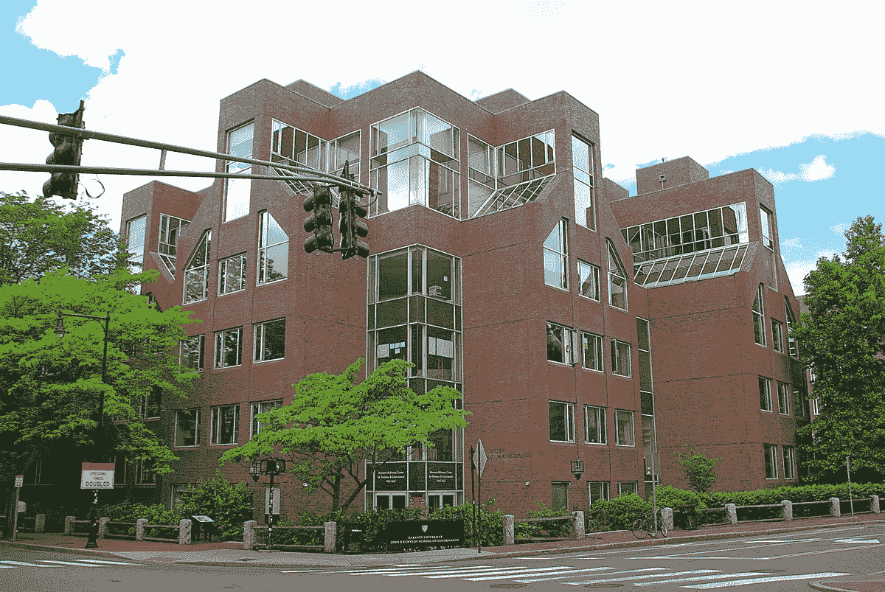

# 人工智能问题是人类的问题

> 原文：<https://towardsdatascience.com/ai-problems-are-human-problems-528d12ff000d?source=collection_archive---------20----------------------->

Harvard’s Belfer Center for Science and International Affairs — a paragon of higher learning and perhaps even higher folly. | [Source](https://en.wikipedia.org/wiki/Belfer_Center_for_Science_and_International_Affairs)

我最近在哈佛大学肯尼迪政府学院参加了一个名为“治理人工智能——我们如何做”的会议。参加会议的都是知名人士，从杰出的哈佛教师，到网络安全专家，再到与丹麦高等教育和科学部长合作的代表团成员。作为一名非常低调的软件工程师和未来的研究生，至少可以说我感到很害怕。

热烈的讨论从围绕人工智能治理和政策的挑战，到围绕术语“人工智能”而非“机器学习”的恐怖神话，到透明的算法决策和问责制问题；上午 8 点聚会的崇高话题。这些话题都是我很感兴趣的，所以在整个讨论过程中，我的神经都放松了。我没有静静地坐在椅子上发抖，而是很快专注于该领域专家之间有趣的玩笑。放松后，我看了看房间，不禁注意到这种担忧——我敢说，是恐惧——微妙地渗透到经过训练的专业门面中。随着一个技术末日的笑话引发的每一次紧张的笑声，专业知识的面纱越来越薄。我很快明白了一些事情:“甚至一些专家也不知道如何应对人工智能的挑战。”

纵观历史，我对大规模解决问题的本质不抱任何幻想。天才的技术官僚很少注意到、致力于并向大众介绍彻底的变革。相反，神奇的创新往往是看似完全不同的想法的综合；文化的转变不是由于政府的政策，而是由于集体意识的转变和规范的转变。然而，有时我仍然想象一些领域专家有，如果不是所有的答案，那么至少比像我这样一个没有装饰的平民有更多的答案。在这次讨论中，情况显然不是这样。

那么，是什么让管理像人工智能这样先进的技术带来的责任变得如此困难？底层技术是否过于复杂？我们是在和我们几乎不了解的力量合作吗？当我听着从墙上反射回来的困惑时，答案对我来说是显而易见的；在一阵令人不舒服的病态笑声中达到高潮:控制和治理人工智能面临的最紧迫的问题与人类自文明诞生以来面临的问题是一样的。

# 人性激发的智慧

人类天生以自己的形象创造工具。我们经常从大自然或我们自己的生物学中获得灵感，以塑造我们自己的系统来挫败我们现实中的压迫性规则。人工智能系统是模仿人类大脑的运作方式；接受信息并激活神经元，这些神经元本身并不聪明，但结合起来创建概率模型，模仿我们自己的模式识别智能。考虑到相似性这一概念，随后对我来说非常明显的是，人类创造的人工智能所面临的问题将是困扰人类智能的问题。

> 几千年来，思想家们一直在诊断这些人类特有的疾病。

问责制、透明度和模型偏差是会议中出现的一些问题的一个小例子。大赦国际需要对其决定负责；不管是好是坏，他们必须被赋予一种动力，或一个行动者，以获得赞扬或指责以及随后的反响。人工智能需要透明，以人类可以理解和内化的方式揭示其决策的逻辑路径。人工智能必须努力以公正的方式行事——从无害的数据集学习——这样它的决定才能反映我们最高的社会价值观。当想到数字情报的责任时，这一切听起来令人不知所措，而且格格不入。然而，一些观点可以帮助我们理解这些挑战:这些同样的症结自人类社会诞生以来就一直困扰着它，并且是我们自己尚未解决的非常人性化的问题。

从任何有意义的意义上来说，人类的权力系统和组织结构都很难问责、透明或公正。倒闭银行的高层领导在 2008 年帮助全球经济崩溃后没有被追究责任。政府和私营企业未能做到透明，因为它们通过谎言和宣传胁迫选民来获取权力或利润。个人经常不能认识到偏见是多么容易潜入他们自己的现实生物模型。几千年来，思想家们一直在诊断这些人类特有的疾病。在人工智能的背景下，任何赋予这些挑战完全新奇的概念都应该立即被认为是谬误，因为人类有着大量相同的斗争记录。

# 我们的日常生活也一样复杂

直到围绕人工智能的问题被认识到是人类的，并且潜在地是社会的，在它们的核心，那些受智能系统的社会整合所导致的最糟糕的愚蠢行为影响最大的人可能会被视为光顾嘘混有技术官僚，行话充斥的“解决方案”。技术专家习惯于居高临下地对待那些据称没有受过良好教育、无法理解问题的复杂性和细微差别的人。历史上，受影响最小的精英们选择躲在复杂的高墙后面假装无辜，而不是接受教育、宣传和让技术为社会服务的责任。

技术官僚的论点与这样一个事实完全矛盾，即在我们的日常生活中，同样存在着我们视为常识的更复杂的概念。一个苦苦挣扎的单身母亲的麻烦是无穷无尽的复杂，然而很大一部分甚至“未受教育”的社会已经开始认为这个问题是一个值得解决的问题。爱情、情感和人与人之间关系的复杂性永远是模糊不清的；比机器如何学习打乒乓球要重要得多。这些类型的人类问题需要大量的内省和同情来理解并以富有成效的方式采取行动。仅仅因为它们是人类的条件并不意味着它们是简单的——特别是不比任何类型的数字技术简单。然而，我们每个人都在自己的生活中面对这些挑战，并能够发展对潜在系统的理解。与我们每天面临的生存斗争相比，诊断人工智能面临的问题应该是在公园里散步。

> 我毫不怀疑，任何将人工智能视为他人的普通人都会提出更合理的解决方案来应对这项技术带来的挑战。

通过更人性化的视角理解人工智能面临的挑战无疑将成为未来解决方案的核心。即使在今天，猖獗的偏见和新闻供稿推荐的过度适应最好通过人类的类比来看待。一个天真的、过度定制的新闻推送推荐者就像一个专门筛选新闻的人类朋友，真的想让你自我感觉良好，因此只给你提供符合你先入为主观念的文章。这位朋友已经了解了你的某些特征，并给你贴上了“自由主义者”、“拉丁人”、“跨性别者”等标签。他们还学会了识别新闻文章中的模式，这些模式也分配了类似的标签，如“吸引自由主义者”、“激怒同性恋者”等。因为你的朋友只是想天真地取悦你，因为他们会从你的快乐中获利，他们只会向你推荐标签匹配的新闻文章。我们知道，这位朋友正在损害任何民主的知情观念；因为这需要对立和不同观点的健康结合。

这种拟人化的神经算法应该作为智能系统中诊断和预测任何此类问题的模型。当想象如何让人工智能负责时，我们应该看看让强大的人类负责的理想。智能计算的透明度应该反映人类有史以来最伟大的教师和沟通者的标准。应该像人类一样根除偏见:考虑尽可能广泛和多样的视角。

在哈佛大学的房间里，技术专家和政策专家关注特定机器学习的细微差别，导致头脑陷入混乱，但我毫不怀疑，任何将人工智能视为另一个人的普通人都会提出更合理的解决方案来应对技术带来的挑战。

参与讨论的人从来没有考虑过用普通人的智慧来寻找解决办法。尽管人们滔滔不绝地谈论智能系统应该如何遵循美国明确而庄严的民主参与形式，但同样的民主存在深刻而悲剧性的缺陷这一概念从未出现过。任何在哈佛广场等公共汽车的普通人都可以告诉你“民主”的缺陷，因为他们在优越感的花言巧语中表现出平均的，或者可悲地低于平均水平的生活质量；毫无疑问，这是一个更加微妙的观点，可以包含在对人工智能治理的考虑中。

# AI 应该是我们的镜子

虽然人类确实在与这些有时复杂、反思性的概念进行斗争，并且人类的解决方案可能会有缺陷，但我们应该认识到人工智能给我们提供的重要机会。关于人工智能面临的挑战的讨论表明，人类几乎没有克服这些障碍。然而，在讨论的过程中，我们得到了一个独特的机会来谦卑我们的宗教人道主义，并认识到我们确实有尚未解决的重大问题。

在接受普通人提供的证据失败的地方，我们应该努力使用人工智能作为破冰船，刺激围绕政府和个人问责制、企业透明度、系统性偏见和仇恨的讨论。或许人工智能的镜头更多的可以充当镜子的角色；当我们开始意识到另一边的创造物非常类似于我们这些偶然发现智慧的稍微聪明一点的灵长类动物。

我相信我们未来的繁荣取决于在我们的创造中看到自己，并认识到人类必须解决的深刻缺陷。同理心和技术已经达到了一个交汇点，如果强者继续不承认自己的缺点，拒绝真正倾听那些“在他们之下”的人，这可能会带来灾难。没有任何考虑，甚至比最富有的精英更强大的机器可能很快就会发挥巨大的影响力；充满了人类最大的缺点，因为他们的创造者太害怕看自己，看不到改进的空间。