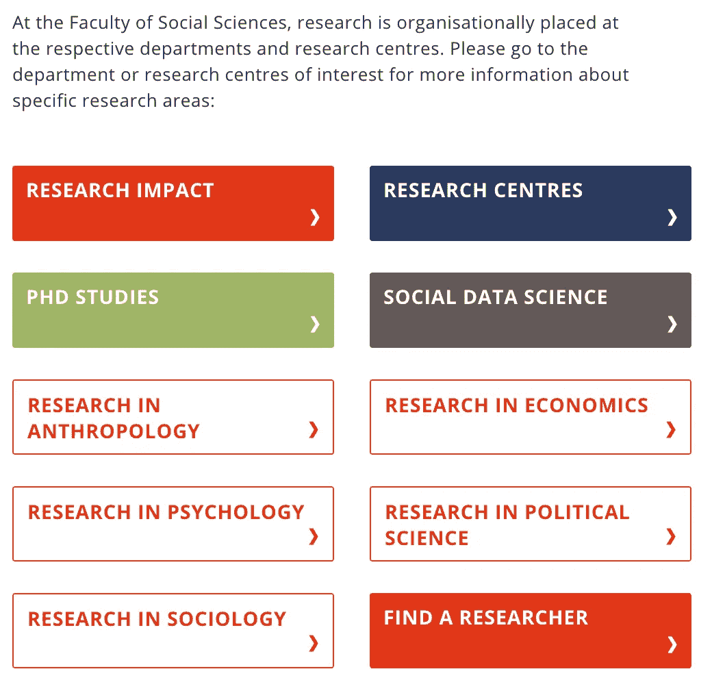
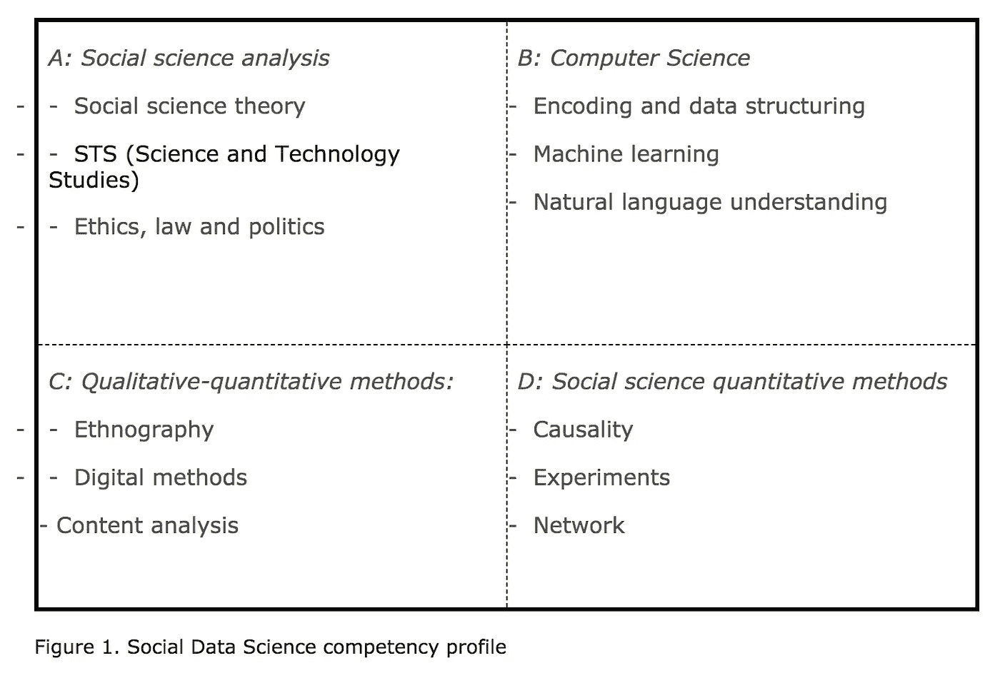
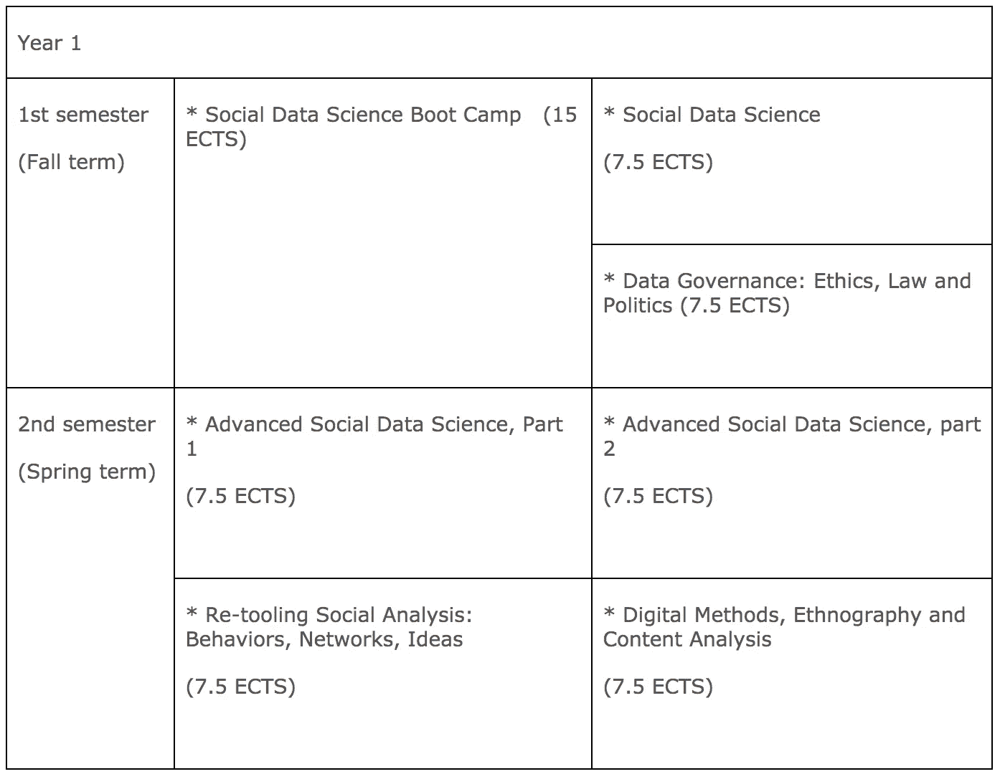
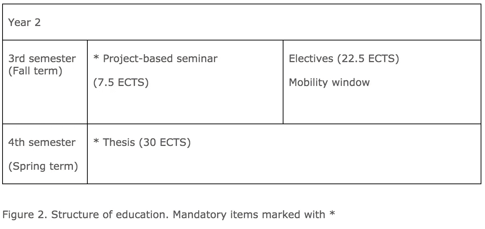

# 人工智能安全和社会数据科学

> 原文：<https://towardsdatascience.com/ai-safety-and-social-data-science-527c2c576a98?source=collection_archive---------23----------------------->

Photo by [@alexander_tsang](https://unsplash.com/@alexander_tsang)

## 哥本哈根大学及其新设立的社会数据科学硕士项目

本文是对哥本哈根大学及其社会数据科学硕士课程的探索，也是对如何促进人工智能安全工作的快速思考。

社会数据科学是一个新的令人兴奋的研究领域。这个月，维基百科上没有关于这个话题的页面，关于 Medium 的文章也很少(只有一篇专门提到这个话题)。我写了一篇关于这个主题的文章，名为《走向社会数据科学的 T2》。有一些机构已经开始在社会数据科学领域培养硕士研究生，包括(牛津大学、伦敦政治经济学院和哥本哈根大学)。对于这篇文章，我将重点关注哥本哈根大学，考虑与哥本哈根大学专注于安全问题的联合学术人员以及参加社会数据科学硕士课程的学生一起为人工智能安全领域做出贡献的可能性。

## 哥本哈根大学

斯堪的纳维亚半岛第二古老的大学和研究机构，根据世界大学的学术排名，被评为斯堪的纳维亚半岛最好的大学和世界第 30 名。它有六个学院，其中一个是*社会科学学院，我将重点关注它。其中又分为五个系，从事经济学、政治学、国际政治、管理学、人类学、心理学和社会学领域的研究和教学。然而，正如你可能注意到的，最近有一个焦点在社会数据科学上。*

# 哥本哈根大学的社会数据科学

如果你点击社会数据科学的标签，你会找到关于这个主题的更多信息。哥本哈根大学社会科学学院对社会数据科学的定义如下:

*“****社会数据科学*** *是社会科学和计算机科学相结合的新学科，其中大数据的分析与社会科学理论和分析相联系。”*

## 隶属于社会数据科学的研究人员

进一步点击“我们的研究人员”选项卡，您会发现该领域的研究人员有各种不同的背景，按出现的顺序排列为:政治学、人类学、经济学、社会学和心理学。然而，似乎并不是所有的人都积极参与其中，然而，看到这些领域的结合出现在这个中心是令人着迷的。

不同研究者下面列出的研究主题，*和我将只提到几个*，范围从:(1)社交媒体外交；(2)数字人类学；(3)数据伦理；(4)教育中的社会数据；(5)数据保护；(6)网上虚拟市场和毒品交易；(7)行为运动；(8)社交大数据；(9)机器学习和公共服务；(10)公司安全；(11)军用无人机；(12)在军事情况下使用人工智能；(13)变革性技术。

我很想知道这个项目的负责人，所以我做了进一步的调查。

## 社会数据科学(SODA)负责人

SODA 的现任负责人是**大卫·德雷耶·拉森**，他也是[社会数据科学中心(SODAS)](http://sodas.ku.dk/) 的创始主任以及[经济行为和不平等中心(CEBI)](http://www.econ.ku.dk/cebi/) 的副主任。他是经济学教授。他目前的研究领域是财政政策和预算谈判。他似乎是哈佛大学的访问学生和研究人员，同时有哥本哈根大学的背景。

2016 年，他获得了社会结构项目的跨学科资助。该项目获得了 1600 万丹麦克朗(约 1000 万美元)的资助。按今天的价值 230 万美元)。它还涉及其他几个院系。我冒险去了哥本哈根大学的社会结构项目现场。

他们似乎从多达 1000 名学生的智能手机上收集并分析了数据活动，作为社交结构项目的一部分，该项目从 2013 年至 2017 年运行。所代表的部门是人类学、经济学、媒体、物理学、心理学、公共卫生和社会学。他有一个 GitHub 页面，其中以简洁的方式展示了他的大量研究和项目，他的简历也很全面。

## 研究项目和小组

我可以在他们的网站(sodas.ku.dk)上找到的当前项目如下。我从不同的页面中提取了名称和摘录，以帮助您简单地理解所有这些项目的重点。当然，在这个过程中，我可能会失去一些重要的元素，但也许这是有帮助的:

1.  **关键算法实验室(调用)**。定性和定量社会数据交汇的新方法。CALL 研究了在网站、社交媒体和大型在线数据库世界中工作的研究人员，并确定了社交大数据在新形式的跨学科社会科学中可以发挥的作用。由[莫滕·阿克塞尔·彼得森](https://anthropology.ku.dk/staff/professor-and-associate-professor/?pure=en/persons/255694)和[社会学副教授安德斯·布洛克](https://www.sociology.ku.dk/staff/professor-and-associate-professor/?pure=en/persons/182002)领导。
2.  **外交辞令**。世界上有 165 位国家元首拥有个人推特账户，其中三分之二的人写自己的推特——甚至在重要的国际谈判期间，比如和平协议或欧盟难民的分配。他们这样做是因为今天公众是外交的工具之一。该项目由政治学教授丽贝卡·阿德勒-尼森领导。
3.  **大众政治和社交媒体**。对政治观点是如何形成的感兴趣。在大众政治和社交媒体项目中，研究人员从 2015 年 6 月议会选举之前的总共 250 万个丹麦脸书账户中“收获”了政治讨论，并分析了它们的语气和内容。
4.  **社会系统中影响的微观动力学**。这个项目的目的是了解信息是如何在社交网络上传播和影响人们的。社交网络上的病毒式传播过程影响着我们的观点、我们购买的东西以及我们投票给哪些政治家，脸书和谷歌等公司使用复杂的算法来“推动”我们遵循他们的建议。该项目由丹麦科技大学的副教授苏纳·莱曼·约尔根森领导
5.  **社会结构**(2013–2017)。三年来，哥本哈根大学和丹麦技术大学的研究人员收集并分析了多达 1000 名学生智能手机的数据活动，作为社交结构项目的一部分，研究人员现在已经准确了解了年轻人如何、何时以及与同学交流多少。该项目的主要协调人是大卫·德雷耶·拉森教授
6.  **数字造谣**。该项目提供了新的见解，说明是什么使数字假信息成功传播到新闻媒体，普通公民、职业巨魔和非人类(机器人)如何受到牵连，以及不同国家和媒体平台对假信息的接受程度如何。提供了对信息战的新见解。[丽贝卡·阿德勒-尼森，](https://research.ku.dk/search/?pure=en/persons/194893)哥本哈根大学政治科学系教授，数字造谣主任。
7.  **GDPR 之后的数据治理**。随着数据驱动的市场经济和公共部门的加速发展，私营公司和公共机构正在改变其组织结构，以纳入管理和治理数据的机制。该项目由哥本哈根大学人类学助理教授克里斯托佛·阿尔布里斯领导。
8.  **连接**。探索技术如何塑造人类的关怀、关系和“储备”。该项目是与丹麦老年痴呆症协会、哥本哈根市和 benr 市合作开展的，由 Velux 基金会资助。由 Nete Schwennesen 领导。
9.  **智慧城市加速器**。为了优化可再生能源的使用并减少二氧化碳的排放，该项目努力在市政能源供应系统的新解决方案中应用对城市发展和人-技术互动的背景驱动的理解。 [Simon Westergaard Lex](https://anthropology.ku.dk/staff/professor-and-associate-professor/?pure=en%2Fpersons%2Fsimon-westergaard-lex(96ad46f6-b970-43f1-9e8f-a698118685ef)%2Fcv.html) 是跨学科项目“智慧城市加速器”的联合 PI。
10.  **当理疗师数字化后**。Nete Scwennesen 研究了一种基于传感器的技术，用于远程监控物理康复。她探索了卫生保健专业人员和患者通过这种技术建立的关系，以及在这些接触中权威和影响是如何产生和协商的。

## 人工智能安全、证券化和 Ole wver

Ole wver 是哥本哈根大学政治科学系的教授。似乎他目前正在研究军用无人机和变革性技术。与巴里·布赞一起在国际关系理论(IR)中与*证券化有关，以至于这与国际关系研究中的哥本哈根学派或简单的哥本哈根学派有关。哥本哈根学派的主要著作是 [*安全:分析的新框架*](https://en.wikipedia.org/wiki/Security:_A_New_Framework_for_Analysis) ，作者是布赞、沃尔和德·王尔德。ole wver 现在也把气候变化作为安全问题来关注。*

*在某种程度上，由于他对军用无人机和变革技术的关注，触及这一领域日益增长的兴趣是有意义的。尤其是现在，阻止机器人杀手的活动越来越多。这不是不可能的，这已经讨论过了，他隶属于苏打水。考虑到人工智能，更具体地说，人工通用智能的概念，已经成为国际关系中越来越多的话题，这似乎不是不可能的。*

*哥本哈根学派在国际关系中已经很有名了，所以看到它和苏打水的关系会很有趣。从表面上看，与哥本哈根社会数据科学中心(SODAS)相关的研究项目中，有相当一部分可能与此相关，尤其是 CALL。*

> *我的建议是，苏打水可以考虑正式成立一个专门的人工智能安全研究小组。*

# *学位课程**社会数据科学硕士***

*我应该从纯粹的推测或思考转向具体说明哥本哈根大学的拟议教学。社会科学学院网站上目前的[表格是丹麦语](https://socialsciences.ku.dk/social-data-science/education/)。幸运的是，亲爱的读者，我是挪威人，所以从丹麦语翻译应该是一件轻而易举的事(尽管可能会有一些小错误)。你当然也可以谷歌翻译这个页面。这是他们想要的，也是他们打算培养的能力:*

**

*提议的模块和布局具有以下结构:*

****

*我缩短了这些不同模块中的一些描述，所有强调部分(无论是斜体还是粗体)都是我添加的:*

## ***第一学期前半学期***

*从密集的***社会数据科学训练营*开始。*前两周*** *为整个教育项目*搭建舞台。*

*   ***团队协作**，学生文化建立在好奇心、社区和责任感的基础上。*
*   ***用数据创造价值的真实案例**。学生使用不同类型的社会数据，通过动手解决方案投入使用。*
*   ***小型现场工作**并获得定性定量方法的初步经验。*

*之后，课程继续进行为期五周的强化代码课程，学生们将学习使用主要的编程语言(如 Python)来分析大量的社会数据；在这里，学生们也接受培训，通过团队合作将这些方法应用于具体问题。*

*前半学期，学生们还将参加一系列讲座，在这些讲座中，他们将了解社会数据科学中的一些基本和核心问题，并会见他们未来的教师和教育主管。*该课程是为被社会数据科学录取的学生预留的。**

## ***第一学期下半学期***

*由两门课程组成: **' *'社会数据科学'*** 和 ***'数据治理:伦理、法律和政治'*** (见上图 2)。*

1.  *在 **' *'社会数据科学'*** 课程中，学生们使用具有挑战性的数字格式的定量数据，并通过结合技术和社会分析技能来分析和可视化人类行为和互动。*
2.  *然后，这些新获得的能力将积极参与课程 ***【数据治理:道德、法律和政治】*** ，这两个课程将以综合试卷的形式取代，将道德、法律和政治原则和观点与更多的技术和量化技能相结合，以识别、管理和分析相关组织环境中的大型复杂社会数据集。*

## ***第二学期***

*跟随着**的两门课程*【高级社会数据科学】*** 。*

***第 1 部分**专门关注调查行为、网络和想法的方法，并与课程 ***“重塑社会分析:行为、网络、想法”*** 整合到考试中。后者旨在通过处理各种社会数据，包括与社会数据及其分析的有效性相关的数据，为学生提供理解、翻译和处理分析挑战和伦理影响的理论和反思技能。*

***第二部分**处理 ***非结构化数据*** ，包括文本和图像，新的数据形式和高级数据结构。该课程与 ***【数字方法、人种学和内容分析】*** 相结合，学生在实践中学习如何使用各种定性方法，并将其与定量方法相结合，以便对社会科学问题进行定性定量分析。*

**综合考试是一个自选项目，将这些不同的方法和分析方法结合在同一个研究中*，由此该考试可以作为学生在以后的论文中可以选择做什么的模型。*

*此外，综合考试中的 ***格式模拟了未来候选人在未来工作场所*** 中应交付的产品，从这个意义上来说，考试的形式是“真实的”(见下文第四学期)。*

## *第三学期的课程*

*由必修的*基于项目的研讨会*组成，在研讨会上**学生** **独立选择他们希望在社会数据科学框架内进一步专业化的主题。***

*将有*个研讨会和*个学习活动与课程相关联，这些活动将在**与外部合作伙伴**的合作中进行准备。除了专题研讨之外，学生可以选择完成实地工作、专题导向的课程或其他项目提供的选修课。*

*将会有来自大学其他院系的指定的选修课程包，如果学生们对每个院系的领域有特定的学术兴趣，他们可以自己选择。希望进行实地考察、完成项目导向课程或交流的学生可以获得免修必修课的资格。*

## ***第四学期***

*该项目 ***以论文*** 结束，论文将结合该项目四个学术组成部分中的至少两个。*

> ****论文可以以传统论文的形式代替，或者，例如，作为产品交付。****

*产品交付可以源自与外部合作伙伴的合作，并反映其对专业学生准备的特定产品的开发的特定需求。可能的产品交付包括:*

*   **带文档和验证的评论和分析数据集**
*   **一个经过注释和记录的算法**
*   **数据伦理协议、数据和实施策略、需求研究和用户研究的组合**
*   **数据收集和/或分析方法的验证**
*   **新数据形式的经验测试/理论/模型测试**
*   **实验/ A / B 测试的开发和实施**
*   **预测模型，包括商业智能和人工智能**

*这以口头辩护结束。*

# *对这种新教育的需求*

*在开设这门课程之前，他们对劳动力市场进行了研究。*

> **“研究结果显示，不仅非常需要具备社会数据科学能力的毕业生，而且这种需求还在不断增加。该结果基于对丹麦最大、最全面的职业银行 job index 2010-2018 年期间的 1，600，000 份工作清单的分析，其中包括私营和公共部门的空缺职位。数据库代表这一期间在工作索引上公布的所有空缺。”**

*以下是哥本哈根大学开展的这项研究的一些重要结果:*

1.  *自 2010 年以来，劳动力市场对社会数据科学毕业生的需求翻了一番。*
2.  *2010 年，2%的社会科学职位空缺要求我们确定的社会数据科学能力，而 2018 年的需求已上升至 17%，即增加了 15 个百分点。*
3.  ***2018 年，每月将发布 50 个职位**，雇主正在寻找拥有融合经典社会科学和数据科学技能的员工。2010 年，每月有 4 个职位需要这种能力。*
4.  *私营部门(65%)和公共部门(35%)都需要这些技能。*
5.  *对社会数据科学毕业生的需求几乎是对商业数据科学能力需求的两倍，并且增长速度明显快于商业数据科学能力需求。*

> **“根据客户的说法，具有经典社会科学和数据科学双重背景的候选人的优势在于，管理大型数据集本身并不是目的，而是对数据的理解(包括他们获得知识和分析的机会以及知识和分析的社会和/或业务后果)包含在工作本身中，并用于构建和管理数据。”**

*该分析确定了三种能力，客户评论通常提到这三种能力，它们通常将即将到来的社交数据科学候选人称为:*

*   *翻译人员*
*   *“分析翻译”*
*   *“分析设计”*
*   *“分析型领导”*

## *人工智能安全需要社会科学家*

*在一篇名为 [*的论文中，人工智能安全需要社会科学家*](https://openai.com/blog/ai-safety-needs-social-scientists/) [Geoffrey Irving](https://medium.com/u/c406eac3ea68?source=post_page-----527c2c576a98--------------------------------) 和[Amanda askel](https://medium.com/u/e05c3ea65eb5?source=post_page-----527c2c576a98--------------------------------)认为，长期的人工智能安全研究需要社会科学家来确保人工智能对齐算法在实际人类参与时取得成功。我之前写了一篇名为[社会科学家和 AI](https://medium.com/ai-social-research/social-scientists-and-ai-1d9d97a5246?source=friends_link&sk=fb29f5178e3c4b34b7ec56082bfc3e47) 的文章关注了这篇论文，然而这篇摘录自他们的摘要是惊人的。*

> *将先进的人工智能系统与人类价值观恰当地结合起来需要解决许多与人类理性、情感和偏见的心理相关的不确定性。这篇论文的目的是激发机器学习和社会科学研究人员之间的进一步合作，我们计划[聘请](https://jobs.lever.co/openai/dd3f7709-6651-4399-b2b4-4f27abcbd296)社会科学家在 OpenAI 全职从事这项工作。*

*在人工智能的发展中，我相信这是至关重要的，因为我是研究计算机科学和社会科学的，同时也是一个关心社会的公民。*

*出现的问题必须负责任地处理，这需要社会科学和自然科学之间富有挑战性的跨学科工作。就像“工程”和“科学”一样，这些标签可以被称为社会结构，但它们与一定程度的 [*实践*](https://en.wikipedia.org/wiki/Praxis_(process)) 联系在一起，这可能是协作框架的重要标志。*

## *结论*

*哥本哈根大学的社会数据科学硕士看起来确实很有意思。特别是如果你正走向人工智能安全，因为它与安全相关的研究人员和研究小组的既定环境密切相关，如 Ole wver 及其国际关系证券化理论。我对哥本哈根社会数据科学中心的建议是，他们考虑为人工智能安全创建一个正式团体的可能性。*

**目前还没有很多大学提供这种特殊形式的教育，所以如果你对这一特定领域感兴趣，你可以考虑作为学生去看看，或者关注一下课程和教学方法。如果你经营一家寻找这些技能的公司，留意这项投资带来的毕业生或研究也是值得的。**

***感谢您的阅读。这是第 500 天的第 58 天。我每天写一篇关于人工智能的新文章。***