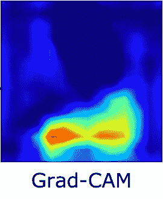

# 人工智能安全——你如何防止敌对攻击？

> 原文：<https://towardsdatascience.com/ai-safety-how-do-you-prevent-adversarial-attacks-ede17480a24d?source=collection_archive---------15----------------------->

Grad-Cam overlaid on top of input-images to DNN from the paper Defending against Backdoor Attack on Deep Neural Networks

## 与 IBM 研究人员 Pin-Yu 和 Sijia 就他们最近的论文进行了简短的交谈

我承诺写 50 天关于人工智能安全的文章，但是最近我更关注人工智能安全和伦理。我认为，我们如何在人工智能领域应用解决方案的目标，是人工智能安全中与防御或攻击同等重要的考虑因素。另一方面，人工智能安全的技术方面也是需要考虑的，因此在接下来的几天里我会更多的关注这方面。今天我和品玉和思佳聊天。平-陈愉和刘思佳是麻省理工学院 IBM 沃森人工智能实验室 IBM 人工智能研究中心的研究人员。

像往常一样，我会在开头放一个简短的免责声明，因为我可能会给出一些没有解释的高级概念，这是我试图理解的一个过程。

## 对抗性机器学习和中毒攻击

在我开始看关于这个主题的三篇论文之前，我将触及对抗性机器学习和中毒攻击的基本概念。

***“对抗性机器学习:*** *是机器学习领域采用的一种技术，试图通过恶意输入来愚弄模型。这项技术可以应用于各种原因，最常见的是攻击或导致标准机器学习模型出现故障。”*

***“投毒攻击*** *:机器学习算法往往会对运行过程中收集的数据进行重新训练，以适应底层数据分布的变化。例如，入侵检测系统(IDSs)通常根据网络运行期间收集的一组样本进行重新训练。在这种情况下，攻击者可能会通过注入精心设计的样本来破坏训练数据，最终危及整个学习过程。因此，中毒可被视为训练数据的敌对污染。”*

Pin-Yu 和 Sijia 目前正在努力了解一个可能的威胁，以避免它。 ***网络防御* e** 专注于感知、探测、定位和打击对手，以确保任务成功并智胜对手。因此，已经提出了哪种类型的技术来处理这些类型的网络攻击？

## 块移位以提高鲁棒性

一种称为“块切换”的新概念，旨在通过用随机分配的运行时间对人工智能模型层的部分进行编程，提供一种前所未见的对抗攻击的防御策略，以便它“愚弄”对手，防止他们知道并利用模型层的弱点。

在计算机科学中，健壮性是计算机系统在执行过程中处理错误和处理错误输入的能力。鲁棒性可以涵盖计算机科学的许多领域，如健壮的编程、健壮的机器学习和健壮的安全网络。

语块转换是对抗对抗性干扰的一种可能的防御手段吗？他们的研究结果可能会表明这一点。那么什么是对抗性扰动呢？

[***对抗性扰动***](https://zpascal.net/cvpr2018/Poursaeed_Generative_Adversarial_Perturbations_CVPR_2018_paper.pdf) *:用于创建对抗性例子的新颖生成模型，类似自然图像但恶意制作以愚弄预先训练的模型的轻微扰动图像。*

一个重要的部分是增强一个模型并保持测试的准确性，而块切换似乎可以同时保持这两者。

> “块交换易于实现，既不需要额外的训练数据，也不需要关于潜在对手的信息。此外，在推理阶段，它没有比常规模型额外的计算复杂性，因为一次只使用一个通道。”

## 修剪方法

IBM 研究人员提出了一种新的“修剪方法”，可以降低后门(更难识别和跟踪)攻击(也称为中毒攻击)的成功率。在这项研究中，科学家可以识别作为后门攻击入口的受感染神经元，并有效地清除它们。典型的例子，取自[另一篇文章](https://arxiv.org/pdf/1707.08945.pdf)，是自动驾驶汽车。

有这样一个:*“用于训练一个模型来欺骗多个目标网络的架构。用于训练生成器的愚弄损失是目标模型的愚弄损失的线性组合*

在《防御深度神经网络的后门攻击》中，、徐、、、提出了一种剪枝方法。

本文研究了后门深度神经网络(DNN)的内部响应，并提出了一种有效的防御方法。他们从通过 Grad-
CAM 描述普通和后门 dnn 开始。为了理解这种说法，让我们先了解一下 DNN、安和 Grad-CAM 是什么。

***深层神经网络*** *:是具有一定复杂程度的神经网络，具有两层以上的非整神经网络。深度神经网络使用复杂的数学模型以复杂的方式处理数据。*

***人工神经网络*** *(* ***安*** *)或连接主义系统是受构成动物大脑的生物神经网络启发但不一定相同的计算系统。这种系统通过考虑例子来“学习”执行任务，通常没有用任何特定于任务的规则来编程。*

***梯度加权类激活映射****(*[***Grad****-****CAM***](https://arxiv.org/abs/1610.02391)*):使用任意目标概念的梯度，流入最终卷积层，产生一个粗略的定位图，突出图像中的重要区域，用于预测概念。*

*图像渐变是图像中强度或颜色的方向性变化。*

研究人员声称他们将在防御和攻击两方面做进一步的工作。在防守方面，他们将发展他们的修剪方法到一个更普遍和有效的防守方法。对于攻击方，他们也可以根据本文
中发现的特征，尝试设计更强大的攻击。

## 防止攻击的 AI 安全

**网络威胁搜寻**是通过网络主动迭代搜索，检测和隔离规避现有安全解决方案的高级威胁的过程。进攻、主动的网络活动和主动的网络防御*有助于减少预期的威胁*，而*则提供保护、检测和事件响应*，因为它能够在远距离和时间上与对手交战。

我很幸运能够采访到 Pin-Yu 和 Sijia，不过这将留给另一天的#500daysofAI。

这是#500daysofAI 的第 74 天。我目前第 50-100 天的重点是人工智能安全。如果你喜欢这个，请给我一个答复，因为我确实想提高我的写作或发现新的研究，公司和项目。如果你想交谈或讨论任何事情，请与我们联系。