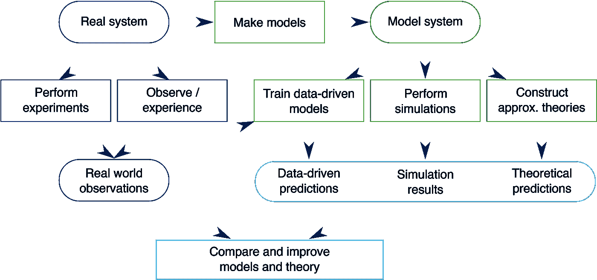

# AI +安全与 DNV-GL

> 原文：<https://towardsdatascience.com/ai-safety-with-dnv-gl-826500a401a7?source=collection_archive---------29----------------------->

Photo by [@eadesstudio](https://unsplash.com/@eadesstudio) Unsplash

## 审查执行摘要和现状

在写完 OpenAI 和他们关于安全的研究论文[[1](/debating-the-ai-safety-debate-d93e6641649d?source=friends_link&sk=55e9229db0464a53c5b27d715c79b1fa)][[2](/avoiding-side-effects-and-reward-hacking-in-artificial-intelligence-18c28161190f?source=friends_link&sk=b71f8915dc595fe44cbdeeb2f7d0a735)][[3](https://medium.com/ai-social-research/social-scientists-and-ai-1d9d97a5246?source=friends_link&sk=fb29f5178e3c4b34b7ec56082bfc3e47)之后，我决定看看离家更近的地方。因为我住在挪威，我想知道这里是否有人关注人工智能安全。当然有，而且可能比我能找到的要多得多。然而，我很幸运地发现了 DNV 大学 GL 的一位研究员关于这个主题的立场文件。这篇论文叫做[人工智能的 AI +安全安全含义:为什么我们需要结合因果和数据驱动模型](https://ai-and-safety.dnvgl.com/)。

*正如我之前在报道 Google 和 OpenAI 时提到的，由于我缺乏经验和审阅论文的时间很短(一天)，我对他们工作的解释可能会有所欠缺。我会尽力而为。尽管如此，我还是希望你能和我一起对 Simen Eldvik 的立场文件进行简短的检查，他是首席研究科学家@ DNV GL-Risk&机器学习。*

## 关于 DNV-GL

自 1864 年以来，DNV-GL 的宗旨一直是保护生命、财产和环境。DNV GL 是一个国际认可的注册和船级社，总部设在挪威的霍维克。他们在 100 多个国家有 350 个办事处。他们是海事、石油和天然气、电力和可再生能源行业风险管理和质量保证服务的领先提供商。他们也是各行各业公司管理体系认证的全球领导者，包括医疗保健、食品和饮料、汽车和航空航天。他们目前的收入是 195 亿挪威克朗(22.3 亿美元)。他们每年投资我们收入的 5%用于研发。Eldvik 在他们的研究部门工作，负责风险&机器学习。

## 关于西蒙·艾尔维克

Simen 一直在进行与机器学习(ML)、人工智能(AI)和基于物理学的罕见和高后果场景约束相关的研究。他一直致力于理解 ML 方法和虚拟测试如何用于数据很少或没有数据的预测。这项工作是为了确保高风险工程系统的安全，需要结合已知的原因。他在卑尔根大学写了他的物理声学和材料科学博士论文，题目是“利用声共振测量钢中的非线性声弹性效应”。在此之前，他拥有物理学硕士学位。

## Eldvik 是如何定义安全的？

Eldvik 参考 ISO/IEC 指南将安全定义为*“远离不可容忍的风险】* ( [ISO](https://www.iso.org/standard/53940.html) )。他还说:“这个定义意味着，一个安全的系统是这样一个系统，在这个系统中，不可容忍的后果发生的概率或频率足够低。AI 和 ML 算法需要相关的观察才能准确预测未来场景的结果，因此，**数据驱动的模型本身可能不足以确保安全**，因为我们通常没有详尽和完全相关的数据。”

因此，有几个方面值得一提，以进一步推动他的论点。欧盟基本权利机构(FRA)有一篇论文叫做 [*数据质量和人工智能——减轻偏见和错误以保护基本权利*](https://fra.europa.eu/en/publication/2019/artificial-intelligence-data-quality) *。*之前写过欧盟诉脸书，因其未能保护用户数据[ [4](/facebook-vs-eu-artificial-intelligence-and-data-politics-8ab5ba4abe40?source=friends_link&sk=756bbc8cf12d7bab4c83f6b802abdf9e) ]。如果我们超越这些数据，那么人工智能中的公平性也是一个相当大的问题，人工智能中的多样性危机也是如此。

## 利用传感器数据和数据驱动模型降低风险

正如 Eldvik 提到的事故会发生，所以存在如何降低风险的问题。他有三个明确的建议，我把它们抄了下来，略加删节:

1)我们需要利用数据获得经验稳健性。然而，我们可能从收集的所有数据中获得的经验知识是大量的。如果我们可以确定[*【DGP】*](https://en.wikipedia.org/wiki/Data_generating_process)*数据生成过程的哪些部分本质上是随机的，哪些是确定性的(例如，由已知的第一原理支配)，那么随机元素可以用于其他相关场景，以增加相对于经验观察到的变化的稳健性。*

由于他的第一点，让我详细说明一下**数据生成过程(DGP):**(a)***数据收集过程*，即数据到达数据库的路线和程序(通常是动态的)；(b) *统计模型*用于表示观察值中假定的随机变化，通常是解释性和/或潜在变量；(c)一个概念上的和非特定的*概率模型*(与没有直接描述或明确设定的机会/概率有关)，包括结合在一起导致个体观察的随机影响，其中一个实例是根据多个随机叠加效应的组合对正态分布的“共同出现”的假定证明。**随机**的意思是:具有随机的概率分布或模式，可以进行统计分析，但可能无法精确预测。**

**2)我们需要利用因果和基于物理的知识来提高外推的鲁棒性。如果一个 DGP 的确定性部分是众所周知的，或者可以应用一些物理约束，这可以用来更有把握地外推超出现有观测数据的限制。对于后果严重的情况，在没有数据或数据很少的情况下，我们可以根据我们对因果关系和物理学的了解来创建必要的数据。**

**再次作为旁注**从源到目标的外推**，是在数据稀疏时利用外部信息的一种有前途的方法。在计算机科学中，**健壮性**是计算机系统在执行过程中处理错误和处理错误输入的能力。健壮性可以包含计算机科学的许多领域，例如健壮的编程、健壮的机器学习和健壮的安全网络。**

****3)我们需要结合数据驱动和因果模型来实现实时决策。**对于高后果系统，用于通知基于风险的决策的模型需要在潜在的灾难性场景实际发生之前预测这些场景。然而，来自复杂的计算机模拟或经验实验的结果通常不可能实时获得。这些复杂模型中的大多数都有大量的输入，并且由于[维数灾难](https://en.wikipedia.org/wiki/Combinatorial_explosion)，计算/模拟真实系统在运行前可能经历的所有潜在情况是不可行的。因此，为了能够在实时环境中使用这些复杂的模型，可能有必要使用替代模型(完整模型的快速近似)。ML 是创建这些快速运行的代理模型的有用工具，它基于复杂模拟器或经验测试的有限数量的实现。**

**之前我写了一篇关于无监督数据增强的半监督学习的进步的文章[ [7](/advancements-in-semi-supervised-learning-with-unsupervised-data-augmentation-fc1fc0be3182?source=friends_link&sk=cbac033d5f98b5ff54daf4547a3d0ace) ]，在那里我描述了维数灾难。换言之，这可以被称为输入空间的**维度。高维空间(100 或 1000)。空间的体积增加太多，数据变得稀疏。例如，计算优化问题中的每个值的组合。****

****4)在开发数据驱动的模型时，应包括风险衡量。**对于高风险系统，在[优化过程](https://en.wikipedia.org/wiki/Mathematical_optimization)中使用的[目标函数](https://en.wikipedia.org/wiki/Loss_function)必须包含一个风险度量。这应该惩罚错误的预测，在错误预测的后果是严重的情况下，使得分析师(人或人工智能)理解在该区域内的操作与相当大的风险相关联。该风险测量也可用于安全关键系统响应的适应性探索(即作为[实验设计](https://en.wikipedia.org/wiki/Design_of_experiments)的一部分)。**

**在 OpenAI **关于 AI 安全性的论文中，也提到了目标函数**。在线性规划中，需要最大化或最小化函数。用简单的英语，也许太简单了，我们可以问:*我们做得对吗？*如果我们将矿产资源开采的价值最大化，却忘记了可能的环境外部性(理解为:损害),这可能就是一个例子。在此他们将**事故**定义为:**

***“从广义上讲，事故可以被描述为这样一种情况:一个人类设计师想到了某个(也许是非正式指定的)目标或任务，但是为该任务设计和部署的系统却产生了有害的和意想不到的结果。”***

**你可以阅读我关于避免人工智能中的副作用和奖励黑客的文章，以获得关于这个主题的进一步想法和关于名为[***AI 安全中的具体问题***](https://arxiv.org/pdf/1606.06565.pdf) 的报告的更多信息。幸运的是，Simen Eldvik 不久后提到了同一篇论文，所以看起来我们有共同的兴趣。**

**不确定性应严格评估。由于不确定性对于评估风险至关重要，因此包括严格处理不确定性的方法是首选方法(如贝叶斯方法和概率推断)。**

****贝叶斯推断**是一种统计推断方法，当更多的证据或信息可用时，贝叶斯定理用于更新假设的概率。贝叶斯推理与主观概率密切相关。在概率论和统计学中，**贝叶斯定理**描述了一个事件发生的概率，基于可能与该事件相关的条件的先验知识。**

## **编纂的过去不会创造未来**

**这个标题是引用凯茜·奥尼尔的话的缩写，凯茜·奥尼尔是《数学毁灭武器》的作者，埃尔维克在他的论文中提到了这一点。Cathy 谈到了大数据，我发现它如此引人注目，所以我想在本文中分享它:**

> **“大数据流程整理了过去。他们没有发明未来。”—凯西·奥尼尔**

**由于这种模型预测只能做这么多，然而，它可能是有用的发挥出一些情景，特别是在有很大的人类生命风险的地区。**

**Eldvik 的立场文件中没有提到这一点，我也不能说模型是否会产生任何影响，但在挪威，亚历山大·基兰钻井平台在 1980 年 3 月倾覆，造成 123 人死亡。因此，安全建模的风险可能很高。我们当然不能预测或模拟条件，但有一个重要性，可能是生死攸关的。**

**Eldvik 展示了一个基于 Allen 和 Tildesley 对液体的计算机模拟的图表:**

****

> **“数据驱动的决策基于数据科学的三个原则:可预测性、可计算性和稳定性( [B. Yu，2017](https://dl.acm.org/citation.cfm?id=3105808) )。此外，对安全关键系统尤为重要的是，需要在决策环境中评估错误预测的后果。”**

**他谈到了 Kaggle 竞赛，以及要“赢得”的挑战可能没有遵循经验主义的严格性。他指的是谷歌大脑团队成员写的一篇名为 [*赢家的诅咒*](https://openreview.net/pdf?id=rJWF0Fywf) 的论文。**

*****Kaggle*** *是一个预测建模和分析竞赛的平台，在这个平台上，公司和研究人员发布数据，统计学家和数据挖掘者竞争产生预测和描述数据的最佳模型。***

**他们提出了经验评价标准的方法:(1)调整方法论；(2)切片分析；(3)消融研究；(4)健全性检查和反事实；(5)至少一个否定结果。你可以去 Google Brain 的论文或者 Simen Eldvik 获取更多的信息。**

## **结论**

**值得看一看 Simen Eldvik 的研究和他关于 AI +安全主题的立场文件。DNV-GL 是一家与风险打交道的公司，因此我们很有可能在未来看到他们团队的更多研究。或许未来会有一个风险衡量和算法的认证？美国立法者正在提出一项法案，要求[大公司审计机器学习驱动的系统](https://www.wyden.senate.gov/imo/media/doc/Algorithmic%20Accountability%20Act%20of%202019%20Bill%20Text.pdf)，也许我们应该在挪威采取类似的措施。如果是这样的话:那么 DNV-GL 将是促成这样一个政策项目的最佳人选。**

*****我的文章列表*** :**

**[ [1](/debating-the-ai-safety-debate-d93e6641649d?source=friends_link&sk=55e9229db0464a53c5b27d715c79b1fa) ]辩论 AI 安全辩论**

**[ [2](/avoiding-side-effects-and-reward-hacking-in-artificial-intelligence-18c28161190f?source=friends_link&sk=b71f8915dc595fe44cbdeeb2f7d0a735) ]避免副作用，奖励人工智能中的黑客行为**

**社会科学家和人工智能**

**[ [4](/facebook-vs-eu-artificial-intelligence-and-data-politics-8ab5ba4abe40?source=friends_link&sk=756bbc8cf12d7bab4c83f6b802abdf9e) 脸书 vs 欧盟人工智能和数据政治**

**[ [5](https://medium.com/@alexmoltzau/artificial-intelligence-and-fairness-75c2490e8d57?source=friends_link&sk=32fc4151778edb664eb79dd57e712118) 人工智能与公平**

**人工智能和挪威的性别配额**

**[ [7](/advancements-in-semi-supervised-learning-with-unsupervised-data-augmentation-fc1fc0be3182?source=friends_link&sk=cbac033d5f98b5ff54daf4547a3d0ace) 半监督学习在无监督数据增强方面的进步**

****感谢您的阅读。这是#500daysofAI 的第 60 天。我每天写一篇关于人工智能的新文章。****