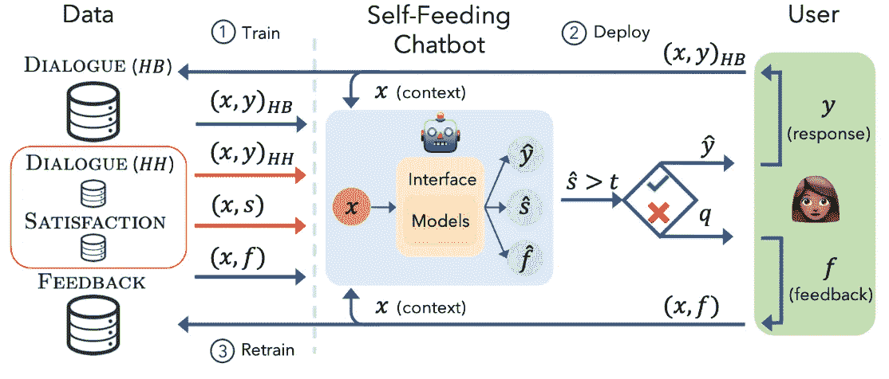

# 人工智能学者:部署后改进的聊天机器人

> 原文：<https://towardsdatascience.com/ai-scholar-chatbots-that-improve-after-deployment-deaef4f91379?source=collection_archive---------14----------------------->

## 部署后对话学习:喂饱自己，聊天机器人！

在过去的几年里，聊天机器人行业缓慢但肯定地成为一种全球现象。2016 年，聊天机器人市场价值约 7 亿美元。根据最近的一份报告，全球聊天机器人市场以超过 24%的 CAGR 增长，预计到 2025 年将达到 12.5 亿美元。

人工智能和机器学习技术的创新正在日益增强聊天机器人的功能，从而推动市场需求。与人工助手不同，聊天机器人提供即时响应，处理复杂的问题，增强分析，提高客户参与度，并且成本更低。人工智能、NLP 和机器学习的进步不断扩大，现代聊天机器人变得越来越智能。因此，聊天机器人的未来是光明灿烂的。

聊天机器人最近的一项发展是聊天机器人通过自我喂食来训练自己的能力——从他们参加的对话中提取新的训练数据的能力。

## 独立聊天机器人——从之前的对话中学习

以前，聊天机器人代理参与的大多数谈话或对话都是已经训练过的，需要大量的监督。

然而，新的研究工作现在提出了一种方法，为聊天机器人提供了无限的能力，它们可以参与对话，并学习自动评估用户对回复的满意度，以便能够改进自己。聊天机器人使用任何可用的监督数据进行训练，并在生产中发布。如果对话进行得很顺利(超过设定的满意度)，机器人会继续自己的对话。相反，当对话进行得不顺利时，机器人会意识到它犯了一个错误，并请求用户反馈，它会预测并模仿用户反馈。聊天机器人偶尔用可用的响应重新训练，而不需要任何新的监督学习，从而提高其对话性能。

这种方法类似于人类的对话技巧，它不仅仅是观察其他人参与良好的对话，而是根据我们对话的反馈主动微调和调整我们的讲话。

## 潜在用途和影响

这种新方法结合了一些想法，创建了一个健壮的、能够随着时间的推移而改进的系统。虽然本文概述了如何在聊天机器人中使用它，但类似的方法可以用于许多不同的产品。我期待着有一天，当我推出一个产品，它会继续变得更好，并根据用户如何与产品互动和参与而更新。“为了你”的革命来了。

链接:【https://arxiv.org/abs/1901.05415v1】T2