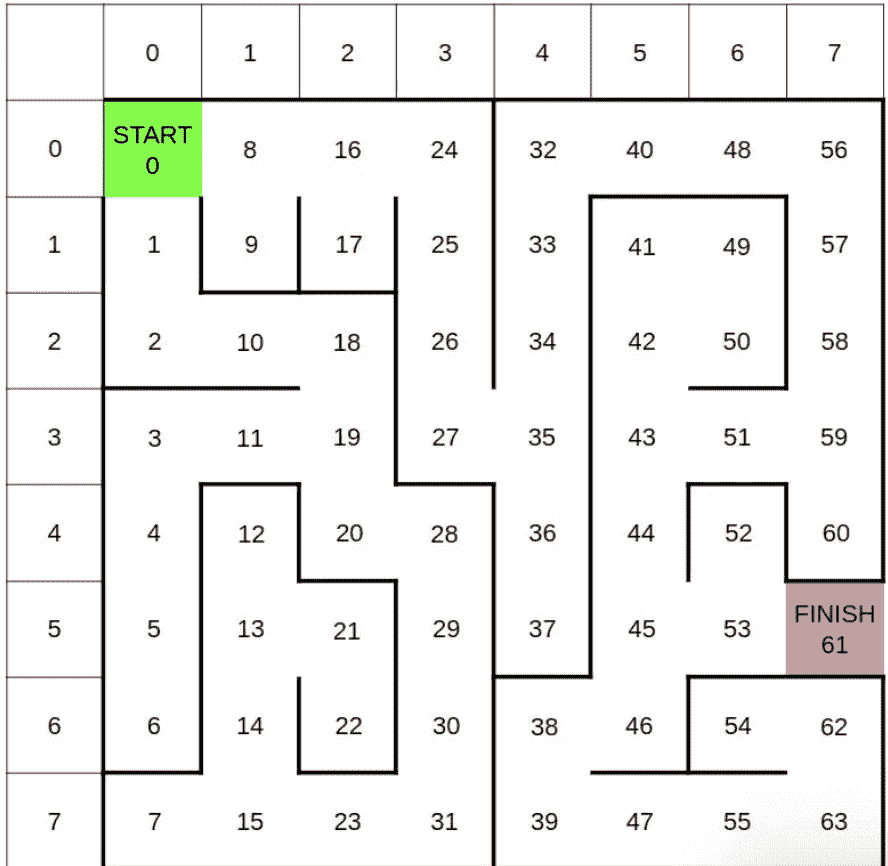
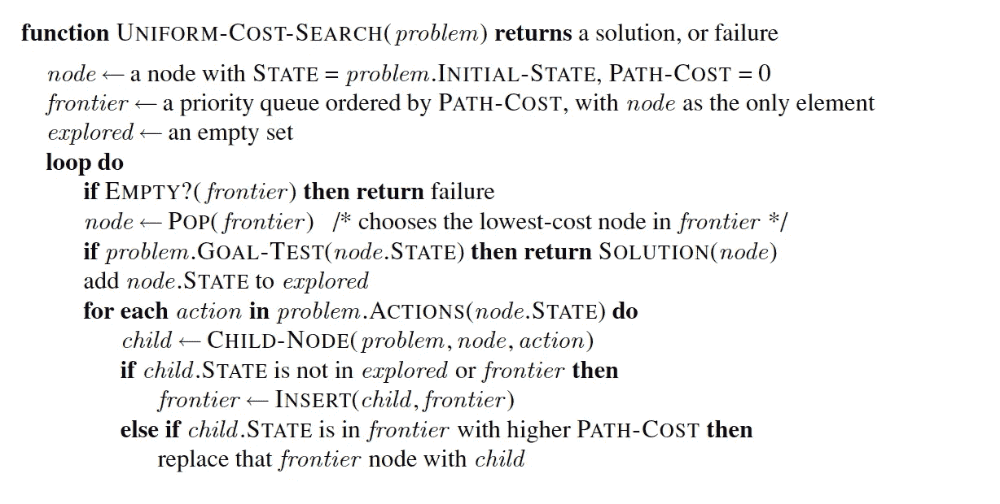

# 人工智能搜索算法实现

> 原文：<https://towardsdatascience.com/ai-search-algorithms-implementations-2334bfc59bf5?source=collection_archive---------4----------------------->

## 人工智能中流行的搜索算法的解释和实现

在纳布星球，R2-D2 机器人为她的阿米达拉女王服务，并成功窃取了一些重要文件，其中包含位于火山星球穆斯塔法的黑魔王达斯·瓦达城堡的秘密。

一旦黑魔王发现了这件事，他就会派军队去追 R2D2，从他那里取回文件。

Photo by [James Pond](https://unsplash.com/@jamesponddotco?utm_source=unsplash&utm_medium=referral&utm_content=creditCopyText) on [Unsplash](https://unsplash.com/search/photos/starwars-robot?utm_source=unsplash&utm_medium=referral&utm_content=creditCopyText)

害怕达斯的军队，R2D2 藏在一个山洞里。在进入洞穴时，R2D2 找到了洞穴的地图，它知道自己在网格位置 0，需要到达网格 61 才能走出洞穴。

达斯的军队知道 R2D2 藏在山洞里，所以他们在山洞里设置了炸药，一定时间后会爆炸。

让我们利用我们的人工智能知识和人工智能搜索算法，帮助 R2D2 搜索出洞穴的路径，并成功地将被盗文件交给他的女王。

R2D2 必须遵循以下规则来寻找他的出路。这个逻辑被硬编码在他的记忆中。

*   *每个节点的(x，y)坐标分别由迷宫顶部和左侧显示的列和行定义。例如，节点 13 具有(x，y)坐标(1，5)。*
*   *按升序处理邻居。例如，如果处理节点 13 的邻居，首先处理 12，然后处理 14，然后处理 21。*
*   *边境使用优先队列。将(优先级，节点)的元组添加到边界。例如，在执行 UCS 和处理节点 13 时，将(15，12)添加到边界，然后是(15，14)，然后是(15，21)，其中 15 是到每个节点的距离(或成本)。*
*   当从边界移除节点(或弹出队列)时，通过选择按字典顺序排在第一位的节点来打破平局。例如，如果从上面的(15，12)、(15，14)和(15，21)中选择，先选择(15，12)(因为 12 < 14 < 21)。
*   *当一个节点从边界移除(或弹出队列)时，该节点被视为已访问。*
*   *只有有效的移动是水平和垂直的(不是对角线)。*
*   *探索单个节点需要 1 分钟。逃离迷宫的时间将是探索的所有节点的总和，而不仅仅是最终路径的长度。*
*   *所有的边都有成本 1。*

# 1.统一成本搜索

> R2D2 被指示使用**统一成本搜索**算法找到走出迷宫的路。如果 R2D2 使用统一成本搜索，他需要多长时间逃离洞穴？

让我们通过实现和编写统一成本搜索算法的代码来尝试找到答案。下面是 ***统一成本搜索*** 的伪代码

*Uniform Cost Search Pseudocode*

让我们用 python 实现这个伪代码。

Uniform Cost Search algorithm implementation

为了运行这个搜索算法，我们需要以图形的形式提供迷宫。这个 [util.py](https://github.com/fakemonk1/AI-Search-Algorithms-Implementations/blob/master/util.py) 中提到了将这个迷宫转换成图形的代码。

因此，如果我们运行上面的代码，我们可以看到，如果 R2D2 遵循统一成本搜索，从起始位置(单元 0)到达迷宫的出口(单元 61)，将探索 58 个节点，因此他将花费 58 分钟走出洞穴。

有趣的是，达斯·瓦达也研究了 UCS 算法，他现在更新了爆炸的时间，这样 UCS 就不再适用于 R2D2 了。

> R2D2 现在有什么选择？

# 2.寻星

研究过搜索算法后，R2D2 知道 *A 搜索比统一成本搜索* *更快。他计划用**的 *A*搜索*与**的曼哈顿距离启发式。R2D2 现在要花多长时间才能找到离开洞穴的路？

让我们用曼哈顿距离试探法实现 A 星搜索算法。 [***曼哈顿距离***](https://en.wiktionary.org/wiki/Manhattan_distance)*是网格上各点之间的水平和垂直距离之和，计算公式相同:*

*Manhattan Distance heuristic*

*让我们实现 A-Star 搜索算法，找出 R2D2 走出迷宫所用的更新时间。*

*A-Star Search algorithm implementation*

*通过运行上面的 A-Star 代码，我们知道 R2D2 现在将探索 50 个节点，因此将花费 50 分钟走出洞穴，这是 ***“比 UCS****快 8 分钟”。**

**

*R2D2 现在从一个可靠的机器人朋友(C-3PO)那里得到了一个提示，达斯·瓦达再次更新了计时器，传统的 A*搜索不够好。作为专家，R2D2 并没有被吓倒。他注意到迷宫中有一个瓶颈。更具体地说，27–35°的边缘是从迷宫的左半部分穿越到右半部分的唯一途径。*

*意识到这一点，R2D2 决定将搜索分成两部分。首先，他从起点搜索到瓶颈(节点 27)。然后，他从瓶颈(节点 35)搜索到目标。他现在要花多长时间才能走出洞穴？*

*如果 R2D2 运行瓶颈 Astar 从 0 到 27，然后 35 到 61，他只需要探索 38 个节点，与其他搜索方法相比，他可以更快地走出洞穴。*

*正如我们在上面的结果中看到的，A*搜索算法是一种“智能”搜索算法，与其他传统搜索算法相比，它的运行速度更快。*

# *结论*

*这个问题也可以通过使用这里提到的**更高级的搜索算法来解决。为了简化搜索算法的介绍，我选择不在本文中实现这些算法。***

***我试图用上面的星球大战故事，以一种有趣的方式解释和实现人工智能搜索算法。如果你喜欢它，请分享，如果你在代码中发现任何错误或可能的改进，请在评论中添加。***

***本文中使用的代码和完整的工作示例可以在下面的 git 资源库中找到:***

***[**https://github . com/fake monk 1/AI-搜索-算法-实现**](https://github.com/fakemonk1/AI-Search-Algorithms-Implementations)***