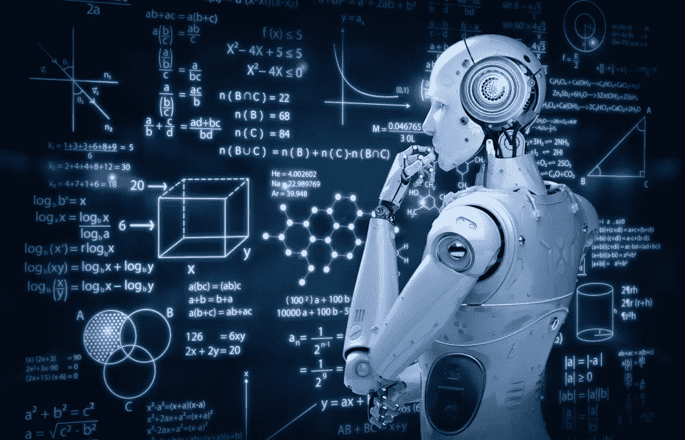

# 人工智能系列:走进学习理论。

> 原文：<https://towardsdatascience.com/ai-series-a-walk-into-the-theory-of-learning-273f79e585e4?source=collection_archive---------22----------------------->

## 机器学习的目标是建立最简单的近似模型，能够解释数据生成过程提供的过去数据和未来实例。

统计学习理论是人工智能发展得最漂亮的分支之一，它为我们提供了许多当今机器学习算法的理论基础。它还试图用哲学的方法来确定从经验数据中得出有效结论的基本要素。

事实上，在机器学习中，将输入域的数据映射到输出域的相应数据的目标函数是未知的。如果它是已知的，我们根本不需要任何学习，我们只需要实现它。学习的基本前提是使用一组观察来揭示一个潜在的过程。在机器学习中，目标是从有限的样本数据集中找到一个逼近目标函数的函数。

从监督学习的角度来看这个问题，我们的挑战包括从一组带标签的数据中学习。训练集中的每个点都是一个输入-输出对，其中输入映射到一个已知的输出。学习问题包括找到最佳算法，该算法能够捕获由样本数据对的分布隐含描述的未知支配规则，并构建一个假设函数，该假设函数逼近目标函数，可用于预测未来未知输入的输出。学习模型的性能，或概括性能，是根据其对独立测试数据的预测的准确度的百分比来测量的。

学习理论及其众多的分支和子理论为我们提供了构建最高性能模型的所有必要工具。

为了选择最佳模型，然后评估其泛化性能，作为最佳实践，在数据丰富的情况下，可用于训练算法的样本数据集通常被分成 3 个随机选择的组:

算法用来拟合模型的训练集。通过利用算法的调整参数(超参数)，我们可以开发不同复杂程度和精度的不同模型。
用于评估不同模型性能的验证集，将它们相互排序，并在其中选择具有最低估计预测误差的模型。
用于评估完全指定的所选模型的泛化性能(和误差)的测试集。
当建模者探索不同的模型类型和它们带来的参数的广泛选择时，预测误差，或概括误差，经常指导模型选择过程。但是估计预测误差并不是微不足道的，因为它是 3 个误差子类的结果:偏差、方差和噪声。

也称为“不可约误差”，噪声是唯一一种不能通过选择模型来减少的误差，因为它仅取决于我们可用于训练的数据。

如果训练数据集中的数据是由固有的随机(random)过程生成的，或者是一个错误的问题，或者是特征集是错误的或不完整的，我们可以花一生的时间来尝试提高我们的模型预测性能，但我们永远不会比我们的杂乱数据允许我们做的更好。

这就是为什么数据科学家花大约 19%的时间寻找好数据，另外 60%的时间清理和组织他们收集的数据:机器学习模型准确预测他们被训练预测的东西:在最好的情况下，他们的预测只能与用于训练的数据一样好。垃圾进，垃圾出。或者更好地说，有噪声的数据输入……有噪声的、容易出错的预测输出。

但是噪音不仅仅是…无用的噪音。它实际上可以作为一个警报，指示错误或不完整的特征选择或错误的训练数据集。

假设我们正在尝试学习一个函数，它能够根据包含年龄的训练数据集来预测人的体重。嗯……是的，年龄可能是预测体重时要考虑的因素之一，但还有许多其他因素来表征体重，包括身高、性别、地理位置等等。如果只考虑年龄，您很可能会得到一个较弱的预测值和一个较大的概化误差，因为对于输入中的每个年龄值，您将有许多不同的权重值可供选择或平均。

因此，对于给定的一组特征，噪声在真实分布中可能不是真正的噪声。可能我们只是没有从数据集中选择足够的表征特征，或者选择了错误的特征，从而无法模拟真实的分布。

当对给定数据集的最大可实现性能(或最小可实现泛化误差)设置正确的期望值时，噪声也非常重要。

例如，假设你正在做金融预测，试图检测市场是上涨还是下跌。这种类型的数据中的噪声水平如此之高，以至于你会非常高兴持续地在 53%的时间里得到正确的结果。因此，虽然 47%的错误率可能看起来是一个非常高的错误率，但这可能是在这种情况下您可以获得的最佳性能。但是考虑一下这个:只要泛化性能高于 50%并且是一致的，你就在做生意，就像许多对冲基金一样，通过这些预测赚了很多钱！

正如我们所看到的，虽然噪声可以为我们提供一些重要的质量相关指标，但它的存在确实会损害我们的模型泛化性能。因此，在训练算法时，我们需要确保它从分布固有噪声中收集尽可能少的数据，这些噪声不携带任何有用的可重复使用的信息或模式，这些信息或模式表征了我们试图理解的控制函数的分布。

怎么会？嗯…确保算法不会学习…太多！

如果算法非常精确地映射了给定训练分布的所有数据点，那么它肯定会在该特定训练数据上产生非常小的误差(训练误差)。然而，在从有效数据点学习的同时，它也将拾取由噪声产生的数据中的随机变化，其代价是测试数据的高误差(测试误差)的高得多的成本，并且因此由于高泛化误差而导致低性能。

换句话说，更高的精度意味着收集更多的噪声，这些噪声会使算法与训练数据中的明显关系“混淆”,而训练数据中的明显关系通常并不基于良好数据和噪声数据的错误组合。

对训练数据建模过于严格的算法会吸收太多的噪声，其结果是，根据训练集的不同，它会产生完全不同的模型，并在不同的测试数据上表现出很大的性能差异。

方差准确地衡量:算法对特定训练数据集的敏感度。高方差表示算法与数据拟合得太好，并且可能过于复杂，因为数据分布试图建模，因此被称为过度拟合数据。

这就是为什么我们需要寻找“最简单的近似模型”！

另一方面，我们也不能选择一个过于简单且表达能力不足的模型来捕捉和学习事件数据分布的复杂性。

想象一下，使用线性回归来绘制具有非线性模式的训练数据集:无论您多么努力地尝试，无论您能够收集多少观察值，线性回归都只是一条线，而且过于死板，无法对非线性数据集的曲线进行建模。偏差，在方差的对角，本质上测量机器学习算法拟合或足够好地表示用于训练系统的数据集的分布的能力。换句话说，偏差为模型做出的简化假设提供了一个维度，以使目标函数更容易学习，但代价是无法找到最佳的可能函数。在这种情况下，该算法将具有较高的偏差值，并被称为数据欠拟合。

过度拟合的特征是方差，而欠拟合的特征是偏差。

好吧，如果我能够转移至少一部分主要概念，你现在可能已经明白了，我们正面临一个有趣的困境:一方面，如果算法紧密适合训练数据，或者过度适合训练数据，它将显示低偏差但高方差。这表明泛化性能不太好。

另一方面，当算法过于简单而无法很好地拟合训练数据，或者对数据进行欠拟合时，它将显示出较低的方差但较高的偏差值。可能具有良好的泛化性能，但可能不是我们可以选择的最佳算法。

在统计学中，这是一个众所周知的困境，它被称为偏差-方差权衡。

能够找到一种算法，很好地平衡偏差和方差的值，将引导我们准确地看到:具有最佳泛化性能(或最小泛化误差)的最简单的近似模型。

偏差-方差权衡概念在机器学习中也通过估计-近似权衡来捕获。偏差衡量模型对目标函数的较差逼近。为了提高性能，我们可能需要选择不同的算法或算法系列，它们提供更大的假设空间，覆盖更大的区域，更有可能接近或更好地近似我们的目标函数所覆盖的空间。但是让我们记住，我们试图接近的目标函数仅仅是从有限的样本数据中得到的。不是从真实的，未来的，全分布的。样本数据是我们学习的全部，有限的一组数据只能代表描述整个现象的真实函数的估计。因此，类似于偏差-方差权衡的情况，如果我们过于逼近描述样本分布的函数，从而产生较低的逼近误差和较低的偏差，那么风险在于，当我们随后使用新构建的函数来预测或分类来自真实分布的未来未知数据时，我们的函数将继续过于紧密地基于样本数据的学习模式进行预测，并且将导致过于僵化和具体，从而无法很好地捕捉真实分布的一般进展。在这些情况下，每个不同的训练集将生成非常具体的模型，这些模型彼此之间差异很大。这就是为什么在统计学中，表达这一特定方面的统一度量被称为方差，而在更面向机器学习的“方言”中，同一方面被称为估计误差。方差大，估计误差大。

正如我们刚刚看到的，由于模型的复杂性会影响它们的性能，我们需要找到一种方法来以定量的方式定义复杂性，其中，Vapnik-Chervonenkis 维度是一种广泛使用的方法，用于在偏差和方差之间找到正确的平衡，因为它可以量化精度，很好地捕捉模型的复杂性概念。

在不涉及太多细节的情况下，VC 维涉及(但不一定等于)每个模型具有的参数数量，而参数数量又与模型可以处理的数据点数量有关。主要思想是，模型想要近似的数据点的数量越多，模型需要映射它们的参数的数量就越多，这增加了复杂性，并使模型非常特定于该数据集。而具体化并不能很好地概括。VC 维有助于捕捉等式中两个不相容但不可分割的元素之间的最佳平衡。

[对于那些想要深入了解 VC 维的人，请考虑:VC 维测量算法的有效参数或二进制自由度的数量，这反过来又表示特定算法可以粉碎的数据点的数量。如果一组点被一类函数分解，不管我们如何给每个点分配一个二元标号，这个类中的一个成员可以完美地分离它们。]

在测量算法复杂性的同时，VC 维还可以帮助我们估计预测误差，为我们提供一种概率评估，即在给定样本数据集的情况下，算法是否可以学习和推广:与可用训练数据的数量相比，VC 维较低将表明测试误差不会远离训练误差。

这是一个令人惊讶的结果:我们实际上可以做出一个强有力的声明，仅仅使用模型的一个属性，我们的测试性能在我们没有见过的数据上将会如何！

但是学习理论的惊喜并没有到此为止。它为使学习成为可能的迷人旅程提供了更多的基本概念和基本指导。

在推动数据科学家寻求正确的炼金术，将未经训练的数据转化为有价值的预测的同时，它也提出了许多很好的常识，即我们人类应该如何对发生在我们周围的生活事实建立更可靠的假设:多一点现实的数据，少一点嘈杂的观点。

谢谢。

*原载于* [*LinkedIn*](https://www.linkedin.com/pulse/ai-series-walk-theory-learning-michele-vaccaro/) *。*