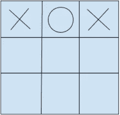
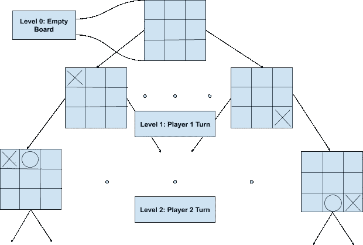
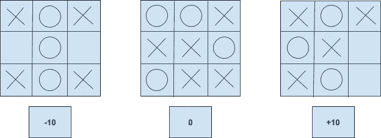
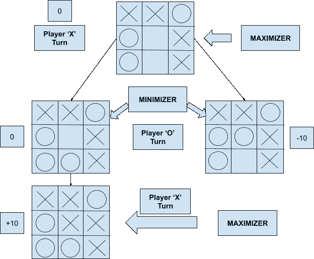
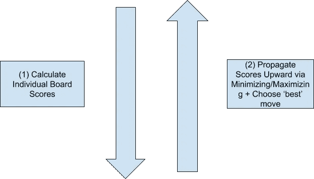
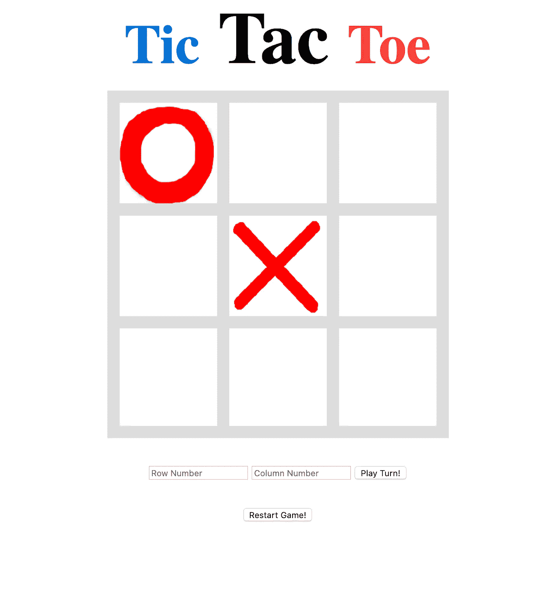

# AI Sidewalk #5:关于 Minimax 的一切！

> 原文：<https://towardsdatascience.com/ai-sidewalk-5-all-about-minimax-via-tic-tac-toe-4c7afe550e83?source=collection_archive---------29----------------------->

## 了解如何成为无与伦比的井字游戏代理！

Beginning of a new journey. Credit to [www.pexels.com/@tony-367405](http://www.pexels.com/@tony-367405?source=post_page---------------------------)

# 这个帖子

这篇文章将重点关注名为 Minimax 的人工智能算法，该算法可用于在不确定性下做出决策。在整篇文章中，我们将利用井字游戏来更好地理解和实现 Minimax。

# Minimax 到底是什么？

更具体地说，顾名思义，该算法寻求**最小化给定代理的最大可能损失**。与此相反的算法叫做**马希民**，它寻求**最大化它所应用到的代理的最小可能增益**。

# 井字游戏人工智能公式

因为这是我们第一次冒险进入人工智能的世界，让我们先弄清楚一些基本的人工智能概念。第一个概念是**状态**和**状态空间**。对于井字游戏，状态只是给定游戏棋盘的任何给定配置:

Example state for Tic-Tac-Toe game

此外，**状态空间**由所有可能的井字游戏棋盘状态的集合组成。很快你就可以看出井字游戏的状态空间会非常大！

第二个概念是**在板值的空间**中搜索。产生的结构是以下形式的树:

Tree for simulating Tic-Tac-Toe moves

请注意，该树的更深层次将继续在玩家 1 和玩家 2 的回合之间交替，直到在最后一级达到一些最终棋盘状态。

# 极大极小的井字游戏公式

如果我们扩展上面的树来获得所有的结束状态，我们可以很容易地分辨出哪些状态是赢的状态、输的状态和平局状态。此外，我们可以根据每个州是赢、输还是平来给他们打分。这些可以告诉我们对于一个给定的玩家(在下面的例子中，玩家“X”)每个状态有多“好”。

Possible Tic-Tac-Toe Board configurations and their associated scores

在这个有两个代理的场景中，Minimax 背后的核心概念是，一个代理将充当最大化者(在我们的例子中，是玩家“X”或 CPU)，而另一个代理将充当最小化者(在我们的例子中，是玩家“O”或用户)。

让我们通过一个例子来说明 Minimax 如何帮助决定 CPU 应该采取什么行动:

整个算法本质上由两个独立的步骤组成。第一步，算法沿着树往下走，给每一层的每块板分配相关的“分数”。然后，第二步向上传播回来，并基于最高得分的整体路径选择一个移动。

Minimax algorithm phases

# 井字游戏最小最大实现

## 井字游戏棋盘类

首先，我们可以创建一个简单的类来初始化表示 TicTacToeBoard 对象的对象，这些对象将显示在我们的前端 UI 中。这个类中有许多方法，其中一些实际上并没有在最终产品中使用。以下是完整的代码片段:

让我们来看看最终产品中实际使用的一些核心功能:

*   **__init__:** 初始化一个空的 3 乘 3 数组(全零)
*   **execute_turn:** 接受一个符号、一个行号和一个列号，在当前的棋盘对象上执行适当的移动。
*   **game_is_won:** 返回true，如果双方中有一方在当前棋盘上赢得了游戏。否则返回 false。
*   **make_move:** 不是最好的名字！在当前棋盘的副本上模拟移动，并返回具有相应结果状态的新棋盘。
*   **get_possible_moves:** 以(row，col)的形式返回一个元组数组，每个元组代表当前棋盘上可以进行的一次可能的移动。
*   **calculate_board_score:** 计算当前棋盘的分数。如果“X”在当前棋盘上处于获胜位置，则该分数为+10；如果“O”处于获胜位置，则该分数为-10；如果没有人处于获胜位置，则该分数为 0。

## 井字游戏烧瓶应用程序文件

除了上面的 board 类，我们还有一个 Flask 应用程序文件，它有一些自己的端点和函数，使我们的前端(我们将制作)能够调用我们的后端。相关代码如下所示:

让我们关注实现 Minimax 算法的三个函数，因为它们构成了我们的“硬”级 TicTacToe 代理的核心功能:

**极大极小函数**

这是我们主要的 minimax 函数，如果 AI 玩家是“X ”,它简单地返回分数最大化移动，如果 AI 玩家是“O ”,返回分数最小化移动。但是在计算每一步棋的分数时，它会考虑对手未来的所有棋步。最后，它返回给定玩家产生最佳分数的移动:

**最小化代理功能**

我们的算法使用的第一个辅助函数简单地模拟了最小化代理(在我们的例子中是‘O’)。注意，这个函数递归地调用了 maximizer 函数(代表‘X’)。你可以认为这是充分利用我们所拥有的一切。因此，在这个函数中，我们试图找到 maximizer 函数返回给我们的分数的平均值，在我们的例子中，它实际上是计算 minimizer 以前返回的最高分数:

**最大化代理功能**

这是我们的算法使用的第二个主要助手函数，它简单地模拟了最大化代理(在我们的例子中为“X”)。注意，这个函数递归地调用 minimizer 函数(它代表‘O’)。你可以再一次认为这是对给予我们的最好的利用。因此，在这个函数中，我们试图找到 minimizer 函数返回给我们的分数中的最高分数，在我们的例子中，它实际上计算 minimizer 的计算分数的平均值:

# 产品化

让我们试着将我们的后端模型产品化，让它更容易被用户使用！我们可以利用一些基本的 HTML 和 CSS 来做到这一点，同时遵循 Flask 的标准项目目录结构。

## 高级目录结构

在我们的例子中，目录结构相当简单，除了上面的两个文件之外，只包含两个不同的文件夹:

*   **静态文件夹:**这个文件夹包含了我们将要使用的 CSS 文件
*   **模板文件夹:**这包含了我们将使用的所有 HTML 文件

## 演示

这里有一个简单的演示来展示最终产品的样子。它与相关的 Github repo 有着完全相同的后端，并被托管在 Heroku @【calm-brook-53734.herokuapp.com】上

 [## 井字游戏

### MinimaxAgent！

calm-brook-53734.herokuapp.co](https://calm-brook-53734.herokuapp.com/) 

请注意，对于演示来说，用户可以玩两种不同的难度，简单和困难。这主要是为了展示随机移动方法和极大极小方法在性能上的本质区别！

## 密码

所有相关的代码(包括前端位！)可以找到@[https://github . com/ShantanuPhadke/AI-Sidewalk/tree/master/5 _ Minimax](https://github.com/ShantanuPhadke/AI-Sidewalk/tree/master/5_Minimax)

# **扩展**

Credit to [https://www.pexels.com/@jeshoots-com-147458](https://www.pexels.com/@jeshoots-com-147458)

在这篇文章中，我们确实覆盖了很好的领域！但正如他们所说，这只是冰山一角。我们在相对简单的棋盘游戏“井字游戏”上实现了一个稍加调整的 Minimax 代理(它的简单之处在于它的状态空间相对较小)。现在你已经知道了基本知识，想象一下你可以为其他游戏制作代理！起初，它可能看起来很复杂，但基本过程可以分为 2 到 4 个部分，这取决于您想要完成的任务:

> (1)找到一种表示游戏状态的方法。
> 
> (2)制作一个树(或图),列出游戏中所有各种可能的状态，并智能地搜索这个状态空间，以确定你的 AI 的最佳行动。
> 
> (3)作为附件(2)，通过‘修剪’状态空间中不需要搜索的部分来加速你的 AI。一种样本修剪技术被称为**阿尔法-贝塔修剪**。
> 
> (4)将你的 AI 产品化，让目标受众可以轻松对抗！