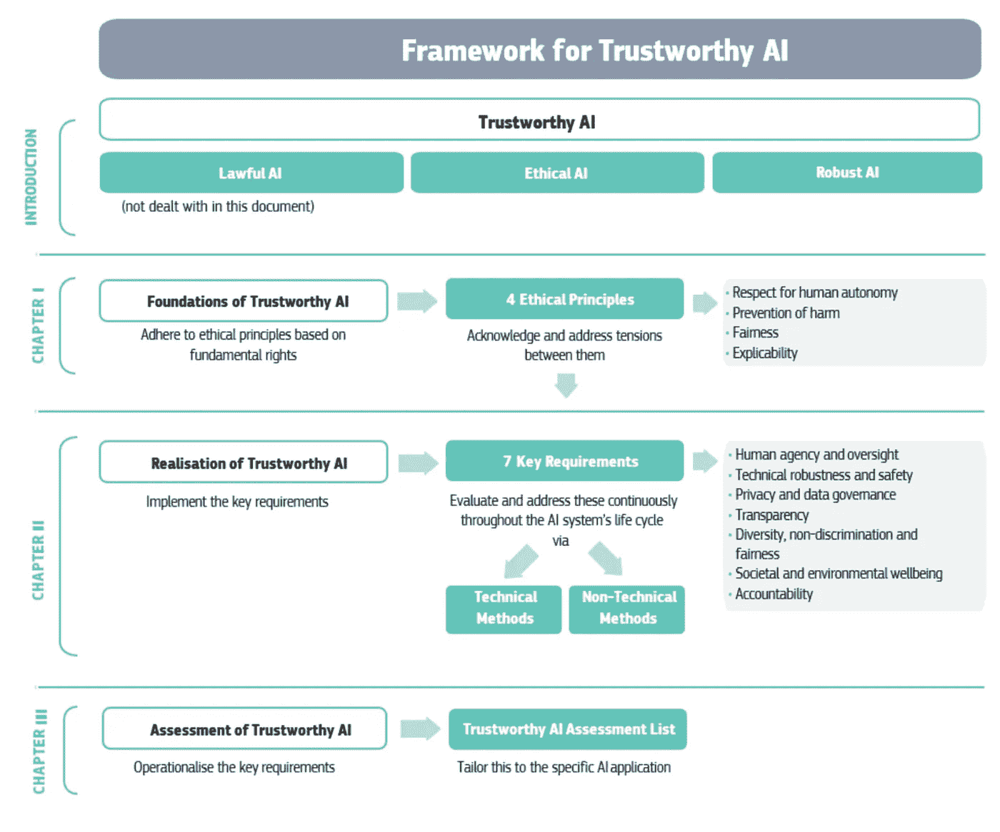
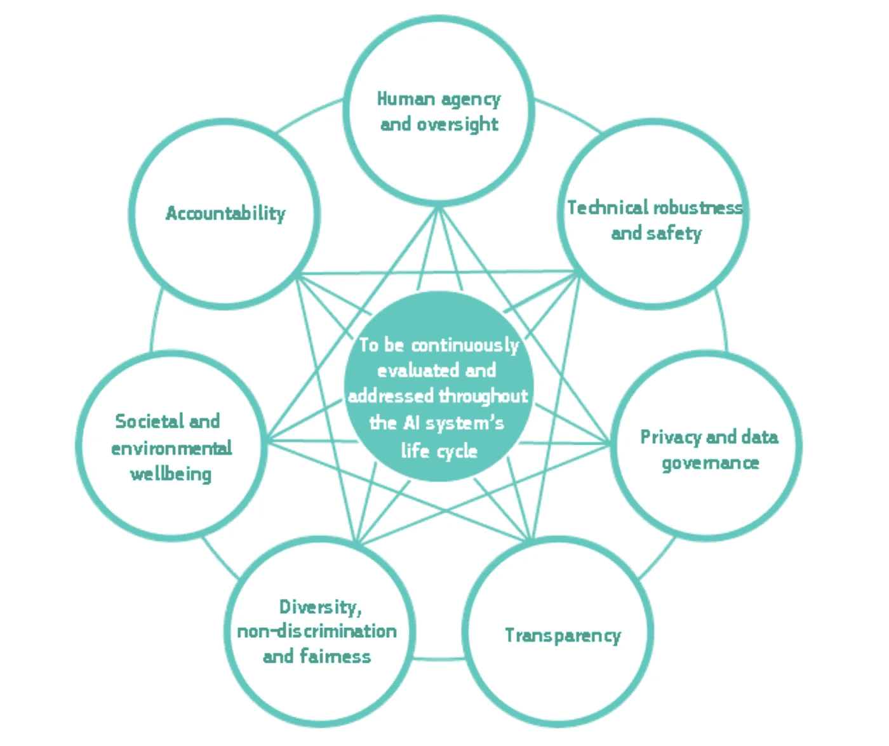

# 面向 2020 年的欧盟人工智能战略

> 原文：<https://towardsdatascience.com/ai-strategy-in-eu-2018-2019-44393b7eaf28?source=collection_archive---------19----------------------->

Illustration by author with assets from Undraw

## 2018-2019 人工智能相关的各种战略和政策的总结

## 摘要

欧盟在伦理人工智能方面的投资是在指导方针和建议中协调的，对成员国都没有法律约束力。这导致了广泛的参与和将在整个区域推广的具体举措，如获得由芬兰创建的翻译成成员国所有语言的免费课程(人工智能要素)。除了试行道德准则以及明确承诺投资人工智能，同时考虑到环境和气候问题，这也是该战略的一部分。它将与解决可持续性问题的以人为本的方法同时发生。这些战略文件中的预示概述了在未来十年 2020-2030 年人工智能领域的研究投资将大幅增加。欧盟目前的主要焦点是伦理使用；增加公众的了解；和实际负责任的应用程序协作。

## 为什么试图理解欧盟的人工智能战略？

在接近 2020 年的最后一周，我决定回顾一下欧盟(EU)过去两年内与人工智能相关的战略。现在是 2019 年 12 月底，我认为总结一下欧盟内部与人工智能领域相关的某些战略举措会很棒。为此，我研究了欧盟发布的五份不同的文件。这当然不是一次全面的审查，而是试图选取欧盟在过去几年中发布的各种文件，并简要介绍它们所包含的内容。我这样做首先是为了学习；其次，这样欧盟成员国的公民可以更加协调地实施这一战略；第三，欧盟以外对政策感兴趣的人可以了解欧盟目前在伦理人工智能投资方面的发展方向。

这五份文件如下:

1.  **人工智能合作宣言(2018 年 4 月)**
2.  **欧洲人工智能(2018 年 4 月)**
3.  **可信人工智能道德准则(2019 年 4 月)**
4.  **可信人工智能政策与投资建议(2019 年 4 月)**
5.  **欧洲联盟大会(2019 年 6 月)**

我将仔细检查下面的每份文件，从申报单开始。

# 1.人工智能合作宣言

25 个欧洲国家于 2018 年 4 月 10 日签署了一份关于人工智能合作的[宣言](https://ec.europa.eu/digital-single-market/en/news/eu-member-states-sign-cooperate-artificial-intelligence)。挪威是其中的一员，尽管他们不是欧盟成员(而是欧洲经济区的一部分)。据说这是建立在欧洲已有的投资和社区基础上的。

它提出通过获取公共部门数据来提高技术和工业能力。应对社会经济变化，特别是劳动力市场的变化。确保在基本权利和价值观以及透明度和问责制的基础上建立适当的法律和道德框架。

“成员国同意”的承诺*(我有时会简化)*:

1.  致力于在人工智能方面实现全面和综合的欧洲方法，以提高欧盟在 R&D 人工智能方面的竞争力、吸引力和卓越性(如有必要，使国家政策现代化)。
2.  鼓励与利益相关方就人工智能进行讨论，并支持在欧洲人工智能联盟中发展广泛而多样的利益相关方群体，以建立意识并促进人工智能的发展，从而最大限度地提高经济和社会效益。
3.  作为优先事项，考虑将 R&D&I 资金分配给人工智能的进一步开发和部署，包括破坏性创新和应用。
4.  加强人工智能研究中心并支持其泛欧洲层面。
5.  在欧洲层面建立数字创新中心。
6.  让人工智能在公共部门可用。交流政府采购和使用人工智能的最佳实践。
7.  帮助中小企业和非技术部门的公司获得人工智能。
8.  就人工智能相关的伦理和法律框架交换意见。
9.  确保人工智能的开发、部署和决策以人为中心，防止人工智能应用程序的有害创建和使用。
10.  提高公众对人工智能的理解。
11.  就人工智能问题与委员会进行持续对话。

# 2.欧洲的人工智能

这种交流在人工智能可以解决什么方面有更积极的倾向，并介绍了人工智能是什么。信息是人工智能正在像蒸汽机或电力一样改变社会。它表示，需要一个坚实的欧洲框架。

这份报告说，欧盟应该有一个“协调一致的方法”来对待人工智能。它建议通过以下方式做到这一点:

1.  世界级的研究人员、实验室和创业公司
2.  数字单一市场——数据保护、网络安全和连通性的共同规则
3.  解锁数据(被报告称为“人工智能的原材料”)

它提到了《宣言》中的承诺。几乎在同一时间，它特别强调竞争，不让任何人落后和欧盟的可持续发展的技术方法。一种有益于人类和整个社会的方法。

这可以追溯到 2017 年对数字单一市场战略的审查，其中探索欧盟人工智能方法的邀请部分源于(例如，对机器人的民法规则)。这三个要点是(1)提高技术能力，(2)为社会经济变革做准备，以及(3)确保道德和法律框架。

关于欧盟在竞争激烈的国际格局中的地位的沟通的不同部分概述了美国和中国在非机密人工智能研究方面增加的投资，从而清楚地表明欧盟“在私人投资方面落后”。人们明确表示希望创造一个刺激投资的环境。欧盟显然生产了四分之一的专业服务机器人。“欧洲不能错过火车”，采用人工智能的好处得到了广泛认可——提到了几个由欧盟资助的项目(农业、医疗保健、基础设施和制造业)。

> 在概述前进的道路时，他们表示，到 2020 年及以后，需要私人和公共部门的共同努力。它概述了未来十年投资将从大约 40-50 亿欧元增加到 200 亿欧元。

这种方式加大了投资力度。他们预计到 2020 年底，这一数字将会增长。该报告还提到支持卓越中心(和数字创新中心)。这里提到了“人工智能按需平台”，它可以帮助促进 400 多个数字创新中心之间的合作。它提到将创建专注于人工智能的中心。

到 2020 年，他们将在研究和创新方面投资 15 亿英镑；加强英才中心；和潜在用户的工具箱。他们谈到了按需人工智能平台和工业数据平台，这些平台提供了访问高质量数据集的途径。2020 年后，他们将升级和支持公共利益应用程序，以及一个数据共享支持中心，同时对现有政策进行各种升级。

目的是提供更多的数据，欧盟在过去 15 年中一直在这样做，一个例子是欧盟的空间计划。它谈到了老龄化社会和增强人们的能力，在“不让一个人掉队”中，他们谈到了新技能。这在很大程度上是针对 STEM 的，而在另一部分，他们谈到了多样性以及跨学科的方法。

*   更多的妇女和不同背景的人，包括残疾人。
*   跨学科的方式结合联合学位，例如法律或心理学和人工智能。这里提到了伦理道德的重要性，同时考虑创造一个有吸引力的环境让人才留在欧洲。

该报告为 2018 年的教育政策制定了计划，包括(再)培训计划、劳动力市场分析、高级数字技能的数字培训、商业-教育-伙伴关系和社会伙伴，以将人工智能纳入影响研究。

> “下一个欧盟多年财政框架(2021-2027)下的提案将包括加强对获取高级数字技能(包括人工智能专业知识)的支持。”

在确保道德框架方面，提到了基本权利、GDPR、数字单一市场和可解释的人工智能系统。在最后一段，还有一个知识产权的问题。道德准则草案将在年底制定。提到了安全和责任，根据 2019 年中期的技术发展，通过关于产品责任指令的指导文件赋予个人权力。还提到了一个建立算法意识的试点项目，以及对消费者组织数据保护的支持。

让成员国参与这项工作非常重要，本节提到了芬兰的国家战略。上面写着:*“鼓励每个成员国制定人工智能战略，包括投资战略。”*这里提到了多利益主体欧洲人工智能联盟以及国际外展。

> *“随着人工智能很容易跨境交易，在这个领域只有全球性的解决方案才是可持续的。”*

欧盟的贡献与其价值观和基本权利一起被提及，这也在结论中被提及。以希望人工智能的力量为人类进步服务而结束。

# 3.可信人工智能的道德准则

## 3.1 人工智能独立高级别专家组

我研究的与伦理和具体政策以及投资相关的文件是由独立的人工智能高级专家组(AI HLEG)整理的。因此，我认为最好先解释一下什么是 AI HLEG，他们的角色和成员。欧盟网站上有一个关于艾莱格的页面。

> *“经过公开遴选程序后，委员会任命了 52 名专家组成高级别人工智能专家小组，成员包括来自学术界、民间社会和工业界的代表。”*

他们的总体目标是支持[欧洲人工智能战略](http://ec.europa.eu/digital-single-market/en/artificial-intelligence)的实施。因此，它涉及与人工智能相关的政策制定、伦理、法律和社会问题，包括社会经济挑战。自成立以来，欧盟表示，他们已经实现了道德准则以及政策和投资建议。

人工智能小组也是欧洲人工智能联盟**的指导小组，这是一个多利益相关方论坛，旨在就人工智能发展的所有方面及其对经济和社会的影响进行广泛而开放的讨论。2019 年 6 月有一场[欧洲 AI 联盟大会](https://ec.europa.eu/digital-single-market/en/news/first-european-ai-alliance-assembly)。可以看看整个会议，至少是讨论的内容:**

**重点是讨论投资和道德。有一个[试点流程](https://ec.europa.eu/futurium/en/ethics-guidelines-trustworthy-ai/register-piloting-process-0)，其中包含可能在未来一年发布的其他文件或至少向参与成员内部发布的信息。**

> ***[*欧洲人工智能联盟*](https://ec.europa.eu/digital-single-market/en/european-ai-alliance) *是一个论坛，吸引了 3000 多名欧洲公民和利益相关者就人工智能在欧洲的未来进行对话。****

***你可以在网上注册加入 Futurium。一旦你的 Futurium 账户创建完成，你就可以填写在线[登记表](https://ec.europa.eu/futurium/en/european-ai-alliance/register-here-european-ai-alliance)加入欧洲人工智能联盟。***

***所有 [AI HLEG 的成员都在网上公开](https://ec.europa.eu/digital-single-market/en/high-level-expert-group-artificial-intelligence)。***

## ***3.2 可信人工智能的道德准则***

***该文件分为三个部分:基础，实现和评估可信的人工智能。因此，在某种意义上，你可以说它是建立在价值观上的，我们如何建立它，以及我们如何知道我们所建立的是好是坏。他们概述了可信人工智能应该(1)合法合规；(2)伦理价值的坚守；(3)从技术和社会角度来看是健壮的。如果这些组成部分之间出现矛盾:“……社会应该努力协调它们。”***

***一个人应该以一种坚持尊重人类自主、防止伤害、公平和可解释的道德原则的方式开发、部署和使用人工智能系统。***

******

***当它们出现时，它们之间的紧张关系也应该得到解决。涉及弱势群体的情况应优先考虑，在这一考虑中，我们发现例如儿童、残疾人和权力不对称(雇员/雇主和企业/消费者)。虽然人工智能系统带来了好处，但也带来了一定的风险，有些事情可能很难衡量，比如对民主、法治和人类思维的影响。必须采取措施来降低风险。***

***人工智能系统应该通过技术和非技术方法满足七个要求。***

1.  ***人力代理和监督***
2.  ***技术稳健性和安全性***
3.  ***隐私和数据治理***
4.  ***透明度***
5.  ***多样性、不歧视和公平***
6.  ***环境和社会福祉***
7.  ***有责任***

***必须考虑技术和非技术方法，以确保实施这些要求。促进创新，以清晰的方式与利益相关者沟通，促进人工智能系统的可追溯性和可审计性。采用值得信赖的人工智能评估列表可能是有用的，并使其适应特定的情况，记住这样的列表不是详尽的。***

***简而言之，我们可以说，根据报告，可信人工智能有三个组成部分:***

*   ***合法的***
*   ***道德的***
*   ***粗野的***

***这三者都是必要的，但还不够。***

> ***理想情况下，这三者在运作中协调一致，相互重叠。然而，在实践中，这些要素之间可能存在紧张关系(例如，有时现行法律的范围和内容可能与道德规范不一致)。作为一个社会，努力确保这三个部分都有助于保护值得信赖的人工智能是我们个人和集体的责任。***

***他们在报告中称之为全球框架下的“负责任的竞争力”。利益相关者可以自愿使用这些指南作为一种方法来操作他们的承诺。他们认为不同的情况会带来不同的挑战(音乐推荐系统与关键医疗)。因此，这些准则必须适应不同的情况。如前所述，人们被邀请尝试操作这个框架的可信人工智能评估列表。***

> ****这些指导方针阐明了基于《欧洲联盟基本权利宪章》(欧盟宪章)和相关国际人权法所载基本权利实现可信人工智能的框架。****

****下面，我总结了值得信赖的人工智能的三个组成部分。****

*****(I)合法** : AI 不在一个无法无天的世界里运作。重要的是要考虑欧盟的主要法律:欧洲条约及其基本权利宪章。此外，欧盟二级法律，如一般数据保护条例(GDPR)；产品责任指令；关于非个人数据自由流动的条例；反歧视指令；消费者法律和工作安全与健康指令；联合国人权条约和欧洲委员会公约(如《人权公约》)以及许多欧盟成员国的法律。那么各种领域的法律适用。《准则》并不主要涉及这些内容，其中任何内容都不应被视为法律意见。***

*****(二)伦理 AI** :法律并不总是跟得上技术发展的速度，可能与伦理规范不合拍，或者不适合解决某些问题。***

*****(III)健壮的人工智能**:个人和社会必须相信人工智能系统不会造成任何故意伤害。系统应以安全、可靠的方式运行，并应预见安全措施以防止任何意外的不利影响。从技术和社会角度来看，这都是必要的。***

*****以下模型用于显示指南文件中的方法:*****

******

***该报告将人工智能伦理学作为应用伦理学的一个分支，与欧盟 2030 议程相关联。它还谈到通过公共辩论、教育和实践学习来建立一种道德文化和心态。***

***提到的基本权利是:( 1)尊重人的尊严；(2)个人自由；(3)尊重民主、正义和法治；⑷平等、不歧视和团结；(5)公民权利。***

## ***3.3 四项原则***

***它进一步概述了前面提到的四项原则。***

*****人类自主**:遵循以人为中心的设计原则，为人工智能系统中有意义的人类选择和人类对工作过程的监督留下选项。它的目标应该是创造有意义的作品。***

*****防止伤害**:不应该加剧对人类的伤害，因此必须注意可能出现信息权力不对称的系统。预防伤害还需要考虑自然环境和所有生物。***

*****公平**:开发和部署必须公平。这必须是实质性和程序性的层面。它应该增加社会公平和平等机会，以平衡相互竞争的利益和目标。为了寻求对决定的纠正，对决定负责的实体必须是可识别的，并且做出决定的过程应该是可解释的。***

*****可解释性**:过程需要是透明的，能力需要被传达，对那些直接和间接受影响的人是可解释的。根据报告，解释并不总是可能的(这些所谓的“黑盒”示例)，这样可能需要其他措施(可追溯性、可审计性和系统能力的透明沟通)。这取决于环境和后果的严重性。***

***不同利益相关者应该扮演不同的角色。***

***a.开发人员应该实现这些要求，并将它们应用到设计和开发过程中；***

***b.部署者应该确保他们使用的系统和他们提供的产品和服务满足需求；***

***c.最终用户和更广泛的社会应该了解这些要求，并能够要求***

## ***3.4 可信人工智能的要求***

***需求问题中的系统和个人方面。***

******

***报告中详细描述了这些不同的方面。在每个需求中，都有一个子需求的分解，或者可能是要考虑的关键词。***

***H **乌曼机构和监督。**系统应支持人类的自主性，并通过支持用户的能动性来实现民主和公平的社会。基本权利有助于让人们追踪他们的个人数据或增加受教育的机会。鉴于人工智能系统的范围和能力，它们可能会对基本权利产生负面影响，因此在存在此类风险的情况下，应进行 ***基本权利影响评估*** 。这应在系统开发 之前 ***完成，包括评估这些风险是否可以降低或合理，以尊重他人的自由。此外，应该建立机制来接收关于可能侵犯基本权利的人工智能系统的外部反馈。在合理的情况下，用户应该能够自我评估或质疑系统。**应保持人类的自主性，这样，当决策对用户产生法律影响或对他们产生类似的重大影响时，人类就不会仅仅受制于基于自动化处理的决策**。******

***此外，还有治理机制，如人在回路(HITL)、人在回路(HOTL)或人指挥(HIC)方法。***

******【HITL】****:指在系统的每一个决策周期中人为干预的能力，这在很多情况下既不可能也不可取。****

******【人在回路(HOTL)*** *:指在系统的设计周期中，人为干预和监控系统运行的能力。****

******【Human-in-command(HIC)****:指监督 AI 系统整体活动(包括其更广泛的经济、社会、法律和伦理影响)的能力，以及在任何特定情况下决定何时以及如何使用该系统的能力。****

***这可以包括在特定情况下不使用人工智能系统的决定。根据应用领域和潜在风险，可能需要不同程度的监督机制来支持安全和控制。***

> ***在其他条件相同的情况下，人类对人工智能系统的监督越少，就需要越广泛的测试和更严格的管理***

***T技术坚固性和安全性。根据该报告，这与预防损害的原则密切相关。人工智能系统必须按照预期可靠地运行，同时最大限度地减少无意和意外的伤害——这也应该适用于操作环境的变化或其他代理的存在(人们或许可以在操作意义上将其与人工智能安全联系起来)。应该确保人的身心健康。**抵御攻击的能力和安全性**是其中的一个方面，因此人工智能系统需要防止黑客攻击。这包括针对数据(数据中毒)、模型(模型泄漏)或底层基础设施，包括软件和硬件。如果一个人工智能系统受到攻击，它可能会导致不同的决策，或者导致它关闭。应考虑恶意行为者的非预期应用和潜在滥用，并采取措施缓解这些情况。**可以设计出出现问题时的后备计划和一般安全措施**。这可能意味着从基于统计的程序切换到基于规则的程序，或者在继续一个动作之前询问人类。 ***应建立流程，以澄清和评估 AI 在各个应用领域的潜在风险*** 。必须主动采取安全措施。准确性或正确的判断，例如将信息分类到正确的类别。在人工智能系统直接影响人类生活的情况下，高水平的准确性尤为重要。**可靠性和再现性**对于能够仔细检查人工智能系统和防止意外伤害至关重要。 ***再现性描述了一个人工智能实验在相同条件下重复时是否表现出相同的行为*** 。这使得科学家和政策制定者能够准确地描述人工智能系统做什么。 ***复制文件*** 可以方便测试和复制行为的过程。***

***P **对抗和数据治理**。根据该报告，隐私是受人工智能系统影响的一项基本权利。这意味着我们需要正确的数据治理、数据完整性、协议访问和保护隐私的数据处理能力。**在系统的整个生命周期中，数据保护**在这方面非常重要。因此，需要考虑最初在交互中提供和生成的信息。人类行为的数字记录可能让人工智能系统不仅可以推断个人偏好，还可以推断他们的性取向、年龄、性别、宗教或政治观点。**数据的质量和完整性**对人工智能系统的性能至关重要，这必须在使用任何给定数据集进行训练之前解决。必须确保数据的完整性，以便恶意数据不被用于可能改变其行为的 AI 系统，尤其是自学系统。因此，数据集必须在过程的每一步进行测试和记录。 ***这也应该适用于不是内部开发，而是从别处收购的 AI 系统*** 。在任何给定的组织中，处理数据都很重要，应该制定管理数据的数据协议。**访问数据**需要与有能力和需要访问个人数据的合格人员一起明确(并非所有人都应被允许)。***

***与人工智能系统相关的要素的透明度:数据、系统和商业模式。人工智能系统中产生决策的过程应按照尽可能好的标准进行记录，以考虑到**可追溯性**。这有助于我们了解为什么人工智能决策是错误的，反过来也有助于防止未来的错误，从而更容易促进可审计性和可解释性。解释技术过程和人类决策。技术要求决策可以被人类追踪和理解。该报告提到了可解释性之间的权衡，这可能会降低准确性——然而，解释必须适应所涉及的利益相关者(外行人、监管者、研究人员)。在交流中，人工智能系统不应该向用户表示自己是人类，人类有权被告知他们正在与人工智能系统交互。人工智能必须是可识别的，并应提供选择，以决定反对这种互动，支持人类互动，以确保遵守基本权利。应传达限制，并涵盖系统的准确性水平。***

***大学，非歧视和公平。所有受影响的利益相关方的参与，在设计过程中给予平等的机会，以及与公平原则相关的平等待遇。**必须努力避免不公平的偏见**，这可能会因无意中的历史偏见、不完整和糟糕的治理模式而对某些群体不利。损害可能来自对(消费者)偏见或不公平竞争的故意利用，可以通过建立监督程序，以明确和透明的方式分析和处理系统的目的、制约因素、要求和决定来抵消。此外，从不同的背景、文化和学科中招聘员工可以确保观点的多样性，应该予以鼓励。**可访问性和通用设计**应使人工智能产品的使用不受年龄、性别、能力或特征的限制。残疾人的无障碍环境尤为重要。因此，人工智能系统不应该有一个通用的方法来实现公平的访问和积极的参与。**利益相关者的参与**是明智且有益的，这可以贯穿整个系统生命周期。***

***S **社会和环境福祉**。人工智能系统应该用来造福全人类，包括子孙后代。应鼓励人工智能系统的可持续性和生态可持续性，并促进人工智能解决方案的研究，以解决全球关注的问题，例如可持续发展目标(SDGs)。 ***系统的开发、部署和使用过程，以及其整个供应链，都应在这方面进行评估*** 。这些系统对我们生活各个领域的社会影响也必须得到监控和考虑。对于社会和民主，必须认真考虑对机构和社会的影响，包括政治决策和选举背景。***

***甲 **乙**。最后一项要求是对前面几项要求的补充，因为它要求在人工智能系统的开发、部署和使用之前和之后，都有必要建立相应的机制，以确保对人工智能系统及其成果的责任和问责。**可审核性**需要对算法、数据和设计流程进行评估。评估必须由内部和外部审计员进行，这种报告的可用性有助于提高技术的可信度。 ***在影响基本权利的应用中，包括安全关键应用，人工智能系统应能被独立审计*** 。必须确保报告行动和应对后果的能力— **尽量减少和报告负面影响**。在开发之前和开发期间，通过红队或 ***算法影响评估*** 等形式进行影响评估，有助于将与人工智能系统带来的风险成比例的负面影响降至最低。**在实现这些需求时，可能会出现折衷**。每一个权衡都应该是合理的，并适当地记录下来。**当不公正的负面影响发生时，尤其是弱势人员或群体，需要采取补救措施。*****

> ***这是七个要求:(1)人力代理和监督；(2)技术稳健性和安全性；(3)隐私和数据治理；(4)透明度；(5)多样性、非歧视性和公平性；⑹社会和环境福祉；(7)问责。***

***此外，在整个使用过程中进行评估和论证也很重要。内部使用、分析、开发和重新设计。***

******

***他们描述了技术和非技术方法，以确保可信的人工智能。***

# ***4.可信人工智能的政策和投资建议***

## ***4.1 使用值得信赖的人工智能在欧洲产生积极影响***

***以下是人工智能高级专家组 2019 年关于政策和投资的建议的要点。详细介绍人工智能高级专家组政策和投资建议的文件于 2019 年 6 月 26 日公布。我称之为“亮点”,因为这是我在报告中注意到的，你可能会注意到其他一些东西。***

******

***该报告涉及私营部门，以及以人为中心的人工智能服务和政府作为一个平台如何催化欧洲的人工智能发展。如前所述，这是通过世界一流的研究能力和正确的基础设施以及人工智能领域的技能和教育来实现的。由此建立适当的治理和监管框架，并筹集资金和投资。特别是解决如何创造一个开放和有利可图的投资环境来奖励值得信赖的人工智能的问题。***

***报告分为两章和一个结论。第一份报告给出了对欧洲政策的具体建议，第二份报告更具体地介绍了*“利用欧洲的促进因素”*。***

## ***4.2 第一章内的重点介绍人工智能政策对欧洲产生的积极影响***

*****人类与社会**。我认为很好的第一个建议是通过欧洲各地的课程(大规模开放在线课程——mooc)提供初级人工智能培训的数字扫盲。另一个是在教育层面上更紧密地整合人工智能培训，以及在线通报教育资源和促进讨论。也有人建议每年设立一个欧洲人工智能意识日(例如在艾伦·图灵的生日)。***

***保护人类、社会和环境的完整性也是一个明确的建议。避免过度的大规模监控、商业监控或数字力量的不对称。***

***鼓励危险任务的自动化，并建立一个基金来管理转型。为开发者引入注意义务，鼓励为儿童提供更好、更安全的人工智能。***

***衡量和监测人工智能的社会影响据说也是一个重要的优先事项。有人谈到建立监督机制和支持民间社会组织。***

****(还有三个章节详细介绍私营部门、公共部门和研究&学术界)****

## ***4.3 利用欧洲可信人工智能的促成因素***

***投资计算机基础设施和设施网络。开发兼容的数据管理和可信数据空间，以及创建数据提供者方案。支持尖端研究和商业开发的机制，同时开发整个数据传输系统的网络安全基础设施。获得必要的技能，但是 STEM 中提到了性别能力培训。在欧洲培养和留住人才被认为很重要。***

# ***5.欧洲联盟大会***

***2018 年 4 月欧洲人工智能战略启动后，人工智能高级专家组(AI HLEG)成立。这个小组起草了一份关于人工智能政策和投资建议的文件。欧洲人工智能联盟与人工智能联盟同时成立。***

***2019 年 6 月，该集团的 500 名成员在[欧洲人工智能联盟大会](https://ec.europa.eu/digital-single-market/en/news/first-european-ai-alliance-assembly)会面，讨论人工智能政策的最新成就及其未来前景。***

> ***这是一个有 3000 多名欧洲公民参与的论坛。***

******

***它被视为一个多方利益攸关方论坛，可以更广泛地为欧盟决策提供投入。在提出可信人工智能的道德准则(另一份报告)后，从人工智能联盟收到的意见是制定政策和投资建议的一部分。***

> ****AI HLEG 是 AI 联盟的指导小组。****

***有可能[在线加入论坛](https://ec.europa.eu/digital-single-market/en/european-ai-alliance)。如果你注册了人工智能联盟，你就可以进入欧盟的一个名为 Futurium 的平台。***

***人工智能联盟的目标如下:***

*   ***充分动员各种参与者，包括企业、消费者组织、工会和民间社会的其他代表***
*   ***特别是帮助制定道德准则，确保欧洲地区在人工智能领域的竞争力。***
*   ***引导可信人工智能的道德准则。***

***因此，可以说，如果一个人对人工智能领域感兴趣，就应该密切关注这一发展。***

*****根据**欧洲数字经济和社会专员玛利亚·加布里埃尔**的说法，试点阶段**将从人工智能联盟会议开始到 2019 年 12 月为期六个月。***

***特别是，如果你对与人工智能、法规和道德相关的政策感兴趣，这将是一件好事。***

***PE kka Ala-**pietil**一直担任欧盟人工智能高级专家组(AI HLEG)主席。他在 2019 年 6 月的人工智能联盟大会上发表讲话时提到了 11 个关键点。***

***根据 Pekka 在 6 月大会上提出的意见，从 AI HLEG 政策和投资建议*中获得的主要信息如下:****

1.  ***授权和保护**人类和社会*****
2.  ***对人工智能市场采取**量身定制的方法*****
3.  ***确保可信人工智能的单一欧洲市场***
4.  *****通过部门多利益主体联盟实现人工智能生态系统*****
5.  *****培育欧洲**数据经济*******
6.  *****利用**公共部门的多面角色*******
7.  *****加强并联合欧洲的**研究**能力*****
8.  *****☆教育**到四次方*******
9.  *****对人工智能采用基于风险的治理方法，并确保适当的监管框架*****
10.  *****刺激开放和有利可图的投资环境*****
11.  *****采用整体工作方式，将 10 年愿景与滚动行动计划结合起来*****

> *****“一个重大机遇正在敲响欧洲的大门。这个机会就是人工智能。”—**PE kka Ala**—**pietil，AI HLEG 主席，2019 年 6 月*******

*****随后在关于启动可信人工智能试点流程的小组讨论中提到，人工智能专家组的某些成员将花一些时间与那些试点指南的人在一起。有人提到，针对不同的部门进行调整可能是好的。有一个问题是指导方针是否可以操作:人工智能不仅仅是技术。在这次讨论中，一个重要的方面是鼓励要求某种形式的自我评估或外部认证的做法。它被认为是测试、外部审计或自我评估之间的区别。此外，还讨论了如何将伦理与现行法律联系起来。Telefonica 的 Richard Benjamins 说，像毕马威(KPMG)、德勤(Deloitte)等咨询公司的大型技术公司的道德方法是建立团队，以便能够在欧洲做到这一点。*****

# *****摘要*****

*****欧盟在伦理人工智能方面的投资是在指导方针和建议中协调的，对成员国都没有法律约束力。这导致了广泛的参与和将在整个区域推广的具体举措，例如获得由芬兰创建的翻译成成员国所有语言的免费课程(人工智能要素)。除了试行道德准则以及明确承诺投资人工智能，同时考虑到环境和气候问题，这也是该战略的一部分。它将与解决可持续性问题的以人为本的方法同时发生。这些战略文件中的预示概述了在未来十年 2020-2030 年人工智能领域的研究投资将大幅增加。欧盟目前的主要焦点是伦理使用；增加公众的了解；和实际负责任的应用程序协作。*****

## *****否则*****

*****明智的做法是在这种背景下理解 [DG Connect](https://ec.europa.eu/info/departments/communications-networks-content-and-technology_en) ，即:通信网络、内容和技术总局。他们的[2016–2020](https://ec.europa.eu/info/sites/info/files/strategic-plan-2016-2020-dg-cnect_may2016_en.pdf)战略计划当然是相关的。*****

*****2018 年 6 月 6 日发布了一份关于[欧盟数字欧洲计划](https://ec.europa.eu/commission/presscorner/detail/en/IP_18_4043)2021-2027 年预算的新闻稿，该预算拟投资 92 亿€。*****

*****我还没有调查人工智能的[责任](https://ec.europa.eu/newsroom/dae/document.cfm?doc_id=63199) (2019，11 月)。然而，一旦有机会，我会这样做并把它加到这个总结中。*****

*****此外，还有处于*咨询阶段*的人工智能 PPP 的[战略研究、创新和部署议程。在这种情况下，PPP 是公私合作的缩写。](https://www.eu-robotics.net/cms/upload/downloads/ppp-documents/AI_PPP_SRIDA-Consultation_Version-June_2019_-_Online_V1.2.pdf)*****

*****人工智能战略的一个相关方面是[欧洲高性能计算联合项目](https://ec.europa.eu/digital-single-market/en/eurohpc-joint-undertaking) — EuroHPC 已经选择了位于 8 个不同成员国的 8 个地点作为超级计算中心，以托管新的高性能计算机。这八个地点于 2019 年 6 月 7 日[公布](https://ec.europa.eu/digital-single-market/en/news/europe-announces-eight-sites-host-world-class-supercomputers)。*****

*****如果你认为我错过了任何重要的文件或者我的摘要的一部分有所欠缺，请通知我，如果给我通知，我会努力修改。*****

*****这是#500daysofAI，您正在阅读第 207 条。500 天来，我每天都在写一篇关于或与人工智能相关的新文章。我目前 100 天 200-300 的重点是人工智能的国家和国际战略。*****