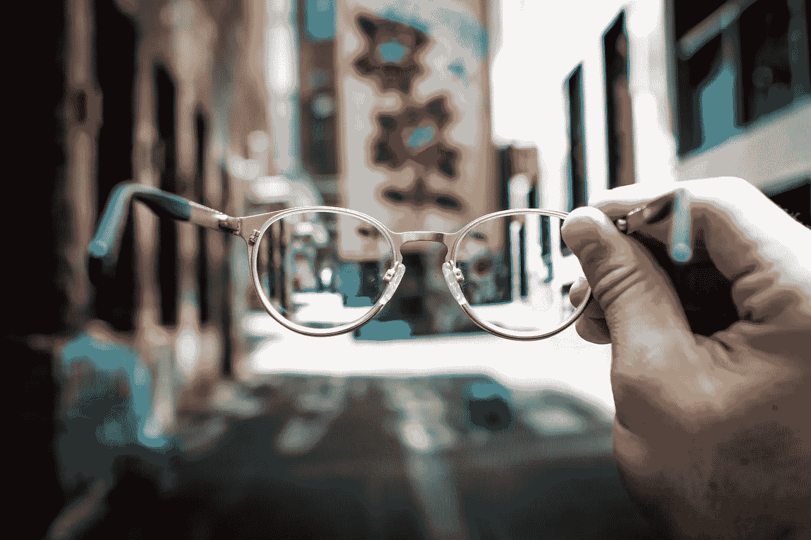

# 人工智能:未来还是创造未来的工具？

> 原文：<https://towardsdatascience.com/ai-the-future-or-a-tool-to-create-it-7e4a09686a0?source=collection_archive---------27----------------------->

还记得你最喜欢的电视节目第一次播出时，你完全被它迷住了吗？即使你每集都学到了更多，你还是不断回来。然而，很少有什么东西会毫无瑕疵地一直给予下去。也许，你会发现，尽管虚构的情节令人惊叹，但现实生活中的演员却相当离奇。嗯，那种感觉不仅仅适用于电视剧…

最近，我有机会与许多新技术一起工作，这些新技术似乎有无穷无尽的应用，最有趣的是人工智能。似乎每天，我都会上网或看新闻，听说研究人员找到了另一种方法来解决一个重大问题。因此，我期待着为每个新项目编码，并不完全知道最终产品能容纳什么。然而，随着我越来越多地使用这项技术，我似乎发现了一把双刃剑。人工智能真的是我曾经认为的革命吗？

A marvellous technology can hold hidden drawbacks upon closer look. Photo by [Shane Aldendorff](https://unsplash.com/photos/mQHEgroKw2k?utm_source=unsplash&utm_medium=referral&utm_content=creditCopyText) on [Unsplash](https://unsplash.com/search/photos/magnifying-glass?utm_source=unsplash&utm_medium=referral&utm_content=creditCopyText).

## 人工智能的巨大可用性带来了突破性的应用

对我来说，这一切都是从我建立第一个识别手写数字的神经网络开始的，这仅仅是一次计算机视觉实验。最初，它只是众多解决问题的算法中的一种。然而，我从来没有想到的是，同样的算法同样可以用于各种各样的其他问题。例如，我然后使用基本相同的算法来识别不同类型的衣服。与此同时，我知道对视觉效果进行分类的问题会延伸到现实生活中的重大情况，比如检测自动驾驶汽车中的行人。这些也不仅仅是未来的目标；像特斯拉和 Waymo 这样的颠覆性公司正在改变汽车行业的创新**现在，**这个行业只是众多行业之一。

本质上，与人工智能合作意味着不断尝试新项目。有一天，我会创建一个 CNN 来分析图像，另一天，我会创建一个 RNN 来人为地改写莎士比亚的戏剧。这不仅仅是一些没有实际应用的个人愚蠢行为的展示。在技术代码的背后，总有一种感觉，那就是这项工作在更大范围内可能产生的真实效果。然而，最重要的是，小项目带来了实际的机会；目前，我正在从事人工智能医疗保健研究，这是微软资助的一项竞赛的一部分。人工智能让我在不到一年的研究时间内解决了世界上一些最大的问题。话虽如此，如果你问我是否会在未来直接研究人工智能，我肯定会说不会(这肯定不是因为我讨厌钱)。

I’m as surprised with the possibilities of AI as people are when I tell them I don’t want to work with it as a career. Photo by [Ben White](https://unsplash.com/photos/qDY9ahp0Mto?utm_source=unsplash&utm_medium=referral&utm_content=creditCopyText) on [Unsplash](https://unsplash.com/search/photos/surprise?utm_source=unsplash&utm_medium=referral&utm_content=creditCopyText).

## 工具的好坏取决于它带来的用途

在我看来，人工智能最大的好处之一也是我未来不想直接追求它的原因；它适用于大量的行业。等等…那不是**好的**吗？？？当然，许多领域的应用使人工智能更加有用，然而，这种使用使它更像一种工具，而不是一种职业。人工智能是解决世界上一些最大问题的巨大资源，但它只是一个工具。如果有人从事医疗保健、商业或任何其他行业，人工智能是解决重要问题的关键，但它本身不如一种职业有吸引力。想一想；不能和任何人一起用的魔术有什么好处？

> 魔术师的艺术是创造奇迹。——道格·亨宁

正如魔术的应用是为了创造奇迹，工具的应用是为了解决问题。然而，两者诱人的细节在于它们的应用，而不仅仅是它们没有目的。人工智能就是这样；它在任何行业都有惊人的优势，但它本身就相当缺乏光泽。

接下来的限制是，与人工智能打交道有相当大的学习曲线(然而，它正在迅速缩小**)，这使它成为你技能组合中更有价值的竞争优势。然而，这也带来了自己的缺点，因为人工智能不断加快的创新步伐如果不受监管，可能会产生负面后果。目前，着手解决世界上最大的问题比以往任何时候都容易(我个人从参加微软的竞赛中学到了这一点)，但对于造成伤害的能力来说也是如此。作为一个例子，考虑某人如何通过对无辜用户使用预测行为分析来破坏在线隐私。这还没有开始考虑这项技术的长期影响，它有可能扰乱我们今天知道的一些最大的就业市场。很难预见这个有用工具带来的重要问题，更不用说准备解决它们了。**

****

**A small amount of clarity isn’t enough to plan your future path. Photo by [Josh Calabrese](https://unsplash.com/photos/qmnpqDwla_E?utm_source=unsplash&utm_medium=referral&utm_content=creditCopyText) on [Unsplash](https://unsplash.com/search/photos/glasses?utm_source=unsplash&utm_medium=referral&utm_content=creditCopyText).**

**总的来说，人工智能确实是我们今天可以想象的许多创新*【和危险】*的游戏规则改变者，但它只是许多工具中的一种。最后，把一生的工作奉献给一个工具，还是奉献给这个工具可以解决的大量问题，哪个更有意义？**

# **关键要点**

*   **没有什么是完美的。最美丽的东西是你可以爱的，尽管它们不完美。**
*   **人工智能的独特之处在于，它可以使用近乎相同的算法来解决完全不同的问题。**
*   **虽然聪明的设计可能很有趣，但它真正的价值在于它被应用于解决问题时(这些问题**可能**领先于我们的时代)。**
*   **你不可能准备好去解决一场你看不到的灾难。**

**在反思人工智能的用途时，我谈到了我以前在人工智能方面的工作。如果你想看看我的推理背后的背景，请阅读更多关于我最近在这个领域的工作。**