# 艾认为雷切尔·玛多是一个男人(这是我们所有人的问题)

> 原文：<https://towardsdatascience.com/ai-thinks-rachel-maddow-is-a-man-and-this-is-a-problem-for-all-of-us-921e45523d6e?source=collection_archive---------4----------------------->

*对生产系统中人工智能偏差的数据驱动审查*

2011 年，IBM Watson 在一场 100 万美元的比赛中击败了 Jeopardy 传奇人物肯·詹宁斯和布拉德·鲁特，成为了 T2 的头条新闻。在《最后的危险》中，詹宁斯承认失败，他写道:“就我而言，欢迎我们新的电脑霸主。”

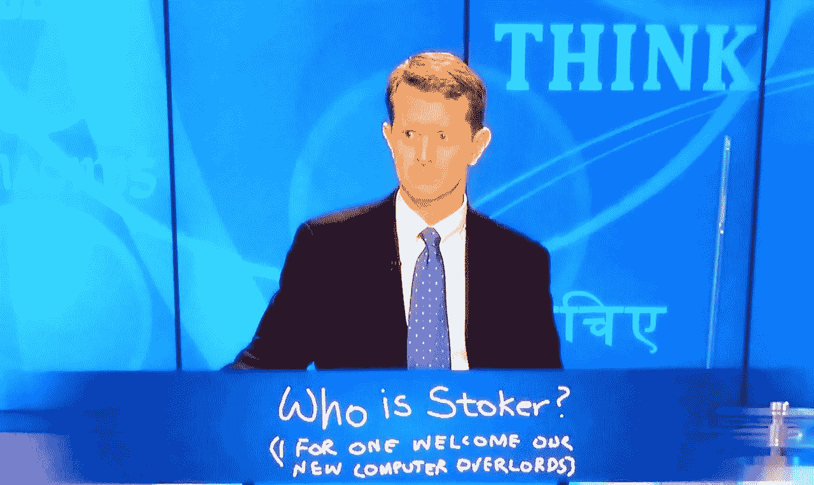

那是在 2011 年，在一场名为 [ImageNet Challenge](http://www.image-net.org/challenges/LSVRC/) 的计算机图像识别比赛中，一个好成绩是 75%。最近，在硬件(GPU&[TPUs](https://en.wikipedia.org/wiki/Tensor_processing_unit))、软件和[技术](https://adeshpande3.github.io/The-9-Deep-Learning-Papers-You-Need-To-Know-About.html)的大量进步之后，最好的程序现在可以识别超过 95%的对象。一些专家的共识是，最先进的人工智能在图像识别任务方面已经超过了人类。

因此，人们会认为，今天的[沃森视觉识别](http://Watson Visual Recognition)，一个(至少是通过营销)赢得了《危险边缘》的超级计算机的后代，同时代的超人图像识别器，会毫无问题地识别出有线电视新闻人物雷切尔·安妮·玛多的图像。

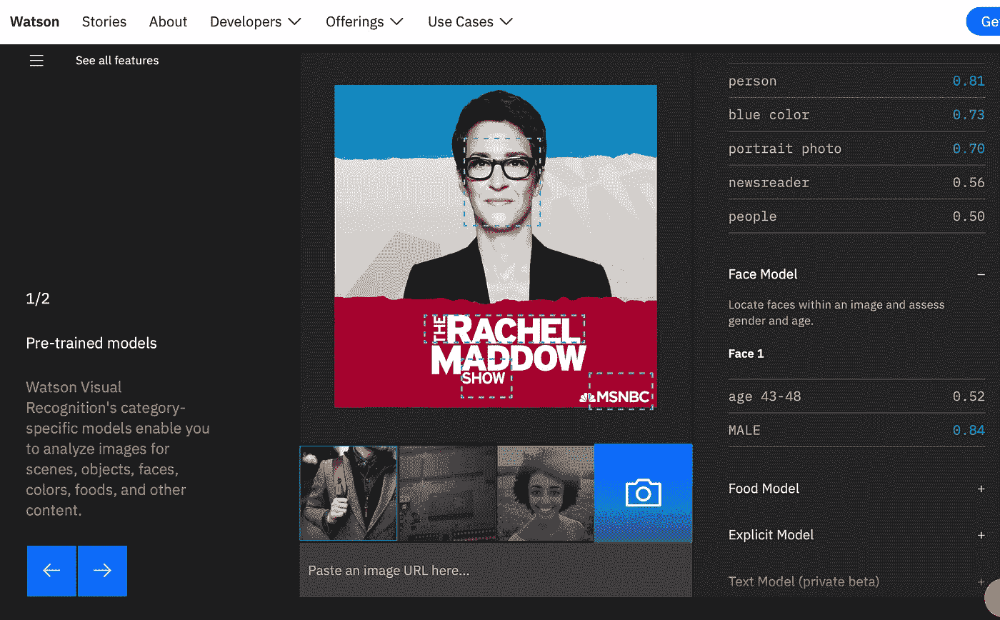

Watson thinks Maddow is male with 84% confidence.

虽然沃森成功地猜出了麦道的年龄范围(有 52%的把握)，但它对麦道的性别标注(有 84%的把握)是错误的。

然而，沃森并不孤单。[来自 AWS 的图像识别器 Amazon Rekognition](https://aws.amazon.com/rekognition/) 也认为 Maddow 是男的，虽然只有 59%的把握。

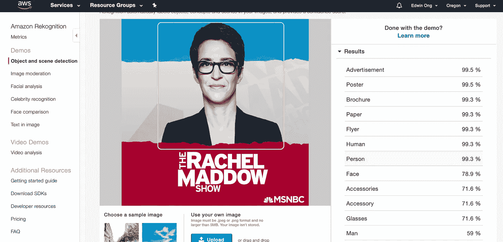

AWS also thinks that Maddow is a man.

AWS 在混淆亚历克斯·安佐隆(Alex Anzalone)的性别时更有信心，这位 6 英尺 3 英寸，245 磅的 NFL 后卫，以 79%的信心将 Anzalone 标记为女性。

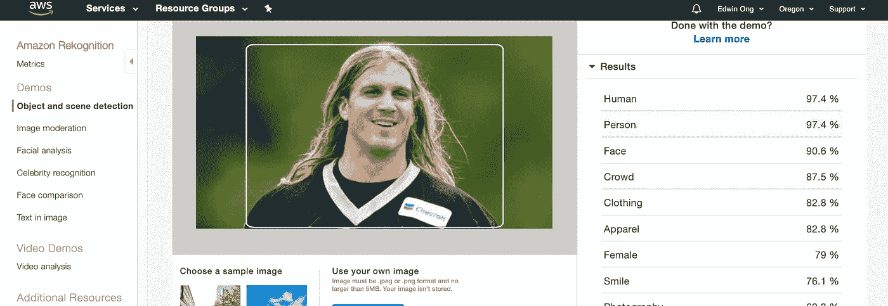

这是怎么回事？为什么具有超人图像识别能力的超级计算机在性别标注上如此自信地失败了？

**二元性别标签(例如:“男性”或“女性”)显然存在固有缺陷，因为我们越来越意识到* [*性别是一个光谱*](https://en.wikipedia.org/wiki/Gender_identity) *。性别认同、性别表达、生物性别可能对齐也可能不对齐，增加了问题的复杂性。*

# **现代机器学习如何工作**

要理解 AWS 和 Watson 的失败，首先应该理解现代机器学习实际上是如何工作的。今天的顶级计算机视觉系统通过使用大型标签训练集优化极其复杂的数学模型来“学习”。在 2017 年的论文[重新审视数据](http://ai.googleblog.com/2017/07/revisiting-unreasonable-effectiveness.html)的不合理有效性中，谷歌的 AI 团队再次确认了 2010 年的直觉，即数据越多越好。

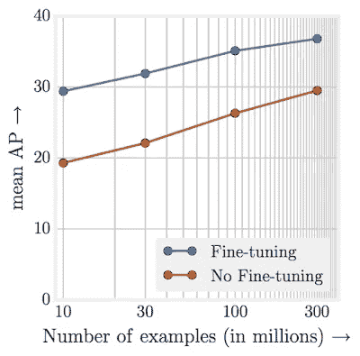

Per [Google](http://ai.googleblog.com/2017/07/revisiting-unreasonable-effectiveness.html), performance continues to increase as the size of datasets increases.

随着模型变得更加复杂，训练数据增长到数亿张图像甚至更多，任何一个机器学习开发者都几乎不可能完全理解任何系统的行为。与具有确定性结果的传统计算机编程不同，大型机器学习系统根据概率(“置信度”)而不是确定性来操作。它们几乎是黑匣子，数据被输入其中，结果被调整到“[最小化损失](https://en.wikipedia.org/wiki/Loss_functions_for_classification)尽管研究人员越来越专注于开发能被人类更好地理解其决策的[可解释的人工智能](https://en.wikipedia.org/wiki/Explainable_Artificial_Intelligence)，但这种努力还远未准备好投入生产。

鉴于测试这种复杂系统的难度，系统误差可能会出现。在一项名为[性别阴影](http://gendershades.org)的[研究](http://proceedings.mlr.press/v81/buolamwini18a/buolamwini18a.pdf)中，麻省理工学院的 [Joy Buolamwini](https://twitter.com/jovialjoy) 和微软的 [Timnit Gebru](http://Timnit Gebru) 展示了商业图像识别系统的偏见，他们表明，与浅色皮肤的男性相比，深色皮肤的女性被误判的几率高达 34%，而浅色皮肤的男性只有 0.8%。ProPublica 的一项研究声称，法庭上使用的一个名为 COMPASS 的软件系统错误地预测黑人被告比他们有更高的再犯风险，而白人被告则相反。

虽然有关于人工智能安全的突出对话和慷慨资助，重点是防止来自天网一样的人工智能的存在威胁，但很清楚的是，今天的生产中存在实际的人工智能安全问题。使用机器学习系统更广泛地做出关键决策。例如，在[中国越来越注重监控的社会](https://www.nytimes.com/2018/07/08/business/china-surveillance-technology.html)，面部识别已经被用于“算法治理”——捕捉犯罪和羞辱不受欢迎的行为。系统误差和偏差会导致严重的后果。

# **云图识别系统**

2013 年，[马修·泽勒](https://twitter.com/mattzeiler)，前述 Imagenet 比赛的顶级选手，[为了创办 Clarifai，拒绝了谷歌](https://www.forbes.com/sites/aarontilley/2017/07/13/clarifai-ai-image-recognition/)的邀请。Clarifai 提供基于云的服务，任何开发者都可以以每张 0.0012 美元的价格获得世界级的图像识别服务。从那以后，这个领域变得竞争激烈，今天提供服务的有[亚马逊的 AWS](https://aws.amazon.com/rekognition/) 、[谷歌的云平台](https://cloud.google.com/vision/)、[微软的 Azure](https://azure.microsoft.com/en-us/services/cognitive-services/computer-vision/) 和 [IBM 的 Watson](https://www.ibm.com/watson/services/visual-recognition/) 。

这些服务都以相似的方式工作。开发人员将图像发送给 API，API 会以相关结果进行响应。每种服务都有自己的模型集合，允许对特定类别的图像进行优化。例如，Clarifai 为对这些类别感兴趣的顾客提供服装和食品特定的模特。它们还提供定制模型，用户可以在其中添加额外的数据来增强定制图像识别器的结果。

这些系统中的性别分类通常通过它们的面部检测模型来暴露。目前，AWS 提供[年龄范围、性别，以及对胡须和眼镜等特征的检测](https://docs.aws.amazon.com/rekognition/latest/dg/API_DetectFaces.html)。Azure 提供[年龄和性别分类](https://docs.microsoft.com/en-us/azure/cognitive-services/computer-vision/concept-detecting-faces)没有可信度。Clarifai 提供[年龄、性别、 ***种族*** 分类](https://clarifai.com/models/demographics-image-recognition-model-c0c0ac362b03416da06ab3fa36fb58e3)，Watson 提供[年龄范围和性别](https://console.bluemix.net/apidocs/visual-recognition#detect-faces-in-images)。

谷歌，这家拥有最好的图像识别技术和团队的公司，是唯一不提供年龄和性别分类的公司。取而代之的是，它提供了对情绪(“喜悦”、“悲伤”、“愤怒”和“惊讶”)以及这个人是否有“头饰”的检测。“谷歌没有性别标签说明了提供这种服务的道德、商业和技术挑战。

# **培训&测试机学习**

为了建立他们的服务，这些公司使用大量的数据。在机器学习中，数据分为训练集、验证集和测试集。训练数据集用于构建模型。您看到的结果基于为适应训练数据而执行的数学优化。验证数据集用于进一步调整模型。最后，测试数据集独立于训练数据，但遵循相同的概率分布，并用于测试模型。

例如，如果糕点图像的训练数据集包含 100 万个油炸圈饼图像、100 万个松饼图像和 100 万个羊角面包图像，则测试数据集应该具有相同的比例。因此，即使系统以接近 100%的成功率成功通过测试数据集，它也不会成功识别 [kouign-amann](https://en.wikipedia.org/wiki/Kouign-amann) 或 [roti canai](https://en.wikipedia.org/wiki/Roti_canai) 的图像，因为这些图像不在原始训练和测试集中。

实际上，用于训练 AWS、Azure、Clarifai、Google 和 Watson 的数据集的实际构成是不透明的。Timnit Gebru(上述性别阴影项目的)现在倡导为数据集提供“[数据表”，以便数据的构成和预期用途是透明和可问责的。然而，鉴于机器学习中的硬件、软件和技术正在变得商品化，公司仍然将数据视为其业务的专有优势，应该保持不透明。](https://arxiv.org/pdf/1803.09010.pdf)

随着越来越多的机器学习系统用于生产，在测试数据集之外采用更好的测试变得越来越重要。与传统的软件质量保证不同，在传统的软件质量保证中，系统经过测试以确保功能按预期运行，机器学习测试需要新数据集的管理和生成，以及能够处理置信水平的框架，而不是来自 web 服务器的传统的 404 和 500 错误代码。

我和我的搭档[阿历克斯](https://twitter.com/vikati)一直致力于开发工具来支持生产中的机器学习。正如她在[的《模型服务器的崛起](https://medium.com/@vikati/the-rise-of-the-model-servers-9395522b6c58)中所写的那样，随着机器学习从实验室走向生产，需要额外的安全和测试服务来完整地完成堆栈。我们的[数据监控](https://basejoy.io)工具之一“安全服务器”允许快速生成和管理额外的测试数据集，并跟踪这些数据集随时间推移的表现。正是通过使用这个工具，我们发现艾认为是一个男人。

# **我们如何测试**

我们一直在使用公共云 API 来构建安全服务器的原型。我们在测试图像识别服务时发现了雷切尔·玛多问题。AWS、Azure、Clarifai 和 Watson 在给雷切尔·玛多最近的照片时都弄错了她的性别。

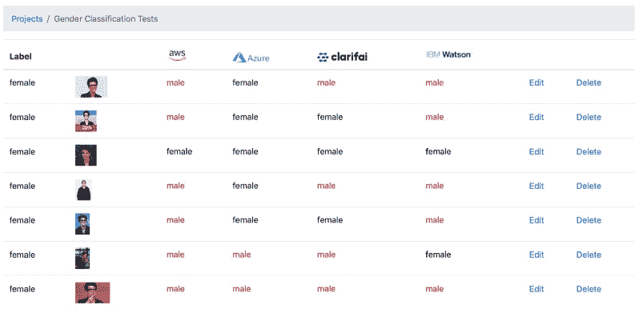

Rachel Maddow is misgendered in all 4 image recognition APIs.

然而，当她从高中年鉴中得到一张雷切尔·玛多的照片时，她留着长长的金发，性别标签是正确的。

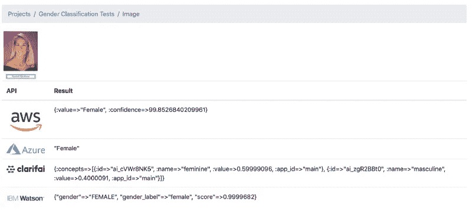

如果雷切尔·玛多要做一个 [20 年挑战](https://www.wired.com/story/facebook-10-year-meme-challenge/)，她的五官变化将是不起眼的。撇开自然衰老不谈，她的脸就是她的脸。唯一明显的区别是她黑色的短发和她的厚框眼镜。

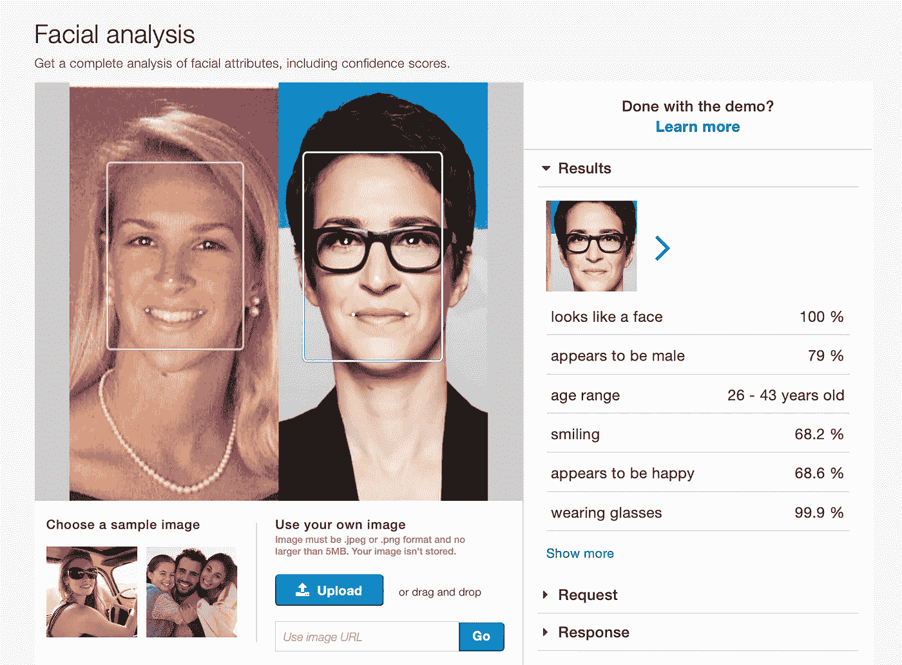

为了测试我们的假设，即短发和眼镜是有问题的，我们策划了 1000 张照片，分别是浅色皮肤的短发女性、浅色皮肤的眼镜女性和浅色皮肤的短发和眼镜女性。在所有情况下，所有 3 个数据集的所有 4 个 API 的误性别率都高于预期，超过 15%。很明显，配饰和发型(随着时尚的发展而演变)会导致性别的错误标签。

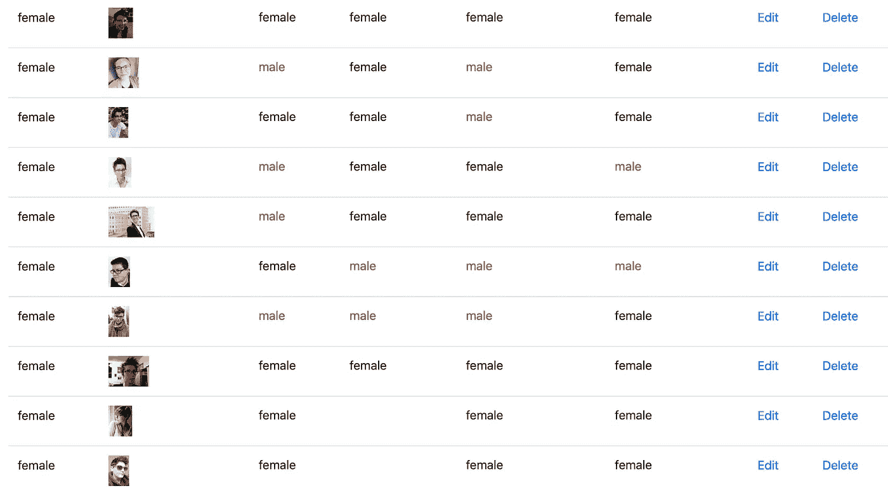

The APIs are struggling with test data of women with short hair and glasses

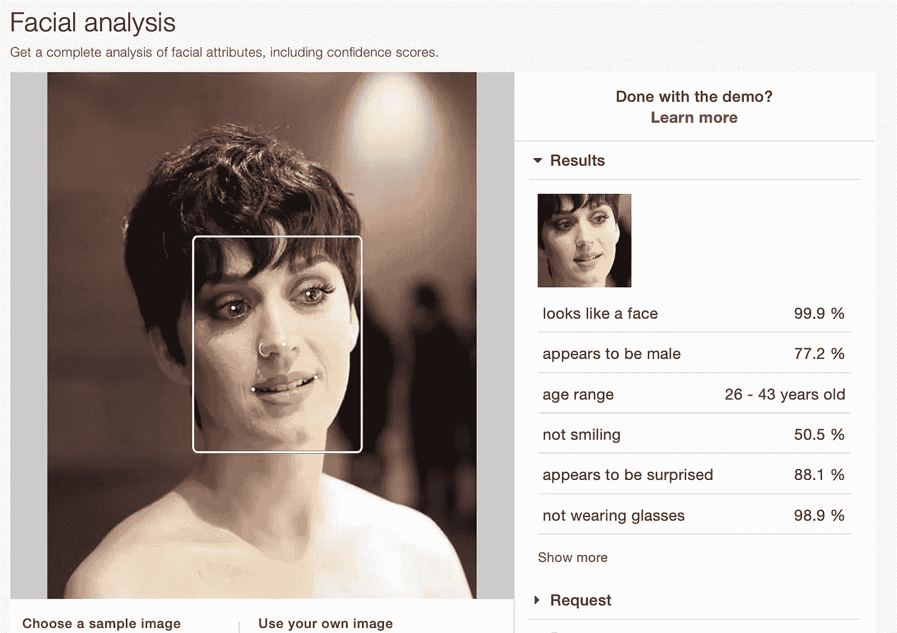

AWS thinks that a short-haired Katy Perry is male.

我们还生成了 1000 张长发男性和眼妆男性的图像，结果不言自明，误差率超过 12%。

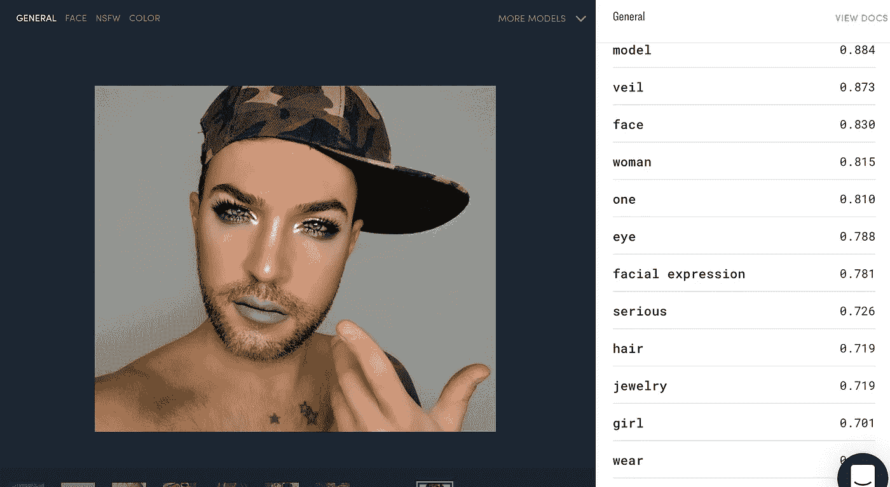

Clarifai: Man with eye makeup is classified as a woman.

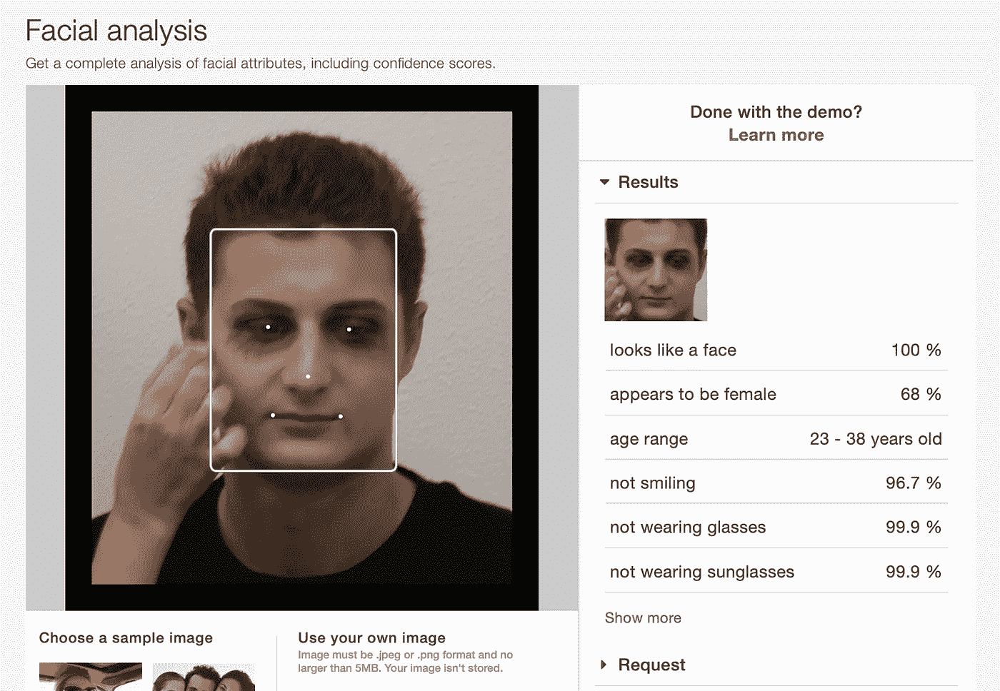

AWS: Man with eye makeup is classified as female.

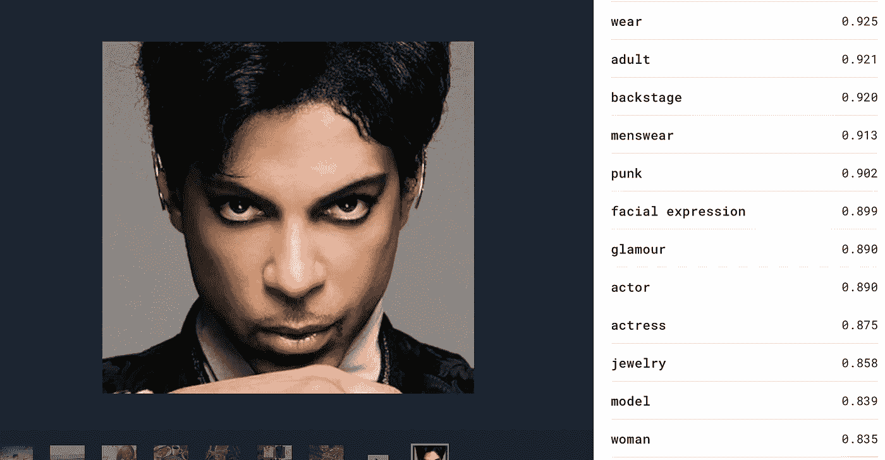

Clarifai: Prince with eye makeup is labelled as a woman.

Watson: Man with long hair is classified as female.

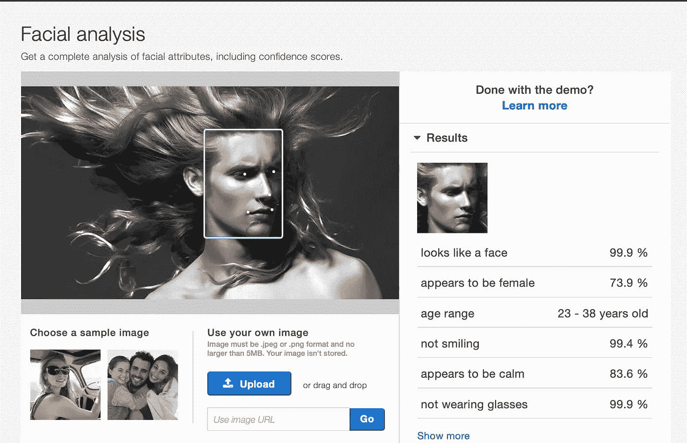

AWS: Man with long hair is classified as female.

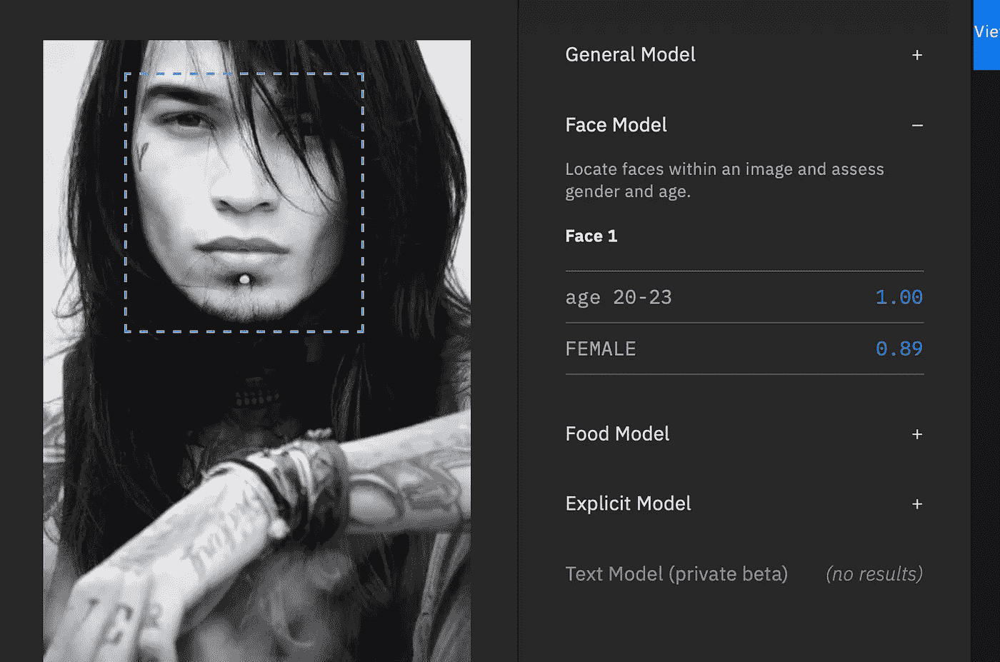

Watson: Man with long hair is classified as female.

的确，其中一些错误发生在较低的置信水平上，AWS 确实警告需要为任务关键型应用程序设置适当的阈值。尽管如此，并不是所有的开发者都会遵循这一指导方针，微软的 Azure 对自己非常确定，它甚至没有默认提供一个置信度得分。

# 问题是

如果“人工智能认为雷切尔·玛多是男人的原因”出现问题，“什么是不完整的测试和训练数据？”可能是比“什么是眼镜和短发”更好的问题公平地说，这些人工智能公司试图解决的问题在技术上很难，解决方案也不总是显而易见的。他们的系统在原始训练数据之外的“边缘案例”中失败是意料之中的。通过扩大他们的训练数据，这些系统可以随着时间的推移而改进。尽管如此，完全有可能随着一个领域的进步，其他领域的结果会变得更糟。

随着我们的世界逐渐进入一个人工智能发挥权威作用的世界，记住这些系统的谬误对我们来说很重要。在生产中部署机器学习的公司应该持续跟踪和测试他们的模型，即使是在野外，像图像识别这样的公共云服务也许应该像其他产品一样受到《消费者报告》等机构的审查。

如果你想谈论更多关于机器学习中的测试和安全问题，请随时联系我们。

*更新:生殖人工智能正在把水搅浑。下面是一些由 AI 生成的* [*【雷切尔·玛多】男*](https://promptflow.co/prompts/search?q=rachel+maddow+as+a+man)*[*雷切尔·玛多女*](https://promptflow.co/prompts/search?q=rachel+maddow+as+a+woman) *(承蒙* [*提示流*](https://promptflow.co) *)的图片。**