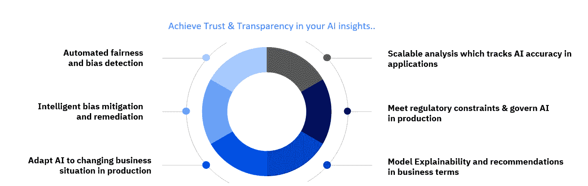
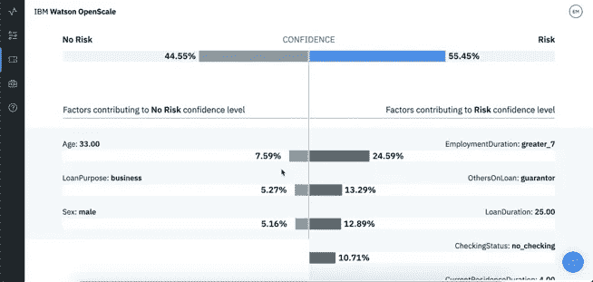

# 人工智能信任、模型偏差和使用 IBM Watson Openscale 的可解释性

> 原文：<https://towardsdatascience.com/ai-trust-bias-model-explainability-using-ibm-watson-openscale-68cb5b257320?source=collection_archive---------32----------------------->

## **规模化信任、解释、运营 AI**

人工智能信任、偏见和模型可解释性在商业难题中提供了重要的一块，以帮助组织将人工智能项目从开发中取出，并将其投入大规模生产。人工智能偏见和模型解释能力有助于确保公平和公正的结果，同时让业务流程所有者对人工智能增强决策能力充满信心。同时，它提供了一个强大的框架，以确保 AI 保持符合公司政策和监管要求。

Watson Openscale AI Solutions

一项简短的调查显示，由于各种原因，业务利益相关者对他们对人工智能应用程序的信任度有着混合和混乱的反馈:

*   **94%** 的公司认为**人工智能是竞争优势的关键**。
*   **60%** 见**监管约束**作为实施人工智能的障碍。
*   **63%** 将**技能的可用性**视为实施的挑战
*   **5%** 的公司已经**将 AI** 广泛整合到产品或流程中。

**此外，众所周知，企业主面临着与偏见和可解释性相关的挑战:**

*   很难**跟踪和衡量**企业生产成功的指标
*   不可能**将**微妙的领域知识传授给生产中的人工智能模型
*   没有办法**验证**人工智能模型是否会实现预期的商业成果
*   违反监管和企业治理要求的风险

**Watson OpenScale 通过专注于人工智能应用生命周期的 4 个阶段来实现这些目标:**构建、运行、管理和应用内操作。****

****

**Watson Openscale across the data science cycle**

**在构建时，数据科学家使用他们首选的流行开源框架和工具，同时访问用于偏差检测和事务可解释性的工具包。**

**开发和运营团队然后在运行时环境中使用他们现有的 DevOps 工具和流程来扩展和管理 AI 应用程序。**

**因此，业务用户能够出于审计和监管目的测量和跟踪单个人工智能工作流的结果。**

*****Watson OpenScale 帮助企业用户大规模交付和运营可信 AI 应用:*****

1.  ****跟踪和衡量生产中的业务成果****

**a.定义业务 KPI 并输入到现有业务应用中，以衡量业务影响
b .定义应用合同，以在构建时评估人工智能模型，并获取指标以在运行时跟踪这些模型
c .在运行时，通过错误分析和有效负载的描述性分析提供可操作的指标和警报**

****2。满足法规约束&管理生产中的人工智能****

**a.使用运营数据模拟业务条件，验证和批准用于生产的人工智能模型
b .跟踪和解释人工智能决策，以便在应用程序中跨多个模型进行全面审计
c .运行时人工智能驱动的偏差检测和缓解，以推动公平的结果**

****3。使人工智能适应生产中不断变化的商业环境****

**a.通过现有的商业应用收集反馈，在运行时教授人工智能
b .检测商业环境中的偏差，提醒用户并触发缓解措施**

**c.使用来自有效负载分析的特定输入自动触发模型再培训渠道，以满足业务目标并适应新数据**

# ****使用 Watson Openscale 的高级模型管理****

*****指示性例子*** *:某银行因少数民族客户待遇不平等被罚款。少数族裔客户获得的贷款更少，利率更高。***

****在这种情况下，Watson Openscale 如何帮助减轻模型开发中的偏差？****

*****第一步:*** *监控预测、模型性能和准确性***

**Openscale 提供了一个显示模型精度的仪表板。使用标准模型评估方法(不同的模型类型有所不同)来确定模型的准确性。**

****

**Monitor Predictions, Performance and Accuracy**

*****第二步:*** *为模型预测提供解释***

**我们可以使用可解释性特征来理解为什么会做出某些预测。可解释性的两个主要组成部分是:**

****预测器重要性:**哪些因素/预测器影响预测**

****统计显著性:**确定每个预测值的统计重要性**

**对比解释:为了控制预测，我们需要改变哪些特征**

****

**Model Predictions Explainability**

*****第三步:*** *监控不公平的预测并自动纠正它们***

**I .定义*受保护字段*:通常是关于客户的人口统计信息，如种族、年龄、性别、人口细分**

**二。定义 ***上下文*** :用于确定阈值的记录数，即评估每 100 个批准或每 1000 个贷款申请**

**三。为偏差定义一个*阈值，定义为少数人赞同相对于多数人赞同的百分比。可选地，OpenScale 可以“去偏差”模型，即自动校正结果:***

*   ***除了模型评分结果之外，去偏差的结果被自动记录在数据库中***
*   ***去偏的结果不一定要在生产中使用，它们可以用于审查或审计***

******

***Biased Prediction Monitoring and Mitigation***

# ***自动偏差缓解***

*****描述*****

***嵌入到生产中的模型需要做出公平的决策，并且在他们的建议中不能有偏见。那些显示出偏差的需要在不干扰预测到应用的当前路径的情况下被校正。***

***它是如何工作的？***

*   ***给定一个输入记录，我们将它发送给偏差检测模型，以找出该模型是否可能以有偏差的方式对该记录进行操作***
*   ***一旦我们确定了模型可能有偏差的记录，我们就通过改变预测来修正它***
*   ***Auto-debias 训练在后台执行的影子模型，以便在部署到生产环境之前生成信任***

***考虑到人工智能模型偏差、模型可解释性和信任，大多数行业都在拥抱人工智能。***

******

***De-Bias Modeling Process***

*****价值主张*****

1.  ***偏差缓解的配置与当前部署的模型一起运行，这提供了去偏差的输出，而不影响正在服务的当前预测***
2.  ***UI 中去偏差输出的可视化，根据建议采取措施修改数据集，并用新数据集重新训练模型***
3.  ***使用自动生成的去偏差模型终点对输入进行评分***

******

***Bias Mitigation De-biased Output***

# ***模型偏差和可解释性的行业用例***

******利用 Watson Openscale 的全行业用例从电信到金融服务和医疗保健:******

*****1。电信:预测性维护*****

***有效维护物理资产和基础设施对电信行业至关重要，资产故障会导致服务中断，这是客户流失的主要原因。维护优先化是一个昂贵且困难的过程，并且在资产故障导致网络问题之前，通常很难在现场发现它。机器学习提供了在问题发生之前根据传感器数据预测故障的机会。***

***网络基础设施的预测性维护可以防止导致代价高昂的客户流失的中断，但是基于历史资产数据训练模型是困难的，因为故障往往很少发生，训练预测模型可能很耗时，并且即使经过训练，它也可能无法在所有故障情况下准确执行***

***Watson OpenScale 的 **r** untime 监控功能允许团队**根据真实数据跟踪他们的模型在实地的表现，以确保持续的表现**——并在必要时指导再培训。OpenScale 的**可追溯性功能**还可以帮助工程师和技术人员获取对审计跟踪至关重要的信息，因此组织可以更轻松地将因该模型而采取的预防性维护措施与关键业务成果(如预防故障和提高客户满意度)联系起来。***

*****2。保险:承保风险建模*****

***保险业市场竞争日益激烈。公司正试图在数据科学和人工智能的帮助下简化他们的流程——保险承保是人工智能洞察的主要目标。传统的核保方法依赖于复杂的基于规则的流程和昂贵的手动分析，而机器学习模型可以分析不同数据之间的复杂交互，以提供风险评分。***

***根据历史客户和索赔数据训练的风险评估模型可以帮助保险商做出更加一致和准确的决策。这些模型可以根据个人资料中的不同特征为个人客户提供价格建议。***

***Watson OpenScale 的**可解释特性** **允许承销商和监管机构逐个决策地查看这些风险评估模型**优先考虑的确切特性。在保险部审计期间，专员可以用业务友好的语言审查每个决策的模型谱系、输入和输出。其**偏差检测和缓解功能**有助于承销商确保这些模型在部署后继续做出公平的决策。***

*****3。金融服务:信用风险建模*****

***传统银行面临着向更大、更多样化的受众扩展其数字金融服务组合的压力，这需要一种新的信用风险建模方法。为了向更广泛和更高风险的人群提供信贷，申请人的信用记录必须扩展到传统信用(如抵押贷款和汽车贷款)之外的其他来源，如公用事业和手机计划支付记录，以及教育和职位。***

***这些额外的特征增加了意想不到的相关性的可能性，这种相关性引入了基于申请人的年龄、性别和其他个人特征的偏见。最适合这些多样化数据集的数据科学技术可以生成高度准确的风险模型，但这是有代价的——这种模型是黑匣子，其内部工作原理不容易理解。***

***银行和信用合作社需要能够检查他们的信用风险模型的偏差，不仅在培训期间，而且在这些模型部署之后。为了遵守《平等信贷机会法》等法规，他们需要能够解释为什么他们的模型做出个人信贷决策。***

***Watson OpenScale 的**偏差检测和缓解功能** **允许风险和治理官员在运行时监控其模型中的偏差**。Watson OpenScale 的可解释性支持为信贷官员和信用分析师提供模型决策的事后解释，从而在信用风险建模中提供高准确性。***

*****4。供应链:有效需求预测*****

***有效的需求预测对于在满足消费者需求的同时降低运营成本至关重要，但这非常困难。企业没有能力处理应对需求实时变化所需的数据量和多样性。不能适应当今市场不断变化的变量的预测会导致数百万美元的误判，严重损害公司的底线***

***需求预测者必须不断监控他们部署的模型的性能，以防止可能使他们的组织损失数百万美元收入的误算。这些模型所依赖的数据并不是固定的，随着新的实际数据的出现，它们分布的统计特性会不断变化。***

***Watson OpenScale 的运行时监控功能允许需求规划者跟踪其部署模型在生产中的性能，**因此他们可以确保准确性并识别数据中的扭曲结果和固有偏差。*****

*****5。医疗保健:疾病结果预测*****

***特定疾病非常复杂，很难早期识别，因为它的症状与其他常见疾病的症状重叠。特定疾病诊断导致的死亡率随着治疗的延迟而每小时增加——因此医生和护士能够在患者进入疾病休克之前发现它们是至关重要的。能够识别那些处于最高风险的患者可以帮助临床医生优先考虑护理。机器学习模型可以根据住院数据和患者数据进行训练，以识别高风险患者并预测死亡结果。用于构建精确模型的算法和方法，如 XGBoost 梯度增强树，有时确实像黑盒一样。***

***Watson OpenScale 的**可解释特性**提供了对特定患者和住院特征的**细分，这有助于做出每个预测的决策。这些结果以护理患者的临床医生可以理解的语言显示，增加了他们对预测模型的信任，并帮助他们做出更好的护理决策。OpenScale 还提供了**可追溯性功能**和**运行时监控**，因此医院可以对做出的所有患者护理决策进行审计跟踪，并可以跟踪这些模型在一段时间内的性能。*****

******免责声明:*** *此处表达的观点仅代表本文作者的观点，不一定代表 IBM 公司的观点。博客上的部分内容是版权所有，除非在 IBM Corporation 下另有说明，否则保留所有权利(例如照片、图像)。****