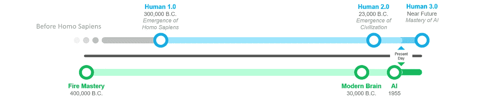

# 人工智能将在人类进化中占据中心位置

> 原文：<https://towardsdatascience.com/ai-will-take-center-stage-in-human-evolution-cead9fa22c25?source=collection_archive---------25----------------------->

Edited. (Original: Photo by [Viktor Talashuk](https://unsplash.com/@viktortalashuk?utm_source=unsplash&utm_medium=referral&utm_content=creditCopyText) on [Unsplash](https://unsplash.com/search/photos/mannequin?utm_source=unsplash&utm_medium=referral&utm_content=creditCopyText))

## [其他关于工程智能的文章](https://towardsdatascience.com/tagged/engineered-intelligence)

## 人类 3.0 的崛起始于 AI

Don’t have time to read? Listen to this article on my podcast.

在你生命中的某个时刻，你意识到你曾经敬仰的人并不像你曾经想象的那样完美。我们现在正努力用我们的智慧来处理这种意识。在这个世界上，曾经是人类成就巅峰的月球发射现在可以通过你的智能手机中的一小部分计算能力来处理[(这种转变发生在不到一个世纪的时间里)，我们不禁想知道我们未来将走向何方——一个人类可能不再相关的未来。](https://www.cultofmac.com/639048/apollo-computer-iphone/)

但不要相信我的话，[埃隆·马斯克甚至为此拍了一部纪录片](https://www.cnbc.com/2018/04/06/elon-musk-warns-ai-could-create-immortal-dictator-in-documentary.html)，这也是[他与 Neuralink](/what-is-neuralink-a-look-at-what-it-is-what-it-wants-to-be-and-what-it-could-become-2acf32b51dc5) 有牵连的原因之一。然而，未来还没有到来，作为一个文明，我们仍然有时间找到保持自身相关性的方法——特别是在我们的认知相关性方面，这是我们首先到达这里的原因。

A Timeline from Human 1.0 to Human 3.0

# 人类简史

人类已经进行了一次穿越时间和空间的长途旅行(主要是在地球上，但最近也在其轨道之外)。首先出现在非洲(嗯，这是最广为接受的理论)，随后迁移到每一寸土地，作为一个物种，我们已经实现了许多里程碑，慢慢走向我们今天拥有的地球的最终统治地位。

人类 1.0 标志着我们作为一个物种的出现:智人。我们繁殖火焰的能力有助于提高我们的认知能力，这反过来又让我们成为一种弱势动物。人类 2.0 标志着一个独立的里程碑:文明，通过能源的再生产——即农业。正是在这个转折点上，我们可以将重点转移到集体创建一个名为社区的实体上。最后，人类 3.0 标志着另一个里程碑，我们正在见证今天的开端:我们复制智能的能力。就像我们使用火和农业来帮助引领我们进入人类的早期阶段一样，我相信人工智能将是我们在未来用来诞生人类 3.0 的工具。

## 人类 1.0 出现在 10 万年前，在掌握火之后

人类 1.0 标志着智人的出现，我们今天仍然是这个物种。目前，该物种的出现估计发生在大约 30 万年前。这发生在我们驯化火之后不久，[大约 30 万到 40 万年前](https://time.com/5295907/discover-fire/)(嗯，公平地说，考古学家认为火的驯化可以追溯到 150 万年前，但 30 万到 40 万年的范围是最广泛接受的)。

这不仅仅是巧合。一种理论指出[火是现代人类大脑发展的催化剂(象征性的，不是字面上的)。当我年轻的时候，我记得我爸爸曾经吃得很多。我妈妈会开玩笑说，他之所以一直很瘦，是因为他用脑太多。回想起来，背后还是有一定道理的。据估计，人类大脑要消耗身体总能量的 20%左右才能发挥作用。](https://www.scientificamerican.com/article/cooking-up-bigger-brains/)

> 作为能量消耗者，大脑是我们随身携带的最昂贵的器官
> 
> - [华盛顿大学的马库斯·赖克尔博士](https://time.com/5400025/does-thinking-burn-calories/)

通过用火烹饪，食物对我们来说变得更容易消化，这做了两件事:首先，它减少了消化所需的能量，其次，它让我们消耗更多的热量，吸收更多的营养，用于大脑的发育。火对我们智力进化的确切影响仍有争议，但不可否认的是，它有助于为我们的大脑提供能量。

 [## 对智力的起源感兴趣？阅读我的系列文章。

### 《智力的起源》是一个探索智力产生的历史和因素的系列。

medium.com](https://medium.com/tag/origins-of-intelligence/latest) 

人类 1.0 是游牧的。虽然它的智力明显高于类人猿，但它也严重依赖体力和耐力生存。由于没有家可回(由于缺乏文明)，人类 1.0 严重依赖同伴合作来生存。Yuval Noah Harai 在他的书《智人》中详细描述了我们祖先的生活。

## 人类 2.0 出现在 23000 年前，在掌握农业之后

人类 2.0 随着农业的出现而到来。以前，人们认为人类大约在 10，000 年前发明了农业。这正好是最近一次冰河时期结束的时间(11700 年前)。

然而，在 2015 年，科学家发现证据表明[的农业可以追溯到 23000 年前](https://www.sciencedaily.com/releases/2015/07/150722144709.htm)，这意味着这种做法开始于——而不是在——最后一次冰河时期之后。在这一点上，世界各地的人类开始独立驯化植物和动物(或者像尤瓦尔·诺亚·哈拉里(Yuval Noah Harari)认为的那样，世界各地的植物和动物开始驯化人类)。在进化的时间线上，农业出现在大约 35000 年前[第一个现代人类大脑开始出现之后。](https://www.mpg.de/11883269/homo-sapiens-brain-evolution)

这个从狩猎采集生活方式向农耕生活方式转变的时期也标志着向人类 2.0 的转变。在某种程度上，农业将人类束缚在他们的土地上，导致了更复杂的社区。在此之前，在狩猎采集的生活方式中，[人类是游牧民族](https://study.com/academy/lesson/early-human-communities-around-the-world.html)——他们四处旅行寻找食物，并没有一个真正称之为家的地方。农业把我们变成了定居的哺乳动物。

此时的里程碑标志着文明诞生的转折点。最初帮助我们物种生存的过程演变成了我们今天看到的现代社会——可以说是一种生物本身，人类已经成为其细胞。现在，我们有微型文明，我们中的许多人是所谓的企业的一部分，这可以被法律认为是纳税和承担诉讼责任的实体，就像人类一样。随着文明的出现和持续发展，人类个体生命的价值越来越受到质疑。

# 掌握人工智能后出现人类 3.0

人类 3.0 是技术直接或间接补充或增强其智力的人类。有几种方法可以实现这一点，但人工智能将不可避免地在某种程度上参与其中。

有人可能会认为人类 3.0 已经到来，它是随着 iPhone 和物联网等技术的出现而出现的，我们连接的每一个设备都为我们提供关于我们自己的可操作信息，并在日常生活中帮助我们。然而，这些物品只是工具。正如火为现代人类铺平了道路，农业开创了文明，人工智能的工具将被应用于在基因或增强水平上衡量人类的智力。

与我们使用的替代工具相比，我们迄今为止取得的人工智能成就相当惊人，尤其是在自动化方面。例如，通过面部识别，人工智能可以对几小时或几天的安全录像进行排序，以找到一个失踪的孩子。在像这样的工具出现之前，一个人必须坐在那里自己浏览所有的片段。

话虽如此，人工智能仍处于起步阶段，要将其应用于更多行业和用例，我们需要数据——海量和正确的数据。李开复在他的书《人工智能的超能力》中广泛地谈到了这一点，所以如果你想了解更多细节，可以看看这本书。我们今天拥有的工业用例令人印象深刻，围绕自动驾驶等未来用例的研发更令人印象深刻。但要让人工智能应用于某些用例(即，那些将带领我们更快实现人类 3.0 的用例)，它需要等待数据和我们对主题的理解赶上来。根据我们实现人类 3.0 的方法类型，人工智能将需要不同的技术来赶上。

## 通过人工智能增强的人类 3.0

实现人类 3.0 的第一个策略最近引起了媒体的广泛关注——[neural ink 是埃隆·马斯克的最新创意](/what-is-neuralink-a-look-at-what-it-is-what-it-wants-to-be-and-what-it-could-become-2acf32b51dc5)，它希望开发一种大脑芯片，可以在人工智能的帮助下帮助用户思考和控制技术。

 [## 什么是 Neuralink:看看它是什么，它想要成为什么，以及它可能成为什么

### 向你的第六感问好。

towardsdatascience.com](/what-is-neuralink-a-look-at-what-it-is-what-it-wants-to-be-and-what-it-could-become-2acf32b51dc5) 

无论是 Neuralink 还是另一家大脑芯片设备制造商，结果仍然是可以想象的——人类历史上第一次，我们建造的所有工具都将成为我们的直接延伸。与我们周围的世界互动可能不再需要我们动动手指。如果人类 2.0 变成了久坐，那么人类 3.0 就有变成久坐 2.0 的风险(请笑)。

虽然与我们周围的物体互动可能不再需要动动手指，但与我们周围的人互动可能不再需要我们张嘴。大脑芯片设备(Neuralink 的设备已经支持蓝牙，可以与你的 iPhone 通信)可以相互通信。大脑芯片读取我们的想法后，它可以比我们大声说出来更快地将信息传递给其他人。

## 通过 DNA 操作的人类 3.0

我们已经探索了进入人类基因组的祖先病毒是如何操纵我们神经通讯的。我们还观察了人类基因组中天然发生的[基因突变，这种突变改变了干细胞产生的神经元数量，从而增加了我们的智力。](https://medium.com/@wandererli/the-origins-of-intelligence-chapter-3-1c42da5ea372)

过去对人类基因组的操纵导致了我们认知能力的提高，没有证据表明我们已经达到了遗传智力的上限。一旦我们对人类基因组有了更多的了解，特别是对智力有最直接影响的基因片段，我们就可以训练人工智能算法进行模拟，并帮助我们发现其他可能的突变，以进一步开发人类大脑。

## 一个组合:人类 3.0 机器人

一个结合是可能的，因为科学界在各自的领域内平行地工作以取得独立的技术进步。这种可能性为人类 3.0 的更多选择打开了大门。例如，目前，要使用 Neuralink，芯片及其电极必须自动安装在颅骨下方。

这是一个侵入性的过程，但需要工作，因为电极需要足够近才能检测到微弱的信号，电极可以捕获神经元相互通信时发出的电信号。通过基因操作，我们有可能增加信号的半径，使其可以被电极检测到，而无需进入大脑。

虽然这听起来很容易想象，但无论我们选择哪条道路来创造人类 3.0，都将不可避免地充满我们必须解决的技术障碍，以及我们必须回答的伦理困境。虽然我们必须等待技术赶上或首先自己制造，但伦理问题以及我们如何最负责任地开发它可以在短期内得到解决。像 Neuralink 这样的公司已经在实现这项技术的过程中，所以现在是时候考虑人类如何在道德上安全地迎接人类 3.0 了。