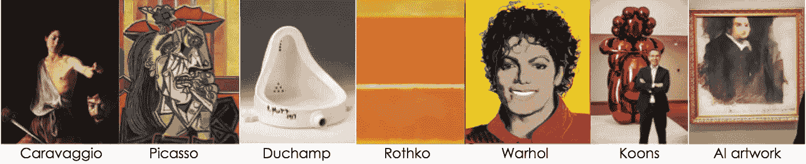
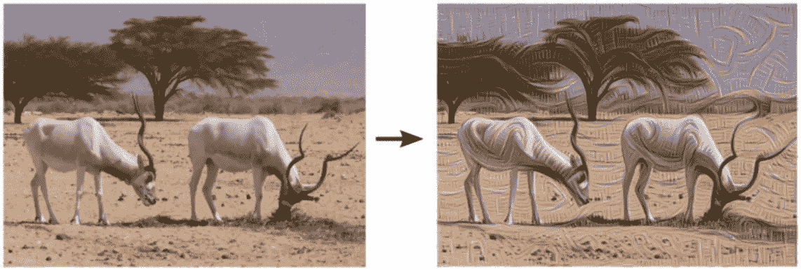
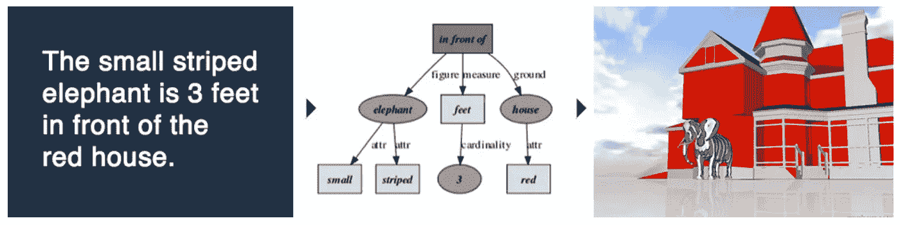
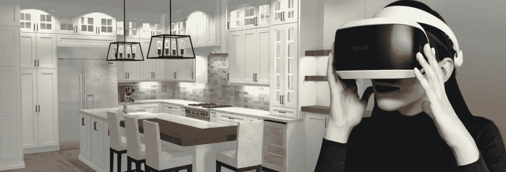
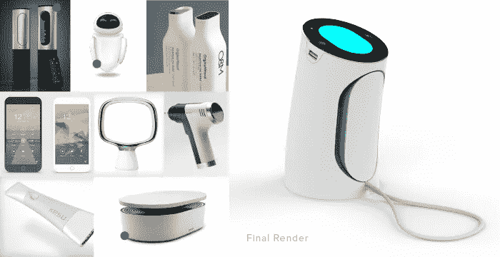
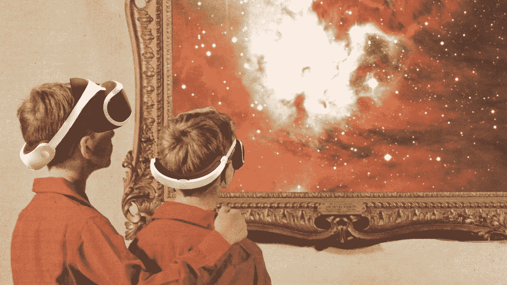

# 人工智能不会取代艺术家，相反，它会增加他们的数量

> 原文：<https://towardsdatascience.com/ai-wont-replace-artists-instead-it-will-augment-them-2963532ec8f3?source=collection_archive---------12----------------------->

艺术界痴迷于人工智能创作的作品，这并不令人惊讶，但也令人筋疲力尽。如果你一直关注[艺术新闻](https://www.vulture.com/2018/10/an-artificial-intelligence-artwork-just-sold-for-usd400-000.html#comments)，你会知道去年 10 月，一幅非常普通的人工智能肖像卖到了 43.2 万美元。它是由一个叫做 GAN 的开源程序开发的。佳士得声称这是“第一幅由算法生成的待拍卖的肖像画。”当然，这不是真的-像托马斯·拉夫这样的艺术家几十年来一直在制作这样的汇编艺术品。在佳士得售出的这件作品甚至不是人工智能图像创作的高级或受启发的应用。那么它为什么会被卖掉呢？我相信这是因为我们正处于艺术界一个一致趋势的逻辑终点:拒绝自己。几个世纪以来，艺术一直处于永久的自由落体状态，分裂并挑战其形式的定义。

这并不新鲜。16 世纪晚期，绘画大师卡拉瓦乔通过描绘令人难以置信的黑暗、病态、戏剧性的场景，拒绝了绘画的光明和理想主义。毕加索拒绝了人类的形式，而喜欢更直观、更感性的形象。杜尚拒绝将艺术视为神圣的创造，并确实想过将便池称为艺术——让观众震惊和敬畏。罗斯科完全拒绝数字和表现，靠在画布上出售模糊的色块过着神话般的生活。安迪·沃霍尔用他对媚俗流行文化的不敬表现拒绝了艺术中剩下的任何意义。

沃霍尔的精神传人杰弗·昆斯通过制作更丑陋、更媚俗、更重复的作品，并经常从不太出名(也可以说更有才华)的艺术家那里窃取创意，进一步堕落到了无意义的无耻艺术中。艺术界不在乎昆斯或其他人是否不道德。只要是拒绝旧标准，什么都可以。首先是拒绝完美，然后拒绝现实主义，然后拒绝形式，然后是意义。现在，看起来，我们已经拒绝了任何目的。人工智能艺术只是一个概念的解释，归结到它的螺母和螺栓。虽然这可能有一些哲学上的兴趣和美学上的吸引力，但我不能提出任何更广泛的理由。

# **我们什么时候才能意识到拒绝标准就是新标准？什么时候我们会拒绝拒绝本身？**

我想知道艺术定义的概念去进化是否在 AI 艺术中达到了最低点，这里是 AI 艺术的工作方式:程序被训练识别艺术和结构中的模式，然后使用那些模式来创作自己的作品。他们还需要一段时间才能开始寻找创造意义的方法，并像真正的艺术家那样对社会趋势做出反应。目前，它们天生就是 100%的衍生品。

事实上，这是艺术界的拒绝执念仍然可以产生一些有趣的东西的地方。为什么我们不要求我们的人工智能创造出分析然后拒绝趋势的作品，而不是模仿它们？如果他们能确定艺术的规则，我们不妨要求他们打破那些规则。

然而，我觉得这比让艺术家使用人工智能创作有意义的作品有趣得多。在之前的一篇文章中，我谈到了技术可以重塑我们所知的艺术。我相信它将非常依赖于大量的开源资产库。我还认为，这些图书馆或数据库将包含我们上传的大量信息。为什么考虑以下技术。

1.  [这个人不存在](https://www.thispersondoesnotexist.com/)创建看起来很真实的脸，但实际上是不同脸的集合。
2.  [活尸人工智能](https://venturebeat.com/2019/04/07/promethean-ai-automatically-generates-game-scenes-like-a-bedroom-for-human-artists/)将他人创造的资产放入人工智能生成的场景中。它负责灯光/阴影&很容易修改。
3.  Nvidia 的 [GauGAN](https://blogs.nvidia.com/blog/2019/03/18/gaugan-photorealistic-landscapes-nvidia-research/?ncid=so-you-n1-78256) 允许你绘制一个形状，并用一种物体/材质类型填充它。然后，艾把它变成了一个逼真的 2D 场景。
4.  WordsEye 让你用文字描述一个场景，然后 AI 创造那个场景。它为每个对象提供了一个小型资源库，因此您可以选择正确的对象。

Source: [https://www.wordseye.com/about](https://www.wordseye.com/about)

Promethean 和 WordsEye 都在 3d 空间中工作，而其他的都是 2d 的。连接所有这些的事情是他们使用人工智能和资产库来达到一个特定的目标。除了这个人不存在，他们都允许用户输入具体的要求或限制。(这个人不存在可以修改为允许用户约束，因为是用开源的 GAN 系统做的)。从艺术上来说，这些都更像是拼贴画而不是绘画。但是这些技术仍处于起步阶段。系统变得越可定制，它们就越有创造性和个性化。

在这项技术中，我们可以开始看到个人资产库的具体潜在应用。我们这个时代的大多数人已经通过电话、视频和音频记录在他们的手机上创建了丰富的资源库。我们用这些来创造我们自己的身份，包括个人身份和社会身份。但是，如果我们可以用这些图像来创造受我们个人世界启发的东西，会怎么样呢？如果我们拍的照片可以是工具而不是最终结果呢？

让我们稍微探讨一下这个想法。你可能有一种特定的数字审美，建立在你的整个数字足迹之上:保存在手机上的照片，你在 Pinterest 上喜欢的东西，你在 Instagram 上发布的东西，等等。人工智能可以很容易地分析你的所有帖子，并重新创建符合你审美的新场景和物体。你可以要求它创造一个受此启发的房间；或者由您概述的特定约束来定义。你可以从画房间的形状和里面的物体开始，就像你在高根画的那样。然后，它可以按照普罗米修斯人工智能创建空间的方式来建造(它会从你发布和喜欢的房间图像中提取)。最后，房间里可以放满亚马逊和宜家购物清单上的物品。

[Source](https://www.legacykitchens.com/news/design-stories/design-technology-virtual-reality-for-kitchen-renovations/)

假设您想更进一步，将您自己的对象添加到您正在创建的场景中。实现这一点的一种方法是将您从现实生活对象中创建的 3d 资源包括在内。这可以通过智能手机上的[应用](https://all3dp.com/2/5-best-3d-scanner-apps-for-your-smartphone/)轻松实现。或者，用你在 2D 的旧照片。像 [Smoothie 3D](https://www.smoothie-3d.com/site/page_index.php) 这样的免费在线平台能够将任何 2d 照片转换成 3D 物体。像 [Threedy.ai](https://www.forbes.com/sites/charliefink/2019/02/27/threedy-ai-can-turn-any-2d-photo-into-a-3d-object-in-seconds/#4a8e48c8128b) 这样的新创公司旨在利用人工智能使这一过程更快、更少人工干预。一旦你有了一个粗略的 3d 场景，你可以使用类似 GauGAN 的绘图功能来绘制一些形状，然后用一个对象填充它们。

让我们进一步推动它。假设你想在你创建的场景中添加一个科幻小工具。你戴上虚拟耳机，画出一个粗略的圆柱体。然后，你必须用纹理填充形状——所以你要求人工智能从你创建的 moodboard 中提取。它利用这些图像的灵感创造了一个圆柱形的物体。使用同样的技术，可以创造出一个装满物品的房间。

Source: [https://worrell.com/using-mood-boards-to-drive-design-decisions/](https://worrell.com/using-mood-boards-to-drive-design-decisions/)

# 等等，这和艺术世界有什么关系？

很明显，这些方法(以及更多我们还没有想到的方法)可以将艺术界推向新的高度。创作和自我表达将变得越来越容易获得，越来越多媒体化。这项技术还将允许艺术家创造比目前更具沉浸感的艺术体验。

我想象的最后一个应用是一种艺术类型，它不仅仅使用人工智能来整合艺术家自己的数字信息。相反，我认为下一个合乎逻辑的步骤是将艺术扩展到我们的思想世界和社会体系中。

## 人工智能艺术可以与观众建立真正的个人关系。

想象一下，你走进一家画廊去看一场新的艺术展览。在门口，你登录你的谷歌账户，然后戴上虚拟现实耳机。突然，你被传送到一个房间。这些墙壁是一个梦幻般的场景集合体，看起来就像是来自你自己的生活。你的猫的动画，由数百张你的猫的照片和视频创建，在地板上蹦蹦跳跳。房间周围的植物与你以前见过的完全不同——它们不存在于现实世界中——但它们看起来像是真的。它们就像你经常在 Instagram 上喜欢的植物图片一样美观。你在镜子里看到自己——这是你谷歌账户上所有自拍照的 3d 组合。你走进房间时穿的衣服已经被摄像头扫描并在虚拟现实中复制。你可以切换不同的服装——既有你在照片中穿过的，也有你喜欢的视频中的，还有 AI 通过汇编你喜欢的风格创建的。

如果陌生人走进展览，人工智能会将你的品味与他们的结合起来。墙上的一扇窗户打开了，你看到自己童年的场景和他们的场景混合在一起。覆盖在你们世界地面上的花卉地毯现在变成了带有花卉图案的瓷砖。音乐从你个人的 Spotify 播放列表转移到你和他们的歌曲的混音，由 AI 创建。这个世界不可能存在于任何人之间。你会以一种全新的方式感受到与这个人的亲密联系。

[source](https://www.gq.com/story/what-is-deal-with-virtual-reality)

艺术世界是建立在拒绝之上的，而技术和虚拟艺术是一个充满机遇的世界。任何人都可以投身其中，做出下一个疯狂的新事物，就像历史上新的艺术范式让文化惊叹一样催眠观众。这种创造、自由和自我探索的行为*就是*艺术。如果你认为计算机程序可以取代艺术家，那你对艺术为什么被创造就有了根本性的误解。

## 艺术一直只是分享人类感知的一种方式。

艺术家总是从他们周围的世界中获取灵感，AI 也是如此。将人工智能作为一种新的媒介或工具，而不是最终结果，要有趣得多，也更有创造性。人工智能和数字艺术是一个新的方向，我们可以在其中探索我们的感知和灵感。

如果我们要继续拒绝艺术规范，是时候抵制简单、无意义和无聊的艺术规范了。在创造力进化的所有方式中，人工智能艺术肯定是最有趣的途径之一——当然，也是最聪明的。