# 利用深度学习的最新进展来预测股价走势

> 原文：<https://towardsdatascience.com/aifortrading-2edd6fac689d?source=collection_archive---------0----------------------->

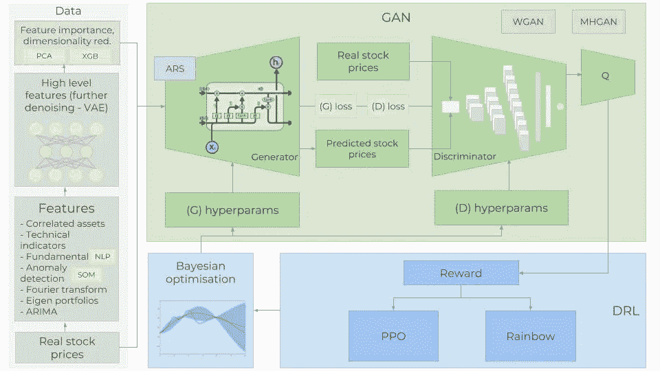

Overview of the complete architecture.

> 完整笔记本链接:[https://github.com/borisbanushev/stockpredictionai](https://github.com/borisbanushev/stockpredictionai)

在这本笔记本中，我将创建一个预测股票价格变动的完整过程。坚持下去，我们会取得一些不错的成果。为此，我们将使用一个**生成对抗网络** (GAN)与**(一种递归神经网络)作为生成器，以及一个卷积神经网络**(CNN**)作为鉴别器。我们使用 LSTM 的明显原因是我们试图预测时间序列数据。为什么我们使用 GAN，特别是 CNN 作为鉴别器？这是一个很好的问题:稍后会有专门的章节讨论这个问题。**

**当然，我们将对每个步骤进行更详细的描述，但是最困难的部分是 GAN:成功训练 GAN 的非常棘手的部分是获得正确的超参数集。出于这个原因，我们将使用**贝叶斯优化**(以及高斯过程)和**深度强化学习** (DRL)来决定何时以及如何改变 GAN 的超参数(探索与开发困境)。在创建强化学习时，我将使用该领域的最新进展，如 **Rainbow** 和 **PPO** 。**

**我们将使用许多不同类型的输入数据。除了股票的历史交易数据和技术指标，我们还将使用 **NLP** (使用“变压器的双向嵌入表示法”、 **BERT** ，NLP 的一种转移学习)的最新进展来创建情绪分析(作为基本面分析的来源)、傅立叶变换来提取总体趋势方向、**堆叠自动编码器**来识别其他高级特征、**特征投资组合**来寻找相关资产、 自回归综合移动平均线( **ARIMA** )用于股票函数的逼近，以及更多，以便尽可能多地捕捉关于股票的信息、模式、相关性等。 众所周知，(数据)越多越好。预测股价走势是一项极其复杂的任务，所以我们对股票(从不同角度)了解得越多，我们的变化就越大。**

**为了创建所有的神经网络，我们将使用 **MXNet** 及其高级 API——Gluon，并在多个 GPU 上训练它们。**

****注意** : *虽然我试图深入几乎所有算法和技术背后的数学和机制的细节，但这本笔记本并没有明确打算解释机器/深度学习或股票市场是如何工作的。其目的是展示我们如何使用不同的技术和算法来准确预测股票价格的变动，并给出在每一步中使用每种技术的理由和用途。***

## **目录**

*   **[1。简介](https://medium.com/p/2edd6fac689d#bbae)**
*   **[2。数据](https://medium.com/p/2edd6fac689d#f8df)**
*   **[2.1。相关资产](https://medium.com/p/2edd6fac689d#9bf2)**
*   **[2.2。技术指标](https://medium.com/p/2edd6fac689d#58e2)**
*   **[2.3。基本面分析](https://medium.com/p/2edd6fac689d#e9dd)**
*   **[2.3.1。来自变压器的双向嵌入表示— BERT](https://medium.com/p/2edd6fac689d#d703)**
*   **[2.4。用于趋势分析的傅立叶变换](https://medium.com/p/2edd6fac689d#c237)**
*   **[2.5。ARIMA 为特色](https://medium.com/p/2edd6fac689d#f039)**
*   **[2.6。统计检查](https://medium.com/p/2edd6fac689d#8528)**
*   **[2.6.1。异方差、多重共线性、序列相关性](https://medium.com/p/2edd6fac689d#7682)**
*   **[2.7。特征工程](https://medium.com/p/2edd6fac689d#b21b)**
*   **[2.7.1。XGBoost 的特性重要性](https://medium.com/p/2edd6fac689d#a522)**
*   **[2.8。使用堆叠自动编码器提取高级特征](https://medium.com/p/2edd6fac689d#f982)**
*   **[2.8.1。激活函数— GELU(高斯误差)](https://medium.com/p/2edd6fac689d#72ea)**
*   **[3。生成对抗网络(GAN)](https://medium.com/p/2edd6fac689d#bbcb)**
*   **[3.1。为什么甘要进行股市预测](https://medium.com/p/2edd6fac689d#5ec4)**
*   **[3.2。大都会-黑斯廷斯甘和瓦瑟斯坦甘](https://medium.com/p/2edd6fac689d#3506)**
*   **[3.4。发电机—一层 RNN](https://medium.com/p/2edd6fac689d#1faf)**
*   **[3.4.1。LSTM 还是 GRU](https://medium.com/p/2edd6fac689d#fa49)**
*   **[3.4.2。LSTM 建筑](https://medium.com/p/2edd6fac689d#f83d)**
*   **[3.4.3。学习率调度器](https://medium.com/p/2edd6fac689d#f68b)**
*   **[3.4.4。如何防止过度拟合和偏差-方差权衡](https://medium.com/p/2edd6fac689d#265c)**
*   **[3.5。鉴别器——一维 CNN](https://medium.com/p/2edd6fac689d#96f6)**
*   **[4.5.1。为什么 CNN 是一个歧视者？](https://medium.com/p/2edd6fac689d#473f)**
*   **3.5.1。CNN 架构**
*   **[3.6。超参数](https://medium.com/p/2edd6fac689d#4010)**
*   **[4。超参数优化](https://medium.com/p/2edd6fac689d#655f)**
*   **[4.1。超参数优化的强化学习](https://medium.com/p/2edd6fac689d#70a3)**
*   **[4.1.1。强化学习理论](https://medium.com/p/2edd6fac689d#37cc)**
*   **[4.1.1.1。彩虹](https://medium.com/p/2edd6fac689d#546a)**
*   **[4.1.1.2。PPO](https://medium.com/p/2edd6fac689d#edc6)**
*   **4.1.2。强化学习方面的进一步工作**
*   **[4.2。贝叶斯优化](https://medium.com/p/2edd6fac689d#7bae)**
*   **[4.2.1。高斯过程](https://medium.com/p/2edd6fac689d#f88a)**
*   **[5。结果](https://medium.com/p/2edd6fac689d#c39d)**
*   **6。下一步是什么？**
*   **[7。免责声明](https://medium.com/p/2edd6fac689d#42bb)**

# **1.介绍**

**准确预测股票市场是一项复杂的任务，因为有数以百万计的事件和先决条件，特定股票会向特定方向移动。因此，我们需要尽可能多地捕捉这些先决条件。我们还需要做几个重要的假设:1)市场不是 100%随机的，2)历史重复，3)市场遵循人们的理性行为，4)市场是“*完美的*”。请务必阅读底部的免责声明。**

**我们将尝试预测高盛的价格走势。为此，我们将使用 2010 年 1 月 1 日至 2018 年 12 月 31 日的每日收盘价(七年用于培训，两年用于验证)。*我们将交替使用‘高盛’和‘高盛’这两个术语*。**

# **2.数据**

**我们需要了解是什么影响了 GS 的股价是上涨还是下跌。这是人们作为一个整体的想法。因此，我们需要整合尽可能多的信息(从不同的方面和角度描述股票)。(我们将使用每日数据— 1，585 天来训练各种算法(我们拥有的数据的 70%)，并预测接下来的 680 天(测试数据)。然后，我们将预测结果与测试数据进行比较。每种类型的数据(我们称之为*特性*)将在后面的章节中详细解释，但是，作为一个高层次的概述，我们将使用的特性有:**

1.  ****相关资产** —这些是其他资产(任何类型，不一定是股票，如商品、外汇、指数，甚至是固定收益证券)。像高盛这样的大公司显然不会“生活”在一个孤立的世界中——它依赖于许多外部因素并与之相互作用，包括其竞争对手、客户、全球经济、地缘政治形势、财政和货币政策、获得资本的途径等。细节在后面列出。**
2.  ****技术指标**——很多投资者追随技术指标。我们将把最流行的指标作为独立的特征包括进来。其中——7 日和 21 日移动平均线，指数移动平均线，动量，布林线，MACD。**
3.  ****基本面分析**——一个非常重要的特征，表明股票可能上涨或下跌。基本面分析中可以使用两个功能:1)使用 10-K 和 10-Q 报告分析公司业绩，分析 ROE 和 P/E 等(我们不会使用这一功能)，以及 2)新闻——潜在的新闻可以表明即将发生的事件，这些事件可能会使股票向某个方向移动。我们将阅读高盛的所有每日新闻，并提取当天对高盛的总体情绪是积极、中立还是消极(以 0 到 1 的分数表示)。随着许多投资者仔细阅读新闻，并根据新闻做出投资决定(当然部分是这样)，如果今天高盛的消息非常积极，那么明天该股很有可能会飙升。*至关重要的一点是，我们将在以后对绝对每一个特征(包括这个特征)执行特征重要性(意味着它对 GS 运动的指示性)并决定是否使用它。稍后会有更多的介绍。
    为了创建准确的情感预测，我们将使用神经语言处理( **NLP** )。我们将使用 **BERT** —谷歌最近宣布的用于情感分类股票新闻情感提取的迁移学习的 NLP 方法。***
4.  ****傅立叶变换** —除了每日收盘价之外，我们还将创建傅立叶变换，以便概括几个长期和短期趋势。使用这些变换，我们将消除大量噪声(随机游走),并创建真实股票运动的近似值。拥有趋势近似值可以帮助 LSTM 网络更准确地选择其预测趋势。**
5.  **自回归综合移动平均法(**ARIMA**)——这是预测时间序列数据未来值最流行的技术之一(在神经网络出现之前的时代)。让我们添加它，看看它是否是一个重要的预测特征。**
6.  ****堆叠式自动编码器**——前面提到的大多数特性(基本面分析、技术分析等)都是人们经过几十年的研究发现的。但也许我们遗漏了什么。也许由于大量的数据点、事件、资产、图表等，人们无法理解隐藏的相关性。通过堆叠式自动编码器(一种神经网络)，我们可以利用计算机的力量，或许可以找到影响股票走势的新型特征。即使我们无法理解人类语言中的这些特征，我们也会在 GAN 中使用它们。**
7.  ****深度无监督学习**用于期权定价中的异常检测。我们将使用另一个功能—每天我们将添加高盛股票 90 天看涨期权的价格。期权定价本身就结合了很多数据。期权合约的价格取决于股票的未来价值(分析师也试图预测价格，以便得出看涨期权的最准确价格)。利用深度无监督学习(自组织地图)，我们将试图发现每天定价中的异常。异常(如价格的剧烈变化)可能表示对 LSTM 了解整体股票模式有用的事件。**

**接下来，有了这么多特性，我们需要执行几个重要步骤:**

1.  **对数据的“质量”进行统计检查。如果我们创建的数据是有缺陷的，那么无论我们的算法多么复杂，结果都不会是正面的。检查包括确保数据没有异方差、多重共线性或序列相关性。**
2.  **创建功能重要性。如果一个特征(例如另一只股票或技术指标)对我们想要预测的股票没有解释力，那么我们就没有必要在神经网络的训练中使用它。我们将使用 **XGBoost** (极端梯度提升)，一种提升树回归算法。**

**作为我们数据准备的最后一步，我们还将使用主成分分析( **PCA** )创建**特征组合**，以减少自动编码器创建的特征的维度。**

```
print('There are {} number of days in the dataset.'.format(dataset_ex_df.shape[0]))**output** >>> There are 2265 number of days in the dataset.
```

**让我们想象一下过去九年的股票。垂直虚线表示训练数据和测试数据之间的分离。**

**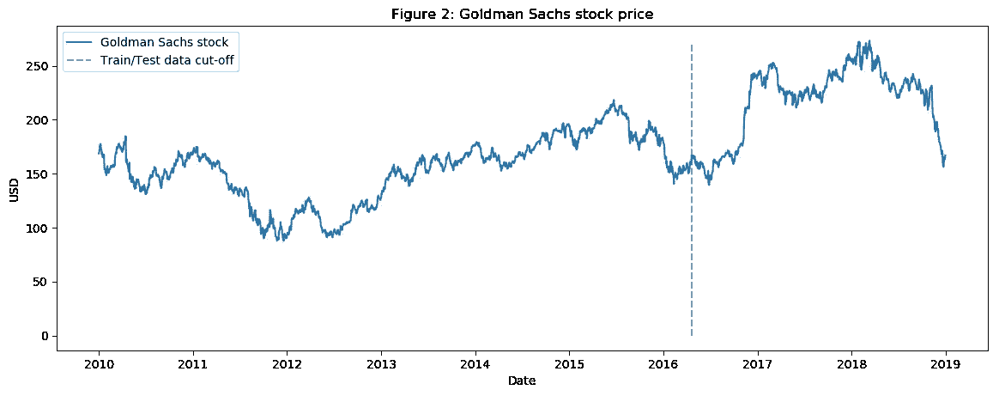**

**Goldman Sachs stock price (NYSE:GS)**

# **2.1.相关资产**

**如前所述，我们将使用其他资产作为特性，而不仅仅是 GS。**

**那么还有哪些资产会影响 GS 的股票走势呢？对公司、其业务线、竞争格局、依赖关系、供应商和客户类型等的良好理解对于选择正确的相关资产非常重要:**

*   **首先是类似 GS 的**公司**。我们将把摩根大通和摩根士丹利等公司加入数据集。**
*   **作为一家投资银行，高盛依赖于全球经济。糟糕或动荡的经济意味着没有并购或 IPO，自营交易收入可能有限。这就是为什么我们将包括全球经济指数。此外，我们将包括 LIBOR(美元和英镑计价)利率，因为分析师可能会考虑经济中的冲击来设定这些利率，以及其他 **FI** 证券。**
*   **每日波动指数(**VIX**)——原因如上所述。**
*   ****综合指数**——如纳斯达克和纽约证券交易所(来自美国)、富时 100(英国)、日经 225(日本)、恒生和 BSE Sensex (APAC)指数。**
*   ****货币** —全球贸易在很多时候反映在货币的变动上，因此我们将使用一篮子货币(如美元、日元、GBPUSD 等)作为特征。**

## **总的来说，数据集中还有 72 项其他资产——每项资产的每日价格。**

# **2.2.技术指标**

**我们已经讨论了什么是技术指标，以及我们为什么使用它们，所以让我们直接跳到代码。我们将仅为 GS 创建技术指标。**

```
""" Function to create the technical indicators """def get_technical_indicators(dataset):
    # Create 7 and 21 days Moving Average
    dataset['ma7'] = dataset['price'].rolling(window=7).mean()
    dataset['ma21'] = dataset['price'].rolling(window=21).mean()

    # Create MACD
    dataset['26ema'] = pd.ewma(dataset['price'], span=26)
    dataset['12ema'] = pd.ewma(dataset['price'], span=12)
    dataset['MACD'] = (dataset['12ema']-dataset['26ema'])# Create Bollinger Bands
    dataset['20sd'] = pd.stats.moments.rolling_std(dataset['price'],20)
    dataset['upper_band'] = dataset['ma21'] + (dataset['20sd']*2)
    dataset['lower_band'] = dataset['ma21'] - (dataset['20sd']*2)

    # Create Exponential moving average
    dataset['ema'] = dataset['price'].ewm(com=0.5).mean()

    # Create Momentum
    dataset['momentum'] = dataset['price']-1

    return dataset
```

**所以我们有每个交易日的技术指标(包括 MACD，布林线等)。我们总共有 12 个技术指标。**

**让我们想象一下这些指标过去 400 天的情况。**

**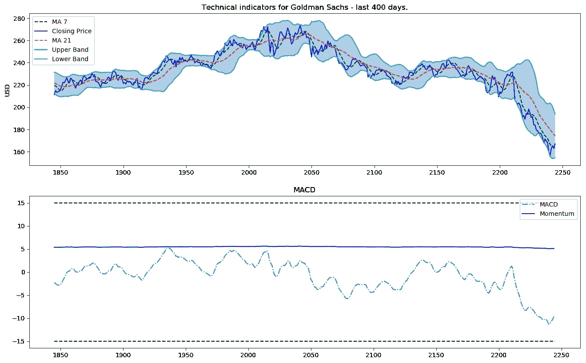**

**Technical indicators for Goldman Sachs — last 400 days.**

# **2.3.基本面分析**

**对于基本面分析，我们将对所有关于高盛的每日新闻进行情绪分析。在末尾使用 sigmoid，结果将介于 0 和 1 之间。分数越接近 0，消息越负面(接近 1 表示情绪积极)。对于每一天，我们将创建平均每日得分(0 到 1 之间的数字)，并将其作为一个特性添加。**

## **2.3.1.来自变压器的双向嵌入表示— BERT**

**为了将新闻分类为正面或负面(或中性)，我们将使用 [BERT](https://arxiv.org/abs/1810.04805) ，这是一种预先训练好的语言表示。**

**MXNet/Gluon 中已经提供了预训练的 BERT 模型。我们只需要实例化它们，添加两个(任意数量)`Dense`层，去 soft max——分数从 0 到 1。**

```
import bert
```

**深入 BERT 和 NLP 部分的细节不在本笔记本的范围之内，但是如果您有兴趣，请告诉我——我将只为 BERT 创建一个新的 repo，因为它在语言处理任务方面肯定非常有前途。**

# **2.4.用于趋势分析的傅立叶变换**

****傅立叶变换**取一个函数并创建一系列正弦波(具有不同的振幅和帧)。当组合在一起时，这些正弦波近似于原始函数。从数学角度来说，变换看起来像这样:**

**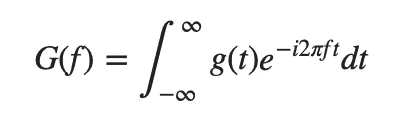**

**我们将使用傅立叶变换来提取 GS 股票的全局和局部趋势，并对其进行一点降噪处理。所以让我们看看它是如何工作的。**

```
""" Code to create the Fuorier trasfrom  """data_FT = dataset_ex_df[['Date', 'GS']]
close_fft = np.fft.fft(np.asarray(data_FT['GS'].tolist()))
fft_df = pd.DataFrame({'fft':close_fft})
fft_df['absolute'] = fft_df['fft'].apply(lambda x: np.abs(x))
fft_df['angle'] = fft_df['fft'].apply(lambda x: np.angle(x))
plt.figure(figsize=(14, 7), dpi=100)
fft_list = np.asarray(fft_df['fft'].tolist())
for num_ in [3, 6, 9, 100]:
    fft_list_m10= np.copy(fft_list); fft_list_m10[num_:-num_]=0
    plt.plot(np.fft.ifft(fft_list_m10), label='Fourier transform with {} components'.format(num_))
plt.plot(data_FT['GS'],  label='Real')
plt.xlabel('Days')
plt.ylabel('USD')
plt.title('Figure 3: Goldman Sachs (close) stock prices & Fourier transforms')
plt.legend()
plt.show()
```

**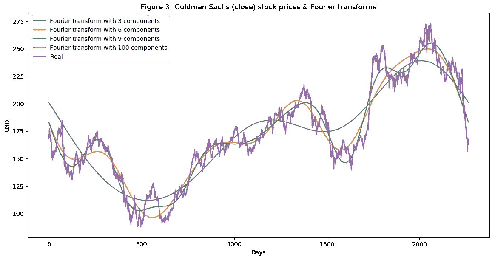**

**Figure 3: Fourier transform of Goldman Sachs Stock**

**如图 3 所示，我们使用的傅立叶变换成分越多，逼近函数就越接近真实的股票价格(100 成分变换几乎与原始函数相同，红线和紫线几乎重叠)。我们使用傅立叶变换来提取长期和短期趋势，因此我们将使用具有 3、6 和 9 个分量的变换。您可以推断，具有 3 个组件的转换是长期趋势。**

**另一种用于数据去噪的技术叫做**小波**。小波和傅立叶变换给出了相似的结果，所以我们将只使用傅立叶变换。**

# **2.5.ARIMA 是一个特色**

****ARIMA** 是一种预测时间序列数据的技术。我们将展示如何使用它，虽然 ARIMA 不会作为我们的最终预测，但我们将使用它作为一种技术来降低股票的噪声，并(可能)提取一些新的模式或特征。**

**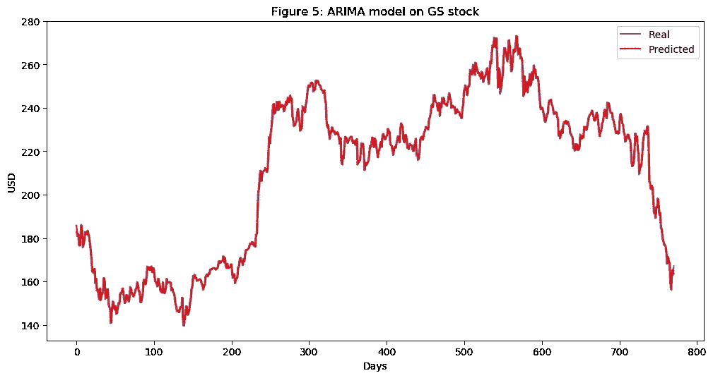**

**ARIMA on Goldman Sachs stock**

```
error = mean_squared_error(test, predictions)
print('Test MSE: %.3f' % error)**output** >>> Test MSE: 10.151
```

**正如我们从图 5 中看到的，ARIMA 给出了真实股票价格的一个非常好的近似值。我们将使用 ARIMA 的预测价格作为 LSTM 的输入特征，因为正如我们之前提到的，我们希望尽可能多地捕捉高盛的特征和模式。我们测试的 MSE(均方误差)为 10.151，这本身是一个不错的结果(考虑到我们确实有大量的测试数据)，但我们仍然只将它作为 LSTM 的一个特征。**

# **2.6.统计检查**

**确保数据具有良好的质量对于我们的模型非常重要。为了确保我们的数据是合适的，我们将执行几项简单的检查，以确保我们获得和观察到的结果是真实的，而不是由于基础数据分布存在基本错误而受到损害。**

## **2.6.1.异方差，多重共线性，序列相关**

*   ****条件异方差**出现在误差项(回归预测值与真实值之间的差异)依赖于数据时，例如，当数据点(沿 x 轴)增长时，误差项也会增长。**
*   ****多重共线性**是指误差项(也称为残差)相互依赖。**
*   ****序列相关**是指一个数据(特征)是另一个特征的公式(或完全依赖于另一个特征)。**

**我们不会在这里深入代码，因为它很简单，我们的重点更多地是在深度学习部分，**，但数据是定性的**。**

# **2.7.特征工程**

```
print('Total dataset has {} samples, and {} features.'.format(dataset_total_df.shape[0],                                                          dataset_total_df.shape[1]))**output** >>> Total dataset has 2265 samples, and 112 features.
```

**因此，在添加了所有类型的数据(相关资产、技术指标、基本面分析、傅立叶和 Arima)后，我们在 2，265 天中共有 112 个特征(然而，如前所述，只有 1，585 天用于训练数据)。**

**我们还将有更多的自动编码器生成的功能。**

## **2.7.1.XGBoost 的特性重要性**

**有这么多的特征，我们不得不考虑是否所有的特征都真正预示了 GS 股票的走向。例如，我们在数据集中包括了以美元计价的伦敦银行同业拆放利率，因为我们认为伦敦银行同业拆放利率的变化可能表明经济的变化，而经济的变化又可能表明高盛股票行为的变化。但是我们需要测试。有许多方法可以测试特性的重要性，但是我们将应用的方法使用 XGBoost，因为它在分类和回归问题上都给出了最好的结果。**

**由于要素数据集非常大，因此出于演示的目的，我们将仅使用技术指标。在真实特性重要性测试期间，所有选择的特性都被证明有些重要，所以我们在训练 GAN 时不会排除任何东西。**

```
regressor = xgb.XGBRegressor(gamma=0.0,n_estimators=150,base_score=0.7,colsample_bytree=1,learning_rate=0.05)xgbModel = regressor.fit(X_train_FI,y_train_FI, eval_set = [(X_train_FI, y_train_FI), (X_test_FI, y_test_FI)], verbose=False)fig = plt.figure(figsize=(8,8))
plt.xticks(rotation='vertical')
plt.bar([i for i in range(len(xgbModel.feature_importances_))], xgbModel.feature_importances_.tolist(), tick_label=X_test_FI.columns)
plt.title('Figure 6: Feature importance of the technical indicators.')
plt.show()
```

**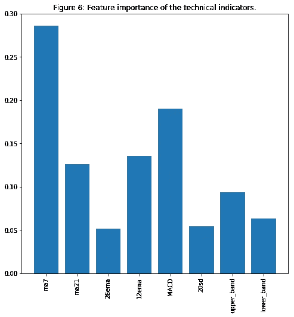**

**Feature importance using XGBoost**

**毫不奇怪(对于那些有股票交易经验的人来说), MA7、MACD 和 BB 是重要的特征。**

**我遵循相同的逻辑对整个数据集执行特征重要性分析——只是与少数特征相比，训练时间更长，结果更难阅读。**

# **2.8.使用堆叠自动编码器提取高级特征**

**在我们进入自动编码器之前，我们将探索另一种激活功能。**

## **2.8.1.激活函数— GELU(高斯误差)**

****格律** —高斯误差线性单元最近被提出——[环节](https://arxiv.org/pdf/1606.08415.pdf)。在论文中，作者展示了使用 GELU 的神经网络优于使用 ReLU 作为激活的网络的几个实例。`gelu`也用于 **BERT** ，我们用于新闻情感分析的 NLP 方法。**

**我们将使用 GELU 作为自动编码器。**

****注**:下面的单元格显示了 GELU 数学背后的逻辑。它不是作为激活函数的实际实现。我必须在 MXNet 中实现 GELU。如果你按照代码把`act_type='relu'`改成`act_type='gelu'`它就不会工作，除非你改变 MXNet 的实现。对整个项目发出一个 pull 请求，以访问 GELU 的 MXNet 实现。**

**我们把`GELU`、`ReLU`、`LeakyReLU`形象化一点(最后一个主要用在 GANs——我们也用)。**

```
def gelu(x):
    return 0.5 * x * (1 + math.tanh(math.sqrt(2 / math.pi) * (x + 0.044715 * math.pow(x, 3))))def relu(x):
    return max(x, 0)
def lrelu(x):
    return max(0.01*x, x)plt.figure(figsize=(15, 5))
plt.subplots_adjust(left=None, bottom=None, right=None, top=None, wspace=.5, hspace=None)ranges_ = (-10, 3, .25)plt.subplot(1, 2, 1)
plt.plot([i for i in np.arange(*ranges_)], [relu(i) for i in np.arange(*ranges_)], label='ReLU', marker='.')
plt.plot([i for i in np.arange(*ranges_)], [gelu(i) for i in np.arange(*ranges_)], label='GELU')
plt.hlines(0, -10, 3, colors='gray', linestyles='--', label='0')
plt.title('Figure 7: GELU as an activation function for autoencoders')
plt.ylabel('f(x) for GELU and ReLU')
plt.xlabel('x')
plt.legend()plt.subplot(1, 2, 2)
plt.plot([i for i in np.arange(*ranges_)], [lrelu(i) for i in np.arange(*ranges_)], label='Leaky ReLU')
plt.hlines(0, -10, 3, colors='gray', linestyles='--', label='0')
plt.ylabel('f(x) for Leaky ReLU')
plt.xlabel('x')
plt.title('Figure 8: LeakyReLU')
plt.legend()plt.show()
```

**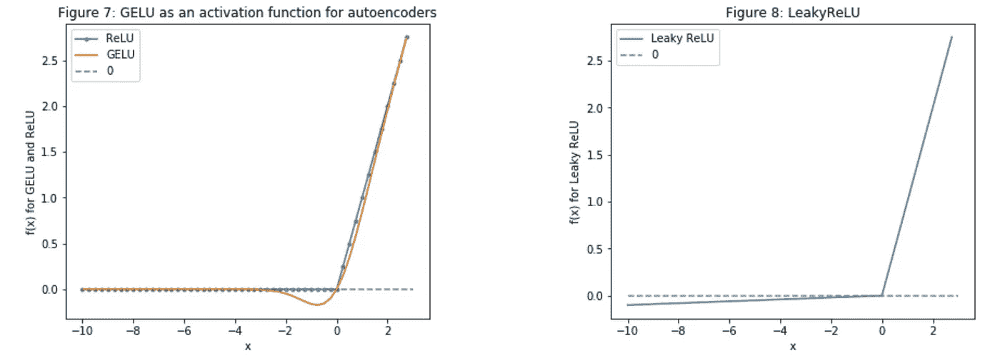**

**Comparison of GELU, ReLU, and LeakyReLU**

****注**:在这款笔记本的未来版本中，我将尝试使用 **U-Net** ( [link](https://arxiv.org/abs/1505.04597) )，并尝试利用卷积层，提取(并创建)更多关于股票基本运动模式的特征。现在，我们将只使用一个简单的由`Dense`层组成的自动编码器。**

**好的，**回到自动编码器**，如下图所示(该图只是示意性的，并不代表真实的层数、单位等。)**

****注意**:我将在以后的版本中探索的一件事是移除解码器中的最后一层。通常，在自动编码器中，编码器的数量==解码器的数量。然而，我们希望提取更高级别的特征(而不是创建相同的输入)，因此我们可以跳过解码器中的最后一层。我们通过在训练期间创建具有相同层数的编码器和解码器来实现这一点，但是当我们创建输出时，我们使用唯一一个层旁边的层，因为它将包含更高级别的特征。**

**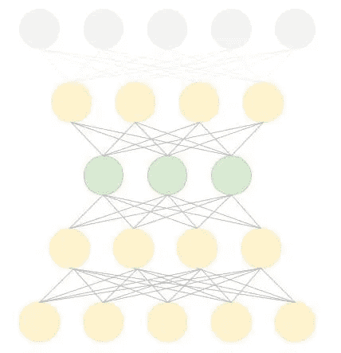**

> **自动编码器的完整代码可以在附带的 Github——顶部的链接中找到。**

**我们从 autoencoder 中创建了 112 个新功能。由于我们只想要高层次的特征(整体模式)，我们将使用主成分分析(PCA)在新创建的 112 个特征上创建一个特征组合。这将减少数据的维度(列数)。特征组合的描述能力将与最初的 112 个特征相同。**

****注意**同样，这纯粹是实验性的。我不能 100%确定所描述的逻辑是否成立。正如 AI 和深度学习中的其他事情一样，这是艺术，需要实验。**

# **3.生成对抗网络**

**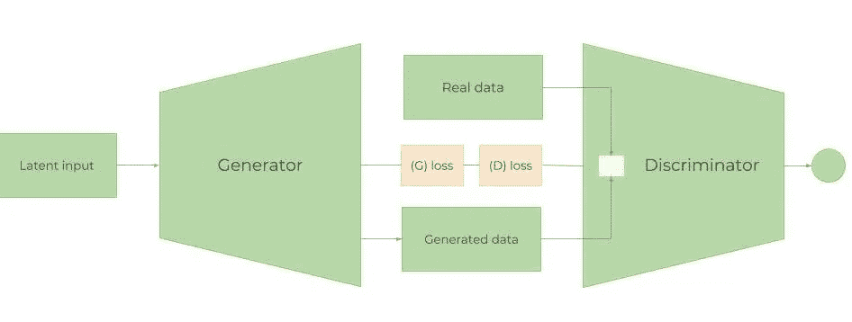**

**Architecture of GANs**

**GANs 是如何工作的？**

**如前所述，这本笔记本的目的不是详细解释深度学习背后的数学，而是展示其应用。当然，在我看来，从基础到最小的细节都要有透彻、扎实的理解。因此，我们将试图平衡并给出一个高层次的 GANs 如何工作的概述，以便读者充分理解使用 GANs 预测股价运动背后的基本原理。如果您对 GANs 有经验，请随意跳过这一节和下一节(并检查第 [4.2 节)。](http://localhost:8888/lab?#wgan))。**

**GAN 网络由两个模块组成——一个**发生器** (G)和一个**鉴别器** (D)。训练 GAN 的步骤如下:**

1.  **生成器使用随机数据(噪声表示为 *z* )试图“生成”与真实数据不可区分或极其接近的数据。其目的是了解真实数据的分布。**
2.  **随机地，真实的或生成的数据被放入鉴别器，鉴别器充当分类器并试图理解数据是来自生成器还是真实的数据。d 估计引入样本对真实数据集的(分布)概率。(*第 3.2 节中有更多关于比较两种分布的信息。下面*)。**
3.  **然后，来自 G 和 D 的损耗被合并，并通过发电机传播回来。因此，发电机的损耗取决于发电机和鉴频器。这是帮助生成器了解真实数据分布的步骤。如果生成器在生成真实数据(具有相同的分布)方面做得不好，鉴别器的工作将很容易区分从真实数据集生成的数据。因此，鉴频器的损耗将非常小。较小的鉴频器损耗将导致较大的发电机损耗(*见下面的等式* L(D，G))。这使得创建鉴别器有点棘手，因为太好的鉴别器总是会导致巨大的发电机损失，使发电机无法学习。**
4.  **该过程继续进行，直到鉴别器不再能够区分生成的数据和真实的数据。**

**当组合在一起时，d 和 g 有点像在玩一个*最小最大*游戏(生成器试图*愚弄*鉴别器，使其增加假样本的概率，即最小化𝔼z∼pz(z)[log(1−D(G(z)))].)鉴别器希望通过最大化𝔼x∼pr(x)[logD(x)].来分离来自发生器 D(G(z))的数据然而，在分离损失函数之后，还不清楚两者如何能够收敛在一起(这就是为什么我们在普通 GAN 上使用一些改进，例如 Wasserstein GAN)。总的来说，组合损失函数看起来像:**

**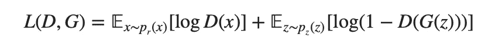**

****注意**:真正有用的训练 GANs 的小技巧可以在[这里](https://github.com/soumith/ganhacks)找到。**

****注意**:我不会在这个笔记本中包括 **GAN** 和**强化学习**部分后面的完整代码——只会显示执行的结果(单元输出)。作出拉请求或联系我的代码。**

# **3.1.甘为什么要进行股市预测**

****生成性对抗网络** (GAN)最近主要用于创建现实图像、绘画和视频剪辑。在我们的案例中，用于预测时间序列数据的 GANs 应用并不多。然而，主要思想应该是相同的——我们想要预测未来的股票走势。未来，GS 股票的模式和行为应该或多或少是一样的(除非它开始以完全不同的方式运作，或者经济发生剧烈变化)。因此，我们希望为未来“生成”与我们已经拥有的数据(历史交易数据)具有相似(当然不是绝对相同)分布的数据。所以，理论上，这应该行得通。**

**在我们的例子中，我们将使用 **LSTM** 作为时间序列发生器，使用 **CNN** 作为鉴别器。**

# **3.2.大都会-黑斯廷斯甘和瓦瑟斯坦甘**

****注意:** *接下来的几节假设有一些关于 GANs 的经验。***

## **一.大都会-黑斯廷斯甘**

**优步的工程团队最近对传统 GANs 进行了改进，称为**Metropolis-Hastings GAN**(MHGAN)。优步方法背后的想法(正如他们所说)有点类似于谷歌和加州大学伯克利分校创建的另一种方法，称为**鉴别器拒绝采样** ( [DRS](https://arxiv.org/pdf/1810.06758.pdf) )。基本上，当我们训练 GAN 时，我们使用鉴别器(D)的唯一目的是更好地训练发生器(G)。通常，在训练完 GAN 之后，我们就不再使用 D 了。而 MHGAN 和 DRS 为了选择由 G 生成的接近真实数据分布的样本，都尽量使用 D(两者略有不同的是，MHGAN 使用马尔可夫链蒙特卡罗( **MCMC** )进行采样)。**

**MHGAN 获取从 G 产生的 ***K*** 个样本(从独立的噪声输入到 G 产生，如下图中的 z0 至 zK)。然后，它依次通过 ***K*** 输出(x’0 至 x’K ),并遵循一个接受规则(由鉴别器创建)决定是接受当前样本还是保留上一个接受的样本。最后保存的输出被认为是 g 的真实输出。**

****注** : MHGAN 最初由优步在 pytorch 中实现。我只把它转入 MXNet/Gluon。**

## **注:我也将很快上传到 Github。**

**图 10:MHGAN 的可视化表示(来自最初的[优步邮报](https://eng.uber.com/mh-gan/?amp))。**

**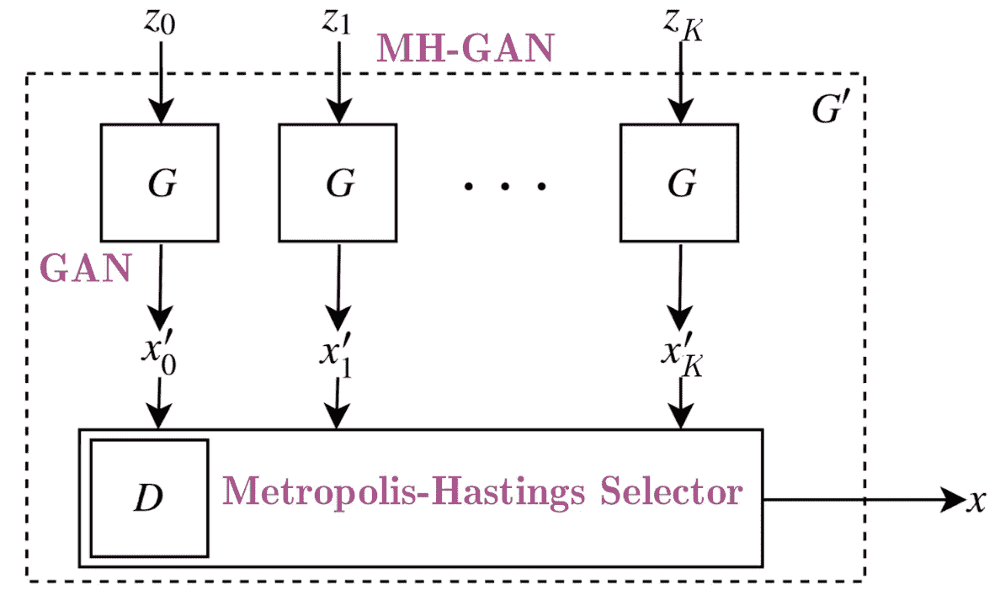**

## **二。瓦瑟斯坦·甘**

**训练 GANs 相当困难。模型可能永远不会收敛，模式崩溃很容易发生。我们将使用 GAN 的一个变体，称为**wasser stein**GAN—[WGAN](https://arxiv.org/pdf/1701.07875.pdf)。**

**同样，我们不会深入讨论细节，但最值得注意的几点是:**

*   **正如我们所知，GANs 背后的主要目标是让生成器开始将随机噪声转换成我们想要模拟的一些给定数据。因此，在 GANs 中，比较两个分布之间的相似性是非常必要的。两个最广泛使用的此类指标是:**
*   ****KL 散度**(kull back–lei bler)—DKL(p‖q)=∫XP(x)logp(x)q(x)dx。当 p(x)等于 q(x)时 dk1 为零，**
*   ****JS 发散**(詹森-香农)。JS 散度以 0 和 1 为界，与 KL 散度不同，它是对称的，更平滑。当损失从 **KL** 切换到 **JS** 发散时，GAN 训练取得了重大成功。**
*   **WGAN 使用**瓦瑟斯坦距离**，w(pr,pg)=1ksup‖f‖l≤k𝔼x∼pr[f(x)]−𝔼x∼pg[f(x】(其中 sup 代表*上确界*)作为损失函数(也称为推土机距离，因为它通常被解释为将一堆沙子移动到另一堆，两堆沙子具有不同的概率分布，在转换过程中使用最小能量)。与 KL 和 JS 背离相比，Wasserstein 度量给出了平滑的度量(没有背离的突然跳跃)。这使得它更适合在梯度下降期间创建稳定的学习过程。**
*   **此外，与 **KL** 和 **JS** 相比，瓦瑟斯坦距离几乎在任何地方都是可微的。如我们所知，在反向传播过程中，我们对损失函数进行微分，以创建梯度，梯度进而更新权重。因此，拥有一个可微的损失函数是非常重要的。**

## **毫无疑问，这是这个笔记本最难的部分。混合 WGAN 和 MHGAN 花了我三天时间。**

# **3.4.发电机——一层 RNN**

## **3.4.1.LSTM 还是 GRU**

**如前所述，生成器是 LSTM 网络一种类型的递归神经网络(RNN)。rnn 用于时间序列数据，因为它们跟踪所有以前的数据点，并可以捕捉随时间发展的模式。由于它们的性质，rnn 很多时候会遭受*消失梯度*——也就是说，在训练期间接收到的权重变化变得如此之小，以至于它们不会改变，使得网络无法收敛到最小损失(有时也会观察到相反的问题——当梯度变得太大时)。这被称为*渐变爆炸*，但解决方案非常简单——如果渐变开始超过某个常数，就对其进行剪辑，即渐变剪辑)。两种修改解决了这个问题——门控循环单元( **GRU** )和长短期记忆( **LSTM** )。两者最大的区别是:1) GRU 有 2 个门(更新和复位)，LSTM 有 4 个门(更新、输入、忘记和输出)，2) LSTM 保持内部存储状态，而 GRU 没有，3) LSTM 在输出门之前应用了一个非线性(sigmoid)，GRU 没有。**

**在大多数情况下，LSTM 和 GRU 在准确性方面给出了相似的结果，但 GRU 的计算强度要小得多，因为 GRU 的可训练参数要少得多。然而，LSTMs 使用得更多。**

**严格地说，LSTM 细胞(门)背后的数学是:**

**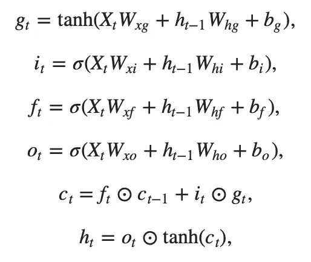**

**The math behind the LSTM cell**

**其中⊙是逐元素乘法运算符，对于所有 x=[x1,x2,…,xk]⊤∈R^k，两个激活函数:，**

**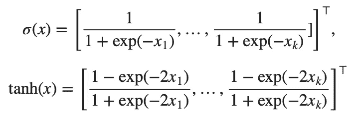**

## **3.4.2.LSTM 建筑**

**LSTM 架构非常简单，一个`LSTM`层有 112 个输入单元(因为我们在数据集中有 112 个要素)和 500 个隐藏单元，一个`Dense`层有 1 个输出-每天的价格。初始化器是 Xavier，我们将使用 L1 损失(这是使用 ***L1*** 正则化的平均绝对误差损失——参见第 3.4.5 节。了解更多关于正规化的信息)。**

****注意** —在代码中你可以看到我们使用`Adam`(带有. 01 的`learning rate`)作为优化器。现在不要太关注这个——有一节专门解释我们使用什么超参数(学习率被排除在外，因为我们有学习率调度程序——3 . 4 . 3 节。)以及我们如何优化这些超参数-第 3.6 节。**

```
gan_num_features = dataset_total_df.shape[1]
sequence_length = 17class RNNModel(gluon.Block):
    def __init__(self, num_embed, num_hidden, num_layers, bidirectional=False, sequence_length=sequence_length, **kwargs):
        super(RNNModel, self).__init__(**kwargs)
        self.num_hidden = num_hidden
        with self.name_scope():
            self.rnn = rnn.LSTM(num_hidden, num_layers, input_size=num_embed, bidirectional=bidirectional, layout='TNC')
            self.decoder = nn.Dense(1, in_units=num_hidden)

    def forward(self, inputs, hidden):
        output, hidden = self.rnn(inputs, hidden)
        decoded = self.decoder(output.reshape((-1,self.num_hidden)))
        return decoded, hidden

    def begin_state(self, *args, **kwargs):
        return self.rnn.begin_state(*args, **kwargs)

lstm_model = RNNModel(num_embed=gan_num_features, num_hidden=500, num_layers=1)
lstm_model.collect_params().initialize(mx.init.Xavier(), ctx=mx.cpu())
trainer = gluon.Trainer(lstm_model.collect_params(), 'adam', {'learning_rate': .01})
loss = gluon.loss.L1Loss()
```

**我们将在 LSTM 层使用 500 个神经元，并使用 Xavier 初始化。为了规范化，我们将使用 L1。让我们看看 MXNet 打印的`LSTM`里面有什么。**

```
print(lstm_model)**output** >>>RNNModel(
   (rnn): LSTM(112 -> 500, TNC)
   (decoder): Dense(500 -> 1, linear)
)
```

**正如我们所看到的，LSTM 的输入是 112 个特征(`dataset_total_df.shape[1]`)，然后进入 LSTM 层的 500 个神经元，然后转换成单一输出——股票价格值。**

**LSTM 背后的逻辑是:我们获取 17 天(`sequence_length`)的数据(同样，数据是 GS 股票每天的股价+当天的所有其他特征——相关资产、情绪等。)并尝试预测第 18 天。然后，我们将 17 天窗口移动一天，再次预测第 18 天。我们像这样在整个数据集上迭代(当然是分批的)。**

**在另一篇文章中，我将探讨修改香草 LSTM 是否更有益，例如:**

*   **使用**双向** LSTM 层——理论上，回溯(从数据集的末尾向开始)可能会在某种程度上帮助 LSTM 找出股票运动的模式。**
*   **使用**堆叠** RNN 架构——不止一层 LSTM，而是两层或更多层。然而，这可能是危险的，因为我们可能会过度拟合模型，因为我们没有很多数据(我们只有 1585 天的数据)。**
*   **探索**GRU**——正如已经解释过的，格鲁的细胞要简单得多。**
*   **将**注意力**向量添加到 RNN。**

## **3.4.3.学习率调度程序**

**最重要的超参数之一是学习率。在训练神经网络时，为几乎每个优化器(如 **SGD** 、 **Adam** 或 **RMSProp** )设置学习率至关重要，因为它控制收敛速度和网络的最终性能。最简单的学习率策略之一是在整个训练过程中保持固定的学习率。选择小的学习速率允许优化器找到好的解决方案，但是这是以限制初始收敛速度为代价的。随着时间的推移改变学习率可以克服这种权衡。**

**最近的论文，如[这](https://arxiv.org/pdf/1806.01593.pdf)一篇，显示了在训练期间改变全局学习率在收敛和时间方面的好处。让我们画出每个时期的学习率。**

```
schedule = CyclicalSchedule(TriangularSchedule, min_lr=0.5, max_lr=2, cycle_length=500)
iterations=1500plt.plot([i+1 for i in range(iterations)],[schedule(i) for i in range(iterations)])
plt.title('Learning rate for each epoch')
plt.xlabel("Epoch")
plt.ylabel("Learning Rate")
plt.show()
```

**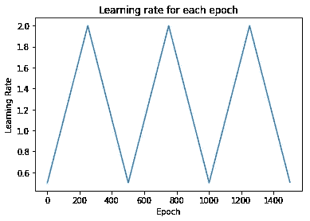**

## **3.4.4.如何防止过度拟合和偏差-方差权衡**

**拥有大量的特征和神经网络，我们需要确保防止过度拟合，并注意总损失。**

**我们使用几种技术来防止过度拟合(不仅在 LSTM，而且在 CNN 和自动编码器中):**

*   ****保证数据质量**。我们已经执行了统计检查，并确保数据不会出现多重共线性或序列自相关。此外，我们对每个特性进行了特性重要性检查。最后，初始特征选择(例如，选择相关资产、技术指标等。)是用一些关于股票市场运作方式背后的机制的领域知识完成的。**
*   ****正规化**(或加重处罚)。最广泛使用的两种正则化技术是套索(**【L1】**)和岭(**【L2】**)。L1 增加了平均绝对误差，L2 增加了损失的均方误差。在不涉及太多数学细节的情况下，基本区别是:套索回归(L1)进行变量选择和参数收缩，而岭回归只进行参数收缩，并最终包括模型中的所有系数。在存在相关变量的情况下，岭回归可能是首选。此外，岭回归在最小二乘估计具有较高方差的情况下效果最好。因此，这取决于我们的模型目标。这两种正规化的影响大不相同。虽然它们都不利于大的权重，但是 L1 正则化导致在零处的不可微函数。L2 正则化倾向于较小的权重，但是 L1 正则化倾向于趋于零的权重。因此，通过 L1 正则化，你可以得到一个稀疏模型——一个参数更少的模型。在两种情况下，L1 和 L2 正则化模型的参数“收缩”，但是在 L1 正则化的情况下，收缩直接影响模型的复杂性(参数的数量)。准确地说，岭回归在最小二乘估计具有较高方差的情况下效果最好。L1 对异常值更稳健，在数据稀疏时使用，并创建要素重要性。我们将使用 L1。**
*   ****辍学**。丢弃层随机删除隐藏层中的节点。**
*   ****密-疏-密训练**。— [链接](https://arxiv.org/pdf/1607.04381v1.pdf)**
*   ****提前停止**。**

**构建复杂神经网络时的另一个重要考虑是偏差-方差权衡。基本上，我们在训练网络时得到的误差是偏差、方差和不可约误差——σ(噪声和随机性引起的误差)的函数。最简单的权衡公式是:Error=bias^2+variance+σ.**

*   ****偏置**。偏差衡量一个经过训练(在训练数据集上)的算法对看不见的数据进行归纳的能力。高偏差(拟合不足)意味着模型不能很好地处理看不见的数据。**
*   ****差异**。方差衡量模型对数据集中变化的敏感度。高方差是过度拟合。**

# **3.5.鉴别器——一维 CNN**

## **4.5.1.为什么 CNN 是一个歧视者？**

**我们通常使用 CNN 进行与图像相关的工作(分类、上下文提取等)。他们非常擅长从特征中提取特征，等等。例如，在一幅狗的图像中，第一个卷积层将检测边缘，第二个卷积层将开始检测圆，第三个卷积层将检测鼻子。在我们的例子中，数据点形成小趋势，小趋势形成大趋势，趋势反过来形成模式。CNN 检测特征的能力可以用来提取关于 GS 股票价格运动模式的信息。**

**使用 CNN 的另一个原因是，CNN 在空间数据上工作得很好，这意味着相互靠近的数据点比分散的数据点更相关。这应该适用于时间序列数据。在我们的例子中，每个数据点(对于每个特征)都是连续的一天。人们很自然地认为，两天之间的距离越近，它们之间的关联就越大。需要考虑的一件事(虽然没有包括在本书中)是季节性以及它如何改变 CNN 的工作。**

****注意**:和本笔记本中的许多其他部分一样，使用 CNN 获取时间序列数据是实验性的。我们将检查结果，但不提供数学或其他证明。并且使用不同的数据、激活函数等，结果可能不同。**

## **3.5.1.CNN 架构**

**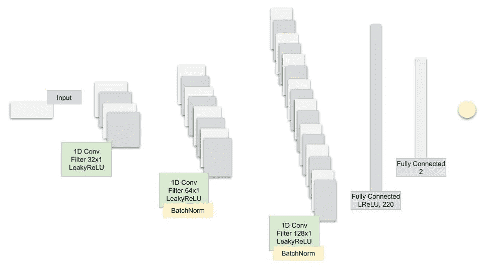**

**The architecture of the proposed CNN model.**

**不需要看完整的代码，我们只显示 MXNet 打印的 CNN。**

```
Sequential(
   (0): Conv1D(None -> 32, kernel_size=(5,), stride=(2,)) 
   (1): LeakyReLU(0.01) 
   (2): Conv1D(None -> 64, kernel_size=(5,), stride=(2,)) 
   (3): LeakyReLU(0.01) 
   (4): BatchNorm(axis=1, eps=1e-05, momentum=0.9, fix_gamma=False, use_global_stats=False, in_channels=None) 
   (5): Conv1D(None -> 128, kernel_size=(5,), stride=(2,)) 
   (6): LeakyReLU(0.01) 
   (7): BatchNorm(axis=1, eps=1e-05, momentum=0.9, fix_gamma=False, use_global_stats=False, in_channels=None) 
   (8): Dense(None -> 220, linear) 
   (9): BatchNorm(axis=1, eps=1e-05, momentum=0.9, fix_gamma=False, use_global_stats=False, in_channels=None) 
   (10): LeakyReLU(0.01) 
   (11): Dense(None -> 220, linear) 
   (12): Activation(relu) 
   (13): Dense(None -> 1, linear) 
)
```

# **3.6.超参数**

**我们将跟踪和优化的超参数有:**

*   **`batch_size`:LSTM 和 CNN 的批量**
*   **`cnn_lr`:CNN 的学习率**
*   **`strides`:CNN 的大步数**
*   **`lrelu_alpha`:GAN 中 LeakyReLU 的 alpha**
*   **`batchnorm_momentum`:CNN 批量正常化的势头**
*   **`padding`:CNN 中的填充**
*   **`kernel_size':1`:CNN 中的内核大小**
*   **`dropout`:LSTM 辍学**
*   **`filters`:过滤器的初始数量**

**我们将培训 200 多名`epochs`。**

# **4.超参数优化**

**在 GAN 在 200 个历元上训练之后，它将记录 MAE(这是 LSTM GG 中的误差函数),并将其作为奖励值传递给强化学习，强化学习将决定是否改变超参数，以保持用相同的超参数集训练。如后所述，这种方法严格用于 RL 实验。**

**如果 RL 决定它将更新超参数，它将调用贝叶斯优化(下面讨论)库，该库将给出超参数的下一个最佳预期集合**

# **4.1.超参数优化的强化学习**

**为什么我们在超参数优化中使用强化学习？股票市场一直在变化。即使我们设法训练我们的 GAN 和 LSTM 产生极其精确的结果，这些结果也可能只在一定时期内有效。也就是说，我们需要不断优化整个流程。为了优化流程，我们可以:**

*   **添加或删除功能(例如，添加可能相关的新股票或货币)**
*   **改进我们的深度学习模型。改进模型的最重要的方法之一是通过超参数(在第 5 节中列出)。一旦找到某个超参数集，我们需要决定何时改变它们，何时使用已知的超参数集(探索与开发)。此外，股票市场代表了一个依赖于数百万个参数的连续空间。**

****注**:本笔记本整个强化学习部分的目的更多的是研究导向。我们将使用 GAN 作为环境来探索不同的 RL 方法。有许多方法可以在不使用 RL 的情况下，成功地对我们的深度学习模型执行超参数优化。但是…为什么不呢。**

****注意**:接下来的几节假设你对 RL 有一些了解——尤其是政策方法和 Q-learning。**

## **4.1.1.强化学习理论**

**在不解释 RL 的基础知识的情况下，我们将跳转到我们在这里实现的具体方法的细节。我们将使用无模型 RL 算法，原因很明显，我们不知道整个环境，因此对于环境如何工作没有定义的模型——如果有，我们不需要预测股票价格的运动——它们只会遵循模型。我们将使用无模型强化学习的两个分支——策略优化和 Q 学习。**

*   ****Q-学习** —在 Q-学习中，我们学习从给定状态采取行动的**值**。 **Q 值**是采取行动后的预期收益。我们将使用 **Rainbow** ，它是七种 Q 学习算法的组合。**
*   ****策略优化** —在策略优化中，我们学习从给定状态采取的行动。(如果我们使用像演员/评论家这样的方法)我们也知道处于特定状态的价值。我们将使用**近似策略优化**。**

**构建 RL 算法的一个关键方面是准确设置奖励。它必须捕捉环境的所有方面以及代理与环境的交互。我们将奖励 ***R*** 定义为:**

**reward = 2∫lossG+lossD+accuracy g，**

**其中，lossG、accuracyG 和 lossD 分别是发生器的损耗和精度，以及鉴频器的损耗。环境是**甘**和**训练的结果。不同代理可以采取的行动是如何改变 GAN 的 D 和 G 网络的超参数。****

## ****4.1.1.1.彩虹****

******彩虹是什么？******

******Rainbow** ( [link](https://arxiv.org/pdf/1710.02298.pdf) )是一种基于 Q 学习的非策略深度强化学习算法，结合了七种算法:****

*   ******DQN** 。DQN 是 Q 学习算法的扩展，它使用神经网络来表示 Q 值。与监督(深度)学习类似，在 DQN，我们训练一个神经网络，并试图最小化损失函数。我们通过随机抽样转换(状态、动作、奖励)来训练网络。例如，这些层不仅可以是全连接的，也可以是卷积的。****
*   ******双 Q 学习**。双 QL 处理了 Q 学习中的一个大问题，即高估偏差。****
*   ******优先重放**。在传统的 DQN 中，所有的转换都存储在一个重放缓冲区中，并对该缓冲区进行统一采样。然而，在学习阶段，并非所有的过渡都同样有益(这也使得学习效率低下，因为需要更多的片段)。优先体验重放并不统一采样，而是使用一种分布，为在先前迭代中具有较高 Q 损失的样本提供较高的概率。****
*   ******决斗网络。**决斗网络通过使用两个独立的流(即具有两个不同的迷你神经网络)稍微改变了 Q 学习架构。一个流是价值流，一个流是优势流。两者共用一个卷积编码器。棘手的部分是流的合并——它使用了一种特殊的聚合器(*王等人 2016* )。****

*****(优点*，公式为 A(s，a)=Q(s，A)—V(s)，一般来说就是一个动作相对于特定状态下的平均动作有多好的比较。当一个“错误”的行为不能用负面奖励来惩罚时，优势有时会被使用。所以*优势*会尝试进一步奖励普通行为中的好行为。)****

*   ******多步学习。**多步学习背后的巨大差异是，它使用 N 步回报(不仅仅是下一步的回报)来计算 Q 值，这自然应该更准确。****
*   ******分布式 RL** 。Q 学习使用平均估计 Q 值作为目标值。然而，在许多情况下，不同情况下的 Q 值可能不相同。分布式 RL 可以直接学习(或近似)Q 值的分布，而不是平均它们。同样，数学比这复杂得多，但对我们来说，好处是对 Q 值的采样更准确。****
*   ******吵网**。基本 DQN 实现了一个简单的𝜀-greedy 机制来进行探索。这种探索方法有时效率很低。噪声网络解决这个问题的方法是添加一个噪声线性图层。随着时间的推移，网络将学会如何忽略噪声(作为噪声流添加)。但这种学习在空间的不同部分以不同的速度进行，从而允许状态探索。****

******注:敬请期待——我将于 2019 年 2 月初在 Rainbow 上上传一个 MXNet/Gluon 实现到 Github。******

## ****4.1.1.2.聚苯醚（Polyphenylene Oxide 的缩写）****

******近似策略优化** ( [PPO](https://arxiv.org/pdf/1707.06347.pdf) )是一种无策略优化模型类型的强化学习。实现其他算法要简单得多，并且给出非常好的结果。****

****我们为什么要用 PPO？PPO 的优势之一是直接学习策略，而不是通过值间接学习(Q 学习使用 Q 值学习策略的方式)。它可以在连续动作空间中很好地工作，这适用于我们的用例，并且可以学习(通过平均值和标准偏差)分布概率(如果 softmax 作为输出被添加)。****

****政策梯度方法的问题在于，它们对步长的选择极其敏感——如果步长很小，则进展需要很长时间(很可能主要是因为需要二阶导数矩阵)；如果它很大，就会有大量噪声，从而显著降低性能。由于政策的变化，输入数据是不稳定的(奖励和观察值的分布也会变化)。与监督学习相比，选择不当的步骤可能更具破坏性，因为它会影响下一次访问的整体分布。PPO 可以解决这些问题。此外，与其他一些方法相比，PPO:****

*   ****要简单得多，例如与 **ACER** 相比，ACER 需要额外的代码来保持偏离策略的相关性，还需要一个重放缓冲器，或者与 **TRPO** 相比，TRPO 对代理目标函数施加了约束(新旧策略之间的 KL 偏差)。此约束用于控制改变太多的策略，这可能会造成不稳定。PPO 通过利用(在[1- 𝜖，1+𝜖]之间)截取的*替代目标函数*并通过具有太大更新的惩罚来修改目标函数，来减少(由约束产生的)计算。****
*   ****与 TRPO 相比，与在价值和策略函数或辅助损失之间共享参数的算法兼容(尽管 PPO 也具有信赖域 PO 的增益)。****

******注意**:出于我们练习的目的，我们不会过多地研究和优化 RL 方法，包括 PPO 和其他方法。相反，我们将利用现有资源，并努力将其融入我们的超参数优化流程，用于我们的**甘**、**、**和 **CNN** 模型。我们将重用和定制的代码是由 OpenAI 创建的，可以在这里[获得](https://github.com/openai/baselines)。****

## ****4.1.2.关于强化学习的进一步工作****

****进一步探索强化学习的一些想法:****

*   ****接下来我要介绍的第一件事是使用**增强随机搜索** ( [链接](https://arxiv.org/pdf/1803.07055.pdf))作为替代算法。该算法的作者(来自加州大学伯克利分校)已经成功实现了与其他最先进的方法(如 PPO)类似的奖励结果，但平均速度快 15 倍。****
*   ****选择奖励函数非常重要。我在上面陈述了当前使用的奖励功能，但是我将尝试使用不同的功能作为替代。****
*   ****利用好奇号【T21 号】作为探索政策。****
*   ****按照柏克莱人工智能研究团队(BAIR)的提议，创建**多智能体**架构——[链接](https://bair.berkeley.edu/blog/2018/12/12/rllib/)。****

# ****4.2.贝叶斯优化****

****我们将使用**贝叶斯优化**，而不是花费大量时间寻找超参数的最佳组合的网格搜索。我们将使用的库已经实现了— [link](https://github.com/fmfn/BayesianOptimization) 。****

## ****4.2.1.高斯过程****

****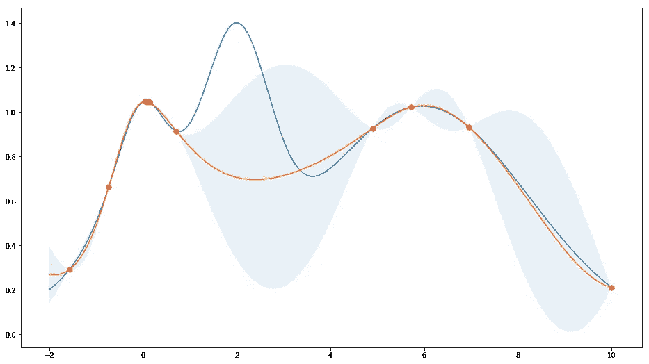****

****Gaussian process for Bayesian hyperparameter optimisation****

# ****5.结果呢****

****最后，我们将比较在过程的不同阶段后，将看不见的(测试)数据用作输入时 LSTM 的输出。****

1.  ****第一个纪元后的情节。****

```
**from utils import plot_predictionplot_prediction('Predicted and Real price - after first epoch.')**
```

****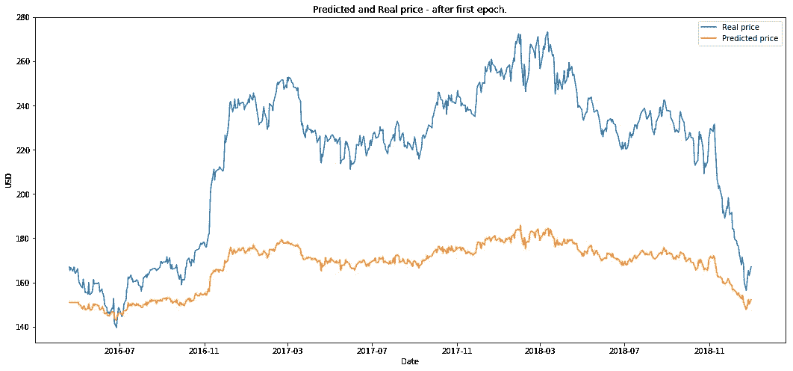****

****2.50 个时代后的情节。****

```
**plot_prediction('Predicted and Real price - after first 50 epochs.')**
```

****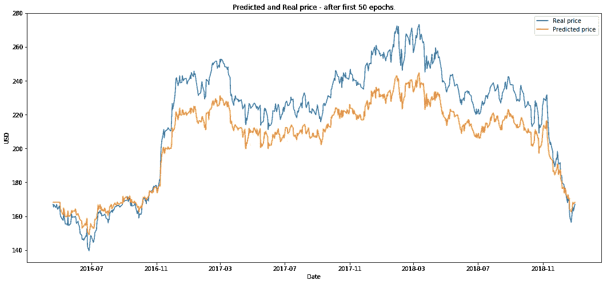****

```
**plot_prediction('Predicted and Real price - after first 200 epochs.')**
```

****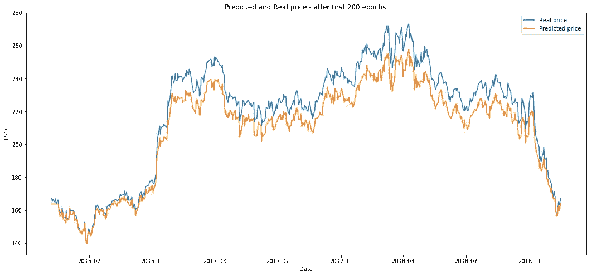****

****RL 运行 10 集(我们将一个时期定义为在 200 个时期上的一个完整的 GAN 训练。)****

```
**plot_prediction('Final result.')**
```

****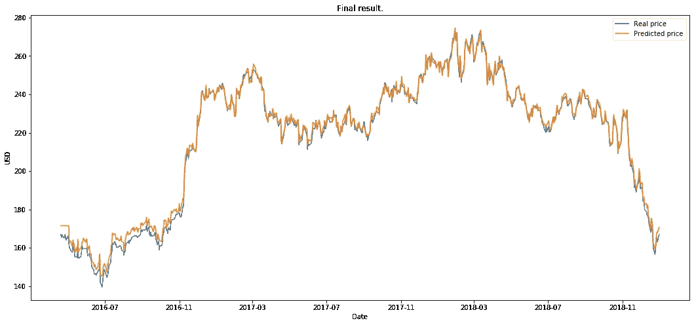****

## ****作为下一步，我将试着把每件事分开，并提供一些关于什么有效以及为什么有效的分析。为什么我们会得到这些结果，这仅仅是巧合吗？敬请关注。****

# ****6.下一步是什么？****

*   ****接下来，我将尝试创建一个 RL 环境，用于测试决定何时以及如何交易的交易算法。来自 GAN 的输出将是环境中的参数之一。****

# ****7.放弃****

****这本笔记本内容丰富。本笔记本中的任何内容都不构成任何特定证券、证券组合、交易或投资策略适合任何特定人士的建议。期货、股票和期权交易涉及大量的损失风险，并不适合每个投资者。期货、股票和期权的估值可能会波动，因此，客户的损失可能会超过其原始投资。****

******所有交易策略使用风险自担。******

****在选择数据特征、选择算法、调整算法等方面，还有更多细节需要探索。这个版本的笔记本本身花了我两个星期才完成。我确信这个过程中有许多未回答的部分。所以，任何意见和建议——请分享。我很乐意在当前流程中添加和测试任何想法。****

****感谢阅读。****

****最好的，鲍里斯****