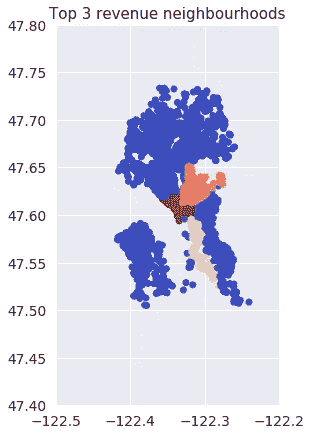

# 西雅图的 Airbnb 数据分析

> 原文：<https://towardsdatascience.com/airbnb-in-seattle-data-analysis-8222207579d7?source=collection_archive---------9----------------------->

## 了解西雅图的 Airbnb 租赁情况


Photo by [Sidekix Media](https://unsplash.com/@sidekix?utm_source=medium&utm_medium=referral) on [Unsplash](https://unsplash.com?utm_source=medium&utm_medium=referral)

对于所有西雅图的准 Airbnb 房东，我将在本文中回答这些问题:

*   何时租赁以实现收入最大化？
*   什么时候是维修的淡季？
*   西雅图旅行者的常见团队规模，是 2 人或家庭还是 4 人或更大？
*   最大化预订率的卧室配置？
*   如何达到一个好的评分？
*   收视率高的主机收入高吗？
*   包括哪些便利设施？

# 获取和准备数据

在本文中，我将对从 Airbnb 内部的[获取的 Airbnb 数据集执行探索性数据分析。](http://insideairbnb.com/)

## 获取列表数据

我们的数据将被加载到 [pandas](https://pandas.pydata.org/) 中，逗号分隔值(CSV)文件可以通过`read_csv`函数轻松加载到 DataFrame 中。

让我们看看使用`pd_listings.head(10)`的前 10 行是什么样子的:

并用`pd_listings.describe()`查看数字数据的汇总:

观察结果:

*   此数据集中有 3813 个列表
*   *价格*列中的值包含美元符号($)
*   列*浴室*、*卧室*和*床*中有缺失值
*   在*评论评级*列中有缺失值(评论分数评级、评论分数准确性、评论分数清洁度、评论分数签入、评论分数交流、评论分数位置、评论分数值)

## 数据准备

*价格栏*，这是清单的价格，它包含美元符号($)。我们仍然不能使用它进行分析，因为它不是一个数值，所以我们删除了美元符号，并将值转换为数值:

```
pd_listings['price'] = pd_listings['price'].str.replace("[$, ]", "").astype("float")
```

然后用零替换这些空值:

```
pd_listings.at[pd_listings['bathrooms'].isnull(), 'bathrooms'] = 0
pd_listings.at[pd_listings['bedrooms'].isnull(), 'bedrooms'] = 0
pd_listings.at[pd_listings['beds'].isnull(), 'beds'] = 0pd_listings.at[pd_listings['review_scores_rating'].isnull(), 'review_scores_rating'] = 0
pd_listings.at[pd_listings['review_scores_accuracy'].isnull(), 'review_scores_accuracy'] = 0
pd_listings.at[pd_listings['review_scores_cleanliness'].isnull(), 'review_scores_cleanliness'] = 0
pd_listings.at[pd_listings['review_scores_checkin'].isnull(), 'review_scores_checkin'] = 0
pd_listings.at[pd_listings['review_scores_communication'].isnull(), 'review_scores_communication'] = 0
pd_listings.at[pd_listings['review_scores_location'].isnull(), 'review_scores_location'] = 0
pd_listings.at[pd_listings['review_scores_value'].isnull(), 'review_scores_value'] = 0
```

最后，将 id 重命名为 listing_id:

```
pd_listings.rename(columns={'id':'listing_id'}, inplace=True)
```

## 获取评论数据

让我们加载另一个 CSV 文件，其中包含每个列表的评论。数据帧包含以下各列:

*   id —审核的标识号
*   listing _ id——列表的标识号，我们可以将它与上面的数据帧连接起来
*   日期—审核的日期

## 计算每个列表的预计收入

我认为每一次点评都是一次成功的预订，客人住了几晚。不幸的是，我们不知道每位客人入住的确切天数，但我们可以使用列表中的`minimum_nights`，假设每位客人至少入住了最少的天数。对于每次点评，`price` * `minimum_nights`获得每次预订的收入:

```
pd_bookings = pd.merge(pd_reviews, pd_listings, on='listing_id')
pd_bookings['estimated_revenue'] = pd_bookings['price'] * pd_bookings['minimum_nights']
```

将每个列表的每次预订的收入合计为每个列表的预计收入:

```
pd_listings_revenue = pd_bookings[['listing_id','estimated_revenue']].groupby(['listing_id']).sum()
```

并将预计收入合并到现有数据框架中(列表):

```
pd_listings = pd.merge(pd_listings, pd_listings_revenue, on='listing_id', how='left')pd_listings.at[pd_listings['estimated_revenue'].isnull(), 'estimated_revenue'] = 0
```

我们已经为一些分析准备好了数据框架。每行代表一个列表、其属性及其估计收入:

# 开始分析

## 按街区划分的收入

下表显示了每个街区的平均收入:



市中心、国会山和灯塔山的 Airbnb 房产可以获得最高的收入。是购物和 CBD 区。


> 市中心、国会山和比肯山的收入最高

## 一年中的热门时期出租？

了解西雅图一年中最受欢迎的租赁时间会很有用，这样 Airbnb 的主人就能够决定何时租赁以及何时进行维护。


七月、八月和九月是收入最大化的最佳时期。五月前的几个月是维修工作的最佳时间。从 10 月到 12 月是休息和享受假期的好时间，如果他们想的话。

> 七月、八月和九月是收入最大化的最佳时期。

## 最高收入列表

以下是估计收入最高的前 5 个列表:

哇！看起来我们的最高收入者是最低夜数为 1000 的主持人。但这可能是数据异常，因为 1000 晚有点极端，所以让我们看看不同 *minimum_nights* 的列表的比例。(谢谢，[辜莞允·乌马西](https://medium.com/u/ffe82dfe6db7?source=post_page-----8222207579d7--------------------------------)强调了这一点！)

大多数主机有最少一个月的夜数，有 1000 夜的主机，必须过滤掉。

这些是预计收入最高的顶级主机(最少 7 晚)。

这些是预计收入最高的顶级酒店(最少 4 晚)。

从这两张表中可以看出，最短住宿时间越长，收入越高。我们来看看*最低夜数*和*预计收入*之间的相关性。

以及*最低夜数*与*去除 1000 最低夜数的房源后预计收入*的相关性。

拥有 1000 个最低夜数的主机已经导致偏向更高的最低夜数，导致更高的收入，在*最低夜数*和*收入*之间有 87%的相关性。但是在移除该主机之后，最低住宿和估计收入并不高度相关，*最低住宿*和*收入*之间的相关性为 20%。

> 最低住宿天数和预计收入并不高度相关


Photo by [Kelcie Gene Papp](https://unsplash.com/@saltedhoney?utm_source=medium&utm_medium=referral) on [Unsplash](https://unsplash.com?utm_source=medium&utm_medium=referral)

## 供求——卧室配置

作为一个 Airbnb 的房东，知道我的房产在市场上是否过饱和会很好。找出不同卧室配置的房源数量(供应)与预订数量(需求)之间的比率:

> 少于 2 间卧室的房源很受欢迎。

但是等等！没有卧室的房产，这是什么样的房产？

这些房产的床位数是多少？

所有这些没有卧室的房产都出租了整个公寓，而且他们至少提供了一张床。唷~

## 供应和需求——游客群体配置

作为一个 Airbnb 的主持人，我也很想知道西雅图访客的常见群体规模。从而发现我的物业配置在市场上是否过饱和。

可容纳 14 人的地方排名第一(最高供需比)，但与容纳 2 或 3 人的地方相比，预订数量很低(只有 83 个预订)。

> 为 2 或 3 个人租一个地方会给主人带来相当不错的固定租金。


Photo by [Priscilla Du Preez](https://unsplash.com/@priscilladupreez?utm_source=medium&utm_medium=referral) on [Unsplash](https://unsplash.com?utm_source=medium&utm_medium=referral)

## 供应和需求—2 至 3 人的卧室配置

因此，让我们把重点放在 2 到 3 人的租赁物业上，因为超过一半的人会在这种规模的团队中旅行。这些客人喜欢一间卧室还是两间独立的卧室？

适用于 2 人的 Airbnb 卧室配置:

适用于 3 个人的 Airbnb 卧室配置:

> 大多数人喜欢一间卧室。

大多数人喜欢一居室，不到 1%的人喜欢两居室。所以对于 2 人或 3 人的群体，他们更喜欢 1 间卧室。但这可能是由于目前 2 居室房产的供应量很低。


Photo by [Christopher Jolly](https://unsplash.com/@chris_jolly?utm_source=medium&utm_medium=referral) on [Unsplash](https://unsplash.com?utm_source=medium&utm_medium=referral)

## 哪些因素很重要？

有好的收视率对 Airbnb 的主持人来说很重要。让我们比较不同因素如何影响总体评分:


> 良好的沟通会影响整体评分和入住率

*沟通*与*总体*评分的相关性最高。西雅图(也许其他地方也一样)的主人需要反应灵敏、友好，因为良好的*沟通*往往会获得较高的*总体评价*。良好的*沟通*也直接影响*签到*评分。

拥有良好的*总体*评级是否意味着上市将带来丰厚的财富？


拥有良好的*总体*评级与预计收入的正相关性非常小。而且有好的收视率对主持人定的价格几乎没有影响。

但是，强烈建议您获得良好的*总体*评分。

## 舒适

这是西雅图提供这些便利设施的机场数量:

> 互联网、暖气和厨房是西雅图的必需品。

烟雾探测器？我刚刚了解到，自 1973 年以来，华盛顿州建筑法规要求所有住宅安装烟雾探测器。

# 摘要

所以，下面是这篇文章的摘要:


# 笔记本

查看本文中使用的代码！

[](/data-scientist-the-dirtiest-job-of-the-21st-century-7f0c8215e845) [## 数据科学家:21 世纪最肮脏的工作

### 40%的吸尘器，40%的看门人，20%的算命师。

towardsdatascience.com](/data-scientist-the-dirtiest-job-of-the-21st-century-7f0c8215e845) 

嗨！，我是叮当。我喜欢构建机器学习项目/产品，我在[走向数据科学](https://towardsdatascience.com/@jinglesnote)上写了它们。在[媒体](https://medium.com/@jinglesnote)上关注我或者在 [LinkedIn](https://www.linkedin.com/in/jingles/) 上联系我。

[](https://towardsdatascience.com/@jinglesnote)[](https://jingles.substack.com/subscribe)