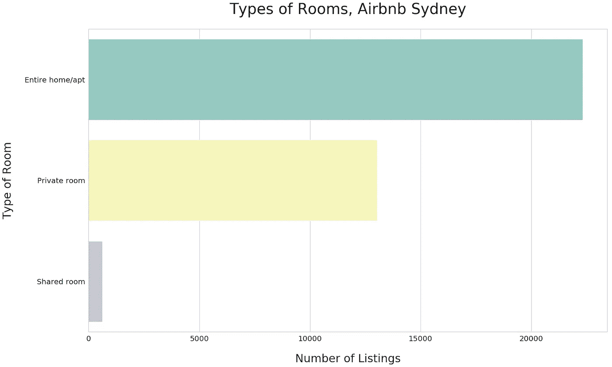

# 悉尼的 Airbnb

> 原文：<https://towardsdatascience.com/airbnb-in-sydney-an-exploratory-data-analysis-ec91334e4780?source=collection_archive---------33----------------------->

## 用 Python 进行探索性数据分析

Photo by [Holger Link](https://unsplash.com/@photoholgic?utm_source=medium&utm_medium=referral) on [Unsplash](https://unsplash.com?utm_source=medium&utm_medium=referral)

## 介绍

这是我作为一名有抱负的数据科学家提高技能时写的第一篇文章，我希望以后会有很多文章。

我在寻找一个有趣的数据集，它符合几个条件。

*   是完整的，需要有限的转换或清理
*   提供了学习一些基本 python 包和在地图上可视化数据的机会
*   与我住的地方相关，这意味着我可以提供一些专业知识

代码可以在我的 Kaggle 笔记本[这里](https://www.kaggle.com/adityasswami/airbnb-sydney-an-exploratory-data-analysis/notebook)找到。

## **数据和灵感**

我在 Insideairbnb.com 的[上找到了数据，这是一套独立的、非商业的工具和数据，用来探索 Airbnb 在世界各地的城市中的实际使用情况。](http://insideairbnb.com/about.html)

Sarang Gupta 和他的团队对纽约市 Airbnb 数据集进行了极其彻底的分析，这给了我灵感和指导。

## **Airbnb 的增长**

2009 年 2 月 22 日，悉尼的第一套出租房屋挂牌出售。这是亚历山大附近的整个公寓。**在接下来的十年里，Airbnb 已经发展到超过 35，900 个房源。**

虽然这种增长是显著的，但有明显的迹象表明**在放缓**。 **2015 年似乎是悉尼平台的高水位。从那以后，每年增加的房源越来越少，这似乎是一个稳步下降的趋势。**

**2019 年**的数据并不完整，但如果趋势可以预测的话，我预计 Airbnb 将经历其**迄今为止最糟糕的一年**，并在上市数量增长方面达到 2013 年之前的水平。

也许悉尼的供应已经接近 Airbnb 的顶峰。

## **列表类型**

Airbnb 以其不同寻常的租房体验而闻名。在数据中，我找到了一个谷仓、一个蒙古包、一个帐篷和一个洞穴的租金。然而，这是个例外，悉尼的大多数房源都要主流得多。

超过 26，000 份房源是针对**整个住宅/公寓**的，占可用租金的三分之二。其中**14000**房源为**整栋**房源。**包间**约占**13000**房源。从下面的图表可以看出，合租房间在悉尼并不常见。

## **热门街区**

房源大多在**悉尼 CBD** 及周边地区(9500+)，其次是**东郊**(8000+)，以及**北部海滩** (5000+)。

Photo by [Simon Rae](https://unsplash.com/@simonrae?utm_source=medium&utm_medium=referral) on [Unsplash](https://unsplash.com?utm_source=medium&utm_medium=referral)

房源最多的街区是**邦迪海滩(1600+)** 紧随其后的是**曼利(1500+)** 。

这并不特别令人惊讶。大多数房源都位于悉尼顶级景点所在的街区，或者靠近中央商务区。

## **承受能力**

旅行者被 Airbnb 吸引的原因之一是其实惠的价格。悉尼的平均租金是 202 美元一整套公寓，485 美元一整套房子。

在价格方面，数据中有一些异常值，所以我把剩下的分析集中在房源最多的街区(前 20 名)。

这将数据集减少到大约 15，500 个列表。我发现这个子集更有助于衡量支付能力，因为它与悉尼最受欢迎的街区有关。

雷德费恩和纽敦等市中心街区提供了最实惠的住宿选择。然而，当你靠近中央商务区或海滩时，平均。房价上涨了不少。

乍一看，这些价格似乎并不比酒店便宜。我在谷歌上快速搜索了一下，找到了从每晚 89 美元到 200 美元不等的预算选项。

Airbnb 真的比酒店便宜那么多吗？我不完全相信。

## **体验**

Airbnb 长期以来一直在推这种像当地人一样体验城市的形象。这个想法是，你的主人可以作为你在这个城市的向导，这是酒店或旅行社无法做到的。原则上，我相信这个理论，所以想看看客人对他们的租赁有什么看法。

Photo by [Rose Lamond](https://unsplash.com/@roselamond?utm_source=medium&utm_medium=referral) on [Unsplash](https://unsplash.com?utm_source=medium&utm_medium=referral)

他们快乐吗？他们如何评价他们住的酒店？

对数据的初步浏览显示，大多数客人通常对他们的租赁非常满意。分数高达 90 多分，对我来说，这表明审查过程中存在一些固有的偏见。

也许客人会因为留下平庸或负面的评价而感到“内疚”。以我的经验来看，酒店评论倾向于更少偏见，更具代表性。我想知道 Airbnb 是否正在考虑如何克服他们的评论数据中似乎存在的固有偏见。

我不认为这很容易。毕竟，想要有礼貌是人之常情。

## **人气**

Airbnb 不会公开披露预订数据。然而，Airbnb 的“旧金山模式”中的**使用了如下修改后的方法:**

*   **50% 的**审核率用于将**审核**转换为**预计预订。******

**我用同样的方法来估算预订量。**

**在一个非常高的水平上，我们可以估计需求已经大幅增长，预订数量几乎比去年同期翻了一番。在 **2018** 中，平台上预计**有 40 万份预订**。**

****

## ****入住****

**我想知道随着上市数量的增加，这个平台有多受欢迎。我还想估计需求方面的潜在增长机会。**

**我将评论数据和列表数据结合起来，做出了以下假设。**

*   ****每年每家酒店可入住 365 晚**。我承认这是一个大胆的假设，但它是估算入住率的一种简便方法。**
*   ****根据 **2** 的规定，每次预订的最低住宿天数**。我选择中值来消除数据中的异常值。**
*   **每次预订的**客人数**为 **1** 。我再次选择中值，因为它对数据中的异常值更有弹性。**

**快速浏览一下，我们可以观察到占用率每年翻一番，这代表了一个确定需求或平台在旅行者中受欢迎程度的代理。**

****

**然而，似乎有一个明显的机会来提高的入住率。至少目前，供应似乎超过了需求。**

**客观地看，悉尼在 2018 年接待了近**1480 万**游客，其中只有 **3%** 选择住在 Airbnb。**

## ****关闭思路****

**自成立以来，Airbnb 迅速颠覆了旅游业。毫无疑问，它是当今世界上最有价值的私有公司之一。**

**在悉尼，似乎至少在目前，供应已经达到某种平稳状态，该平台每年增加的新房源越来越少。**

**另一方面，需求继续以狂热的速度增长，没有显示出任何放缓的迹象。**

**随着悉尼预计在 2019 年接待超过 1500 万游客，机会在于说服这些游客以他们的酒店房间换取像当地人一样生活的机会。**