# 西雅图 AirBnB 房源:更深入的观察

> 原文：<https://towardsdatascience.com/airbnb-listings-in-seattle-a-deeper-look-4fc4dad3e34e?source=collection_archive---------10----------------------->

Source: [Wikimedia](https://commons.wikimedia.org/wiki/File:Airbnb.png)

AirBnB 彻底改变了人们寻找住宿的方式。它让人们向游客敞开家门，住在比老一套单调的旅馆有趣得多的地方。

在本文中，我们将分析西雅图的 AirBnB 房源。这个数据是 AirBnB 发布的，发布在 [Kaggle](https://www.kaggle.com/airbnb/seattle) 上。分析的 AirBnB 西雅图数据集由 3 部分组成:

1.  列表及其详细信息
2.  每天的可用性信息
3.  每个列表的评论

在浏览数据集后，我发现了 3 个真正引起我兴趣的问题。我想更深入地研究数据集，以了解同样的情况。

执行下面总结的所有分析的代码托管在 [Github](https://github.com/karthikvijayakumar/Kaggle/tree/master/AirBnB_Seattle) 上。

**提问**

1.  通常什么时候有房源
    答:是只有周末有房源，还是整个星期都有房源？一年中的几个月是否有明显的季节性？
    这个问题的灵感来自于 [Josh Bernhard 的博客对西雅图和波士顿 Airbnb dat](https://medium.com/@josh_2774/a-comparison-of-airbnb-homes-seattle-vs-boston-cdc0df2cfcd7) a 的分析
2.  房源可以出租几天以上。他们可以租一个星期甚至一个月！租房一周或一个月的典型折扣是多少？
3.  西雅图有多个社区。我们能观察到它们之间的一些变化吗？大部分房源集中在哪里？
    2。街区之间的价格分布是否存在偏差？
    3。某些社区的房源通常比其他社区更容易获得吗？

**问题 1:列表可用性**

1.a 房源通常只在周末或一周中的特定日子提供吗？

当我们使用星期几透视可用性数据时，我们得到以下结果:

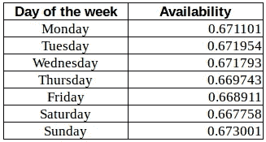

我们看到，至少在西雅图，一周中的每一天几乎没有变化。

事实上，如果我们要分析邻居级别的可用性/一周中的某一天，同样适用。没有一个邻域显示出一周中的任何一天有任何变化。

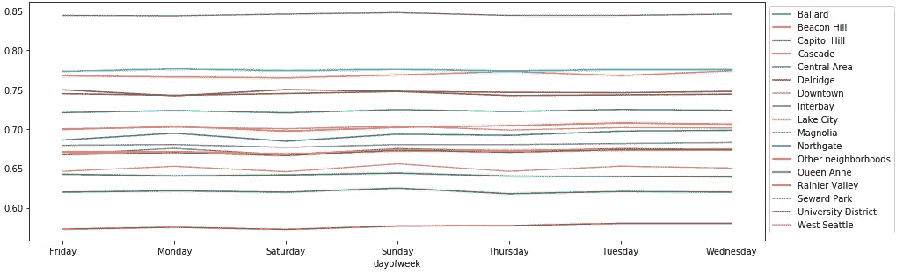

Avg availability/day of the week for different neighborhoods in Seattle

1.b 一年中的几个月是否有明显的季节性？

当我们取西雅图每个月的列表的平均可用性时，我们得到如下结果

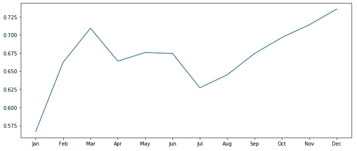

Average monthly availability for listings in Seattle

这个挺有意思的。这里有三个主要观察结果:

1.  接近年底时达到峰值
    一个可能的解释是，接近年底时，更多的人会去度假，更高的需求反映在更高的可用性上
2.  一月份的大幅下降
    这一次非常有趣，尤其是因为 2 月份的供应量反弹至接近其他月份的水平。我猜在年底的高峰期过后，人们会利用这段时间来重新进货、修复、升级等等。
3.  七月和八月
    西雅图以多雨闻名。七月和八月是西雅图一年中最干燥和最温暖的月份。我相信这可能意味着更多的人倾向于在这两个月去城外度假。较低的需求可能导致可用性下降，列表所有者可以利用这段时间对其列表进行升级或修复等。

**问题二**:租房一周或一个月的典型折扣是多少？

在查看周租或月租的折扣之前，你必须记住，并不是所有的房源都允许出租这么长的时间。事实上，只有大约 50%的房源列出了周租金，只有大约 40%的房源列出了月租金。

每周和每月折扣的分布如下

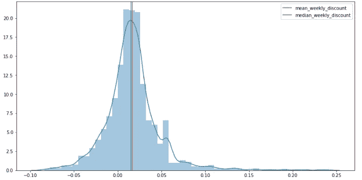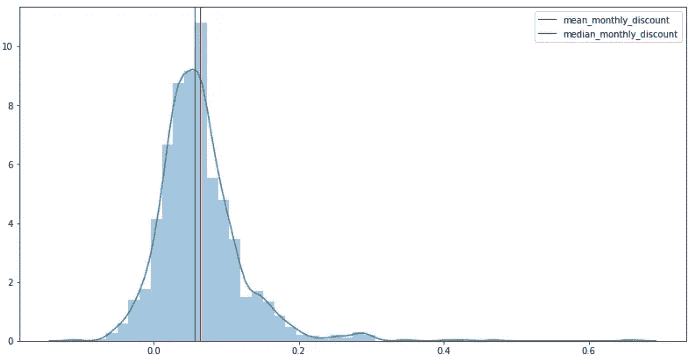

Distribution of weekly and monthly discounts across Seattle

从上面的图表中突出的第一件事是，每周和每月的折扣可以是负数！

人们通常根本不会想到这一点。对负折扣的一个合理解释是，维持一个设施一周或一个月可能需要更多的努力。再次必须记住，只有少数上市提供周租或月租。

现在让我们来看看一些数字

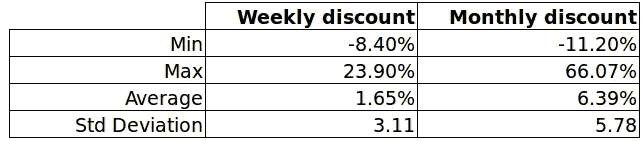

Weekly and monthly discount statistics

上面的一些观察结果:

1.  平均每周折扣远低于每月折扣，这是可以理解的。人们会认为月租的折扣比周租的折扣高。
2.  周折扣和月折扣差异很大
    月折扣可高达 66%！！而且周折扣可以高达~24%。从负面来看，两者都可能接近-10%

**问题 3** :西雅图不同社区的差异

3.a 大多数房源集中在哪里

数据集中提供了两个属性来指示列表的位置。一个是邻里，一个是邻里团体。后者将城市分成 17 个区，而前者将城市分成 87 个区。这里我们使用邻居组属性来查看列表在城市中的分布情况。展望未来，我们将会交替使用邻域和邻域组。

每个邻域组中的列表数量如下:

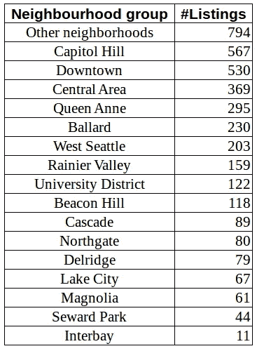

为了了解这些地区的位置，让我们参考西雅图市政府办公室的西雅图地图

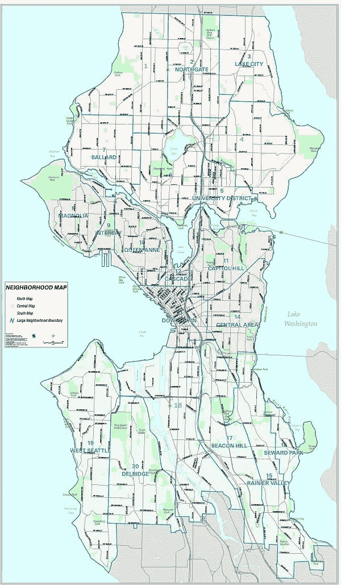

Seattle city map. Source: [Office of the city clerk, Seattle](http://clerk.ci.seattle.wa.us/~public/nmaps/fullcity.htm)

不包括“其他社区”，排名前五的社区中有四个位于西雅图市中心。在某种程度上，这似乎很自然。离市中心越近，人口密度越大，商业空间越集中。这两种情况都可能意味着该地区对房源的需求更大，因此房源数量也会更多。

3.b 不同社区的价格分布是否存在偏差？

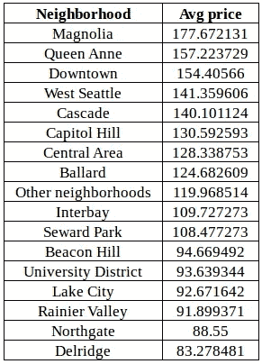

让我们来看看西雅图各个社区的平均房价

我们还是能看到西雅图市中心的地方定价高了一点，这又是蛮期待的。通常情况下，越靠近市中心，房地产价格和生活成本越高，这在数据中有所反映。

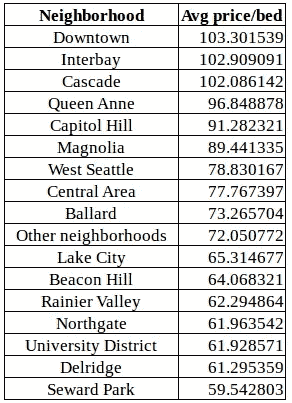

Avg price/bed for listings in different neighborhoods in Seattle

然而，这种分析在某一方面并不公平。将 3 张床的价格与单人床的价格进行比较是不公平的。虽然很难创建一个完美的指标来考虑所有这些因素，但让我们从价格/床位开始

让我们计算一下价格/床位，看看它的分布如何。和我们之前看到的类似吗？

当按价格和价格/床位比较社区时，前 5 个社区中有 3 个重叠。此外，西雅图中部仍然显示在顶部。因此，人们可以说价格和价格/床位在不同的社区遵循相同的模式。如果将上述分析扩展到价格/卧室，就会看到类似的结果。

3.c 某些社区的房源比其他社区的房源更多吗？

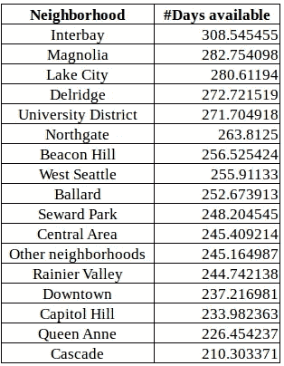

Avg num days available per neighborhood

如果我们计算每一个街区的可用房源的平均天数，我们会得到左边的数据。

可用性最低的 5 个地区中有 4 个位于西雅图市中心。

这里可以形成 3 个不同的桶:

高可用性:> 260
中可用性:240–260
低可用性:< 240

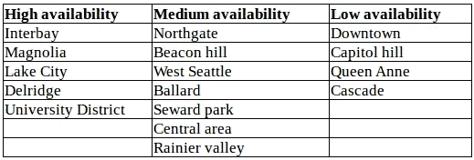

可以观察到低可用性存储桶的所有成员都来自西雅图中部。

注:以上列表不包括“其他社区”

**结论**

在这篇文章中，我们查看了来自西雅图的 AirBnB 数据。特别是，我们分析了 3 个方面——可用性模式、每周/每月折扣和邻近地区的变化。

我们注意到每个方面都有许多有趣的模式，有些我们能够解释，有些需要更多的分析才能更好地理解。高层次的要点是:

1.  西雅图的房源在年底达到高峰，在 1 月、7 月和 8 月跌至低谷。它们在工作日和周末同样可用。
2.  租赁一周或一个月的房源会有一些折扣，但差异很大，甚至可能是负数。
3.  大多数房源都集中在西雅图市中心。那里的价格最高，可用性也最低。

这个数据集非常有趣，让人不禁要问几个问题。未来分析的一些问题包括:

1.  影响房子定价的主要因素是什么？
2.  人们对西雅图的房源写什么样的评论？