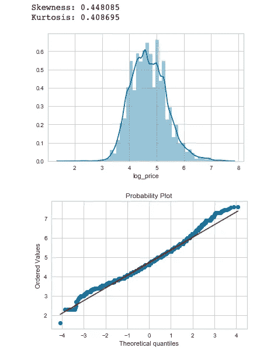
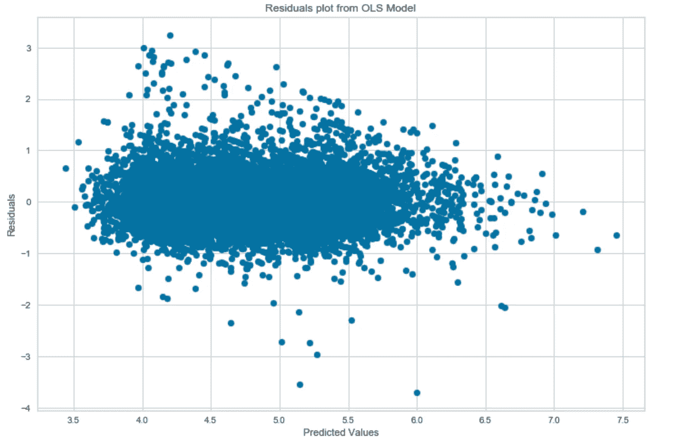
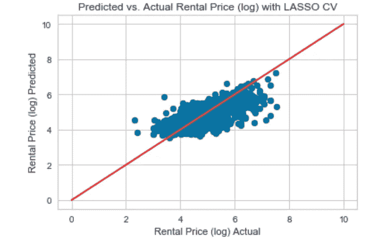
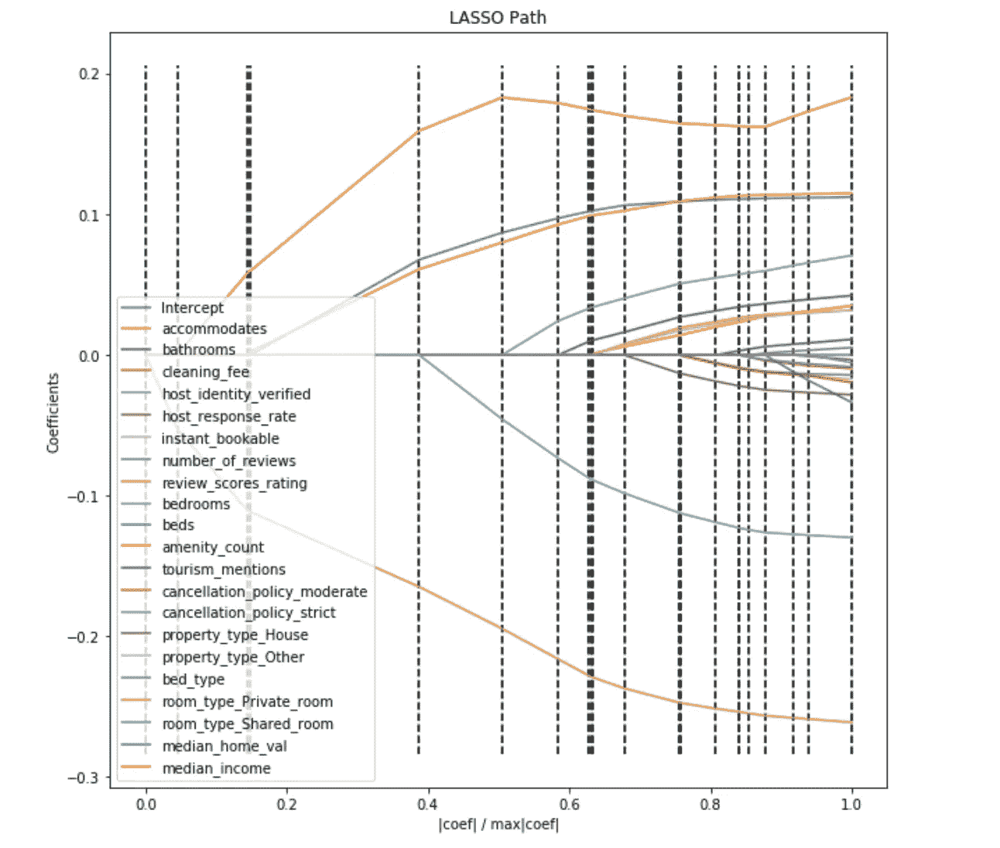

# 使用线性回归(Scikit-Learn 和 StatsModels)进行 Airbnb 价格预测

> 原文：<https://towardsdatascience.com/airbnb-price-prediction-using-linear-regression-scikit-learn-and-statsmodels-6e1fc2bd51a6?source=collection_archive---------6----------------------->

## Airbnb 的租赁价格是由什么决定的？床位数？允许的客人数量？复习分数？取消政策？

这个问题的答案提供了有趣的见解，可以使寻求利润最大化的主机受益。为了更深入地探究影响 Airbnb 租赁价格的可能因素，我用 Python *中的 Scikit-Learn 和 StatsModels 使用了各种线性回归模型。*在这篇文章中，我将重点介绍我用来回答这个问题的方法，以及我如何利用两个流行的线性回归模型。

**主要问题:**什么预测 Airbnb 租房价格？

**数据:**约 74k Airbnb 租房的 Kaggle 数据集。该数据集包括许多功能，如:床位数、允许的客人数、描述、评论数等等。有关特性和数据的更详细预览，请参见数据集[此处](https://www.kaggle.com/stevezhenghp/airbnb-price-prediction)。

**方法/模型:**这个问题属于回归和预测的范畴，所以使用了线性回归模型。我使用 StatsModels 生成一个起点普通最小二乘模型，使用 Scikit-Learn 生成一个 LassoCV 模型。

# 步骤 0:思考问题和数据集

在一头扎进数据和产生大的相关矩阵之前，我总是试图思考这个问题并对特征有一个感觉。我为什么要做这个分析？目标是什么？特征和目标变量之间的关系有什么意义？

# **步骤 0:导入包**

```
# Import packages
import pandas as pd
import patsy
import statsmodels.api as sm
import statsmodels.formula.api as smf
import statsmodels.api as sm
from statsmodels.stats.outliers_influence import variance_inflation_factor
from sklearn.preprocessing import StandardScaler, PolynomialFeatures
from sklearn.model_selection import train_test_split
from sklearn.linear_model import lars_path
from sklearn.linear_model import LinearRegression, Lasso, LassoCV
from sklearn.metrics import r2_score
import scipy.stats as stats# Visualization
import seaborn as sns
import matplotlib.pyplot as plt
%matplotlib inline
```

# 步骤 1:探索性数据分析和熊猫模型准备

下面是一些我经常采取的一般数据清理和 EDA 步骤。我没有包括一些更细微的数据集特定步骤。

*   我从 pd.describe()和 pd.info()开始，了解丢失了哪些数据以及每个特性的值
*   清理了包含空格的功能名称
*   将一些功能与许多类别相结合。例如，“property_type”有 25 个不同的类别(这是使用 pd.value_counts()检查的)。我把最低的 23 个组合成了“其他”类别。这也是在其他一些特性上完成的。这很有帮助，因为我没有从虚拟代码中创建 20+个新列。
*   删除分布非常不均匀或不会被使用的功能。比如‘host _ has _ profile _ pic’有 32k 个“是”，只有 97 个“否”。这在模型中没有用。
*   缺失数据的进一步检查。对于我认为重要的特征(例如“点评分数评级”)，我用中间值填充。注意-这里的插值可能比用中值填充更微妙。例如，我可以用他们自己的中间值填充租赁的每个子类(公寓、房子、其他)。
*   检查与 pandas (pd.corr())和 Seaborn heatmap 的视觉相关性:特征和结果之间，以及特征本身之间。

```
model_df.corr() # Whole correlation matrix
model_df.corr()['log_price'] # Check correlations with outcome onlysns.heatmap(model_df.corr(), cmap="seismic", annot=True, vmin=-1, vmax=1);
```

*   各种分类变量的虚拟代码(如“取消 _ 政策”、“财产 _ 类型”)。确保设置 drop_first=True，以便不包括引用列。注意-如果特征是分类的，但只有两个选项(例如“男性”、“女性”)，则不需要手动生成虚拟代码，只需确保它是一个整数(0，1)。

```
# Example dummy coding for 'cancellation_policy'
model_df = pd.get_dummies(model_df, columns=['cancellation_policy'], drop_first=True)
```

*   确保目标变量(' log_price ')是:正态分布，峰度和偏度是正态的。

```
sns.distplot(model_df['log_price'], kde=True,);
fig = plt.figure()
res = stats.probplot(model_df['log_price'], plot=plt)
print("Skewness: %f" % model_df['log_price'].skew())
print("Kurtosis: %f" % model_df['log_price'].kurt())
```



# 步骤 2:在 StatsModels 中运行 OLS，并检查线性回归假设

StatsModels 中的 OLS 模型将为我们提供最简单的(非正则化)线性回归模型，作为我们未来模型的基础。从简单开始，然后增加复杂性总是好的。此外，它还提供了一个很好的汇总表，很容易理解。这是检查线性回归假设的好地方。

*   用 [Patsy](https://patsy.readthedocs.io/en/latest/quickstart.html) 创建特征矩阵。Patsy 很好，因为它用简单的 *R* 语法创建了我们的模型。默认情况下，它还会在您的模型中添加一个截距(如果您不使用 Patsy，请确保手动添加一个截距)。
*   训练/测试分割数据。80%将用于培训，20%将用于测试(稍后将详细说明为什么没有验证拆分)。
*   运行 OLS 模型，检查汇总表。

## 要从 OLS 摘要表中检查的关键指标:

*   *R Adjusted* :告诉你模型中的预测者解释了你的结果(租赁价格)的多少差异。
*   对数似然:这个模型在新数据上表现相同的可能性有多大。您希望这个数字接近于零(很可能是负数)。
*   *P 值*:检查每个变量。低于 0.05 是标准阈值，让您了解哪些对模型有显著影响。
*   *德宾-沃森*:有自相关吗？这应该是两点左右。
*   也可以查看*综合*和*条件号*以获得模型质量的整体感觉。

## **获取方差膨胀因子(VIFs)**

*   *Vif*不是从上面的 OLS 表中产生的，因此您应该手动提取它们。
*   它们是检查模型中多重共线性的好方法。多重共线性是指要素之间高度相关。线性回归假设您的数据没有多重共线性，因此请确保检查这一点。你希望你的波动率指数低于 4。

```
# Check for VIFs of each feature, then save to its own DF
vif_census = pd.DataFrame()
vif_census[“VIF Factor”] = [variance_inflation_factor(X_census.values, i) for i in range(X.shape[1])]
vif_census[“features”] = X_census.columns
```

## **检查模型的残差**

*   线性回归的另一个假设是残差是正态分布的。你可以很容易地用图来验证这一点。在下图中，你可以看到有一些传播(特别是左上)，但残差大多落在中线附近。

```
# Use statsmodels to plot the residuals vs the fitted values
plt.figure(figsize=(12,8))
plt.scatter(fit_census.predict(), fit_census.resid); # print resids vs predictions
plt.title("Residuals plot from OLS Model")
plt.xlabel("Predicted Values")
plt.ylabel("Residuals")
plt.savefig('LR_Residual_Plot')
```



# 第三步:**拉索夫**

接下来，我使用正则化线性回归模型。这些类型的模型对变量施加惩罚，并有助于降低模型的复杂性。正则化有助于偏差-方差权衡，并有助于模型对新的测试数据更具普遍性。参见[这篇文章](/regularization-in-machine-learning-76441ddcf99a#targetText=Regularization,linear%20regression%20looks%20like%20this.)对正规化的一个很好的概述。

*   由于正则化模型惩罚变量，我们需要将它们标准化，这样它们都以相同的比率被惩罚。这是通过对数据应用标准定标器来实现的。把标准化想象成把所有的特性放在同一个平面上，并给它们一个 *z* 的分数。

```
# Standard scale the datastd = StandardScaler()
std.fit(X_train_census.values) # only std.fit on train set
X_tr_census = std.transform(X_train_census.values)
X_te_census = std.transform(X_test_census.values)
```

**型号类型快速说明**

*   现在我们准备运行我们的正则化模型。我们是要用套索，脊，弹力网，还是三者都用？我只在这里使用套索，不会去详细说明，但套索和山脊惩罚变量/系数不同，所以每个可以用来获得不同的见解。简而言之，Lasso 惩罚了一些系数，以至于它们变为零并被排除在模型之外。这基本上是一个自动的特征选择。Ridge 通过“缩小”系数和“抹黑”它们的影响来惩罚系数。当您希望平稳地处理多重共线性时，岭是很好的选择。ElasticNet 本质上是两者的结合。Scikit-learn 的网站上有关于所有这些的很好的文档。这三者的代码本质上是相同的。

# 步骤 3a:拉索夫

*   我使用 CV 版本的 Lasso，因为它们有内置的交叉验证。这意味着您不必在新的数据集上手动验证，而是由 CV 模型为您进行训练和交叉验证。注意前面(训练-测试分割代码)我只做了 80-20 分割——没有留出验证数据，而是将整个 80 用于训练和验证。
*   我喜欢先运行 LassoCV，因为它固有的特性选择。从具有 0.0 beta 系数的模型中得出的特征可能不是强特征，并且可以在以后被移除。

```
# Run the cross validation, find the best alpha, refit the model on all the data with that alphaalphavec = 10**np.linspace(-2,2,200)
lasso_model_census = LassoCV(alphas = alphavec, cv=5)
lasso_model_census.fit(X_tr_census, y_train_census)
```

*   在上面的代码中，我做了三件事:1)创建一个将放入 CV 模型的 alpha 数组 2)使用设置为步骤 1 的 alpha 数组的 alpha 参数初始化模型，并设置五重交叉验证 3)拟合训练数据。
*   在这一步之后，我们可以检查每个特性的 beta 系数，以及访问关于模型的一些重要信息。

**关于模型比较指标的简要说明**

*   有几种方法可以比较回归模型，但这里我用的是 R 和平均绝对误差(MAE)。r 是我们用模型计算的结果变量的方差的度量。MAE 是我们模型中平均误差量的度量。这很容易解释，也是一个很好的分享指标。例如，在我预测 Airbnb 租赁价格的模型中，如果我的 MAE 是($)20，那么在进行预测时，我可以说我的模型误差了大约 20 美元。

```
# Print feature name zipped with its beta
lasso_betas = list(zip(X_train_census.columns,
lasso_model_census.coef_))# R2 of Training set
lasso_model_census.score(X_tr_census,y_train_census)
```

如果满意，运行测试数据的时间。如果没有，就回去做一些特色工程。如果你满意，以下步骤。

```
# Predict model on test data
y_census_pred = lasso_model_census.predict(X_te_census)# R2 of test set using this model
r2_score(y_test_census, y_census_pred)#Mean Absolute Error (MAE)
def mae(y_true, y_pred):
    return np.mean(np.abs(y_pred - y_true))mae(y_test_census, y_census_pred)# Plot
plt.scatter(y_test_census, y_census_pred)
plt.plot([0,10],[0,10],color='red')
plt.grid(True)
plt.title('Predicted vs. Actual Rental Price (log) with LASSO CV')
plt.ylabel('Rental Price (log) Predicted')
plt.xlabel('Rental Price (log) Actual');
```



*   这里我们可以看到，我们的模型是体面的，有一些低于性能时，租金价格高。这可能是因为在这个范围内没有太多的。

**使用 LARS 路径确定哪些功能最重要**

*   LARS path 是一个很好的工具，可以用来查看 LassoCV 模型中哪些特性最重要/最不重要。简单来说，在下图中，首先从零(正或负)变化的特征是最重要的，最后变成非零的特征是最不重要的。也就是说，出现在左边的特征是最重要的。这也反映在这些特征的β系数中。

```
print("Computing regularization path using the LARS ...")
alphas, _, coefs = lars_path(X_tr_census, y_train_census, method='lasso')# # plotting the LARS path
xx = np.sum(np.abs(coefs.T), axis=1)
xx /= xx[-1]
plt.figure(figsize=(10,10))
plt.plot(xx, coefs.T)
ymin, ymax = plt.ylim()
plt.vlines(xx, ymin, ymax, linestyle='dashed')
plt.xlabel('|coef| / max|coef|')
plt.ylabel('Coefficients')
plt.title('LASSO Path')
plt.axis('tight')
plt.legend(X_train_census.columns)
plt.show()
```



概括地说，这里我介绍了我喜欢在数据探索和清理中采取的一些基本步骤(还有更多的事情可以做，参见[这篇文章](/a-gentle-introduction-to-exploratory-data-analysis-f11d843b8184)以获得更详细的 EDA 技巧)。此外，我运行了一个简单的 OLS 回归和一个正则化套索模型。在这些步骤之后，人们可以运行 RidgeCV 和/或 ElasticNetCV 并比较模型。

感谢您的阅读，如果有我需要补充的地方，请告诉我。