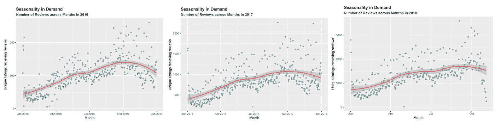
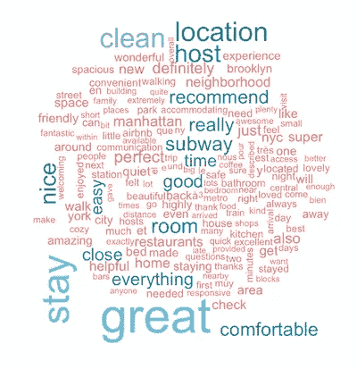

# Airbnb 租赁房源数据集挖掘

> 原文：<https://towardsdatascience.com/airbnb-rental-listings-dataset-mining-f972ed08ddec?source=collection_archive---------2----------------------->

## 对 Airbnb 数据的探索性分析，以了解纽约市的租赁情况

自 2008 年成立以来，Airbnb 经历了飞速发展，其网站上的租赁数量每年都呈指数级增长。Airbnb 成功地颠覆了传统的酒店行业，因为越来越多的旅行者，不仅是那些希望物有所值的旅行者，还有商务旅行者，都将 Airbnb 作为他们的首选住宿提供商。

纽约市一直是 Airbnb 最热门的市场之一，截至 2018 年 11 月，已有超过 52，000 个房源。这意味着每平方公里有 40 多所房屋被出租。在纽约的 Airbnb 上！人们或许可以将 Airbnb 在纽约的成功归因于酒店收取的高额费用，这主要是由该市过高的租金价格推动的。

在本帖中，我将对来自 Airbnb 网站内 [**的 Airbnb 数据集进行探索性分析，通过各种静态和交互式可视化来了解纽约市的租房情况。**](http://insideairbnb.com/get-the-data.html)

分析已经用 r 做了，源代码可以在我的 Github 上找到:[https://github.com/saranggupta94/airbnb](https://github.com/saranggupta94/airbnb)

# 数据描述

数据集由三个主表组成:

*   `listings` -显示每个列表的 96 个属性的详细列表数据。分析中使用的一些属性有`price`(连续)、`longitude`(连续)、`latitude`(连续)、`listing_type`(分类)、`is_superhost`(分类)、`neighbourhood`(分类)、`ratings`(连续)等等。
*   `reviews` -嘉宾给出的 6 个属性的详细评价。关键属性包括`date`(日期时间)`listing_id`(离散型)`reviewer_id`(离散型)`comment`(文本型)。
*   `calendar` -通过列表提供下一年的预订详情。共有四个属性，包括`listing_id`(离散型)`date`(日期型)`available`(分类型)`price`(连续型)。

快速浏览一下数据可以发现:

*   纽约市共有 50，968 个唯一列表。2008 年 4 月，纽约曼哈顿哈莱姆区的第一次租金上涨。
*   从那时起，客人们已经写了超过 100 万条评论。
*   房源的价格从每晚 10 美元到 10，000 美元不等。)每晚。标价为 10，000 美元的列表位于布鲁克林的绿点；阿斯托利亚，皇后区和曼哈顿上西区。

# Airbnb 在纽约的迅速崛起

Airbnb 的成功取决于其广泛的主机网络，以及使用其服务寻找度假租赁的客人数量。纽约市在这两个方面都出现了指数级增长——独特房源的数量和在 Airbnb 上预订住宿的游客数量。

下面的动画展示了 2008 年至 2018 年 Airbnb 在该市的主机网络增长情况。正如你所观察到的，这个城市所有行政区的房源数量都在快速增长，如杂乱的蓝点所示。

Number of Airbnb listings over the years

2008 年，Airbnb 在纽约的第一个上市地点是在哈莱姆区，此后的增长一直呈指数级。头几年增加了大约 600 处房产，大部分在曼哈顿和布鲁克林。曼哈顿市中心和布鲁克林附近的区域一直都有很多 Airbnb。自那以后，上市公司的数量每年大约翻一番。到 2015 年，曼哈顿的每个街区都有多个房源。有趣的是，布朗克斯区的房源非常少，以至于在动画中可以看到曼哈顿-布朗克斯区的边界，因为房源的突然减少。自 2016 年以来，Airbnb 房源已经扩散到斯塔滕岛的部分地区。预计到 2020 年将有 7 万套房产，这应该不远了。

我无法获得这些年来在 Airbnb 上预订的数量数据。相反，我用“评论数量”来代表 Airbnb 的租赁需求。根据该公司的说法，大约 50%的客人会评论主机/列表，因此研究评论的数量将会给我们一个很好的需求估计。

与主机数量类似，接受评论的独特房源数量多年来稳步增长，表明对 Airbnb 租赁的需求呈指数级增长。

要获得所有列表的详细视图，请查看下面我设计的交互式 [RShiny](https://ankitpeshin.shinyapps.io/listings/) 应用程序，它允许用户根据各种参数过滤列表。下面是 RShiny 应用的截图。你可以通过链接试试实际的应用程序:【https://ankitpeshin.shinyapps.io/listings/ (抱歉，加载需要几秒钟)

Airbnb Property Finder: RShiny app

# 位置，位置，位置！:了解纽约的房地产市场

Airbnb 用户根据位置、清洁度和一系列其他参数对他们的住宿进行评级。在这里，我处理位置得分数据。查看每个街区的平均位置得分会很有趣。位置得分必须是该社区吸引力的坚实指标。高评级的社区往往具有更好的连接性(地铁站)，往往更靠近城市热点(时代广场、帝国大厦、华尔街)。

曼哈顿在市中心地区(尤其是中央公园以下)获得了最高的位置分数。在斯塔滕岛，靠近州立公园的区域位置得分最高。靠近曼哈顿的布鲁克林区往往有更高的位置评级。观察布鲁克林的纽约地铁系统，有趣的是观察到高度评价的区域与地铁线路的存在相对应。地铁线不去的布朗克斯也是如此。

上市成本在很大程度上与位置得分一致。高评级的位置也往往是最昂贵的。很明显，高评级的位置也往往是昂贵的(需求与供应)

然而，有趣的是发现一些异常值:I)。*寻找高评级-低租金区域(两全其美)*:斯塔滕岛的州立公园区域(上图中讨论过)就是这样一个区域，尽管其位置评级最高，但租金往往相当低。另一个这样的好去处位于布鲁克林的东北部。ii)。*寻找低评级-高租金地区(两个世界中最糟糕的)*:斯塔滕岛的榆树公园地区租金高得不成比例，但位置得分非常低。在靠近北布朗克斯区的地方可以找到其他这样的地方。

现在让我们探索一下纽约市的房源类型。下图显示了各区不同列表类型的分布情况。

除了斯塔滕岛，公寓风格的房源在所有四个街区都是最多的。斯塔滕岛的“房子”式房产多于“公寓”。这似乎很直观，因为斯塔滕岛人口稀少，因此与其他行政区相比有更多的“空间”。

# 一切都是为了钱:分析需求和定价

在这一部分，我将对 Airbnb 租赁进行需求和价格分析。我将观察自 2008 年 Airbnb 成立以来的几年以及一年中几个月的需求，以了解季节性。

如前所述，由于预订数据不可用，我将使用评论数量作为 Airbnb 租赁需求的代理。根据 Airbnb 声称 50%的客人会对他们的住宿进行评论，假设评论的数量与租赁需求相对应。此外，客人必须在入住两周内提供点评，因此点评的数量可以很好地估计特定时期的需求。

通过“Airbnb 有多受欢迎？”之前显示的图表(为了便于参考，我在下面再次提供了它)，可以观察到评论/需求数量的季节性模式。每年都有需求的高峰和下降，表明某些月份比其他月份更忙。

从更细的层面来看，需求在 1 月份最低，并在 10 月份增长，然后开始下降，直到年底。

租房价格有季节性吗？让我们看看历年来的每日平均价格。

随着一年时间的推移，各上市公司的平均价格往往会上升，并在 12 月达到峰值。除了 11 月和 12 月的审查数量(表示需求)开始下降之外，该模式与审查/需求数量的模式相似。

我们还可以在图表上看到两组点，这些点描述了某些日子的平均价格比其他日子高。下面，我将绘制一个一周中各天平均价格的箱线图来理解这一现象。

正如我们所见，周五和周六比一周中的其他日子更贵，可能是因为住宿需求更高。

我将通过研究明年的入住情况来结束对这一部分的分析。使用表`calendar`中的数据，我将找出下一年的入住率，即截至 2018 年 11 月 3 日(收集数据的日期)，已预订房源的百分比。我无法获得过去的入住率数据，因此无法研究实际入住率。

可以推断，一月往往是最安静的，随着一年的进展，入住率也在增加。这与对审查数量(表明需求)的分析结果密切相关，该结果显示了全年的增长趋势。

# 进入顾客的头脑:分析顾客评论

数据集为我们提供了大量的数据，但没有什么比他们的评论/反馈更有见地、更贴近客户。如果挖掘得当，它们可以告诉我们很多关于客户心态、他们的期望以及这些期望的满足程度。为了使最终结果有意义，评论文本数据需要大量的清理，例如，需要对单词进行词干处理，需要删除逗号-句号-百分比等，需要删除常见的英语单词和停用词等。有一百多万条评论，所以我对这些数据进行了随机抽样，在这个例子中是大约 30k 条评论。

对“云”这个词的分析显示了有趣的趋势；位置似乎是关键，因为单词“邻居”、“位置”、“区域”在单词“云”中非常突出。像“地铁”、“步行”这样的交通方式也经常被提及。Airbnbs 是短期租赁，然而人们似乎强调他们住宿的舒适性，像“厨房”这样的词告诉我们，许多人宁愿做饭也不愿出去吃饭。附近的餐馆也可以找到。浴室和床，正如预期的那样，如果不是处于最佳状态，显然会成为交易的破坏者。“主机”一词被多次提及；表明了主人在塑造 Airbnb 体验中扮演的重要角色。

单词向量提供了一种有效的方法来找出与特定搜索项最接近的单词。使用评论数据，我构建了一个向量空间来构建相似单词的单词云，以获得有趣的见解。

第一个字云是为了“难受”这个字。类似于“不舒服”的词通常是那些经常与它连用的词，即不舒服的原因。“云”这个词正好说明了这一点——注意像“拥挤”、“拥挤”、“小”、“闷”和“杂乱”这样的词表明缺乏空间是最常见的抱怨之一。“热”、“潮湿”和“冷”是一些常见的温度问题。“满是灰尘”、“肮脏”、“不干净”的环境会促使人们写下负面反馈。很多感觉“紧张”、“不安全”、“压力大”；对于未来的租户来说，这显然是一个危险信号。

类似地，通过关键字“舒适”查询，我们希望看到导致积极体验的事情。突出的特点是像“安静”、“可步行”、“干净”、“一尘不染”等词，再次证明了环境、位置和清洁的重要性。有益的“主人”和“交流”会让你感到舒适。床单的干净程度和床的大小会给人留下决定性的印象。

看看这个闪亮的应用程序，它是对客户评论的词向量分析的扩展。你可以查询向量来找到“相似”的单词，并建立一个自定义的单词云。输入任何有效的查询词，并在词云中设置“最大字数”。一个有效的查询词应该出现在语料库中，否则它就不是词向量的一部分。

下面是一个截图，你可以通过链接试试实际的应用:[https://ankitpeshin.shinyapps.io/wordcloud_generator/](https://ankitpeshin.shinyapps.io/wordcloud_generator/)(允许它一些时间来加载)。

# 拥有超能力的主持人！:分析如何成为超级主持人

Airbnb 将“超级房东”的称号授予一小部分可靠的房东。这是一个激励计划，对房东、Airbnb 和他们的客户都是双赢的。superhost 通过更高的预订量获得了更多业务，客户获得了更好的服务，Airbnb 获得了满意的客户。

但是怎样才能成为超级主持人呢？Airbnb 的网站有一套必须满足的要求，以便成为一个。保持 50%以上的审核率，90%以上的回复率等。我们的发现，虽然大部分符合 Airbnb 的指导方针，但也显示出一些有趣的异常值。虽然大多数超级主机都处于高评级:高响应率区域，但我们也可以看到少数主机的响应率低于 75%(这违反了 Airbnb 设定的 90%+标准)。这只是很小一部分主机。收视率方面，几乎所有主持人的评分都在 80%及以上。

也就是说，大多数 Airbnb 主机位于高评级:高响应区域，但只有一小部分成为超级主机。所以很明显，成为超级主播需要的不仅仅是高收视率和高回复率。

总的来说，Airbnb 在纽约市出现了惊人的增长。上述分析强调了数据中的几个趋势，以概述 Airbnb 的市场。Airbnb 内部保存了全球其他几个主要城市的类似数据，我相信比较这些城市之间的模式和趋势会非常有趣。

在我的 Github 上检查源代码:【https://github.com/saranggupta94/airbnb 

*我目前正在纽约州的哥伦比亚大学攻读数据科学硕士学位。这个项目是作为探索性数据分析和可视化课程的一部分完成的。特别感谢 Ankit Peshin 和 Ankita Agrawal 的贡献。*

*欢迎在*[*http://www.columbia.edu/~sg3637/*](http://www.columbia.edu/~sg3637/)*查看我的其他项目，或者在 saranggupta94@gmail.com*给我留言