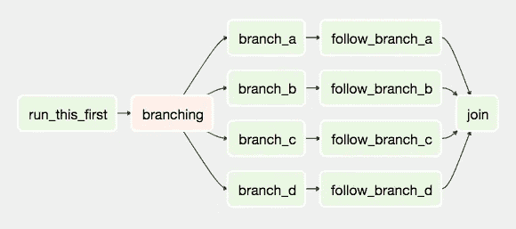

# 气流来编排您的机器学习算法

> 原文：<https://towardsdatascience.com/airflow-for-orchestrate-your-machine-learning-algorithms-805702fc40c9?source=collection_archive---------22----------------------->

作为数据工程师，一个巨大的挑战是管理、安排和运行工作流程，以准备数据、生成报告和运行算法。这篇文章的范围是用一个简单的例子为这些活动提出一个可能的、快速实现的解决方案。

管理和安排数据分析工作流的方式有很多种，但比较常见的有:

*   cron 作业，直接在操作系统上。
*   詹金斯。

这两种情况都不能很好地适应作业的规模:如果一个作业在工作流的某个阶段失败了，那么您的工作流就需要从头开始。如果你想创建一个更好的数据管道，有一个简单易学的界面和许多有用的功能，你需要使用像 Apache Airflow 这样的计算 orchestrator。

Airflow 是计算协调器，因为如果你能为它写一个工作流，你就能管理每一种操作。这意味着您可以使用 airflow 将工作流创作为任务的有向无环图(Dag)。

Airflow 由两个元素组成:webserver 和 scheduler。

Webserver 运行用户界面，可视化生产中运行的管道，监控进度，并在需要时解决问题。airflow scheduler 在遵循指定依赖关系的同时，对一组工作线程执行您的任务。丰富的命令行实用程序使在 Dag 上执行复杂的手术变得轻而易举。

我认为气流最重要的特征是工作流被定义为代码！通过这种方式，它们变得更易于维护、版本化、可测试和协作。有了 Airflow，您可以随心所欲地安排管线组合。DAG 是使用代码而不是 GUI 工具创建的。

但是什么是 DAG 呢？DAG(有向无环图)是您想要运行的所有任务的集合，以反映它们的关系和依赖性的方式组织。让我举一个例子:一个简单的 DAG 可以包含三个任务:A、B 和 C。它可以说 A 必须在 B 可以运行之前成功运行，但是 C 可以在任何时候运行。它可以说任务 A 在 5 分钟后超时，B 在失败的情况下最多可以重启 5 次。它还可能会说工作流将在每晚 10 点运行，但不应该在某个特定日期之前开始。这样，DAG 描述了*你想要如何*执行你的工作流；但是请注意，我们还没有提到*我们实际上想做什么*！a，B，C 可能是任何东西。也许 A 准备数据给 B 分析，而 C 发邮件。

*DAG example [http://michal.karzynski.pl]*

Dag 是用 python 编写的，所以如果 B 是一个像 DBSCAN 这样的聚类算法，它对 A 阶段准备的数据进行聚类，那么您可以使用任何有助于完成这项任务的机器学习库(例如 Scikit-learn)。Airflow 实现了 python 操作符(以及更多)来运行定义的 python 函数，我认为这对于轻松实现机器学习工作流非常有用，正如我们在这个例子中看到的:K-Means 的 scikit-learn 演示对手写数字数据进行聚类。

你可以在这里找到所有代码。在此回购中，我们需要运行以下示例:

*   带有 Scikit-learn 库的气流 docker 文件
*   docker-compose 设置环境
*   DAG 调度 k-means 算法的例子。

在下面的代码中，我们可以看到运行 scikit-learn k-means 示例的 DAG。

正如我们所见，设置非常简单，气流界面非常清晰，易于学习。

**结论**

我认为 airflow 是一个非常强大且易于使用的工具，它能够真正快速地研究 ML 算法的生产过程。有了 docker 和 docker-compose，环境的设置变得非常容易和可重复，并且可以与团队中的所有数据科学家共享。这样，数据科学家可以在自己的笔记本电脑上运行模型，就像模型在生产环境中运行一样。你不觉得很酷吗？

*原载于 2019 年 3 月 31 日*[*devklaus.wordpress.com*](https://devklaus.wordpress.com/2019/03/31/airflow-for-orchestrate-your-machine-learning-algorithms/)*。*