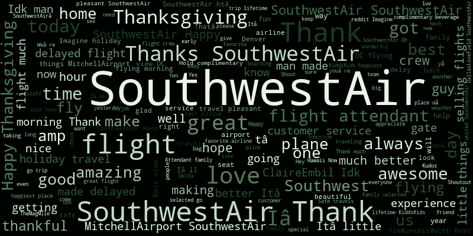
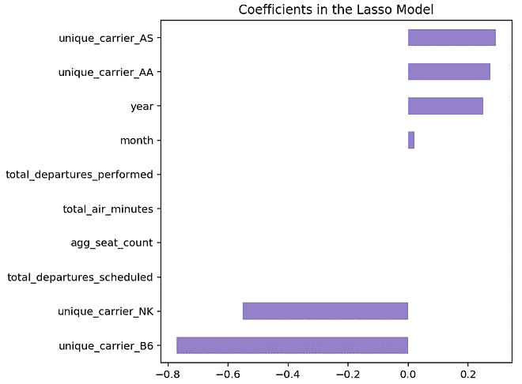
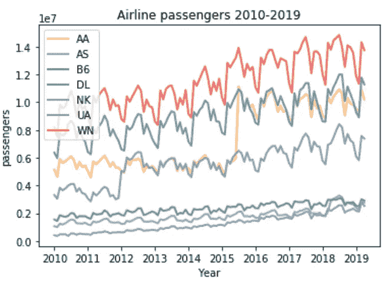
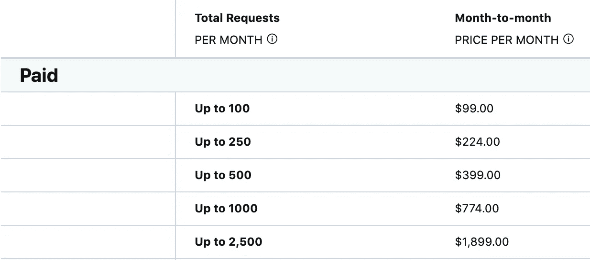
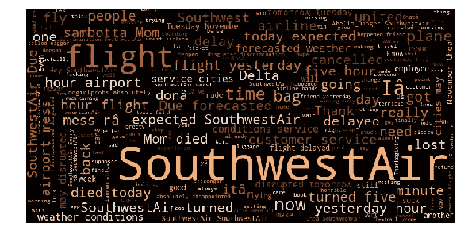
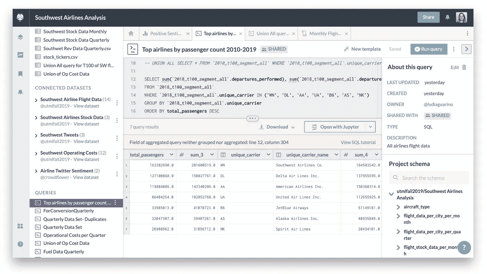
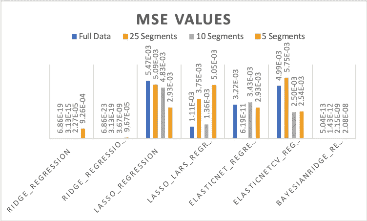
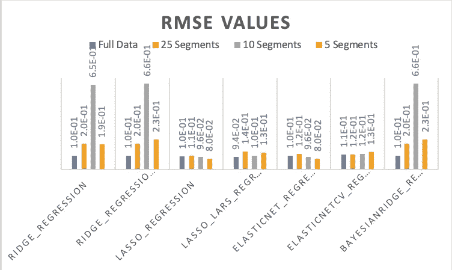
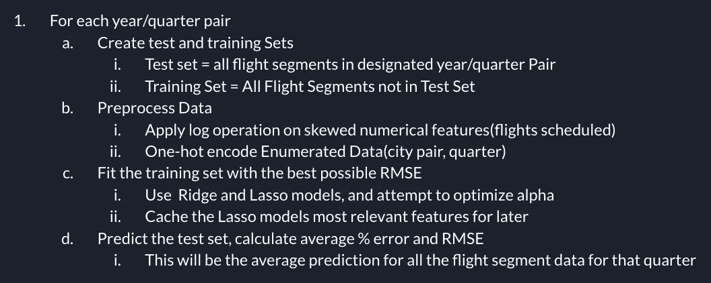
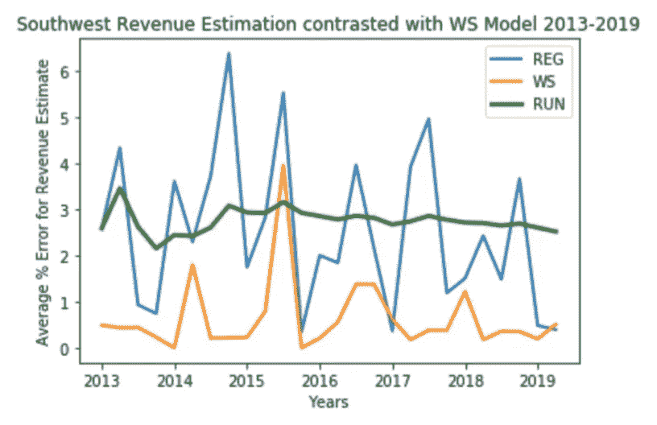

# 航空公司收入预测

> 原文：<https://towardsdatascience.com/airline-revenue-prediction-fb128343bcd6?source=collection_archive---------13----------------------->

## 一个心碎的故事，发现，以及我们如何几乎击败华尔街的收入共识。

Hey, look, that NLP tweet analysis WAS good for something.

## 背景

这个项目是由亚历克斯·霍根森、T2、戴尔·佩津斯基和 T4 在亚历克斯·迪马基斯教授的指导下完成的，是德克萨斯大学的一门介绍性 ML 课程的一部分。我们的数据集和分析可以在 [**data.world**](https://data.world/utmlfall2019/southwest-airlines-analysis) 和 [**github**](https://github.com/dpedz-tech/utscalablemlfall2019) 上找到。在这篇文章中，我们链接到了相关的代码和数据集。

## 介绍

美国运输统计局**提供大量航空数据供公众下载。我们的团队受到这些丰富的航班统计数据的启发，并对使用公开可用的数据来预测个别航空公司的一些有价值的东西的应用感到好奇。我们从以下问题着手:**

> **我们能否利用公共航空数据创建一个机器学习模型来预测航空公司的股票价格或收入？**

# **该项目**

**为了回答这个问题，我们做了 4 个实验。两次失败，两次成功。在估算季度收入时，我们表现最好的实验产生的平均百分比误差仅为 2.5%，与华尔街的收入预测一致。将 WS 投影作为一个特征应用的进一步改进甚至进一步降低了平均百分比误差，达到 0.95%。下面，我们将逐一介绍这些实验的细节。**

## **实验 1——失败:线性回归股票价格预测**

**我们从 2010-2019 年间 7 家主要航空公司的[航班统计数据](https://data.world/utmlfall2019/southwest-airline-flight-data/workspace/file?filename=monthly_flight_stock_fuel_summary_7_airlines.csv)开始。我们的假设是，像客流量这样的航班统计数据可以用来代表需求。我们添加了燃料支出统计作为每月运营费用的代理，最后[为每个航空公司汇编了每月库存数据](https://data.world/utmlfall2019/southwest-airlines-analysis/workspace/file?filename=Monthly+Flight+Stock+and+Fuel+Data.ipynb)，用于监督线性回归模型。**

************

**Feature coefficient analysis showed that there was little correlation between our features and stock price.**

**虽然这个练习在探索工具、练习数据操作和提升 matplotlib 技能方面很有价值，但很快就发现我们的特征和股票价格之间没有足够的相关性。航班统计似乎不太适合股票价格预测，股票价格预测深深植根于人类心理。**

## **实验 2——失败:情感分析**

**从股票价格可能与市场情绪有更好的相关性这一想法出发，我们决定探索是否可以通过对涉及特定航空公司的推文进行 NLP 情绪分析来预测股票拐点。一些初步研究表明，在推特语料库上进行的情感分析已经被用于[的几项学术](http://eprints.lincoln.ac.uk/11274/1/ASONAM%202012.pdf) [研究](https://dalspace.library.dal.ca/bitstream/handle/10222/56328/Wan-Yun-MEC-ECMM-March-2015.pdf?sequence=3)中，以预测股票行为。为了集中我们的研究，我们选择深入研究一家航空公司——西南航空公司。我们做出这一选择是基于他们的中等股票价格，也因为他们拥有美国最大的波音 737 Max 喷气式飞机机队。我们急切地想知道，对这些飞机安全性的负面情绪是否会对股价产生影响。**

**这个实验似乎很有希望。在搜索发现了一个包含 2015 年 2 月关于航空公司的推文的[全标签情感数据集](https://data.world/crowdflower/airline-twitter-sentiment)用作验证数据集后，我们注册了一个 twitter 开发者账户(等待一天的批准)，并使用 [Tweepy api](http://docs.tweepy.org/en/latest/api.html) 获得了关于西南航空公司的最新推文。**

****

**问题:众所周知，Twitter 对他们提供的没有高价的数据非常吝啬(我们说的是每月数百美元)。虽然工具很容易使用，但我们最终只能获得前 10 天的[条推文，总共大约 7000 条推文。这对](https://data.world/utmlfall2019/southwest-tweets/workspace/file?filename=southwest_tweets.csv)[进行情绪分析](https://data.world/utmlfall2019/southwest-tweets)来说已经足够了，然而，10 天的时间序列对于建立股票价格预测模型来说太小了。**

**我们决定使用我们获得的数据来测试 [AWS 领悟 API](https://aws.amazon.com/comprehend/) ，并为这篇博文生成一些甜蜜的[情感词云](https://data.world/utmlfall2019/southwest-tweets/workspace/file?filename=Southwest+Airlines+Tweet+Analysis-Copy1.ipynb)图形。**

************

**Negative, neutral, and positive sentiment extracted from Southwest Airline tweets. The “parallel takeoff” terms came from a heavily recirculated [video](https://twitter.com/Aviationdailyy/status/1198513402609651712) of a United E-175 and Southwest B737 parallel takeoff from San Francisco International Airport.**

## **实验 3 —成功:线性列回归收入预测**

**鉴于我们现有的数据、交货时间以及对市场复杂性的相对无知，股票预测似乎超出了我们的能力范围。我们把股票预测从清单上划掉，继续探索收入预测。**

**收入的问题在于:它只是每季度报告一次。虽然月度数据仍然为我们提供了一个合理大小的数据集，但将该数据滚动到季度级别会将数据集缩减到其初始大小的四分之一。为了克服这一点，我们决定使用一个更大的数据集，其中包括按运营商细分的数据。一个航段本质上代表一种类型的飞行:出发地点、目的地地点和特定的飞机类型。**

****

**[T-100 Segment (All Carriers) dataset](https://www.transtats.bts.gov/Tables.asp?DB_ID=111&DB_Name=Air%20Carrier%20Statistics%20%28Form%2041%20Traffic%29-%20All%20Carriers&DB_Short_Name=Air%20Carriers)**

**使用分段数据产生了一个庞大的数据集。我们决定继续我们之前的计划，深入西南航空公司。即使使用仅包含西南段的[过滤数据集](https://data.world/utmlfall2019/southwest-airlines-analysis/workspace/file?filename=Union+All++query+for+T100+of+SW+flight+data)，我们也能够获得 300，117 行数据和 21 列特征。**

**项目这一阶段的主要资产是使用 data.world 作为我们的集中项目空间。我们有 3 个人编辑数据，执行查询，在 Jupyter 笔记本上跳来跳去，所有人都远程工作。 [Data.world](http://data.world) 被证明是一个跟踪我们的数据和分析的极好的集中场所，并为此项目提供了一些本地数据检查工具。我们的项目和数据集[已经在平台上公开](https://data.world/utmlfall2019/southwest-airlines-analysis/workspace/query?queryid=6b5ffdaa-e941-41bc-999c-627a0eb9f1ab)，可以通过免费账户访问。**

****

**Disclaimer: Lydia Guarino works for data.world. All use of the platform for this project was conducted solely for academic purposes.**

**一旦我们建立了运营商细分市场数据和项目空间，我们就开始搜索其他数据来丰富更广泛的财务状况。虽然获得[燃料成本](https://www.macrotrends.net/1369/crude-oil-price-history-chart)、运营成本和[库存数据](https://finance.yahoo.com/quote/LUV/)相对简单，但挑战在于如何组合这些数据，以便对预测季度收入产生最大影响。每个数据集都是在不同的时间尺度上提供的。有些是每日的，有些是每月的，有些是每季度的。**

**在一些重要的[特性工程](https://github.com/dpedz-tech/utscalablemlfall2019/blob/master/Q%20Rev%20Analysis/convertQuarterDataToLinearFormat.ipynb)之后，我们决定将数据组织成一个[列回归结构](https://www.dbs.ifi.lmu.de/~tresp/papers/linear_surprises3.pdf)，而不是传统的行回归格式。这意味着我们有一个很宽的数据集，有*千*列，只有 40 行代表 10 年期间的每个季度。这实际上给了我们一个以收入为标签的给定季度的整个航班网络的行表示。从这个结构中，我们能够确定哪些*部门*与公司收入的相关性最大。也许不出所料，这一过程确定了航空公司在达拉斯爱田(DAL)、休斯顿霍比(HOU)和拉斯维加斯麦卡伦(las)的几个“大型车站”与收入预测的相关性最高。一旦我们确定了这些航段，我们就决定将重点放在这种相关性上，并从整个网络中筛选出每个季度前 5、10 和 25 个客运航段的特征数量。将包含的功能从 9126 个减少到 60 个。**

****

**Sample of Experiment 3 data**

**我们通过八个流行的线性回归模型运行我们的数据: *Ridge、RidgeCV、Lasso、LassoCV、LassoLars、ElasticNet、ElasticNetCV 和 BayesianRidge -* 比较结果。我们调整了每个模型的 alphas，并评估了 RMSE、MSE 和平均误差百分比的预测。结果是一个相当可靠的预测模型，其中 [ElasticNet 和 Lasso](https://github.com/dpedz-tech/utscalablemlfall2019/blob/master/Q%20Rev%20Analysis/quarterly_rev_predict.ipynb) 表现最好。套索和弹性线选择具有最具影响力系数的要素以用于估算。这消除了一些噪声，提高了 RMSE 和 MSE 值。ElasticNet 实现了 0.0959 的**RMSE 和 6.4%** 的平均百分比误差。Lasso 实现了 0.0955 的 RMSE 和 5.7%的平均百分比误差。**

********

**MSE and RMSE results for each model type and top segment splits by passenger count for Experiment 3**

## **实验 4——赢家:使用邻近可比住宅假设的线性回归收入预测**

**实验 3 的结果很有希望。他们当然表明，我们的数据集与收入有足够的相关性，值得进行另一次迭代。对于这种变化，我们回到我们的航段数据集，通过单个航段对收入的影响来重新评估。我们形成了一个假设，即该模型可以被认为是一个平均邻里住宅价格估计算法的变化。**

**我们将数据集重新格式化为 37，896 行季度细分数据，并执行以下算法:**

****

**最佳表现的回归类型是超参数调整后具有α2 的岭；该模型在 2013 年 Q1 至 2019 年 Q2 期间产生了平均测试误差 **2.5%** 值得注意的是，我们选择在本次评估中排除 2010 年至 2012 年的值，因为我们确定这些值产生的结果不太可靠，因为高可信度预测错过了大衰退的残余影响和通货膨胀的显著差异。这种模式将*出发执行*、*座位数*和某些*城市对*如 FLL-IAD 作为重要特征。此外，它还强调了 [737 Max 喷气式飞机是 2018 年第四季度](https://www.nytimes.com/interactive/2019/business/boeing-737-crashes.html)的一个重要特色。**

**为了进一步评估该模型的表现，我们将其与西南航空公司季度收入的平均误差百分比进行了比较，这是由华尔街收入共识*预测的。*WS 模型的平均百分比误差令人震惊，仅为 **0.617%** 。下图显示了我们如何对照 ws 估计以及我们的模型随时间推移的运行错误。**

****

**我们对这些结果很满意，但想看看我们是否能进一步完善它。我们将 WS 投影作为一个附加特征应用于我们的模型，并能够产生平均百分比误差 **0.95%** (见下图)。我们的模型甚至在某些时间段(2017 年第四季度和 2018 年 Q1)超过了 WS 预测，在蓝线穿过橙色线的地方可以看到这一点。不幸的是，图表显示，我们的模型在大多数时间内偏离了 ws 预测，但考虑到我们仅用了几周的数据工程就处理了公开可用的数据，这仍然令人印象深刻。**

****

**You can read about possible influences for the inaccuracy spike in 2015, [here](https://www.fool.com/investing/general/2015/10/22/southwest-airlines-co-earnings-growth-and-margin-e.aspx).**

# **结论和未来工作**

> **我们能否利用公共航空数据创建一个机器学习模型来预测航空公司的股票价格或收入？**

**经过 4 次实验，我们可以有把握地说，从航班统计数据预测股票价格是一场失败的战斗，Twitter 很吝啬，我们可以从航班、股票和支出数据中准确预测收入，并且在这个领域还有许多进一步探索的空间。**

**我们正在构思想法，试图通过 1D 卷积神经网络方法来击败 WS 的收入预测，使用每月航班和财务数据作为时间序列来预测收入行为。**

**我们感谢亚历克斯·迪马基斯教授的支持。我们的代码和数据集在整篇文章中都有链接，但你可以在 [**data.world**](https://data.world/utmlfall2019/southwest-airlines-analysis) 和 [**github**](https://github.com/dpedz-tech/utscalablemlfall2019) 上看到完整的项目和回购。**