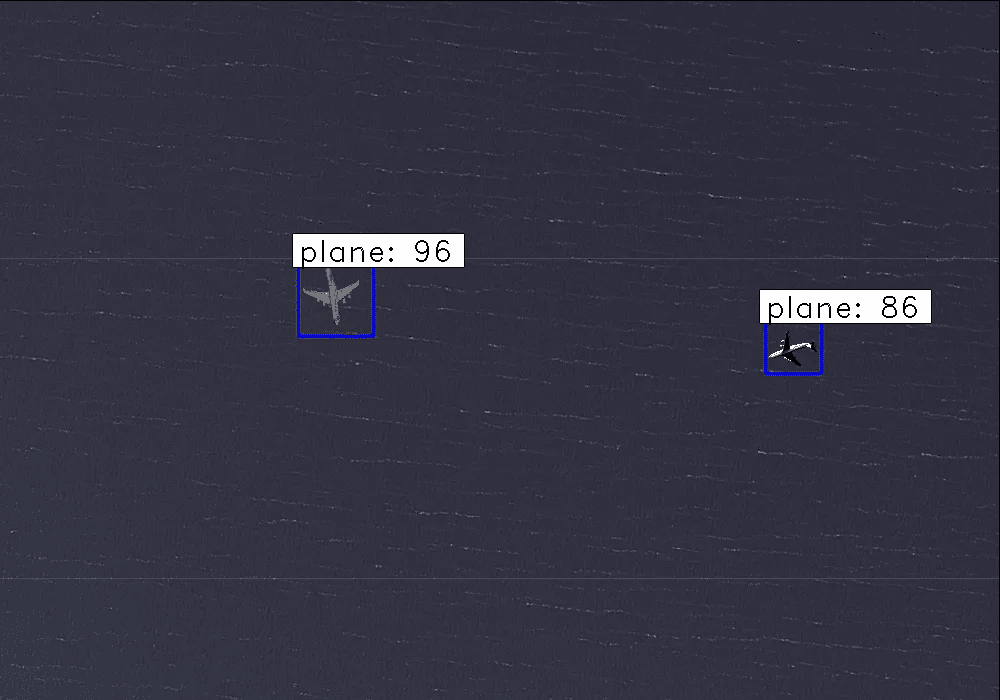

# 基于快速 RCNN 的卫星飞机检测

> 原文：<https://towardsdatascience.com/airplanes-detection-for-satellite-using-faster-rcnn-d307d58353f1?source=collection_archive---------6----------------------->

## 对象检测、更快的 RCNN、数据增强、飞机、卫星图像等等…


# 介绍

**物体检测**是一项与计算机视觉和图像处理相关的计算机技术，处理在数字图像和视频中检测某类语义**物体**的**实例**。

目标检测是已经取得巨大成功的领域之一。它被用于许多领域，如人脸检测(脸书用于识别人)、肿瘤检测(用于医学领域)等。

自从计算机视觉中的深度学习出现以来，像物体检测这样的任务已经变得相对容易和有效。
深度学习模型比早期的计算机视觉方法提供了更好的准确性、更少的时间消耗、更低的复杂性和更好的整体性能。
深度学习为对象检测提供了优于传统计算机视觉方法的出色结果，导致了深度学习模型的广泛使用。

其中表现最好的物体检测(深度学习)算法包括:
1。RCNN(基于区域卷积神经网络)
2。快速 RCNN
3。更快的 RCNN
4。SSD(单次多盒探测器)
5。YOLO(你只看一眼)

在本文中，我将使用更快的 RCNN(FRCNN)来演示对象检测的突出用途。

# 数据

数据集取自 kaggle，你可以在这里找到它
它包含 400 张训练图像和 100 张测试图像。边界框保存在 XML 和 CSV 文件中。


An image from the training set

数据集包含计算机生成的飞机卫星图像。

从数据集可以看出，一些图像不包含与背景高度可区分的对象(飞机)，即飞机在颜色、纹理和外观方面与背景有些相似。
例如，考虑以下图像:


你能看见多少架飞机？？你能看见一架飞机吗？？？！！
嗯，这是来自训练集的图像，你可以看到在图像中找出飞机是多么困难(即使对一个人来说)。


顺便说一下，这是带有边框的图像，显示有两架飞机。(你想通了吗？？)

但是，这种很难区分背景和对象的图像会对模型性能产生影响吗？
如果你有很强的计算机视觉背景，那么你一定知道物体检测的初始方法首先将图像转换为灰度，然后寻找边缘或梯度变化……
所有这些都会受到图像中物体外观的很大影响。如果图像和物体非常相似(如上图所示)，那么这些方法将会失败。这种情况称为杂乱回波，在这种情况下，很难区分对象和背景。
但是它也会影响深度学习模型吗？？？
这些神经网络在寻找的是如何将物体从背景中区分出来(识别)，从而将其包围在一个包围盒中(定位)。这些被称为负责对象检测的特征。
如果物体和背景之间的差异较小，很难发现这样的特征。
因此，这个数据集是一个很好的例子，用于测试深度学习模型-FRCNN 的性能。

# 方法

你可以在这里找到这个问题的 python 代码

首先，400 张图片没有用武之地。为了让深度学习模型发挥最佳性能，我们需要大量数据。

深度学习模型的性能与训练数据量成正比是众所周知的事实。数据越多，性能越好。
像 FRCNN 这样的模型需要大量的训练数据才能产生好的结果。然而，很少有(如果不是没有的话)用于对象检测的数据集具有充足的训练数据。
在这个数据集中，我们也只有 400 张图像，这不足以产生好的结果。
因此，要解决这一数据增强问题，就要出手相救。
这个数据集再次成为一个很好的例子，展示了数据增强对于深度学习模型如何产生良好结果是至关重要的。

## 数据扩充

**数据扩充**是从现有的训练**数据中人工创建新的训练**数据**的技术。** 如果你一直在研究计算机视觉的深度学习模型(无论是图像分类、定位还是检测等)，那么你一定遇到过数据增强这个术语，并意识到它的重要性。

数据扩充生成用于训练的新图像，从而提高模型性能。
数据增强为什么有效？？
现代深度学习算法，如卷积神经网络，或 CNN，可以学习对图像中的位置不变的特征。然而，增强可以进一步帮助这种变换不变的学习方法，并且可以帮助模型学习对于诸如从左到右到从上到下排序、照片中的亮度等变换也不变的特征。

有各种各样的数据增强技术，以下是在这种方法中使用的:
1。水平翻转
2。缩放比例
3。翻译
4。旋转
5。剪切
6。以上的各种组合

与图像分类相比，数据扩充对于对象检测是不同的。在图像分类中，您只需要相应地改变图像，但是在对象检测中，您还需要改变和调整边界框。例如，如果您水平翻转图像，那么您也需要翻转边界框。

牢记边界框约束，我实现了数据扩充，总共生成了 4400 张图像。
图像数量仍然不多，但是因为只有 100 个图像要测试，并且只有一个类别要检测，所以这么多就够了。
但我强烈建议在不创建不必要数据的情况下，尽可能地增加训练数据(这种情况在数据扩充过程中经常发生)。

现在我们已经有了一些可以训练的数据，让我们来实现这个模型。

## FRCNN

我建议您从上面提到的 GitHub 资源库下载代码文件，以充分利用本文。

更快的 RCNN 是一个非常棒的深度学习模型，表现极其出色，这一点我们即将搞清楚。

首先，组织数据。
训练集图像被移至名为 *train_images* 的文件夹，测试集图像被移至文件夹 *test_images。* 一个空文件夹*结果* *_imgs* 被创建，该文件夹将包含所有带有边界框的输出图像。

通过在命令提示符下执行下面一行，安装了所有需要的库和包(将当前文件夹作为工作目录):

```
pip install -r requirements.txt
```

批注文件(annotate.txt)已创建，看起来像:


annotate.txt

它包含训练集图像的文件夹名称、图像名称和边界框坐标以及对象的类别。
注意，边界框坐标的顺序为:xmin、ymin、xmax 和 ymax。

注释文件中的条目将根据数据扩充的实现方式而变化。

通过在命令提示符下执行以下行来运行该模型:

```
python train_frcnn.py -o simple -p annotate.txt
```

我已经运行了 800 个时期的代码，每个时期有 20 次迭代，人们可以改变这些数字以获得更好的准确性，比如增加时期的数量。

强烈建议使用 GPU 来运行上述代码，因为训练可能需要很多时间，尤其是对于大量的历元。

培训完成后，是时候测试模型了。
为了得到输出图像，执行以下命令:

```
python test_frcnn.py -p test_images
```

执行该命令时，可以看到输出图像，其边界框保存在 *results_imgs* 文件夹中。

以下是我获得的一些结果:



上面的图像显示了 FRCNN 在目标检测方面的出色表现。
通过使用数据扩充生成更高质量的图像并增加历元数，可以增强模型性能。

现在，让我们看看在没有进行数据扩充的情况下获得的结果，保持历元和迭代的数量不变。


可以看出，结果不如先前的结果好，在先前的结果中实现了数据扩充。
该模型未能正确识别飞机，而是将非飞机物体识别为飞机。即假阳性和假阴性的数量很高。

这表明了数据增强如何有助于减少错误并提高深度学习模型的性能。

## 结束注释

物体检测是一个很好的探索领域。
我见过许多用于各种场合的物体检测模型，例如用于自动驾驶汽车、手机、安全等，但将其用于卫星对我来说有些陌生。

此外，更快的 RCNN 名副其实，并产生很大的结果。

我在这篇文章中的唯一目的是分享使用更快的 RCNN，而不是如何实现它，所以如果您在运行上述代码时遇到任何错误或有任何疑问，请随时在评论部分提问。