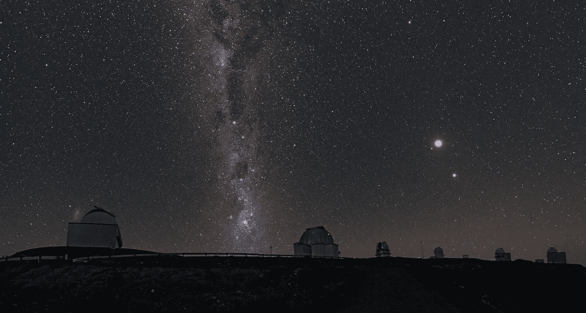
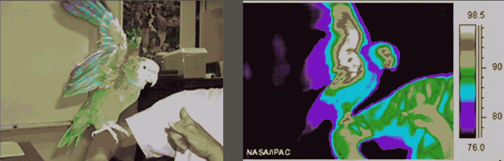
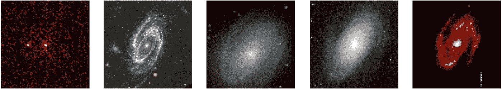
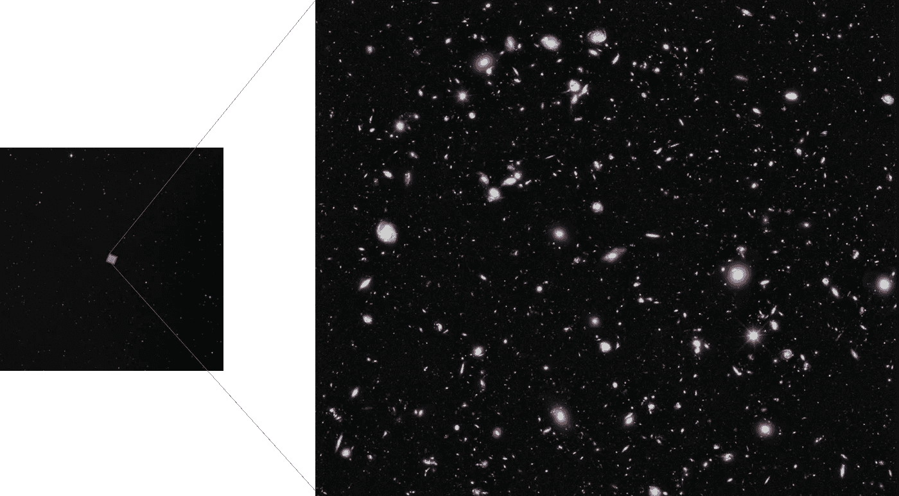
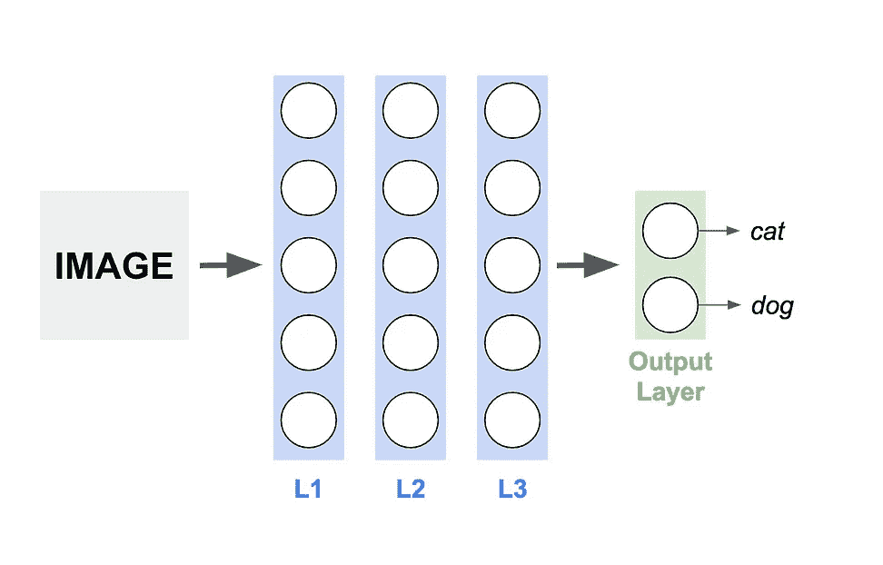
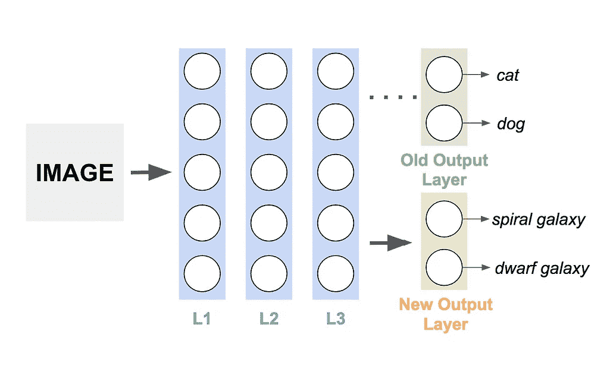

# 阿卡什恒河(银河)

> 原文：<https://towardsdatascience.com/akash-ganga-milky-way-c08a57936365?source=collection_archive---------16----------------------->

## 基于迁移学习的星系形态学

这项工作是作为莫阿德**实习项目的一部分完成的。**

## *天文成像导论*

*A video comparing the age of the universe to the time humankind has spent on science (most of our scientific progress has taken place in time that is equal to 0.000 0001% Age of Universe)*

*四个世纪前，伽利略仰望月亮，沉思夜空。快进:我们在月球上有足迹，不久也将在火星上有足迹！人类在地球上短暂的时间里取得了巨大的进步。我们已经发现了宇宙的起源，并且模拟了宇宙的未来。*

*我们最初对夜空的研究是用肉眼完成的，然后用简单的望远镜增强我们的视力。这些研究使用了夜空的“光学图像”。*

**

*An image of the night sky using ‘optical light’.*

*除了光学光图像之外，任何类型的电磁辐射都可以成像。例如，当你去看一个腿骨折的医生时，医生可能会用“x 光”而不是“光学光”来拍摄你的腿。*

*在下面的图片中，我们有两张图片，一张使用光学光线，另一张使用红外线光线。*

**

*The image in optical light (left) and infrared light (right). [NASA/IPAC]*

*随着地面望远镜和卫星的发展(哈勃太空望远镜于 1990 年发射)，我们可以用不同类型的电磁辐射拍摄宇宙照片。在下面的图片中，我们看到的是同一个星系的图片，但是有五种不同类型的光。*

**

*The image of a galaxy in the gamma, visible, UV, radio and infrared spectrums. [NASA]*

*借助先进的望远镜，天文学家已经收集了无数的夜空图像。他们的工作帮助我们绘制了电磁波谱中的宇宙地图，这些图像和地图让我们对宇宙有了更多的了解。如果我们继续研究这些图像和地图，我们一定会继续取得突破性的发现。*

*唯一的问题是我们的天文学家要处理的数据太多了。下面的图片，称为极端深场，从夜空的 1 度拍摄，有超过 3000 个星系！对这些图像中的所有星系进行分类和标记是一个相当大的挑战(让我们甚至不要考虑标记这些星系中我们看到/看不到的所有恒星)。*

**

*The eXtreme Deep Field, a photo assembled by combining 10 years of NASA Hubble Space Telescope photographs taken of a patch of sky at the centre of the original Hubble Ultra Deep Field. The image on the left is what is visible with a naked eye, while the image on the right is the Deep Field image of a small section of the night sky [NASA, ESA, and the HUDF09 Team]*

*我们目前对这些图像中的星系进行标记和分类的方法是众包图像:获得平民的帮助来帮助分类星系( [GalazyZoo](https://www.zooniverse.org/projects/zookeeper/galaxy-zoo/) )。然而，使用计算机来帮助分类可能是一个更好的方法。一旦经过机器学习训练，计算机在这项任务中将会更加胜任。*

*我们的项目 Akash Ganga 的目标是创建一个机器学习模型来帮助星系分类。*

## *我们研究星系形态学的独特方法——迁移学习*

*一些组织过去曾试图通过从零开始训练 ML 特工来训练 ML 特工执行星系分类。对于这个 Akash Ganga，我们使用迁移学习来训练我们的模型。*

*迁移学习的概念是采用预先训练的 ML 模型，如 Google 的 Inception net 或 VVG16，并修改模型的末端层以适应新的分类需求。迁移学习的好处是，VVG16 等训练出来的模型都经过了上千小时的训练。许多这种训练实际上可能涉及到教授图像的模型基本特征提取。通过使用预训练模型，我们已经为特征提取准备好了权重。剩下要训练的，就是添加任何新的层，以允许新类的分类。*

****

*A diagram explaining Transfer Learning. The ML model on the left is trained to classify images into either ‘dog’ or ‘cat’. On altering the last layer, we can now train the ML model to classify images of different types of galaxies instead, as shown on the right.*

## *我们的数据——艾菲吉数据集*

*为了训练我们的 ML 模型，我们使用了 [EIFIGI 数据集](https://www.astromatic.net/projects/efigi)。EIFIGI 数据集拥有五个*乌格里兹*和光带中的星系图像，以及使用这五个光带制作的复合彩色图像(有关*乌格里兹*光带及其波长的更多信息，请参考维基百科关于[光度系统](https://en.wikipedia.org/wiki/Photometric_system)的文章)。*

*我们没有像通常那样将一幅图像的所有光带组合在一起，而是决定在训练时将它们分开。这是一种略微非传统的方法，因为当结合在一起时，ugriz 波段提供了更多的信息来理解特定的图像。做出这一决定是为了使 Akash Ganga ML 模型对光带具有鲁棒性(以便不管用于拍照的光带如何，ML 模型仍然可以对图像中的星系进行分类)。*

*此外，数据集有很大的偏差:与螺旋或椭圆星系的图像数量相比，矮星系的图像数量非常少。为了防止矮星系的错误分类，我们决定通过剪切矮星系图像来生成新的矮星系图像，以便矮星系和其他星系图像的数量可以比较。*

## *我们用于星系分类的训练 ML 模型*

*我们的 ML 模型的基础是预训练的 VVG16(也称为牛津网)模型。我们在这个模型的末尾添加了几个层，并用 EIFIGI 数据集训练了额外的层，以将星系区分为椭圆、透镜状、螺旋或不规则星系类型。*

*在 Google Colab 上对模型进行 60 多个小时的训练后，我们的准确率达到了 70%,并稳定在该值。这告诉我们，也许迁移学习并不是星系分类的合适方法，也许所有不同的波段对星系形态都是至关重要的。*

## *结论*

*像 VVG16 这样的模型被训练来区分非常不同的类别(例如，狗和椅子)，这些类别是复杂的(狗的图像可能非常复杂)。另一方面，星系的图像包含简单的形状(大多数时候，只是像椭圆、螺旋等基本形状)。因此，使用迁移学习可能是一个障碍，因为对于星系分类，可能不需要复杂的特征分析。*

*如前所述，星系形态学的传统方法包括在训练 ML 模型之前将来自几个不同光带的数据分组。也许我们的模型由于缺乏其他波段的数据而无法提高其训练精度。尝试对光带进行分组，然后进行训练可能是提高模型准确性的一种方法。*

*我们所有的代码都可以在这个[项目的仓库中免费获得。我们希望这项工作可以作为任何对星系形态学感兴趣的人的基础！](https://github.com/rahulremanan/akash_ganga)*