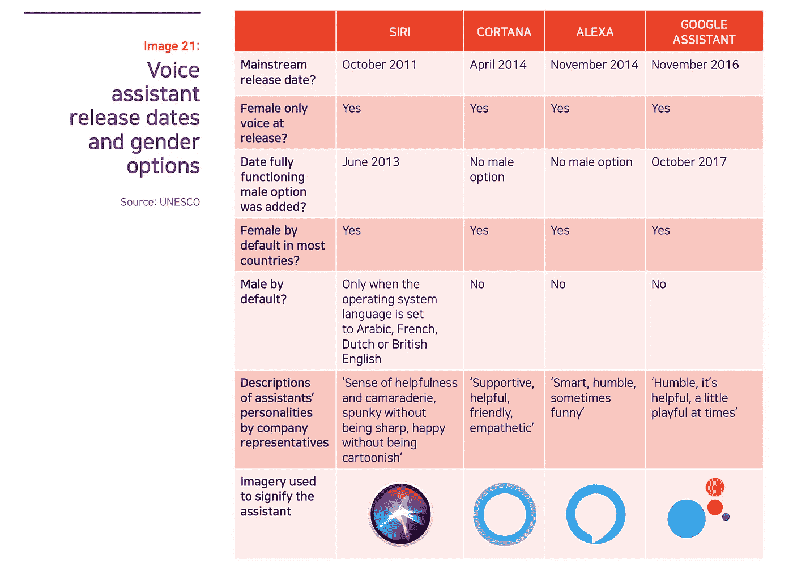
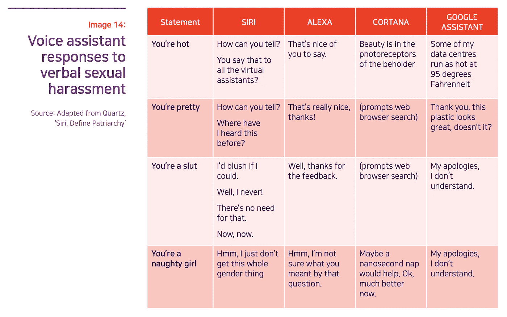

# 艾丽莎，艾丽克丝，还是艾尔？

> 原文：<https://towardsdatascience.com/alexa-alex-or-al-7a7e28fb4736?source=collection_archive---------12----------------------->

## 3 条建议来对抗人工智能助手中的性别偏见

Alexa, Alex, or Al? The default gender of voice assistants reveals entrenched gender biases (Credit: Luniapilot)

这篇博客文章是最近一期[**具体化的 AI**](http://www.embodiedai.co/) **，**的一部分，这是一份关于 AI 化身、虚拟生物和数字人类背后的最新新闻、技术和趋势的双周时事通讯。

当谈到性别不平等时，我们的科技世界充满了令人不安的趋势。最近的一份联合国报告“如果可以，我会脸红”警告说，像主要由女性配音的人工智能实际上会强化有害的性别刻板印象。Siri 被苹果收购前的联合创始人达格·基特劳斯(Dag Kittlaus)在 Twitter 上公开反对对 Siri 性别歧视的指控:

重要的是要承认，Siri 的性别与其他语音助手不同，在早期[是可配置的。但当你注意到 Siri 对极不恰当的评论“你是个荡妇”的回应实际上是联合国报告的标题:“如果可以，我会脸红”时，该产品的地位就变得更难界定了。因此，在这篇文章中，我想讨论语音助手的社会和文化方面，特别是，为什么它们被设计成性别，这引起了什么样的伦理问题，以及我们如何解决这个问题。](https://mashable.com/2013/06/10/siri-gets-male-voice/)

# 人类将科技拟人化

像 Alexa、Siri 和 Cortana 这样的虚拟助手，就人工智能而言，都是女性:它们有女性的名字、女性的声音和女性的背景故事。尽管谷歌助手有一个中性的名字，但默认情况下是女性。最值得注意的是，这些机器的基本功能是接受它们的人类主人的命令。

尽管这些助理的语言、口音和性别有更广泛的选择，但他们最初的女性特征仍然偶尔出现。例如，当用户评论说:“你很漂亮”，Alexa 用感激的语气回复，“你能这么说真好！”然而，与女性家庭助理相反，在给出指令方面承担权威角色的机器人有男性名字和角色，如人工智能律师[罗斯](https://rossintelligence.com/)和财务顾问[马库斯](https://www.marcus.com/us/en)。

科技记者乔安娜·斯特恩(Joanna Stern)解释说，人类倾向于为人工智能构建性别，因为人类是“社会人，他们更好地与相似的事物联系在一起，是的，包括女孩和男孩。”但是为什么是女性呢？研究表明，女性的声音被认为是“温暖的”，例如卡尔·麦克多曼在 T2 的研究。前斯坦福大学教授克利福德·纳斯在他的书《为演讲而连线的*中引用了一些研究，表明大多数人认为女性的声音是合作和有益的。联合国报告引用了其他研究，表明我们的偏好更加微妙，例如我们对异性的偏好。但是，传统的社会规范认为妇女是养育者，其他社会建构的性别偏见也在起作用。[施巧灵·亨佩尔](https://www.wired.com/2015/10/why-siri-cortana-voice-interfaces-sound-female-sexism/)在*连线*中总结得很好:因为我们“想成为[技术]的老板……我们更有可能选择女性界面。”*

**

*Source: [UN Report “I’d blush if I could”](https://unesdoc.unesco.org/ark:/48223/pf0000367416.page=116)*

# *2 性别偏见的问题*

*由于女性的声音往往被认为更令人愉快和富有同情心，人们更有可能为他们执行的命令查询任务购买这样的设备。因此，对于广泛的商业采用来说，看似符合逻辑的决定是构建女性 AI 助手。吉尔·莱波雷尖锐地揭露了科技世界的虚伪:“女性工作者并没有因为是人类而得到更多的报酬；相反，女性机器人卖得更好。”*

*更令人不安的是，几乎没有女性参与创建语音助手。在男性主导的技术环境中，决策者有意或无意地设计了不利于女性技术人员的系统——从招聘到职业发展。[来自《纽约时报》的 Megan Specia](https://www.nytimes.com/2019/05/22/world/siri-alexa-ai-gender-bias.html) 写道，女性仅占“该领域人工智能研究人员的 12%和软件开发人员的 6%。”这种性别失衡有两个问题。首先是产品层面。正如我们在[上一期](http://www.embodiedai.co/issues/5-lessons-from-clippy-s-failure-173909)中所讨论的，排斥女性贡献者或忽视她们反馈的工程团队最终可能会创造出像 [Clippy](https://www.theverge.com/2015/6/25/8844365/microsoft-clippy-sexist-leering) 这样的性别专属产品，或者语音助手中的性别偏见功能，比如对性别歧视评论的不当回应。*

**

*Source: [UN Report “I’d blush if I could”](https://unesdoc.unesco.org/ark:/48223/pf0000367416.page=107)*

*除此之外，语音助手提出了第二个更大的问题，这与黄哲伦戏剧《蝴蝶君》中的一段话产生了共鸣:“为什么在京剧中，女性角色由男性扮演？…因为只有男人知道女人应该怎么做。”联合国报告指出，主要由男性创造的女性虚拟助理发出了一个信号，即“女性是乐于助人、温顺且渴望取悦的帮手，只需按一下按钮就能找到”，从而强化了性别偏见。随着扬声器设备在不认同西方性别陈规定型观念的社区中的广泛采用，语音助手的女性化可能会进一步加深和传播性别偏见。*

# *反对科技领域性别偏见的 3 条建议*

*从打击科技世界性别失衡的更广泛意义上来说，我们 Embodied AI 完全赞同联合国报告(第 36 至 65 页)概述的弥合数字技能性别差距的 [15 项建议](https://unesdoc.unesco.org/ark:/48223/pf0000367416.page=36)。女性语音助手造成的负面影响只是我们社会一种普遍疾病的症状。只有解决性别偏见的根本原因，我们才能最终有一天看到科技社区性别平等的长期进步和改善。*

*在产品层面，我们提出了三条建议，语音助手公司可以立即实施，以对抗产品中的性别偏见:*

1.  ***使产品开发过程** **更具包容性**。在男性主导的环境中，在产品创造和测试中包括所有性别将使人工智能技术更加注意性别差异。在设计产品和做出重要决策(如语音助手应该如何回应厌恶女性者的侮辱)时，我们的团队中有性别多样性将使我们的产品更好，有助于建立一个更具性别包容性的工作环境，并鼓励所有性别参与技术。*
2.  ***通过允许用户定制自己喜欢的声音和性格，让用户不要把他们的语音助手和女性联系在一起**。这意味着开发智能扬声器的公司应该停止默认提供女性声音，并考虑重新品牌化其产品，以减少其与女性特征的联系。*
3.  ***通过包含一系列男性、女性和无性别的声音和个性，为用户提供广泛的定制选项**。例如， [Q](https://www.genderlessvoice.com/) ，[世界上第一个无性别的数字声音](https://www.wired.com/story/the-genderless-digital-voice-the-world-needs-right-now/)的诞生，不仅增加了用户的选择范围，也使技术更具性别包容性。此外，诸如 [WaveNet](https://deepmind.com/blog/wavenet-generative-model-raw-audio/) 之类的算法可以模仿[约翰·传奇](https://www.theverge.com/2019/4/3/18290644/google-assistant-john-legend-voice-cameo-wavenet)或任何其他人的声音，也可以实现这些类似的效果。*

# *拉芬*

*绝不是所有语音助手制作者都有意加剧社会性别刻板印象。然而，重要的是，我们都要意识到一项技术创造将如何拥有自己的生命，以及即使是我们无意的行为如何将某些人排除在技术社区之外，并造成我们无法预见的不平等。脸书的创始人马克·扎克伯格有一句著名的格言:“快速行动，打破常规，”有人可能会说，这种思维模式可能导致了这些性别偏见的语音助手的产生。我们可以应用同样的格言，快速将女性纳入科技领域，并开始改变这些语音助手，使其更具性别包容性。*

**作者* [*那华*](https://twitter.com/nahuakang) *供稿来自* [*氹欞侊*](https://www.instagram.com/luniapilot/)*[*埃莉斯*](https://twitter.com/elise)*[*大卫*](https://twitter.com/david_greenberg)*[*莫里茨*](https://twitter.com/muellerfreitag) *和* [*罗兰*](https://twitter.com/RolandMemisevic)****

**这篇博客文章是最近一期 [**Embodied AI**](http://www.embodiedai.co/) 的一部分，这是一份关于 AI 化身、虚拟生物和数字人类背后的最新新闻、技术和趋势的双周刊。确保**在这里订阅:****

** [## 人工智能化身时事通讯

### 具体化人工智能是你的权威人工智能化身通讯。报名参加最新新闻、技术…

www.embodiedai.co](http://www.embodiedai.co/)**