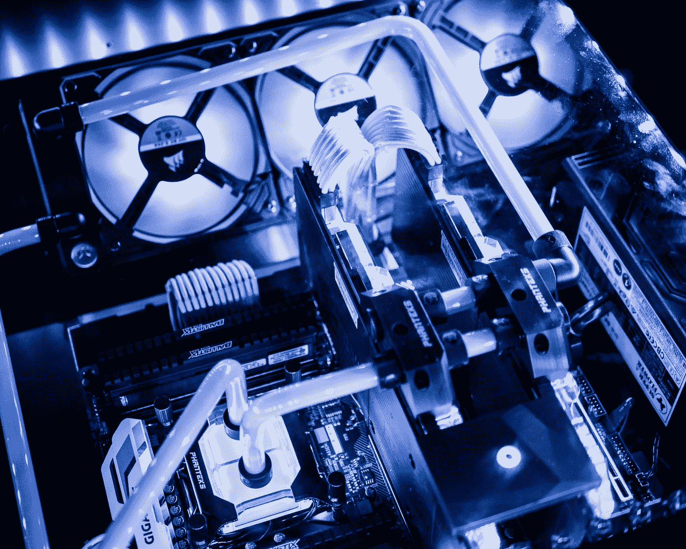
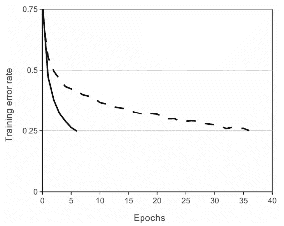
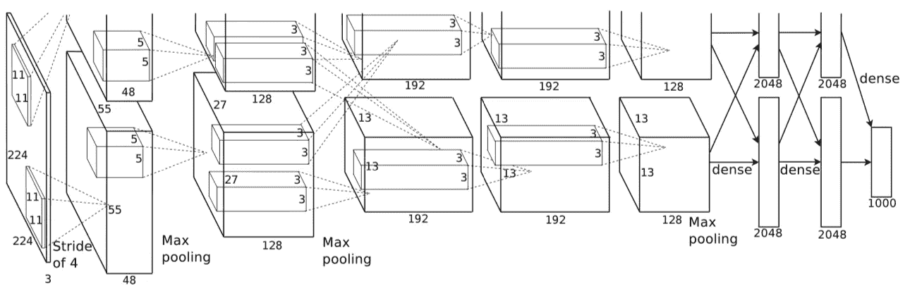
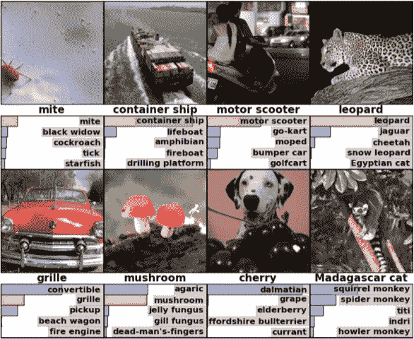

# AlexNet:挑战 CNN 的架构

> 原文：<https://towardsdatascience.com/alexnet-the-architecture-that-challenged-cnns-e406d5297951?source=collection_archive---------2----------------------->

几年前，我们还在使用由数万张图片组成的小型数据集，如 CIFAR 和 NORB。这些数据集足以让机器学习模型学习基本的识别任务。然而，现实生活从来都不简单，有比这些小数据集中捕捉到的更多的变量。最近，像 ImageNet 这样的大型数据集的可用性，包括数十万到数百万的标记图像，推动了对极其强大的深度学习模型的需求。然后来了[**AlexNet**](https://papers.nips.cc/paper/4824-imagenet-classification-with-deep-convolutional-neural-networks.pdf) 。

Photo by [Casper Johansson](https://unsplash.com/@cabbejj?utm_source=medium&utm_medium=referral) on [Unsplash](https://unsplash.com?utm_source=medium&utm_medium=referral)

**问题。**卷积神经网络(CNN)一直是物体识别的首选模型——它们是易于控制甚至更易于训练的强大模型。当在数百万张图像上使用时，它们没有经历任何令人担忧的过度拟合。它们的性能几乎等同于相同大小的标准前馈神经网络。唯一的问题是:它们很难应用于高分辨率图像。在 ImageNet 规模上，需要有一种创新，这种创新将针对 GPU 进行优化，并在提高性能的同时减少训练时间。

**数据集**。ImageNet:由超过 1500 万张高分辨率图像组成的数据集，标记有 2.2 万个类别。关键是:网络抓取图像和众包人类标签。ImageNet 甚至有自己的竞争对手:ImageNet 大规模视觉识别挑战(ILSVRC)。该比赛使用 ImageNet 图像的子集，并要求研究人员实现最低的前 1 名和前 5 名错误率(前 5 名错误率是指正确标签不是模型的五个最可能标签之一的图像的百分比)。在这场竞争中，数据不是问题；大约有 120 万幅训练图像、5 万幅验证图像和 15 万幅测试图像。作者通过裁剪掉每幅图像的中心 256x256 像素的小块，对他们的图像实施了 256x256 像素的固定分辨率。

Convolutional Neural Networks that use ReLU achieved a 25% error rate on CIFAR-10 six times faster than those that used tanh. Image credits to Krizhevsky et al., the original authors of the AlexNet paper.

**AlexNet。**该架构由八层组成:五个卷积层和三个全连接层。但这并不是 AlexNet 的特别之处；这些是卷积神经网络的新方法所使用的一些特征:

*   **ReLU 非线性**。AlexNet 使用校正线性单位(ReLU)代替当时标准的双曲正切函数。ReLU 的优势在训练时间上；使用 ReLU 的 CNN 能够在 CIFAR-10 数据集上达到 25%的错误，比使用 tanh 的 CNN 快六倍。
*   **多个 GPU。**过去，GPU 仍然拥有 3gb 的内存(现在这种内存应该是新秀数字)。这尤其糟糕，因为训练集有 120 万张图片。AlexNet 允许多 GPU 训练，将模型的一半神经元放在一个 GPU 上，另一半放在另一个 GPU 上。这不仅意味着可以训练更大的模型，而且还减少了训练时间。
*   **重叠汇集。**CNN 传统上“汇集”相邻神经元组的输出，没有重叠。然而，当作者引入重叠时，他们看到误差减少了约 0.5%，并发现具有重叠池的模型通常更难过度拟合。

Illustration of AlexNet’s architecture. Image credits to Krizhevsky et al., the original authors of the AlexNet paper.

**过度拟合问题。** AlexNet 有 6000 万个参数，这是过度拟合的一个主要问题。采用两种方法来减少过度拟合:

*   **数据扩充。**作者使用标签保留转换使他们的数据更加多样化。具体来说，他们生成了图像平移和水平反射，这使训练集增加了 2048 倍。他们还对 RGB 像素值执行了主成分分析(PCA ),以改变 RGB 通道的强度，从而将 top-1 错误率降低了 1%以上。
*   **辍学。**这项技术包括以预定的概率(例如 50%)来“关闭”神经元。这意味着每次迭代使用模型参数的不同样本，这迫使每个神经元具有更强大的功能，可以用于其他随机神经元。然而，辍学也增加了模型收敛所需的训练时间。

**结果。**在 2010 版 ImageNet 竞赛上，最好的模型取得了 47.1%的 top-1 错误和 28.2%的 top-5 错误。AlexNet 以 37.5%的前 1 名错误和 17.0%的前 5 名错误大大超过了这一数字。AlexNet 能够识别偏离中心的物体，并且它对每张图像的前五类中的大多数都是合理的。AlexNet 以 15.3%的前 5 名错误率赢得了 2012 年 ImageNet 比赛，而第二名的前 5 名错误率为 26.2%。

AlexNet’s most probable labels on eight ImageNet images. The correct label is written under each image, and the probability assigned to each label is also shown by the bars. Image credits to Krizhevsky et al., the original authors of the AlexNet paper.

**现在怎么办？** AlexNet 是一个非常强大的模型，能够在非常具有挑战性的数据集上实现高精度。然而，删除任何卷积层都会大幅降低 AlexNet 的性能。AlexNet 是任何物体探测任务的领先架构，可能在人工智能问题的计算机视觉领域有巨大的应用。在未来，AlexNet 可能会比 CNN 更多地被用于图像任务。

作为使深度学习更加广泛适用的里程碑，AlexNet 还可以被认为将深度学习带到了自然语言处理和医学图像分析等相邻领域。

我在下面链接了一些有趣的资源。

*   [Alex net 上的原始论文](https://papers.nips.cc/paper/4824-imagenet-classification-with-deep-convolutional-neural-networks.pdf)
*   [ImageNet 的网站](http://www.image-net.org)
*   [关于 CNN 的更多信息维基百科页面](https://en.wikipedia.org/wiki/Convolutional_neural_network)