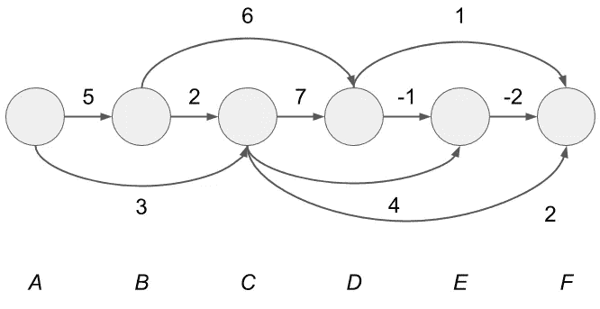

# 理解 Dijkstra 算法和 Bellman-Ford 算法的边缘松弛

> 原文：<https://towardsdatascience.com/algorithm-shortest-paths-1d8fa3f50769?source=collection_archive---------5----------------------->


Photo by [Denys Nevozhai](https://unsplash.com/photos/7nrsVjvALnA?utm_source=unsplash&utm_medium=referral&utm_content=creditCopyText) on [Unsplash](https://unsplash.com/search/photos/intersection?utm_source=unsplash&utm_medium=referral&utm_content=creditCopyText)

***最短路径问题*** 的目的是寻找从起始顶点到目标顶点的最短路径。我们广泛使用算法来解决最短路径问题，从竞争性编程到谷歌地图方向搜索。理解了关键的概念，“ ***边缘松弛*** ”，就真的更容易理解具体的算法了，比如说 Dijsktra 算法或者 Bellman-Ford 算法。换句话说，如果不理解边缘松弛，可能很难让这些算法成为你自己的。在这篇文章中，我将重点讨论边缘松弛，并解释解决最短路径问题的一般结构。此外，为了更好地理解，我们将介绍 easy 算法及其实现。我使用 Python 来实现。该职位的结构如下:

1.  什么是最短路径问题？
2.  什么是边缘松弛？
3.  放松的顺序
4.  有向无环图的最短路径及其实现

请注意，我们不对待 Dijkstra 算法或 Bellman-ford 算法。

# 1.什么是最短路径问题？

在这篇文章中，我解释了最短路径问题中的*单源最短路径问题*，其中我们需要找到从一个起始顶点到所有其他顶点的所有路径。我将最短路径定义为加权图中所有其他路径中从起始顶点到目标顶点的最小加权路径。在这里，你可以认为加权路径中的“加权”是指到达目标顶点(某个顶点)的到达成本。从这里开始，当我说一个公正的图，它意味着一个加权的图。

在下图中，让我们考虑从起始顶点 S 到其他顶点 A 和 b 的最短路径。


从顶点 S 到顶点 A 的最短路径变成“S→A”。在上图中，从顶点 S 到顶点 A 只有一条路径，所以我们不需要关心权重。另一方面，我们可以找到从顶点 S 到顶点 B 的两条路径，分别是“S→B”和“S→A→B”，最短路径就变成了“S→A→B”。在“S→B”中，路径的权重是 3，但在“S→A→B”中，路径的权重变成了 2，而且最短:1+1=2。我们可以认为最短路径的权重是从起始顶点到一个顶点的最短距离。

# 2.什么是边缘松弛？

在这里，我将解释解决最短路径问题的重要且常用的概念，即边松弛。通常，您可以通过使用边松弛来解决所有最短路径问题。边松弛是计算到达顶点下限的代价的操作。更具体地说，操作将变成:

```
For the edge from the vertex *u* to the vertex *v*, if *d*[*u*]+*w*(*u*,*v*)<*d*[*v*] is satisfied, update *d*[*v*] to *d*[*u*]+w(*u*,*v*)
```

顶点 *u* 和 *v* 代表图中的邻居，而 *d* [ *u* ]和 *d* [ *v* 分别代表到达顶点 *u* 和 *v* 的到达成本。另外， *w* ( *u* ， *v* )代表从顶点 *u* 到顶点 *v* 的边的重量。总结到目前为止的事情，我们可以把这个图做成下图。


现在我们知道我们可以从起始顶点 S 通过两个顶点到达顶点 *u* ，并且路径开销为 *d* [ *u* 。同样，我们可以从起始顶点 S 通过四个顶点到达顶点 *v* ，并且该路径花费 *d* [ *v* ]。

这里边缘松弛更新 *d* [ *v* ]为*d*[*u*]+*w*(*u*， *v* )当*d*[*u*+*w*(*u*，*v*换句话说，它将当前到达顶点*v*(*d*[*v*)的到达成本更新为更低的到达成本(*d*[*u*]+*w*(*u*， *v* )。它更新成本的原因是通过顶点 *u* 的路径可以更短，因为通过顶点 *u* 的路径的到达成本将低于当前路径的成本。实际上，**最短路径问题的算法通过重复使用边松弛**来解决问题。**

我将展示一个例子，我们可以通过重复使用边松弛来解决最短路径问题。让我们像以前一样通过边松弛找到同一图的最短路径。我假设起始顶点为 S，并对图应用边松弛，以获得到顶点 A 和 b 的最短路径。


要应用边松弛，我们需要知道到达成本，但是在搜索之前没有办法知道，所以我们将顶点 A 和 B 的到达成本初始化为无穷大(∞)。顶点的无穷成本意味着我们无法到达那个顶点。另一方面，从起始顶点到起始顶点的到达成本为零，因此我们将顶点 S 的 *d* 值设置为 0。


我们首先选择并松弛从顶点 S 出来的边，然后松弛从顶点 a 出来的边。首先，我们将边松弛应用到边 SA。


边 SA 满足*d*【S】+*w*(S，A)<*d*【A】，我们设*d*【A】为*d*【S】+*w*(S，A)=1。这里，π[A]代表到达成本*d*A】的路径中在顶点 A 之前到达的顶点。在这种情况下，π[A]是 S .π[A]= S 表示到达成本的路径 *d* [A]总是使用子路径，A←S .细节将在下面描述，但我们可以使用π来重构路径。

我们以同样的方式放松边缘人。


边 SB 满足*d*【S】+*w*(S，B)<*d*【B】，所以我们设*d*【B】为*d*【S】+*w*(S，B)=3。对于 *d* [B]路径重建，我们将π[B]设为 s。随后，我们放松从顶点 a 向外的边 AB。


边 AB 满足 *d* [A]+ *w* (A，B) < *d* [B]，所以我们设 *d* [B】为 *d* [A]+ *w* (A，B)=2。一旦我们更新了 B 的 *d* 值，我们也将π【B】更新为 A，从上图可以发现，从顶点 S 到顶点 A 和 B 的最短距离等于到达成本 *d* 。我们不能更新更低的 *d* 值，所以我们完成了边缘松弛。

在这里，让我们确认我们可以通过使用π[A]= S 和π[B]= A 来重建最短路径。在上图中，我们将以重建从顶点 S 到顶点 B 的最短路径为例。从π[B]= A，我们可以知道我们应该在到达顶点 B 之前访问顶点 A。从π[A]= S，我们可以知道我们应该首先访问顶点 S，然后到达顶点 A。顶点 S 是起始顶点，因此我们不能再向后遍历。把我们到目前为止得到的顶点反过来，就可以得到从顶点 S 到顶点 B 的最短路径，“S→A→B”。一般我们可以通过回溯π[*v*]，π[π[*v*]]，π[π[π[*v*]]，…并对获得的顶点进行反转，为顶点 *v* 重构最短路径。

# 3.放松的顺序

前一节我们不关心放松边缘的顺序，但是应该怎么决定顺序呢？还是我们真的在乎？似乎我们可以通过随机放松边来获得最短路径。然而，这是不正确的。在这里，我来解释一下为什么要在乎顺序，以及如何选择边缘来放松。

说实话，如果你随机选择和放松边缘，计算效率的真正糟糕的情况是存在的。例如，让我们考虑下面的图表。我假设图中的 *d* 值已经初始化。


首先，让我们从左到右放松直线边缘。


接下来，我们放松边缘。


然后，我们放松边缘 CE。


在这里，你可能会发现我们可以放松的边缘，如再次。


同样，当我们放松边 AC 时，我们可以再次放松边 CE 和 EG。所以如果我们不注意秩序，我们会一次又一次地放松同样的边缘。在上面的例子中，如果我们从左到右放松边缘，我们可以有效地放松边缘。然而，有太密集的图形，以至于无法像上面的例子那样可视化。所以提前找到一个高效的订单似乎不太现实。这就是我们应该关心放松秩序的原因。

那么，我们应该如何选择和放松边缘。事实上，像 Dijkstra 算法或 Bellman-Ford 算法这样的最短路径算法给了我们一个宽松的顺序。这意味着**每个最短路径算法基本上重复边松弛，并根据图的性质**(正或负权重、DAG 等)设计松弛顺序。换句话说，我们应该通过观察图形的性质来寻找选择和放松边的方法。总之，每个最短路径算法都有如下的一般结构:

```
1\. Initialize *d* and Π in the graph
2\. Choose the edge somehow (it depends on the algorithm) and Relax it.
```

# 4.有向无环图的最短路径及其实现

在前一节中，我说过我们应该通过观察图形的性质来选择边缘松弛的方式。在这里，我将用 Python 实现来解释 DAG ( *有向无环图*)的简单易行的最短路径算法。DAG 是没有圈的图。在这一节，我将解释算法，因为你知道[拓扑顺序。](https://en.wikipedia.org/wiki/Topological_sorting)如果不熟悉，可以查看我的文章:[用 Python 理解深度优先搜索和拓扑排序？](https://medium.com/@yasufumy/algorithm-depth-first-search-76928c065692)

在 DAG 上的最短路径算法中，我们可以通过选择和放松拓扑顺序中的外出边来获得最短路径。具体算法如下:

```
1\. Initialize the d value of the starting vertex as 0 and the other vertices as ∞
2\. Relax the out-going edges in topological order
```

让我们看看算法是如何工作的。我展示了这个图，我初始化了这些 *d* s，拓扑排序如下。我假设起点是 b。让我们试着解决最短路径问题。


每个顶点都是拓扑排序的，所以我们只是从左到右放松向外的边。我们不能从最左边的顶点 A 放松向外的边，所以我们不更新 *d* 。


接下来，我们放松从顶点 B 开始的向外的边，它们是 BC 和 BD。一旦我们放松了边缘，我们就更新了π。我们设π[C]为 B，π[D]为 B。


然后，我们从顶点 c 松弛出边。我们不能将出边松弛到顶点 D，所以我们只更新*D*E】和 *d* [F】。同样，我们将π[E]更新为 C，将π[F]更新为 C。


我们从顶点 d 更新向外的边。我们只将*d*E】和π[E]更新为 d。


我们从顶点 e 更新向外的边。我们还将π[F]更新为 e。


没有从顶点 f 向外的边。我们完成了边松弛。最后，我们获得如下最短距离:我们不检查它是否在这里工作，但是我们可以从π重构最短路径。


随后，让我们用 Python 实现 DAG 上的最短路径算法，以便更好地理解。实现如下:在这个实现中，这个代码解决了上面解释中使用的图上的最短路径问题。这段代码评估 *d* 和π来解决问题。我假设我们已经预先知道了拓扑顺序。

首先，让我们看看图和它的权重是如何表示的。在上面的代码中，图形实现如下:

```
graph = {'A': ['B', 'C'],
         'B': ['C', 'D'],
         'C': ['D', 'E', 'F'],
         'D': ['E', 'F'],
         'E': ['F'],
         'F': []}
weights = {('A', 'B'): 5, ('A', 'C'): 2,
           ('B', 'C'): 2, ('B', 'D'): 6,
           ('C', 'D'): 7, ('C', 'E'): 4, ('C', 'F'): 2,
           ('D', 'E'): -1, ('D', 'F'): 1,
           ('E', 'F'): -2}
```

该图的相应数字如下:



例如，当我们查看顶点 C 时，*图* ['C']返回['D '，' E '，' F']，它们是从顶点 C 可到达的邻居。因此这些顶点从顶点 C 构造出向外的边。此外，您会发现*权重* [ *u 【T7， *v* 对应于边 *uv* 的权重。*

接下来，让我们看看每一行的角色 *dag_shortest_path* 以获得最短路径。第 2 行到第 4 行是如下初始化:设置起始顶点的 *d* 为 0，其他顶点为∞。此外，这些行初始化π以重建路径。

```
d = {v: INF for v in graph}
d[s] = 0
pi = {s: None}
```

从 9 到 12 的线对应于边缘松弛。代码中的*d _ temp*<*d*[*v*对应边缘松弛状态下的*d*[*u*]+*w*(*u*，*v*)<*d*[*v*)。当这个条件满足时，它更新 *d* [ *v* ]。一旦它更新了 *d* ，它也会更新π。

```
d_temp = d[u] + weights[u, v]
if d_temp < d[v]:
  d[v] = d_temp
  pi[v] = u
```

代码按照拓扑顺序从每个顶点向外的边重复这个过程。这个重复的过程是由两个 for 循环完成的。*命令器*按照拓扑顺序保存顶点。此外，*图形*返回顶点以从顶点构建出向外的边。因此，我们通过将来自*顶点*的顶点视为 *u* 并将*图形**u*视为 *v* 来获得边 *uv* 。

```
for u in torder:
  for v in graph[u]:
    # relax(u, v)
```

代码解释到此为止。我们不检查结果，但是您可以在您的终端中通过以下命令执行代码:您会发现您可以正确地获得 *d* 和π。

```
curl -s [https://gist.githubusercontent.com/yasufumy/e6477c836baa85735f6019bc0b0c1460/raw/ee4885e5d21f009ee490038525887d8fcf80f8d8/dag_shortest_path.py](https://gist.githubusercontent.com/yasufumy/e6477c836baa85735f6019bc0b0c1460/raw/ee4885e5d21f009ee490038525887d8fcf80f8d8/dag_shortest_path.py) | python3
```

最后，我们来考虑一下这个算法的时间复杂度。在这个算法中，有两个主要的计算部分。一个是拓扑排序。另一个是边缘松弛。在上面的代码中，我们不做拓扑排序，但实际上，我们需要这样做。所以我们应该把它考虑进去。我们可以通过深度优先搜索进行拓扑排序，所以时间复杂度为*O*(|*V*|+|*E*|)。循环的数量只影响边缘松弛的时间复杂度，因为循环中的过程以恒定时间运行。*转矩*的循环数为| *V* |而*图形* [ *u* ]的循环数为| *E* |。所以边缘松弛的时间复杂度为*O*(|*V*|+|*E*|)。综上所述，算法的整体时间复杂度为*O*(|*V*|+|*E*|)。

在这篇文章中，我将重点讨论边缘松弛，并解释最短路径问题及其算法。当你理解了边缘松弛，你就很容易理解 Dijsktra 的算法或者 Bellman-Ford 算法。还有，你可以知道这些算法的区别。感谢您阅读我的文章。

## 参考

*   麻省理工学院开放式课程 6.006 第 15 讲:单源最短路径问题
*   麻省理工学院开放式课程 6.006 复习课 15:最短路径