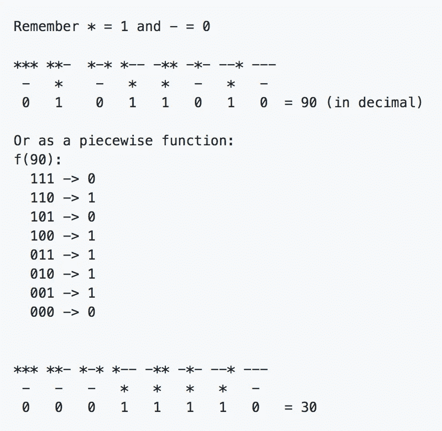

# 算法之美:细胞自动机导论

> 原文：<https://towardsdatascience.com/algorithmic-beauty-an-introduction-to-cellular-automata-f53179b3cf8f?source=collection_archive---------8----------------------->

## 生成复杂逼真结果的简单算法概述。

The famous rule 30; capable of generating pseudo-random numbers from simple/deterministic rules. Rule 30 was discovered by Stephan Wolfram in ’83.

> 如果你对细胞自动机的哲学含义感兴趣，查看我的帖子[这里](https://medium.com/@evankozliner/proving-determinism-a-thought-experiment-1fee090b7232?source=your_stories_page---------------------------)。

细胞自动机(CA)同时也是我遇到的最简单和最迷人的想法之一。在这篇文章中，我将回顾一些著名的元胞自动机及其性质，重点是“基本的”元胞自动机和著名的“生命游戏”。你不需要了解编码来阅读这篇文章，但是对于更多的技术读者，我提供了尾注和 Github repos。

我还用 Python 编写了一个库来生成我在整篇文章中使用的 CAs。我不喜欢我在互联网上遇到的许多网站，因为我觉得它们对初学者不够友好。所有代码都在 Github 上，你可以通读一下:

*   [链接到基础 CA 库](https://github.com/evankozliner/elementary-CAs)
*   [链接到游戏人生库](https://github.com/evankozliner/game_of_life_terminal)

# 元胞自动机基础:基本元胞自动机

ca 是计算模型，通常由带有值(单元)的网格表示。单元格是网格上带有值的特定位置，就像您在 Microsoft Excel 中看到的电子表格上的单元格一样。网格中的每个单元*基于其邻居和一些规则进化*。

通过绘制一行单元格，然后根据规则演化该行，并将演化后的行显示在其前身的下方，来可视化基本 CAs。话虽如此，但通过例子最容易理解:

8 evolutions of rule 30, starting with one star in the middle. The command to generate the CA is from [the library](https://github.com/evankozliner/elementary-CAs) I provide.

以上是一个 CA 的例子。它是如何产生的:

*   首先，我们从顶行的单元格开始。顶行单元格是手动选择的初始配置。最上面一行的值可以是任何值:它们可以是随机的，或者中间只有一个星号，就像我们这里一样。CA 会根据初始条件做完全不同的事情，但通常会出现相同种类的形状。
*   从第二行开始的每个单元格都是根据其自身的形状以及其上方相邻单元格的形状(根据顶部的键)来计算的。截止值以“-”号计数。例如，第 2 行第 2 列是“-”，因为它上面有一个“-”-“-”，如上述“规则”的倒数第二条规则所述。请注意，该行中的所有单元都是并行进化的。

基本 CAs 通常被称为“规则”(原因见[2])。上面的 CA 是规则 30。值得注意的是，如果运行足够多次，它会变成页面顶部的模式。更令专家困惑的是，尽管使用了简单、确定的规则来构建自动机，但结果*永远不会收敛*。换句话说，规则 30 从未在其行为中开始展示任何模式，该模式将允许某人在不通过强力计算所有先前迭代的情况下预测在任意行什么单元处于什么状态。随便用什么统计工具，你都找不到感兴趣的东西。这很有趣，因为像它这样的大多数其他模式都可以用代数来表达，所以当科学家想知道特定行中会发生什么时，他们可以做一些快速的数学计算，几乎立即就能找到答案。然而，根据规则 30，如果我们想知道在第十亿行上发生了什么，我们实际上必须一个接一个地生成所有的十亿行！由于这个原因，30 号规则实际上在很长一段时间里充当了 Mathematica [中的随机数生成器](https://www.youtube.com/watch?v=P7kX7BuHSFI&t=1860)。

这种伪随机行为使得规则 30 如此迷人。根据确定性规则构建的东西怎么会如此有序，而且无法预测？我们将在“及时”移动 CAs 中看到这种行为；这些表现出几乎逼真的行为。

大多数 ca 没有这种随机行为；它们汇聚成定义明确的模式。以规则 94 为例:

Rule 94\. [Source](http://mathworld.wolfram.com/Rule94.html) .

另一个可以产生随机行为的 CA 是规则 90。第 90 条规则有很多特别之处。其中之一是，它可以根据其初始条件预测或随机地运行。看看这个。

8 iterations of rule 90\. More technical readers might notice each output cell is an XOR of the above 2 neighboring cells.

注意上图中中间的一颗星星是如何产生高度自相似的行为的。这是同一模式的扩展。你可能会认出这个 [Sierpiński 三角形](https://en.wikipedia.org/wiki/Sierpi%C5%84ski_triangle)分形。

在这种配置中，规则 90 是可预测的。但是，让我们看看当我们给它一个随机的初始配置时会发生什么:

Rule 90 again. Same rule as above, but with a random initial condition. This time the individual cells are unpredictable, like in rule 30.

这就是数学家和哲学家所说的*对初始条件的敏感性。*你在学校学过的大部分函数都不是这样表现的。

这三个应该让你对初级 ca 有一个很好的了解。它们之所以被称为基本的，是因为每个细胞只有两种状态:有色和无色(我用*和“-”来表示有色和无色，但原则上，这是一样的)。

ca 最初是由约翰·冯·诺依曼和斯塔尼斯拉夫·乌拉姆在 40 年代发现的，但我在这里谈到的许多 ca 直到现代计算机允许研究人员快速探索潜在 ca 的空间时才被发现。更现代的是，Wolfram Alpha 的创始人 Stephan Wolfram 对基本 CAs 进行了详尽的研究[3]。他已经证明，当 CAs 不再是初等的时，像规则 30 中展示的随机模式不会变得更有可能。如果你在寻找更多关于初级 CAs 的资源，他的书，*一种新的科学，*可能是我找到的最好的资源。

现在你知道什么是基本 ca，你会开始注意到它们无处不在。对于这样一个最近的发现来说相当令人惊讶。

Shellular automata. [Source](https://www.flickr.com/photos/zen3d/31814919578)

# 2D 细胞自动机:康威的生命游戏

既然您已经熟悉了基本的“1D”CAs，我想向您展示您可以使用 2D CAs 做些什么。结果是显著的，因为 CAs 看起来是“活的”。每当我运行这些程序时，我都觉得我的电脑里有一个培养皿。

This is what I mean when I say the results look like they’re out of a petri dish.

我想给你看的 2D CA 被称为“康威生命的游戏”，或者只是文献中经常提到的*生命、*。它的名字和出现都不是偶然。*生命*的创造者约翰·何顿·康威建造它的目的是为了满足约翰·冯·诺依曼对生命的两个标准。

(正如我在介绍中提到的，我写了一个库[来运行终端](https://github.com/evankozliner/game_of_life_terminal)中的生命游戏，如果你有基本的编程知识，你可以用它来快速地玩这些游戏。)

冯·诺依曼认为，如果某物能做两件事，它就是“活的”:

1.  自体繁殖
2.  模拟图灵机

康威成功地找到了一个符合这些标准的 CA。游戏中的“生物”似乎可以繁衍后代，经过一番努力，研究人员证明了*生命*实际上是一台通用图灵机。换句话说， *Life* 可以计算任何可能可计算的东西，满足第 2 [4]项。

正如我们在基本 CAs 中看到的，生命*的规则*很容易实现。但是， *Life* 没有像我们在基本 CAs 中那样考虑单元上方行中的邻居，而是计算单元周围的邻居来决定中间单元的状态。与基本 CAs 不同，下一代单元格显示为“游戏标记”，而不是上一代单元格下面的另一行单元格。规则如下:

1.  任何少于两个活邻居的活细胞都会死亡，好像是由于人口减少。
2.  任何有两个或三个活邻居的活细胞都可以存活到下一代。
3.  任何有三个以上活邻居的活细胞都会死亡，好像是由于人口过剩。
4.  任何一个死细胞，只要有三个活的邻居，就会变成活细胞，就像通过繁殖一样。

值得注意的是，细胞居住的网格通常具有环形几何形状——想想吃豆人的风格——细胞将“循环往复”寻找邻居。

令人惊讶的是，上面的规则产生了上面的复杂模式。这是另一个生命的例子，这次是在它进化的早期，是用我之前提到的 [Github 回购](https://github.com/evankozliner/game_of_life_terminal)制作的:

Short gif of the output of the Github repo I wrote. Notice how some collisions seem to spawn multiple “creatures” while others leave some live cells in stasis. When given a large enough grid, this configuration will actually expand indefinitely instead of “going extinct” as many others do.

然而，我们并不局限于看起来随意的形状。有许多模式，或者说“吸引子状态”是*生活*趋向的。下面是他们两个的碰撞。我喜欢上面的规则可以自动产生一种碰撞检测。

A collision between a pulsar (the big, oscillating structure) and a glider (the smaller thing, traversing the map). Without a collision, both will continue on indefinitely.

这些只是*生命*的几个属性。如果你感兴趣，一定要试试我提供的库，并阅读更多内容。另外，记住*生活*也不是唯一的 2D CA。如果你想了解另一个 2D，我推荐[布莱恩的大脑](https://en.wikipedia.org/wiki/Brian%27s_Brain)。

我想给你们留下一段视频，是关于*生活*中一些最令人震惊的配置。我希望它能给你留下和我一样的神秘感。

# 笔记

**【1】**CAs 的大部分观众是哲学家、生物学家和只有基本编程背景的高中生。我发现的大多数库都有依赖项，对于初学者来说安装起来可能很复杂。我更希望有一些东西，人们可以在 shell 中运行，并立即看到发生了什么。

**【2】这是什么编号系统？(Wolfram 代码)**

Wolfram 还发明了我们用来命名每个规则的数字代码。编号系统要求您理解二进制，所以如果您不知道二进制，可以跳过这一部分。给定规则的编号告诉您它应该如何对不同的输入做出反应。下面举个例子:规则 90 是二进制的 01011010。二进制编码的第*个*位告诉你输入 *i* 的规则如何表现。所以规则 90 为输入 111 输出 0，因为当转换成二进制时，它的第 8 位数字是 0。注意***在下图中是 111，十进制是 8。

这在视觉上更容易看到:

Visualization of how we come to the names “rule 90” and “rule 30”.

诚然，我还没有读完他那本 1200 页的书*《一种新的科学》。它坐在我的公寓里，有点怪异地看着我。大部分是图片，所以我已经看了大约 200 页了。如果它不那么重的话，我可能已经完成了。*

**【4】**我知道这是一个用一句话来掩饰的大陈述。我可能会在另一篇文章中再写一篇关于图灵机及其与 CAs 和哲学的关系的文章。