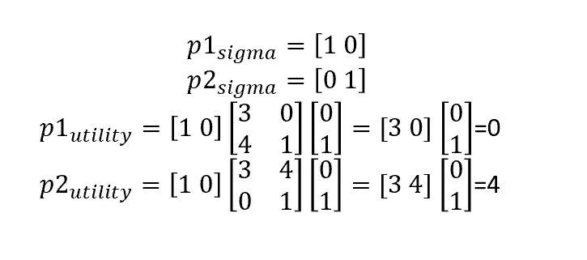

# Nashpy 算法博弈论

> 原文：<https://towardsdatascience.com/algorithmic-game-theory-with-nashpy-a73caf14296b?source=collection_archive---------13----------------------->


博弈论是一种研究战略形势的方法。“战略”情境是指影响你的结果不仅取决于你自己的行动，还取决于其他人的行动。让我们考虑公司市场:如果是完全竞争的情况，所有公司都是价格接受者，因此他们不必担心价格的战略设置。类似地，如果情况是垄断，市场中唯一的公司可以设定自己的价格，而不用关心其他公司的策略。

完全竞争和垄断之间的一切都是战略态势。

**算法博弈论**是博弈论和计算机科学的交叉领域，目标是理解和设计战略环境中的算法。

在本文中，我将借助 Nashpy 库，向您展示一个非常直观的博弈论 Python 实现。顾名思义，Nashpy 提供了算法途径来寻找游戏的纳什均衡。

博弈的纳什均衡是所有参与者都在做最佳反应分析的策略轮廓(我们稍后会解释这个概念)。基本上，它找到了一个均衡策略曲线 s*，使得每个人都采取了最佳对策。

但是“最佳对策”是什么意思呢？

为了更好地理解这个概念，让我们来看看众所周知的囚徒困境:


这个想法是，有两个玩家(囚犯)必须决定是否互相合作，在接受警方采访时不透露对方的名字。如果两者都合作，他们将各有 3 的效用。然而，他们被激励不合作，因为不合作的一方将获得 4 的效用(而另一方将一无所获)。然而，如果两者做出相同的推理，他们最终将不会合作，这意味着每个人只能获得 1 的效用。他们为什么要背离合作？让我们来看看参与人 1 (P1)的最佳对策分析

*   如果 P2 合作，P1 的最佳对策是不合作，因为 NC 的效用是 4>3。
*   如果 P2 不合作，P1 的最佳对策是不合作，因为 1>0。

因此，P1 有一个优势策略是(NC，NC)。由于这是一个对称的游戏，同样的推理也适用于 P2。因此，在这个博弈中，纳什均衡是(NC，NC)=P1 选择 NC，P2 选择 NC:每个参与者都选择自己的最佳对策来对抗对方。

现在让我们看看如何用 Python 实现这个过程。

首先，你必须在你的 Jupyter 控制台上运行 *pip 安装 nashpy* 然后导入模块。完成后，你就可以创建你的游戏环境了。对于一个非零和的 2 人游戏(这是 Nashpy 的默认解释)，你必须创建两个矩阵来代表每个玩家的观点。也就是说，对于 P1，我们将有:


而对 P2 来说:


让我们用 Python 做同样的事情:

```
import nashpy as nash
import numpy as np
P1=np.array([[3,0],[4,1]])
P2=np.array([[3,4],[0,1]])
prisoner_dilemma=nash.Game(P1,P2)prisoner_dilemma
```


我们也可以得到玩家策略的效用。也就是说，如果 P1 合作，而 P2 不合作，看表我们会看到这对效用是(0，4)。

我们通过查看游戏表获得了前一个结果(0，4)，但是我们可以通过矩阵计算获得相同的结果，这与 Nashpy 遵循的过程相同。事实上，如果我们考虑一个向量*∑*，只要行动的数量(在这种情况下，只有 2 个——合作和不合作)，其中每个条目都等于 0，除了玩家将采取的行动的位置，其中条目是 1，我们可以看到，当 P2 采取另一个给定行动时，从给定行动得出的 P1 的效用是:


P2 也是如此:


如果我们把这个公式应用到前面的例子中，当 P1 演奏 C，P2 演奏 NC 时，我们有:



让我们和 Nashpy 一起来看看吧:

```
p1_sigma=[1,0]
p2_sigma=[0,1]
prisoner_dilemma[p1_sigma,p2_sigma]
```


现在让我们看看我们的算法是否能够找到纳什均衡，如上所述，是(NC，NC):

```
eqs = prisoner_dilemma.support_enumeration()
list(eqs)
```


大家可以看到，纳什均衡由两个向量组成，每个向量表示一个玩家的行动:P1 有[0 1]，第二个位置的 1 表示 P1 会出 NC；同样的道理也适用于 P2。