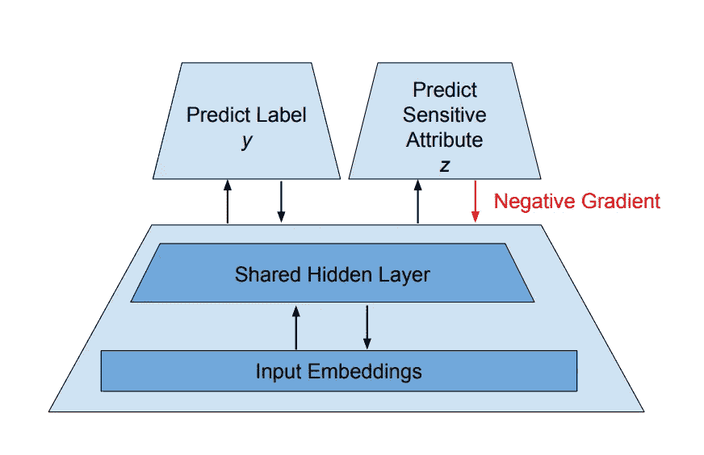
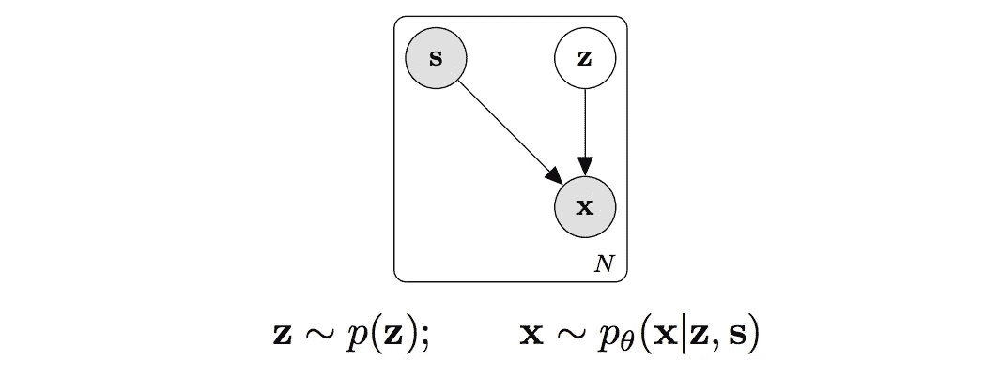
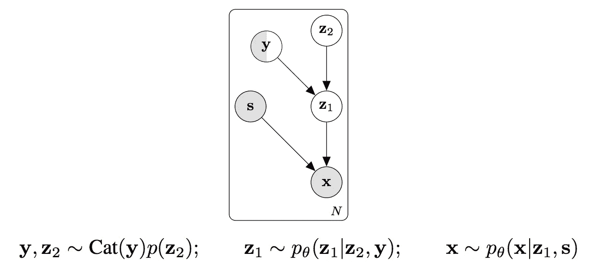
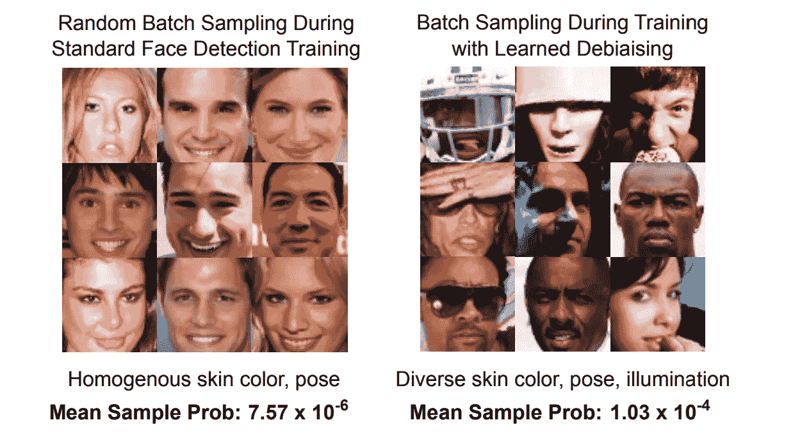
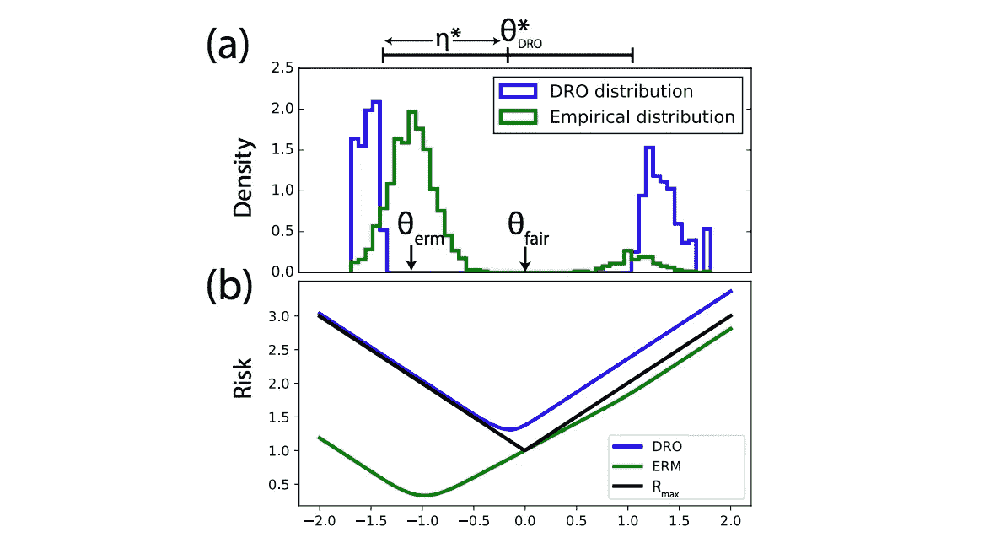

# 算法偏差的算法解决方案:技术指南

> 原文：<https://towardsdatascience.com/algorithmic-solutions-to-algorithmic-bias-aef59eaf6565?source=collection_archive---------3----------------------->

我想谈谈减轻算法偏差的技术方法。

现在是 2019 年，大多数 ML 社区终于公开承认 ML 模型中偏见的流行和后果。多年来，ProPublica 和《纽约时报》等组织的数十份报告一直在揭露算法歧视在刑事风险评估、T2、预测性警务、T4、信贷、招聘等领域的规模。不管是不是故意的，我们作为 ML 的研究人员和工程师不仅成为延续等级制度和加剧不平等的更广泛的社会政治项目的同谋，而且现在还对黑人不成比例的监狱判决和针对有色人种的住房歧视负有积极的责任。

对这种偏见的承认不能是谈话的结束。[我已经论证过](https://stanfordsphere.com/2018/05/21/silicon-valleys-libertarian-solution-is-regulation/)，并继续论证**即使是个别的 ML 工程师在这些自动化系统中也有塑造公平的直接作用**。偏见可能是人类的问题，但是偏见的放大是一个技术问题——一个数学上可以解释和控制的模型训练方式的副产品。因此，减轻现有的偏见也是一个技术问题:**，*算法上*，我们如何确保我们建立的模型没有反映和放大数据中的人类偏见？**

不幸的是，并不总是能够立即收集到“更好的训练数据”在这篇文章中，我给出了以下减少偏差的算法方法的概述，我希望对想要采取行动的个体从业者有用:

*   **通过保护敏感属性对模型进行对抗性去偏**，
*   用半监督的**可变“公平”自动编码器**对不变表示进行编码，
*   **基于学习的潜在表示的训练数据的动态上采样**，以及
*   通过**分布式鲁棒优化防止差异放大。**

我尽我所能从头到尾链接到库/代码/教程/资源，但是如果你想直接进入代码，那么 [AI 360 工具包](https://aif360.mybluemix.net/)看起来是个不错的起点。同时，让我们开始计算:)。

# I .对抗性去偏向

**对抗性去偏置**技术是目前对抗偏置最流行的技术之一。它依靠对抗性训练来消除模型学习到的潜在表征中的偏见。

假设 *Z* 是一些敏感的属性，我们希望防止我们的算法进行歧视，例如年龄或种族。简单地从我们的训练数据中移除 *Z* 通常是不够的，因为它通常与其他特征高度相关。我们真正想要的是防止我们的模型以任何实质性的方式学习依赖于 *Z* 的输入的表示。为此，我们训练我们的模型来**同时预测标签 Y 并防止共同训练的对手预测 Z** 。

直觉如下:如果我们的原始模型产生了一个主要编码关于 *Z* 的信息的 *X* 的表示(例如，种族)，那么一个敌对模型可以使用这个表示轻松地恢复和预测 *Z* 。从反面来看，如果对手无法恢复任何关于 *Z* 的信息，那么我们一定已经成功地学习了输入的一种表示，这种表示基本上不依赖于我们的受保护属性。

我们可以将我们的模型视为一个多头深度神经网络，一个头用于预测 Y，另一个头用于预测 Z。我们通常反向传播，除了我们在使用负梯度预测 Z 的头上发回一个*负*信号。

形式上，把 *g* (X)看作是我们输入的共享学习嵌入。我们让 *f* 是我们的预测函数，其中 Y= *f* ( *g* (X))，而 *a* 是我们的对手，其中 Z= *a* ( *g* (X))。我们的神经网络的最终目标是**学习一个表示 *g* (X ),使得 *f* 预测 Y 变得容易，但是 *a* 预测 Z** 变得困难。在最优化方面，我们希望最小化我们的预测损失 L_y( *f* ( *g* (X))，Y)并最大化对抗损失 L_z( *a* ( *g* (X))，Z)。

为了统一这些优化并控制两者之间的权衡，我们引入 J_λ，它是具有负梯度的恒等函数，即:

*   j(*g*(X))=*g*(X)，以及
*   dJ/dX = -λ d *g* (X)/dX。

使用 J_λ，其中λ是确定模型精度和移除敏感信息之间的折衷的超参数，我们可以用总体优化目标来训练我们的神经网络:

实际上，将对手视为一个独立的神经网络，拥有自己的权重，会更容易、更有效。在这种情况下，我们将预测器网络最后一层的输出馈入对抗网络的输入。

由于对手只是试图最小化自己的损失，我们照常根据梯度∇_uL_A 更新其权重 u。然而，预测器权重 W 的更新表达式变得有点复杂:

表达式中的第一项是预测值损失的梯度，用于最小化预测损失。第三项是对手*相对于预测者权重*的负梯度，其目的是最大化对手的损失。(注意，在这种情况下，α是控制精度/去偏置权衡的超参数)。这个提法的新颖之处在于中间的投影项。这个术语说:移除*预测器的梯度更新中所有*会对对手有贡献的成分。如果没有此项，预测者仍有可能做出对对手有利的更新，如下图所示:

The vector in the far upper-right corner (g) is our gradient from the prediction loss. If we try to maximize the adversary’s loss simply by adding its negative gradient with respect to W, we end up with the vector g+h, which still moves in the **positive** direction of the adversary’s gradient. We have to also remove the projection of g onto h to get rid of all components of g that help the adversary, bringing us to the upper-left vector.

除了我在这里描述的之外，还存在对抗去偏置方法的许多变体和改进。就在几天前，我与 CVPR 大学的一名研究人员聊天，他提出的模型最大化了对手预测的*熵*而不是损失，即网络寻求最大化地*迷惑*对手，而不是玩零和游戏来权衡预测准确性和偏差消除。根据您的用例，类似这样的变化可能也值得尝试。

## 哇，对抗性去偏见是如此之酷！我如何使用它/了解更多信息？

*   **代号** : [Colab 教程](https://colab.research.google.com/notebooks/ml_fairness/adversarial_debiasing.ipynb)；[图书馆](https://github.com/IBM/AIF360/blob/master/aif360/algorithms/inprocessing/adversarial_debiasing.py)。
*   **论文** : [Beutel，2017](https://arxiv.org/pdf/1707.00075.pdf)；[张，2018](https://arxiv.org/pdf/1801.07593.pdf) 。

# 二。可变“公平”自动编码器

另一种学习数据“公平”表示的技术是**变分公平自动编码器(VFAE)。** VFAE 将“公平性”表征为相对于数据集的某个已知方面而言*显式* ***不变*** *的表示。从概念上讲，这种技术是我最喜欢的技术之一，因为它非常巧妙地将 ML 偏差和更广泛的无监督和半监督表示学习领域的想法联系在一起。实际上，因为这是一种半监督的方法，它在利用未标记数据方面特别有用。*

## 快速 VAE 复习

如果你不熟悉变分自动编码器(VAE)，[这篇博文](/intuitively-understanding-variational-autoencoders-1bfe67eb5daf)提供了一个很好的直觉，Stefano Ermon 的[课堂笔记](https://ermongroup.github.io/cs228-notes/extras/vae/)做了一个建立数学的彻底工作。然而，由于 VAE 对于这种方法和下一种方法都是不可或缺的，所以我也想在这里提供一个简短的总结。

VAE 是一个生成模型，它学习输入的一些潜在表示的参数化。我们假设有一些潜在变量 z 来解释 x；我们有一个“编码器”网络 q(z|x ),它产生正态分布的μ和σ，从中可以对 z 进行采样，还有一个“解码器”网络 p(x|z ),它试图从编码 z 中重建 x。这里的关键是，我们希望学习编码器和解码器的参数，使数据的可能性最大化，但通常情况下，计算后验 p(z|x)是很难的。因此，我们训练我们的神经网络来最大化 p(x)的下限:

这个下限的第一项是我们的“重建损失”，它评估:*我们的解码器能够多好地从我们采样的编码中恢复输入*？第二项是 KL 散度正则化，它鼓励 *q* 产生类似于由 p(z)定义的标准法线的编码，它评估:*我们的编码器产生有意义的集群编码吗？*对这两个目标的训练一起鼓励模型发现潜在的空间，这些空间既**准确地捕捉我们的数据的语义**又**概括/插入我们的数据之外**。

## 回到算法公平:把 F 放入 VFAE

我们开始将 VFAE 公式化为一个无监督模型，该模型假设每个数据点 x 可以从两个“源”中概率性地生成:一个观察到的 s，它代表我们想要移除的变量，以及一个连续的潜在变量 z，它编码剩余的信息。

Unsupervised model.

直觉上，我们可以认为学习“无偏表示”的问题是恢复输入背后的*潜在的、概率性的信息来源，以某种方式明确地将敏感来源(s)与不变来源(z)分开。注意，这种方法，像前面讨论的对抗性去偏置方法一样，要求您*知道*并指定敏感源或特征是什么。*

使用上述 VAE 的下限，我们可以优化解码器 p_θ和编码器 q_φ以获得 z，这是一种捕获关于 x 的最显著的非敏感信息的编码:

不幸的是，无监督模型有一个明显的问题:如果敏感变量 *s* 和标签 *y* 实际上是相关的，我们可能最终得到 z 相对于 y 的*退化的*表示——也就是说，这些表示实际上没有编码关于标签的显著信息。为了解决这个问题，我们引入了第二层变量来尝试将 z 与 y 相关联，它由标签 y 本身和另一个潜在变量 z2 组成，z2 编码 z 中的剩余变量，即由 y 解释的*而不是*。注意，在下面的图和表达式中，z 现在表示为 z1。

Semi-supervised model.

直觉上，z2 将捕获并“解释掉”依赖于 x 的噪声，让我们期望的表示 z1 单独负责*找到能够解释标签 y 的 x 的不变表示。*

在特征提取阶段“注入”关于标签的信息的巧妙之处在于，即使标签不存在，我们也可以使用从数据中学习的解码器 q_φ(y|z1)来估算缺失的数据，其中 y *是*存在。换句话说，这种技术很容易扩展到半监督学习。完整的数学推导有点太长，这里不包括，但可以在[原始论文](https://arxiv.org/pdf/1511.00830.pdf)的 2.2 节中找到。

这种方法的最终贡献是使用**最大均值差异**作为进一步的正则化，以确保模型的“公平性”。虽然注入标签有助于防止退化表示，但如果标签 y 碰巧与敏感变量 s 相关，则关于该敏感变量的信息仍有可能通过 y“泄漏”到我们的表示中。为了解决这个问题，**我们在下界引入了一个最终惩罚项，以明确鼓励 z1 相对于 s** 保持不变；具体来说，我们鼓励分布 q_φ(z1|s = 0)和 q_φ(z1|s = 1)相似。

这个惩罚项是最大平均差异(MMD)，它测量两个分布(或它们各自的特征映射)的*平均嵌入*之间的平方距离。VFAE 的最终损失项简单地比较了 s=0 和 s=1 时 z1 的经验统计ψ()。

在形式上，我们的最终 VFAE 模型将变分自动编码器架构扩展到标记数据(x_n，s_n，y_n)和未标记数据(x_m，s_m ),并使用 MMD 来确保我们的学习表示 Z 相对于 s 的不变性:

## 好吧，我服了。我怎么能和 VFAE 一起潜水呢？

*   **代码** : [研究代码](https://github.com/dendisuhubdy/vfae/blob/master/vfae.py)(免责声明:这是在 Theano 中，此时只是疼)； [Jupyter 笔记本](https://github.com/yevgeni-integrate-ai/VFAE/blob/master/VFAE_blog.ipynb) (tensorflow)。
*   **论文** : [Louizos，2017](https://arxiv.org/pdf/1511.00830.pdf) 。

# 三。训练数据的动态上采样

我们的前两种技术都修改了模型的*学习表示*。他们使用结果(预测或关联敏感属性的能力)来规范数据的学习表示。下一种方法被称为**去偏置变分自动编码器，**实际上是*使用*学习表示来重新平衡训练数据。它的前提非常直观:由于许多现代 ML 系统由于在训练数据中缺乏适当的代表性而在某些人口统计学上失败，因此让模型**了解哪些输入来自代表性不足的群体，并在训练期间更频繁地对这些输入进行采样。**

这种方法的最大优点是，与前两种不同，它不要求您知道或指定数据中的敏感属性；*模型在训练时会自动学习它们*。因此，模型还可以自由地学习比人类注释者更复杂、更细微的“表示不足”的来源。例如，在面部识别中，人类可能很容易识别出人口中的哪些部分在训练数据中代表性不足，但要指定哪些姿势或面部表情出现频率太低而无法准确预测则困难得多。

去偏置变分自动编码器提出了一个非常简单的修正:**如果一个数据点在潜在空间的一个欠表示区域，在训练中对其进行上采样**。我们需要了解这种方法的两个组成部分:1)修改的 VAE 模型架构和 2)数据重新加权算法。

VAE 有一个标准编码器 q_φ(z|x)来逼近潜在变量，除了不是为 *k* 潜在变量产生标准的 *2k* 激活(即每个潜在变量的μ和σ)，而是产生 *2k+d* 输出，其中 *d* 是标签 y 的维度。换句话说，**VAE 编码器同时执行原始预测任务并学习训练数据的潜在表示**。我们还学习了一个标准解码器 p_θ(x|z ),它从学习到的潜在变量中重构输入。

总之，我们的网络用 3 个损失训练:预测任务的监督损失，重建输入的重建损失，和潜在变量的 KL 发散损失。

Note that the first term is a supervised classification loss, and the next two terms are the standard components of a VAE loss.

整体架构如下所示:

The modified VAE architecture. Note that z_0 is the predicted label and z_1 through z_k-1 are the latent variables used to update sampling probabilities.

现在，为了提升在潜在空间中未被充分表示的训练点，我们需要找出哪些数据点具有不常见或不常出现的潜在表示。为此，我们估计潜在空间(z)中变量的*频率分布*。注意，给定一个数据集 X，我们可以用直方图 Q_hat(z|X)来近似这个分布。随着潜在变量 *k* 的数量增加，该直方图的维数会变得非常大，因此我们进一步用每个潜在变量 z_i 的独立直方图来近似该联合分布:

为了直观地解释直方图 Q_i(z_i|X ),回想一下，每个潜在变量 z_i 都由μ_i 和σ_i 参数化，进一步回想一下，由于 z_i 以 X 为条件，因此每个输入 X 都有自己的潜在变量均值和标准差。直方图 Q_i 统计了整个数据集中这些平均值和标准偏差*的频率。给定任何输入 X，如果 Q_i(z_i(x)|X)很小，我们知道它通常呈现 z_i 的不常见值。如果 Q_j(z_j(x)|X)在所有(或许多)潜变量 z_j 中很小，我们知道 X 具有不常见的整体潜在表示*。**

使用这些直方图，我们可以使选择用于训练的数据点 x 的概率**与其在潜在空间**中的表示频率成反比

该模型将最终学会将小样本概率 W(z(x)|X)分配给标准图像，并将较大样本概率分配给非标准图像:

## 太好了，我准备好动态地重新平衡我所有的 ML 数据集了。

*   **代码**:不幸的是，我在任何地方都找不到这方面的代码:(，但我已经给论文作者发了电子邮件询问。同时，[该算法](https://github.com/IBM/AIF360/blob/master/aif360/algorithms/preprocessing/reweighing.py)是数据重新加权的另一个例子，除了它是在预处理阶段仅使用类别标签完成的(与在训练时间使用潜在表示动态相反)。
*   **论文:** [阿米尼，2019](https://www.aies-conference.com/2019/wp-content/papers/main/AIES-19_paper_220.pdf) 。

# 四。分布稳健优化

我们的最终偏差缓解策略直接修改了优化目标。它建议使用**分布稳健优化(DRO)** ，本质上是**最小化数据集**中每组的最坏情况损失，而不是经验风险最小化(ERM)的现状，即最小化数据集中的平均损失。这可能是所描述的所有方法中最通用的:它是模型不可知的，并且不需要我们知道保护组的身份或者它们在数据集中的比例。

在开始之前，我们需要澄清几个驱动 DRO 背后动机的术语。*表征差异*是指一个模型整体准确率高，但少数准确率低的现象。在我们正在运行的面部识别示例中，当识别引擎整体表现良好，但对某些少数群体表现不佳时，就会出现这种情况。*视差放大*另一方面，指的是通过 ML 模型中的正反馈回路，随着时间的推移，表示视差以某种方式被放大的现象。例如，少数群体可能会因为性能不佳而停止使用面部识别引擎，从而停止提供数据。类似地，使用预测警务算法的警察可能从一开始就不成比例地针对黑人社区，从而在这些社区捕捉到更多的犯罪，强化了模型的初始(历史和人类)偏差。

这种方法背后的论点是，表示差异是针对平均损失进行优化的结果。相反，通过为最坏情况群体进行优化，DRO 可以在 ERM 变得不公平的例子中取得成功，甚至防止这种模型中的差异放大。

形式上，我们考虑一个具有 k 个潜在群体的人口，其中每个群体 k 构成人口的一个比例⍺_k，并具有一个潜在分布 P_k。我们假设我们既不知道任何人口统计的比例也不知道潜在分布。每个输入 Z *~* P_k 都有一些损失，每个组的“风险”记为 R_k(θ)，是这些输入 Z 的预期损失。

DRO 的目标是控制所有 K 组的最坏情况风险，即:

但是，请注意，我们不能使用 R_max 直接优化，因为我们不知道数据集中任何组的身份，因此也不知道底层分布 P_k。这给我们留下了一个显而易见的问题:当我们不知道这些组的分布情况时，我们如何最小化每个组的最坏情况风险？

答案是，我们简单地考虑所有可能分布的最坏情况损失，这些分布合理地接近我们观察到的总体人口分布。具体来说，我们考虑在经验分布 P 的某个卡方半径 *r* 内的所有分布 *Q* :

由于我们也不知道最差群体的比例，我们选择这个半径 *r* 是基于我们愿意考虑的最小少数民族比例⍺_ *min* 。可以看出，我们需要考虑的最大鲁棒性半径将是 r*_ max*=(1/⍺_*min-*1)。

直观地说，我们现在正在为至少占已知总体分布 P. 的 **⍺_ *最小*百分比的**最坏情况基本分布**进行优化**

但是就优化过程的行为而言，这些看起来像什么呢？可以证明，在一定的约束条件下，R _ dro(θ；r *_max* )等价于以下(更有用的)表达式:

其中 C=(2*r_ *max* +1)^(1/2)，η为超参数。这个表达式使得 DRO 的行为更加明显:**所有损失小于η水平的数据点都被忽略，而损失远大于η的数据点由于平方项而被上加权。**下图说明了实际使用 DRO 时的这种行为:

从该图的面板(a)中，我们看到我们的数据集是两种基本分布的混合物，其中一种分布的数量远远超过另一种分布。针对平均损失进行优化的 ERM 估计自然只会针对多数群体进行优化，并产生完全不适合其他分布的θ_erm。与此同时，如果我们*知道*哪些数据点属于哪些组，并可以使用 R_ *max* 优化每个组中的最坏情况风险，我们最终会得到一个与两组等距的θ_fair。在没有任何组成员知识的情况下， **DRO 简单地忽略了所有损耗小于η*的例子，并在所有分布**的尾端上增加了高损耗的例子。结果，DRO 找到了一个最优的θ_dro*，它接近θ_fair，只是稍微偏向多数群体。

实际上，为了使用 DRO 训练任何神经网络，我们只需选择η值并计算最佳θ:

由于η是一个超参数，我们可以对可能的值进行二分搜索法以找到全局最优值。

## 我已经准备好(凭经验)和 DRO 一起捍卫失败者！

*   **代码** : [Codalab 工作表](https://worksheets.codalab.org/worksheets/0x17a501d37bbe49279b0c70ae10813f4c)(为珀西让他的研究生保持在可重复研究的领先地位而欢呼)。
*   **论文** : [桥本，2018](https://arxiv.org/pdf/1806.08010.pdf) 。

# 结论

我希望我描述的这些算法能够有用，但我也想强调一下**算法的公平性不能是故事的结尾**。即使最好的技术也是达到目的的手段，在一个几个世纪以来结构不平等、压迫和剥削的产物的世界里，关于“*的*终结”的问题往往不会产生令人惊讶的答案。**一个算法公平不代表它被公平使用**；我们的责任是批判性地询问谁从这些技术中受益，谁为此付出了代价，并直言不讳地说出我们的模型应该或不应该如何使用。为此，我强烈建议大家查看以下内容:

*   "[用于模型报告的模型卡](https://arxiv.org/pdf/1810.03993.pdf)(2019)，关于模型随附的标准化简短文档的提案，详细说明了它们的预期用途、评估结果、道德考虑和警告等。,
*   AI Now 研究院提出的[算法影响评估](https://medium.com/@AINowInstitute/algorithmic-impact-assessments-toward-accountable-automation-in-public-agencies-bd9856e6fdde)框架(2018)，
*   《纽约客》对美国第一个监管纽约市“自动决策系统”的法案(2017 年)及其遇到的法律、政治和企业绊脚石的分析
*   2019 年 4 月提交给参议院的“[算法问责法案](https://www.wyden.senate.gov/imo/media/doc/Algorithmic%20Accountability%20Act%20of%202019%20Bill%20Text.pdf)”以及讨论潜在缺点的相应[意见文章](https://www.nytimes.com/2019/05/07/opinion/tech-racism-algorithms.html)。

同时，请在评论中留下你的想法，一如既往地祝你黑客生涯愉快:)。