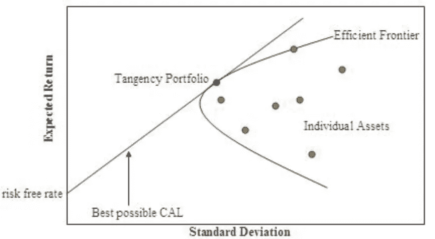
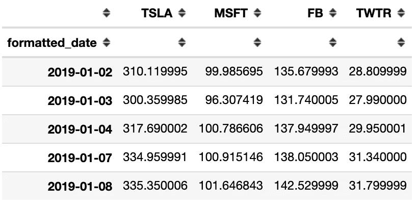
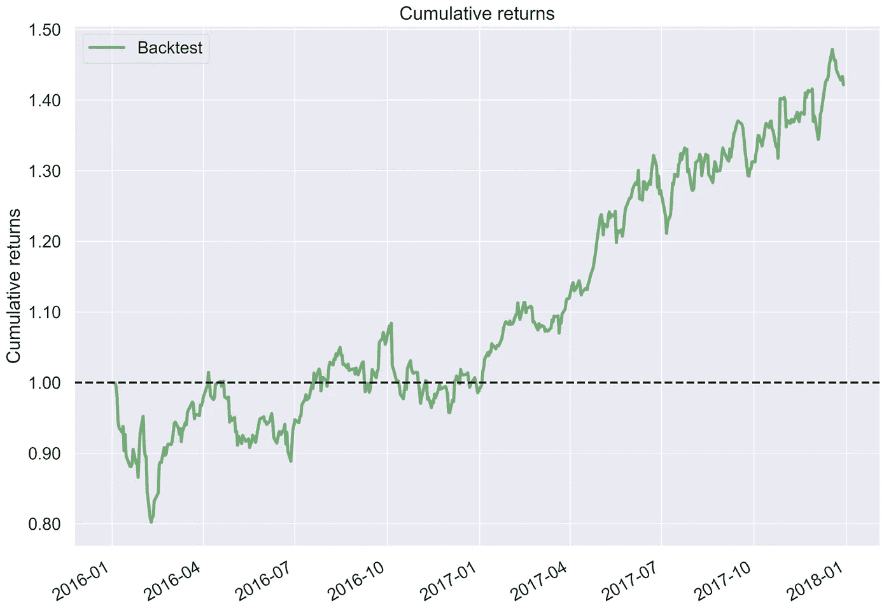
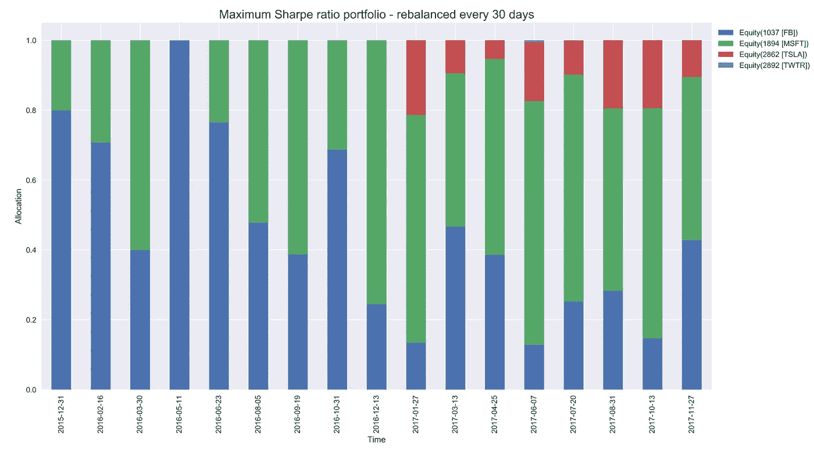
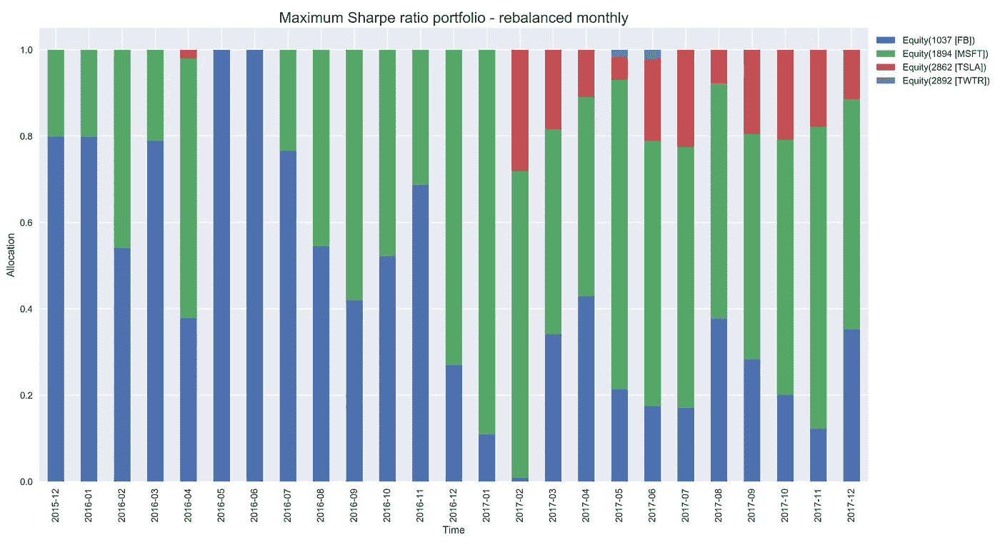
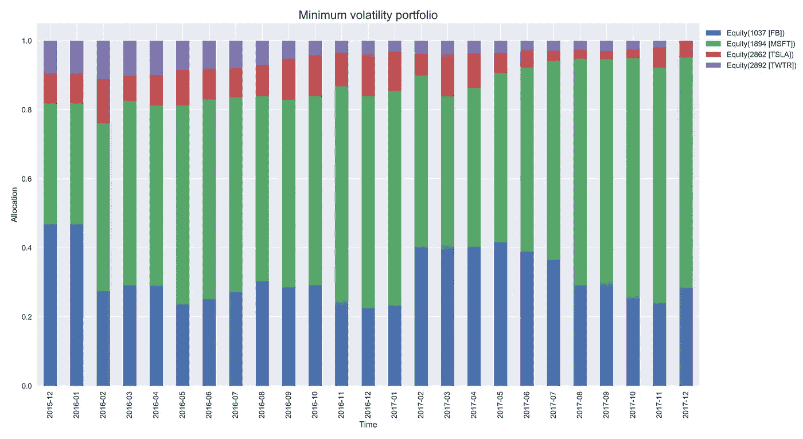
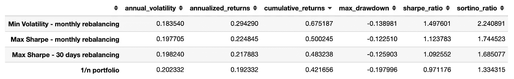

# Python 中基于均值-方差优化的算法交易

> 原文：<https://towardsdatascience.com/algorithmic-trading-based-on-mean-variance-optimization-in-python-62bdf844ac5b?source=collection_archive---------4----------------------->


Source: [pixabay](https://pixabay.com/photos/trading-analysis-forex-chart-643723/)

## 学习如何使用 Markowitz 的优化创建和实施交易策略！

这是 Python 中回溯测试交易策略系列文章的第 5 部分。之前的文章描述了以下主题:

*   介绍 zipline 框架并展示如何测试基本策略([链接](/introduction-to-backtesting-trading-strategies-7afae611a35e)
*   导入自定义数据以使用`zipline` ( [链接](/backtesting-trading-strategies-using-custom-data-in-zipline-e6fd65eeaca0))
*   评估交易策略的表现([链接](/the-easiest-way-to-evaluate-the-performance-of-trading-strategies-in-python-4959fd798bb3))
*   根据技术分析实施交易策略([链接](/algorithmic-trading-based-on-technical-analysis-in-python-80d445dc6943))

这一次，本文的目标是展示如何使用 Markowitz 的投资组合优化和现代投资组合理论来创建交易策略。

在这篇文章中，我首先简单介绍/提醒一下均值-方差优化，然后展示如何在交易策略中实现它。和以前一样，我将使用`zipline`框架对它们进行回溯测试。

# 设置

对于本文，我使用以下库:

```
zipline    1.3.0
matplotlib 3.0.0
json       2.0.9
empyrical  0.5.0
numpy      1.14.6
pandas     0.22.0
pyfolio    0.9.2
```

# 均值-方差优化入门

1952 年，哈里·马科维茨出版了《投资组合选择》,描述了一种现在被称为现代投资组合理论(简称 MPT)的投资理论。一些关键要点是:

*   投资组合收益是单个投资组合成分的加权平均值，然而，波动性也受到资产之间相关性的影响
*   投资者不应该单独评估资产的表现，而是要看它们会如何影响投资组合的表现
*   分散投资(将资金分配到多种资产上，而不是一种或几种资产上)可以大大降低投资组合的波动性

我们不会深入研究 MPT 的假设，但主要的是所有投资者都有一个共同的目标，即在尽可能避免风险的同时最大化投资回报，他们可以以无风险利率(无限制)借入和借出资金，并且不考虑交易成本。

基于以上所述，均值-方差分析是寻找最佳资产分配的过程，该过程提供了预期回报和风险(以回报的方差衡量)之间的最佳权衡。与均值-方差分析相关的一个关键概念是有效边界(Efficient Frontier)，即在给定风险水平下提供最高预期投资组合回报的一组最优投资组合，或者换句话说，提供预期投资组合回报的最低风险水平。



Visualization of the Efficient Frontier — Source: [wikipedia](https://en.wikipedia.org/wiki/Efficient_frontier#/media/File:Markowitz_frontier.jpg)

从数学上讲，该问题的一种可能表述如下:

其中 *w* 为权重向量， **μ** 为资产收益向量，**σ**为协方差矩阵， **μ** *_p* 为目标预期投资组合收益。其中两个限制是:

*   非负权重 0 不允许卖空
*   权重总和必须为 1，不允许使用杠杆

为了解决这个问题并获得有效边界，我们可以定义一个可能的预期投资组合回报范围，然后为每个值找到最小化方差的权重。幸运的是，有一个库可以让这个过程变得非常简单。

[**PyPortfolioOpt**](https://pyportfolioopt.readthedocs.io/en/latest/index.html)只需要几行代码就可以解决整个优化问题。在本文中，我们将创建要么最大化预期夏普比率(投资组合每单位风险的超额回报)要么最小化整体波动性的投资组合。这两种投资组合都处于有效前沿。

我们在下面的简短例子中展示了如何使用`pypfopt`。首先，我们使用`yahoofinancials`下载历史股票价格。



`pypfopt`允许我们直接从价格轻松计算预期收益和协方差矩阵，无需事先转换成收益。

```
# calculate expected returns and sample covariance amtrix
avg_returns = expected_returns.mean_historical_return(prices_df)
cov_mat = risk_models.sample_cov(prices_df)
```

我们通过运行以下代码行来获得最大化夏普比率的权重:

```
# get weights maximizing the Sharpe ratio
ef = EfficientFrontier(avg_returns, cov_mat)
weights = ef.max_sharpe()
cleaned_weights = ef.clean_weights()
cleaned_weights
```

这导致以下权重:

```
{'FB': 0.03787, 'MSFT': 0.83889, 'TSLA': 0.0, 'TWTR': 0.12324}
```

为了方便起见，我们使用`clean_weights()`方法，因为它将非常小的权重截断为零，并将其余的取整。

# 战略

在本文中，我们使用以下问题设置:

*   投资者有 50000 美元的资本
*   投资时间跨度为 2016 年至 2017 年
*   该投资者只能投资以下股票:特斯拉、微软、脸书、Twitter
*   我们假设没有交易成本
*   不允许卖空(投资者只能卖出他/她目前拥有的股票)
*   在进行优化时，投资者考虑过去 252 个交易日来计算历史收益和协方差矩阵
*   第一个交易决定是在 12 月的最后一天做出的，但订单是在 2016 年 1 月的第一个交易日执行的

## 基准 1/n 策略

我们首先创建一个简单的基准策略，即**1/n 投资组合**。这个想法非常简单——在测试的第一天，我们将总资本的`1/n` %分配给所考虑的 n 项资产中的每一项。为了简单起见，我们不做任何重新平衡。

实践中经常发生的情况是，投资组合每 X 天重新平衡一次，使配置回到 1/n，为什么？我们可以想象，我们持有两种资产 X 和 Y 的投资组合，在投资期限开始时，分配是 50-50。一个月后，X 的价格急剧上升，而 Y 的价格下降。因此，资产 X 构成了我们投资组合价值的 65%，而 Y 只有 35%。我们可能想通过卖出一些 X，买入更多 y，重新平衡到 50-50。

下图显示了该策略产生的累积回报。



我们存储一些结果，以便与其他策略进行比较。

```
benchmark_perf = qf.get_performance_summary(returns)
```

## 最大夏普比率投资组合—每 30 天重新平衡一次

在这种策略中，投资者选择使投资组合的预期夏普比率最大化的权重。投资组合每 30 个交易日进行一次再平衡。

我们通过对当前交易日的数字(存储在`context.time`中)使用模运算(Python 中的`%`)来确定给定的一天是否是一个再平衡日。我们在除以 30 后的提醒数为 0 的日子重新平衡。

我们将在文章的最后检验所有策略的结果。然而，有趣的是，这里看到的是一段时间内的权重分配。



从剧情中得到的一些感悟:

*   在这个策略中，Twitter 几乎没有任何投资
*   有时整个月都会被跳过，比如 2016 年 1 月或 2016 年 4 月。这是因为我们每 30 个交易日进行一次再平衡，而一个月平均有 21 个交易日。

## 最大夏普比率投资组合—每月重新平衡

这种策略与前一种非常相似，我们也选择最大化投资组合预期夏普比率的权重。不同之处在于再平衡方案。首先，我们定义了`rebalance`方法，它计算最佳权重并相应地执行订单。然后，我们使用`schedule_function`对其进行调度。在当前设置下，重新平衡发生在市场关闭(`time_rules.market_close`)后的本月最后一个交易日(`date_rules.month_end`)。

我们还会随着时间的推移检查重量:



每月重新平衡时，我们确实有所有月份的条目。还有，在这种情况下，2017 年年中对 Twitter 有一些小的投资。

## 最小波动性投资组合—每月重新平衡

这一次，投资者通过最小化波动率来选择投资组合权重。多亏了`PyPortfolioOpt`，这就像在前面的代码片段中将`weights = ef.max_sharpe()`改为`weights = ef.min_volatility()`一样简单。

最小波动性策略产生的权重在一段时间内肯定是最稳定的——在两个连续时期之间没有太多的重新平衡。当我们考虑交易成本时，这当然很重要。



# 比较性能

从下面的比较中我们看到，在回溯测试期间，最小化波动性的策略获得了最好的回报和最低的投资组合波动性。它的表现也比夏普比率最大化的策略好得多。

另一个有趣的观察是，所有使用优化创建的定制策略的性能都优于简单的 1/n 分配结合买入并持有。



# 结论

在本文中，我展示了如何将`zipline`与`pypfopt`结合起来，以便对基于均值-方差优化的交易策略进行回溯测试。我们只讨论了夏普比率最大化或整体波动性最小化的投资组合，但是，肯定还有更多可能性。

一些可能的未来方向:

*   在优化方案中，考虑分配中最大的潜在变化。对于零佣金设置，这不是问题，但是，在存在交易成本的情况下，如果我们每隔 X 天完全重新平衡，我们希望避免在费用上花费太多。
*   允许卖空
*   在优化问题中使用自定义目标函数—使用不同的评估指标进行优化

重要的是要记住，该策略在过去表现良好的事实并不能保证这种情况在未来会再次发生。

一如既往，我们欢迎任何建设性的反馈。你可以在推特[或评论中联系我。您可以在我的](https://twitter.com/erykml1) [GitHub](https://github.com/erykml/medium_articles/blob/master/Quantitative%20Finance/technical_analysis_strategies.ipynb) 上找到本文使用的代码。

我最近出版了一本关于使用 Python 解决金融领域实际任务的书。如果你有兴趣，我贴了一篇文章介绍这本书的内容。你可以在[亚马逊](https://www.amazon.com/Python-Finance-Cookbook-libraries-financial-ebook/dp/B083KG9DC7)或者 [Packt 的网站](https://www.packtpub.com/data/python-for-finance-cookbook)上买到这本书。