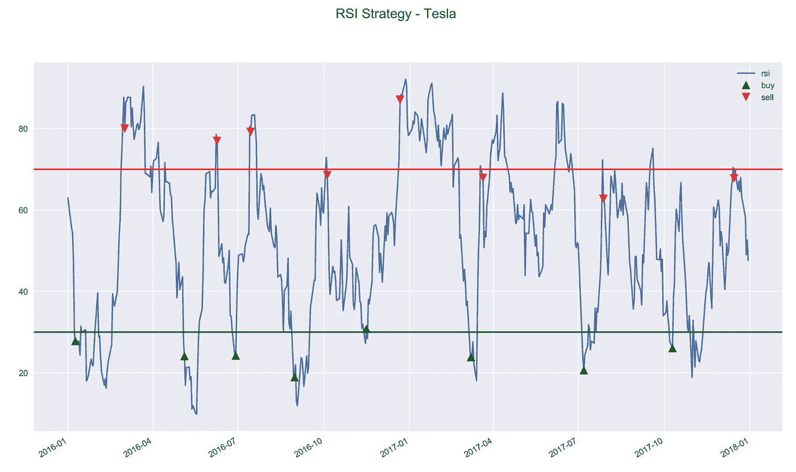

# 基于 Python 技术分析的算法交易

> 原文：<https://towardsdatascience.com/algorithmic-trading-based-on-technical-analysis-in-python-80d445dc6943?source=collection_archive---------1----------------------->


Source: [unsplash](https://unsplash.com/photos/EMPZ7yRZoGw)

## 学习如何根据技术分析制定和实施交易策略！

这是 Python 中回溯测试交易策略系列文章的第四部分。之前的文章描述了以下主题:

*   介绍 zipline 框架并展示如何测试基本策略([链接](/introduction-to-backtesting-trading-strategies-7afae611a35e))
*   导入自定义数据以使用 zipline ( [link](/backtesting-trading-strategies-using-custom-data-in-zipline-e6fd65eeaca0) )
*   评估交易策略的绩效([链接](/the-easiest-way-to-evaluate-the-performance-of-trading-strategies-in-python-4959fd798bb3))

这一次，文章的目标是展示如何根据技术分析(简称 TA)创建交易策略。引用维基百科，技术分析是一种“通过研究过去的市场数据，主要是价格和交易量来预测价格方向的方法”。

在本文中，我将展示如何使用一个流行的 Python 库来计算 TA 指标——`TA-Lib`——以及`zipline`回溯测试框架。我将创建 5 个策略，然后调查哪一个在投资期限内表现最好。

# 设置

对于本文，我使用以下库:

```
pyfolio    0.9.2
numpy      1.14.6
matplotlib 3.0.0
pandas     0.22.0
json       2.0.9
empyrical  0.5.0
zipline    1.3.0
```

# 助手功能

在创建策略之前，我定义了几个助手函数(这里我只描述其中一个，因为它是影响回溯测试的最重要的一个)。

该函数用于获取回溯测试的修改开始日期。这是因为我希望所有的战略在同一天开始实施——2016 年的第一天。然而，一些基于技术指标的策略需要一定数量的过去观察值——即所谓的“热身期”。这就是为什么我使用这个函数计算回溯测试应该开始的日期，这样在投资期限的第一天，我已经有足够的过去的观察来计算指标。请记住，在回溯测试的真正开始日期之前，不能做出任何交易决定！

更新:实际上没有明确需要使用这种方法。当我们在`data.history`中指定`bar_count`时，`zipline`将自动获取先前可用的棒线数量，即使它们来自回溯测试之前的一段时间。我在这里使用了这种方法。

# 战略

在本文中，我们使用以下问题设置:

*   投资者有 10000 美元的资本
*   投资时间跨度为 2016 年至 2017 年
*   投资者只能投资特斯拉的股票
*   我们假设没有交易成本——零佣金交易
*   不允许卖空(投资者只能卖出他/她目前拥有的股票)
*   当投资者建仓(买入股票)时，投资者“全押”——分配所有可用资源进行购买

选择这个日期范围的原因之一是，从 2018 年年中开始，Quandl 数据集没有更新，我们希望尽可能保持代码简单。关于如何将自定义数据(包括最新的股票价格)加载到`zipline`中的详细内容，请参考我在[之前的文章](/backtesting-trading-strategies-using-custom-data-in-zipline-e6fd65eeaca0)。

## 买入并持有策略

我们从最基本的策略开始——买入并持有。这个想法是，我们购买某项资产，在整个投资期限内不做任何事情。因此，在第一个可能的日期，我们用我们的资本尽可能多地购买特斯拉股票，之后什么也不做。

这个简单的策略也可以被认为是更先进的策略的基准——因为使用一个非常复杂的策略产生的钱(一般来说或由于交易成本)比购买一次而什么都不做更少是没有意义的。

我们加载性能数据框架:

```
buy_and_hold_results = pd.read_pickle('buy_and_hold.pkl')
```

这里可能发生的(它没有发生，但意识到这种可能性是件好事)是负面`ending_cash`的突然出现。原因可能是我们想要购买的股票数量是在一天结束时使用当天的(收盘)价格计算的。但是，订单在第二天执行，价格可能会发生显著变化。在`zipline`,订单不会因为资金不足而被拒绝，但我们最终可能会出现负结余。这种情况大多发生在“全押”策略中。我们可以想出一些方法来避免这种情况，例如手动计算我们第二天可以购买的股票数量，还可以包括一些加价来防止这种情况发生，但是，为了简单起见，我们接受这种情况可能发生。

我们使用一个助手函数来可视化策略的一些细节:投资组合价值的演变、价格序列顶部的交易以及每日回报。

```
visualize_results(buy_and_hold_results, 'Buy and Hold Strategy - TSLA')
```


我们还创建了性能摘要(使用另一个助手函数)，它将在最后一节中使用:

```
buy_and_hold_perf = get_performance_summary(buy_and_hold_results.returns)
```

为了简洁起见，我们不会展示每种策略的所有这些步骤(比如加载性能数据帧或获取性能摘要)，因为它们每次都以相同的方式完成。

## 简单移动平均策略

我们考虑的第二个策略是基于简单移动平均线(SMA)。该战略的逻辑可以总结如下:

*   当价格向上穿过 20 日均线时，买入股票
*   当价格向下穿过 20 日均线时，卖出所有股票
*   移动平均线使用前 19 天和当天——交易决定是第二天的

这是我们第一次需要使用之前定义的 helper 函数来计算调整后的起始日期，这将使投资者能够在 2016 年的第一个交易日做出交易决策。

```
get_start_date('TSLA', '2016-01-04', 19)
# '2015-12-04'
```

在下面的策略中，我们使用调整后的日期作为开始日期。

> 注:`data.current(context.asset, ‘price’)`相当于`price_history[-1]`。

下面我们举例说明这个策略:


下图显示了价格序列和 20 天移动平均线。我们另外标记了订单，这些订单将在信号产生后的下一个交易日执行。


## 移动平均交叉

这种策略可以被认为是前一种策略的扩展——我们使用不同窗口大小的两个平均值，而不是单个移动平均值。100 日均线需要更长的时间来适应价格的突然变化，而 20 日均线要快得多。

该战略的逻辑如下:

*   当快速移动平均线向上穿过慢速移动平均线时，我们买入资产
*   当慢速移动平均线向上穿过快速移动平均线时，我们卖出资产

请记住，对于这种策略，可以考虑许多不同的窗口长度组合来定义快速和慢速移动授权。

对于此策略，我们需要额外获取 100 天的数据，以应对“预热期”。


下面我们在价格系列的顶部绘制了两条移动平均线。我们看到该策略产生的信号比基于 SMA 的策略少得多。


## MACD

MACD 代表移动平均线收敛/发散，是股票价格技术分析中使用的指标/振荡器。

MACD 是使用历史收盘价计算的三个时间序列的集合:

*   MACD 系列——快速(短期)和慢速(长期)指数移动平均线之间的差异
*   信号——MACD 序列的均线
*   散度——MACD 级数和信号之间的差异

MACD 由用于计算三个移动平均线(MACD(a，b，c))的天数来参数化。参数 *a* 对应快速均线， *b* 对应慢速均线， *c* 对应 MACD 信号均线。最常见的设置，也是本文中使用的，是 MACD(12，26，9)。从历史上看，这些数字对应于基于 6 天工作周的 2 周、1 个月和 1.5 周。

需要记住的一点是，MACD 是一个滞后指标，因为它是基于移动平均线的。这就是为什么 MACD 对于没有趋势或者价格波动不稳定的股票不太有用。

我们在本文中使用的策略可以描述为:

*   当 MACD 向上穿过信号线时买入股票
*   当 MACD 向下穿过信号线时卖出股票

和以前一样，为了计算预热时间，我们需要确定我们有 34 个观测值来计算 MACD。


下面我们画出了 MACD 和信号线，交叉线表示买入/卖出信号。此外，人们可以以柱状图的形式绘制 MACD 散度(通常称为 MACD 直方图)。


## RSI

RSI 代表相对强弱指数，这是另一个我们可以用来制定交易策略的技术指标。RSI 被归类为动量振荡器，它测量价格方向运动的速度和幅度。动量描述了资产价格上涨或下跌的速度。

不涉及太多的技术细节，RSI 测量的是较高收盘价与较低收盘价的比值。具有更多/更强正变化的资产比具有更多/更强负变化的资产具有更高的 RSI。

RSI 的输出是一个从 0 到 100 的数字，通常以 14 天为基础进行计算。为了生成交易信号，通常将 RSI 的高低水平分别指定为 30 和 70。对阈值的解释是，较低的阈值表示资产超卖，较高的阈值表示资产超买。

有时，中等水平(介于低和高之间)也被指定，例如在策略中也允许卖空。我们还可以选择更极端的阈值，如 20 和 80，这将表明更强的势头。然而，这应该使用领域知识或通过运行回溯测试来指定。

我们考虑的策略可以描述为:

*   当 RSI 越过下限(30)时，买入资产
*   当 RSI 超过上限(70)时，卖出资产


下面我们将 RSI 与上限和下限一起绘制。



# 评估绩效

最后一步包括将所有性能指标放入一个数据框架中，并检查结果。我们可以看到，在我们的回溯测试中，基于简单移动平均线的策略在产生的回报方面表现最好。它还拥有最高的夏普比率——每单位风险的最高超额回报(在这里是回报，因为我们不认为是无风险资产)。第二好的策略是基于 MACD 的策略。值得注意的是，只有这两只股票的表现好于基准的买入并持有策略。

```
perf_df = pd.DataFrame({'Buy and Hold': buy_and_hold_perf,
                        'Simple Moving Average': sma_perf,
                        'Moving Average Crossover': mac_perf,
                        'MACD': macd_perf,
                        'RSI': rsi_perf})
perf_df.transpose()
```


# 结论

在这篇短文中，我展示了如何将`zipline`和`talib`结合起来，根据流行的技术指标，如均线、MACD、RSI 等，对交易策略进行回溯测试。但这只是开始，因为有可能创造更复杂的策略。

一些可能的未来方向:

*   在策略中包括多种资产
*   允许卖空
*   混合指标
*   对每个策略的不同参数进行回溯测试，以找到性能最佳的策略

我们还必须记住，该战略在过去表现良好的事实并不能保证这种情况在未来会再次发生。

一如既往，我们欢迎任何建设性的反馈。你可以在推特上或评论中联系我。你可以在我的 [GitHub](https://github.com/erykml/medium_articles/blob/master/Quantitative%20Finance/technical_analysis_strategies.ipynb) 上找到本文使用的代码。

喜欢这篇文章吗？成为一个媒介成员，通过无限制的阅读继续学习。如果你使用[这个链接](https://eryk-lewinson.medium.com/membership)成为会员，你将支持我，而不需要额外的费用。提前感谢，再见！

以下是该系列的其他文章:

*   基于均值-方差分析建立算法交易策略([链接](/algorithmic-trading-based-on-mean-variance-optimization-in-python-62bdf844ac5b))

我最近出版了一本关于使用 Python 解决金融领域实际任务的书。如果你有兴趣，我贴了[一篇文章](/introducing-my-book-python-for-finance-cookbook-de219ca0d612)介绍这本书的内容。你可以在亚马逊或者 Packt 的网站上买到这本书。