# 算法交易机器人:Python

> 原文：<https://towardsdatascience.com/algorithmic-trading-bot-python-ab8f42c37145?source=collection_archive---------1----------------------->

随着云计算的兴起，免佣金交易 API 已经让普通人运行自己的算法交易策略成为可能。你需要的只是一条小蟒蛇和一点运气。我将向你展示如何使用[羊驼](https://alpaca.markets/)在谷歌云平台(GCP)上运行一个。一如既往，所有的代码都可以在我的 [GitHub 页面](https://github.com/robsalgado/personal_data_science_projects/tree/master/trading_bot)上找到。

你首先需要的是一些数据。有一些免费的数据来源，当然也有需要花钱的来源。我将使用免费的 [TD Ameritrade API](https://developer.tdameritrade.com/apis) 。接下来你需要的是一个交易平台，你可以通过 API 提交免佣金交易。

为此我会用羊驼毛。羊驼也允许纸交易(假币)，所以我们可以在野外测试我们的策略，而不会让我们的家庭破产💸。然后，您只需要一种方法来自动运行您的机器人和存储/检索数据。为此，我们将使用 GCP，因为这是我所熟悉的，但任何云平台(AWS，Azure 等)。)也一样管用。

Photo by [M. B. M.](https://unsplash.com/@m_b_m?utm_source=unsplash&utm_medium=referral&utm_content=creditCopyText) on [Unsplash](https://unsplash.com/s/photos/stocks?utm_source=unsplash&utm_medium=referral&utm_content=creditCopyText)

哦，当然你需要一个交易策略。这篇文章是关于建立运行交易策略的框架，所以策略本身并不重要，也不是重点。出于演示的目的，我将使用动量策略，寻找在过去 125 天内具有最大动量且每天交易的股票。

你不应该在没有彻底回测的情况下盲目使用这个策略。我真的不能强调这一点。你不应该接受我的投资建议，你很可能会后悔😄。

# 数据

你首先需要的是大量的股票。我会用纽约证券交易所上市的所有股票。为了得到这些股票的代码，我们要从 eoddata.com 那里刮下来。然后，我们可以从 TD Ameritrade API 请求这些股票代码的数据。

一旦我们有了数据，我们将把它存储在一个 BigQuery (BQ)表中，这样我们就可以在以后的策略中得到它。这一切都将在一个云函数中运行，我们可以安排在每个工作日收盘后运行，以获得最新的收盘价。

我将 API 凭证存储在云存储的一个文本文件中，因此它们不是硬编码的。我们只是通过 API 调用从那里检索它们。然后我们得到日期来检查市场是否开放。然后我们抓取纽约证券交易所的股票代码，并将它们传递给 TD Ameritrade API，以获取当天的数据。

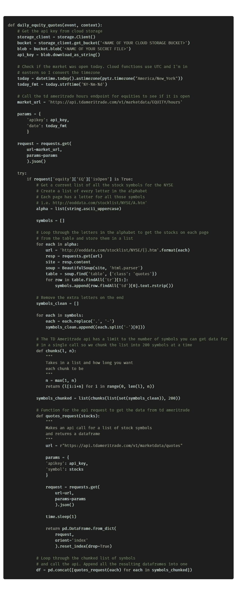

然后，我们通过 API 将数据存储在一个 BQ 表中，以便稍后用于我们的 bot。

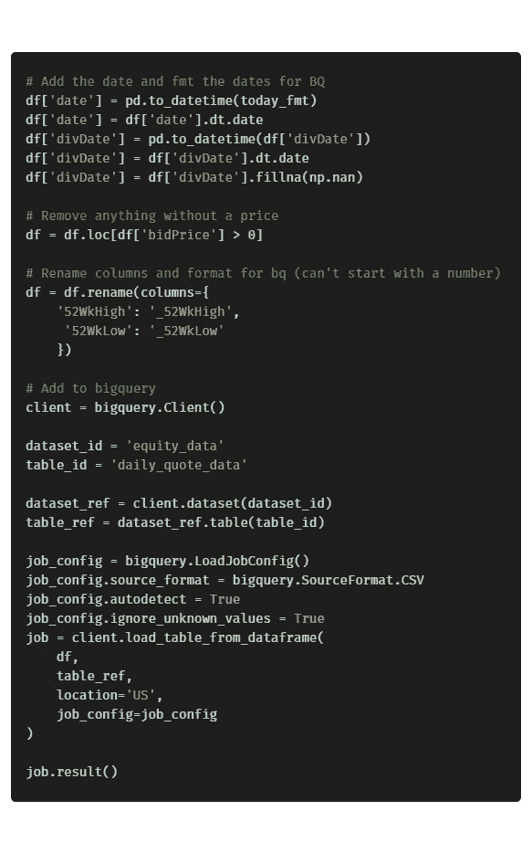

我只使用收盘价，但是 API 返回了更多的数据，所以把所有数据都存储起来是个好主意。我创建了一个名为“equity_data”的数据集，该表将被命名为“daily_quote_data”。如果该表不存在(即，您第一次这样做时)，将创建该表，然后每天都会向该表追加新数据。

在 GCP，你可以用这个脚本创建一个云函数。要安排这个云功能在设定的时间运行，只需为触发选项选择“云发布/订阅”并创建一个主题。

然后转到 Cloud Scheduler，将主题设置为在需要时运行。在这里，我们将它设置为每个工作日东部时间下午 5 点运行。频率以 unix-cron 格式设置。有效载荷只是一个将要发送的消息，可以是您想要的任何内容，但它是必需的。

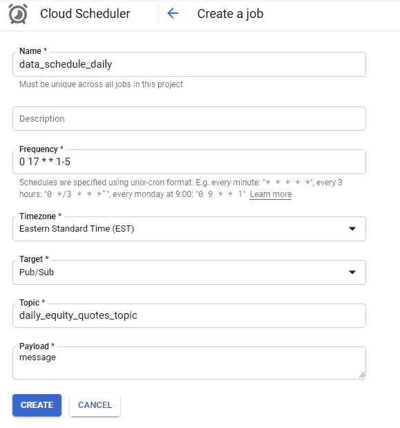

将云函数的超时设置为最大值 540 秒也是一个好主意，这样可以避免超时。这可以在高级选项部分找到。

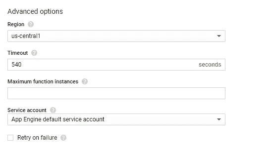

这将下载未来的数据，但我们也需要交易机器人的备份数据。我在这里使用的端点是“报价”端点，它不提供历史数据。要获得历史价格数据，您必须使用“pricehistory”端点。我在 GitHub 文件夹中提供了一个名为“get_historical_data.py”的文件。您可以在本地运行该文件，然后将数据帧下载到 csv 中，并上传到 BQ 表中。

# **交易机器人**

基本上，交易机器人需要能够:

1.  知道我们有多少钱可以交易
2.  获取在策略中使用的数据
3.  根据策略选择我们想要的股票
4.  买入/卖出这些股票来更新我们的投资组合

整个云函数在较长的一边，所以我在这里总结一下，但是完整的代码在我的 GitHub 上。就像我说的，策略在这里并不重要，我使用了一个简单的动量策略，选择了过去 125 天中动量最高的 10 只股票。

首先，我们从 BQ API 将历史数据下载到动量策略的数据框架中:

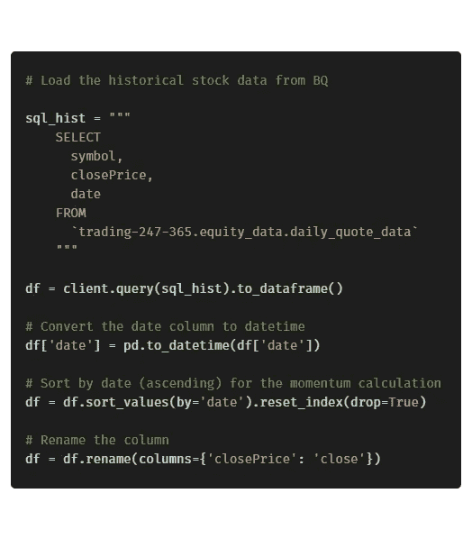

然后我们从羊驼 API 得到当前头寸和我们当前的投资组合价值。他们有一个我在这里使用的 API [包装器](https://github.com/alpacahq/alpaca-trade-api-python)。凭证再次存储在云存储上的文本文件中。请注意，我们使用的基本 url 是用于纸张交易的。你可以在你的纸上交易账户中设置任何金额，这里我设置为$10K。显然，如果这是你第一次运行这个程序，你不会在羊驼有任何头寸，所以在你运行云函数之前，只需在本地运行脚本，根据你选择的动量股票获得你的初始投资组合。然后把那些送到羊驼 API 去买。我假设你已经这么做了。

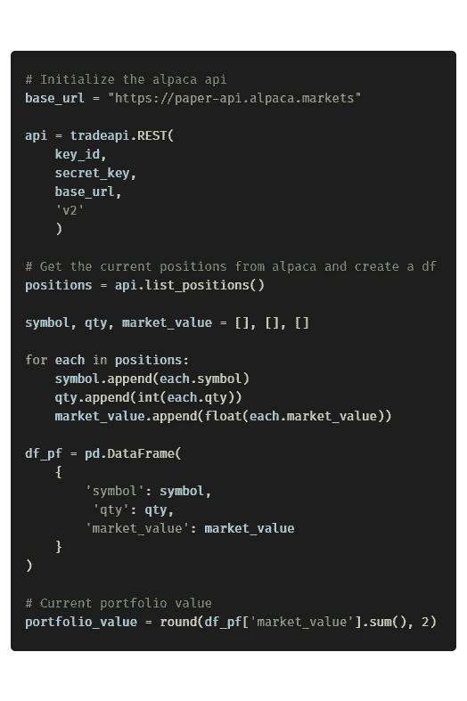

现在我们有了历史数据和交易金额，我们可以根据我们的策略选择股票。第一步是识别动量最高的股票。

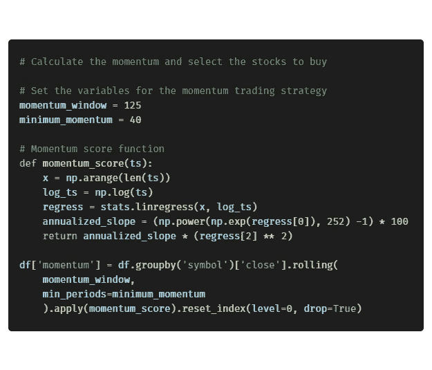

动量计算来自安德烈亚斯·f·克莱诺的《交易的演变》一书，我推荐这本书。它非常容易理解，并且针对不同类型的策略有很多不同的代码示例。

它的工作方式是计算每只股票在过去 125 天(最少 40 天)的收盘价的线性回归。下一步是让它更容易让人理解。它取回归线斜率的指数(告诉你每天上涨或下跌的百分比)，然后按年计算(252 的幂，这是一年中的交易天数)并乘以 100。然后乘以 r 的平方值，这将为很好地解释方差的模型提供权重。

在我们确定了动量得分最高的前 10 只股票后，我们需要决定每只股票的购买数量。投资组合配置本身就是一个完整的主题，所以我不会在这里深入讨论，因为它并不重要。为了在这里进行分配，我使用了 [pyportfolioopt](https://pyportfolioopt.readthedocs.io/en/latest/index.html) 库。

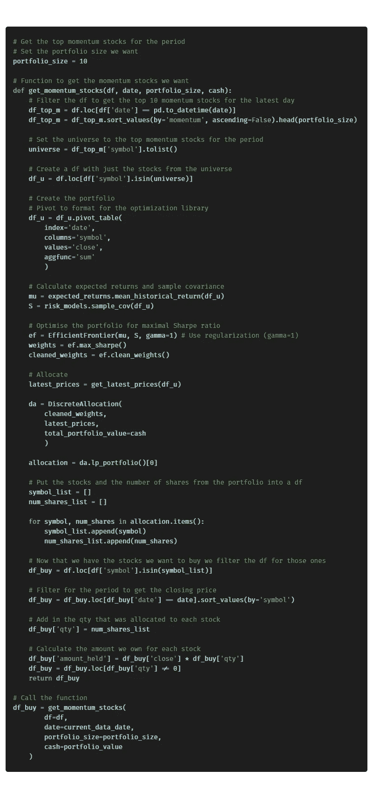

我们现在有一个 df，上面有我们想买的股票和数量。现在我们需要弄清楚，根据我们当前的投资组合，我们是否需要卖出任何股票。有可能:

1.  我们今天对动量股票的选择和分配与昨天完全一样，我们不需要进行任何买卖
2.  在我们目前的投资组合中，有些股票我们根本不想再持有了
3.  我们今天想买的股票和我们目前持有的股票是一样的，但是我们想持有的数量发生了变化(增加或减少)
4.  我们今天想买一些新股票，这些股票昨天不在我们的投资组合中

我们需要检查所有这些东西，并进行任何必要的销售或购买。首先，我们将检查当前投资组合中是否有我们不再需要的股票。

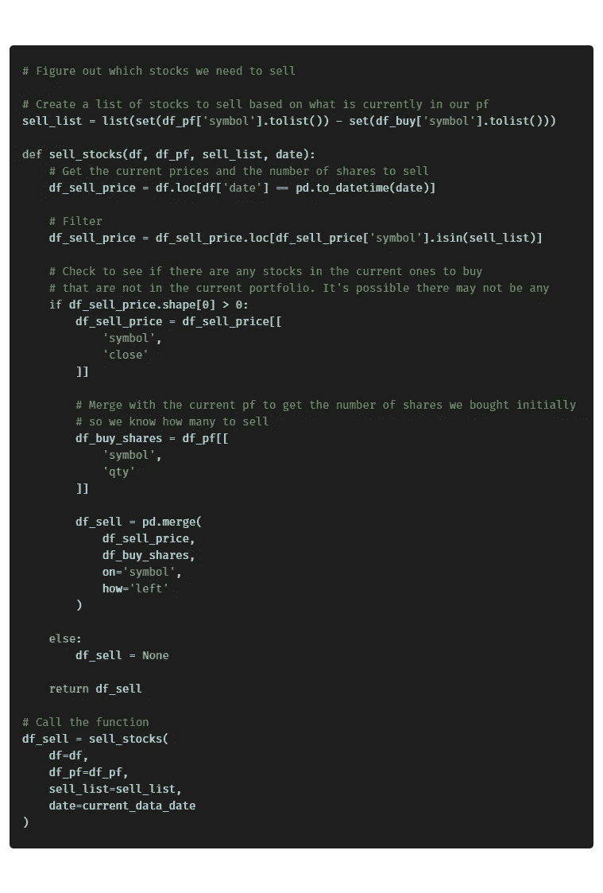

现在我们有了一个数据框架，其中包含了我们想要出售的任何股票以及我们需要出售的数量。接下来，我们将查看我们当前拥有的任何股票数量是否减少了。同样，从技术上讲，这里可能没有变化，所以我们需要检查是否有变化。这将给我们一个最终的数据框架，包含我们需要卖出的所有股票。

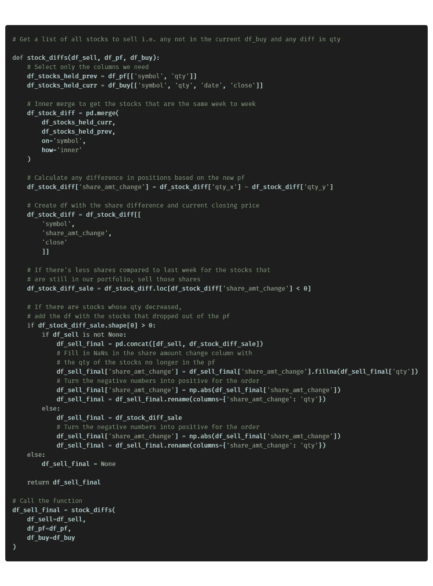

现在我们已经有了要出售的股票的完整列表(如果有的话)，我们可以将它们发送给羊驼 API 来执行订单。

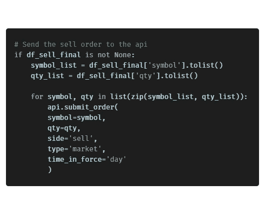

最后，我们需要看看是否有我们目前持有的新股票数量增加了，或者是否有我们今天想买但昨天没有的新股票。

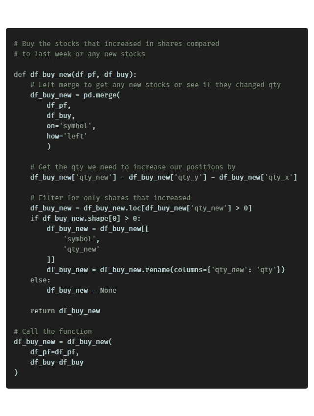

如果我们需要购买任何产品，我们会将订单发送给 API。

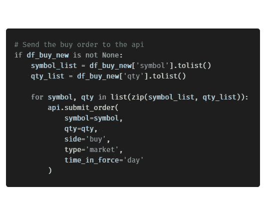

完成后，记录投资组合也是一个好主意。羊驼只允许你有一个单一的纸交易账户，所以如果你想运行多个算法(你应该)，你应该创建一个日志，这样你就可以自己跟踪它们。我们可以创建一个策略栏来将此策略与其他策略区分开来。然后，我们可以简单地将它添加到另一个 BQ 表中。

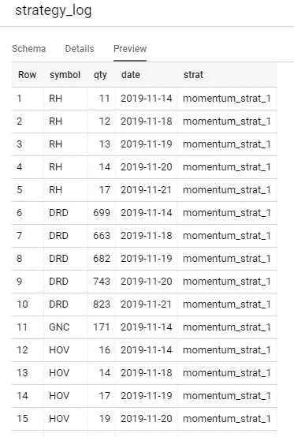

下面的 SQL 查询将为您提供您的投资组合与前一天相比的每日总额和百分比变化。

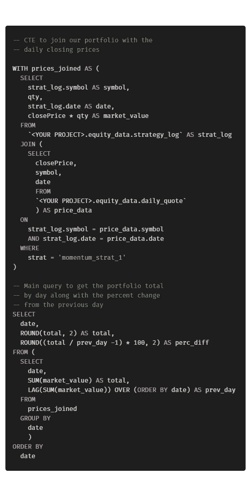

那是机器人。现在，您可以安排它在云函数中每天运行。这应该会给你一个很好的框架来运行你自己的交易策略。

Photo by [Frank Busch](https://unsplash.com/@frankbusch?utm_source=unsplash&utm_medium=referral&utm_content=creditCopyText) on [Unsplash](https://unsplash.com/s/photos/profit?utm_source=unsplash&utm_medium=referral&utm_content=creditCopyText)