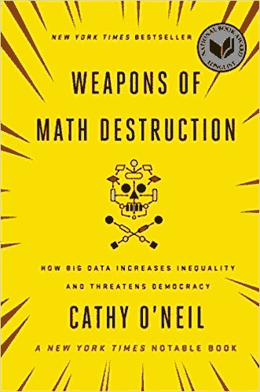
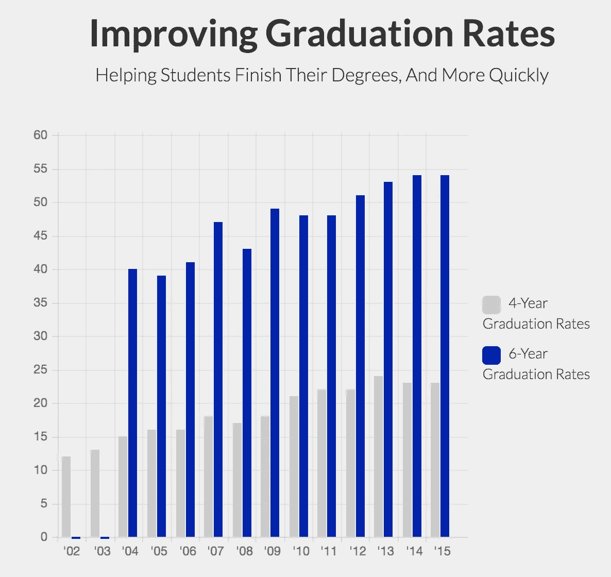

# 算法是种族主义的。现在怎么办？

> 原文：<https://towardsdatascience.com/algorithms-are-racist-now-what-53fc130bb203?source=collection_archive---------15----------------------->

Photo by Yuriy Golub/Shutterstock

围绕算法给现有不平等加剧带来的危险，人们一直在进行讨论。2016 年，凯西·奥尼尔(Kathy O'Neil)出版了《数学毁灭武器》(Weapons of Math Destruction)，这本书揭示了危险的算法，这些算法声称可以衡量我们生活中从教育到犯罪水平和就业等关键方面的质量；但实际上却强化了有害结果，增加了不平等。这些危险的算法，或者说数学毁灭的武器，大多符合四个原则:

1-不透明:他们行事隐秘，他们的目标人群不了解他们是如何工作的，那些拥有更多权力和特权的人甚至可能不会遇到这些算法

2-规模:它们分布广泛，影响许多人

3-损害:它们对人们生活中的关键时刻(尤其是贫穷的有色人种)产生负面影响，并导致无望和绝望。

4-代理:他们缺乏他们最感兴趣的行为的数据，所以他们使用替代数据，这些替代数据提供了不精确的指标，通常是有偏差的

[Weapons of Math Destruction](https://www.barnesandnoble.com/p/weapons-of-math-destruction-cathy-oneil/1123130166/2677932271525?st=PLA&sid=BNB_ADL+Marketplace+Good+New+Books+-+Desktop+Low&sourceId=PLAGoNA&dpid=tdtve346c&2sid=Google_c&gclid=EAIaIQobChMIpZLA2LLQ4QIVyYuzCh0lEgCSEAQYASABEgKVKfD_BwE)

我们在预测性警务算法中看到了这一点，这些算法利用先前逮捕的有偏见的历史数据(由于妨害犯罪的水平较高，这些数据偏向于较贫困的社区[)，来确定未来犯罪将在哪里发生，并确定应该将警察更频繁地派往哪里巡逻。这导致了在贫困地区更多的警察和自我实现的强化循环。](https://www.nyclu.org/en/publications/more-nuisance-outsized-consequences-new-yorks-nuisance-ordinances)

一个社区的警力越多，因妨害治安罪被捕的人就越多。因妨害治安罪被捕的人越多，犯罪地图上的点就越多。犯罪地图上的点越多，就越有理由维持治安。危险的反馈循环继续下去。

很容易相信更多的数据就是更好的数据。但是有偏见的数据进入，意味着有偏见的数据出来。换句话说，“垃圾进垃圾出。”

最终，我们是将这些数据输入算法的人。我们创造它们，我们对它们保密，对它们如何工作的理解远离受它们影响最大的人。在最近的 [PBS 采访](https://www.pbs.org/wnet/amanpour-and-company/video/joi-ito-of-mit-discusses-complex-moral-issues-in-new-tech/)中，麻省理工学院媒体实验室主任 Joi Ito 证实了这种技术的局限性，因为有缺陷的人类正在选择数据输入。

“人工智能不会神奇地让我们变得聪明，”伊藤说。“在锁定这些算法之前进行这些关于种族的对话，真的比所有这些数学问题更重要。”

 [## 麻省理工学院的 Joi Ito 讨论了新技术中复杂的道德问题

### 现在我们转向与最有良知的人斗争的学者。以创新者发现自己处于泡沫中为例…

www.pbs.org](https://www.pbs.org/wnet/amanpour-and-company/video/joi-ito-of-mit-discusses-complex-moral-issues-in-new-tech/) 

**如果我们生活在一个种族主义的社会中，我们就是这样，我们的算法天生就是种族主义的，**那么一旦我们理解了这一点，我们该如何行动呢？人们目前如何试图纠正不仅仅是这些算法系统的错误，而是整个社会的错误？

预测软件的一个问题是，它经常将摄像头放在较差的颜色社区。强大的系统控制着预测软件将使用哪些数据，预测软件将如何评估这些信息，以及这些信息是否对利益相关方(包括有色人种社区)开放。

但是，如果我们有能力将镜头转向这些系统，以激发系统性的变化，那会怎么样呢？

鉴于美国大规模监禁的现状以及有色人种社区和执法机构之间令人痛苦的历史和现实关系，有人提出了翻转相机的倡议，特别是关于刑事司法系统的倡议。美国的几个警察部门已经开发并开始使用“[早期预警系统](https://www.hsdl.org/?abstract&did=792977)”，该系统可以识别那些可能受益于额外培训、资源或咨询的警察，以防止过度使用武力。通过使用警方数据和关于当地犯罪和人口统计的特定背景数据，这些系统通过检测可能导致过度使用武力的因素，如传讯、投诉和内部事务调查来工作。这些数据也向公众开放，以建立更大的社区信任。

我认为，试图通过向公众公开这些信息来消除不透明性是一个重要的行动。看到人工智能被用作解决系统性问题和潜在转变政策的手段令人兴奋。也就是说，我认为这种类型的算法也可能存在有问题的偏差。这取决于用来确定官员的标准。我认为我们需要努力提高算法系统的透明度。我们需要使用语言让所有人都能理解和理解。我们需要理解输入的数据，以便检查这些信息是否是一个公平的指标，或者是我们想要评估的事物的一个糟糕的代理。此外，我们需要直面我们认为的偏见，并努力让所有利益相关者参与到创建和评估过程中。

我对我们技术固有的种族主义本质的另一个回应是，我们如何利用算法给弱势群体更多的机会？

已经有一些算法被用来给弱势群体更多机会的例子，特别是在教育领域。

“在高等教育中使用大数据的机会既可以产生歧视，也可以防止歧视。”

[Georgia State University](https://success.gsu.edu/initiatives/gps-advising/)

学校可能用于从申请过程中捕获学生数据的技术可用于拒绝录取/其他机会，或识别和服务更可能需要额外支持的学生。[佐治亚州立大学](https://www.hsdl.org/?abstract&did=792977)是后者的一个很好的例子。在他们的毕业和升学成功(GPS)建议项目中，他们跟踪每个学生的 800 个不同的风险因素，目的是让学生顺利毕业。当发现问题时，学校会主动提供建议和干预，给予学生所需的支持。有了这个项目，佐治亚州在几年前创造了历史。他们第一次让第一代、黑人、拉丁裔和佩尔助学金资助的学生的毕业率达到或超过了全体学生的毕业率。此外，佐治亚州现在授予黑人学生的学士学位比美国任何非营利学院或大学都多。

我们必须努力围绕我们现有的种族偏见保持跨学科的空间和对话。算法有潜力成为解决社会问题的工具，但我们需要明白，这些数学模型是我们现有社会的延伸，因此不能摆脱人类的偏见。如果我们计划使用这些算法，我们必须意识到它们的局限性，创造透明度的重要性，以及对人类检查点和一致的多利益相关方反馈的需要。