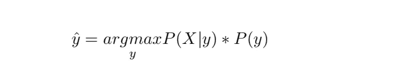
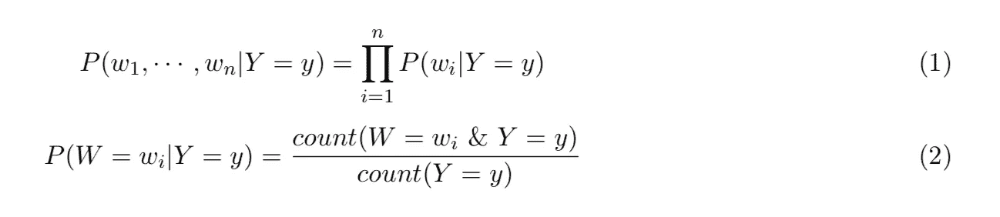
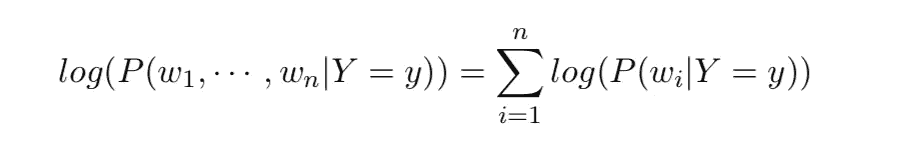
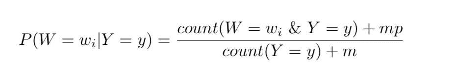
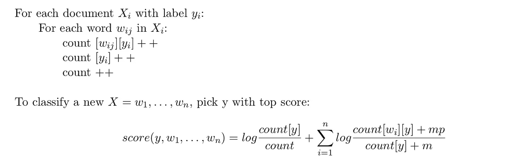
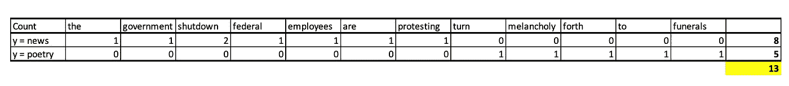
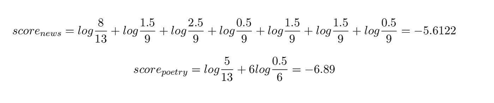

# 文本分类算法—第一部分

> 原文：<https://towardsdatascience.com/algorithms-for-text-classification-part-1-naive-bayes-3ff1d116fdd8?source=collection_archive---------6----------------------->

## 朴素贝叶斯算法讲解

当你这几天查看关于自然语言处理(NLP)的新闻时，你会看到很多围绕语言模型、迁移学习、OpenAI、ULMFit 等的炒作。赶上 NLP 的当前技术水平是很好的，尽管我仍然相信人们应该很好地理解经典算法，如朴素贝叶斯和逻辑回归。为什么？因为你可能合作的公司可能并不专门开发聊天机器人或文本生成机器！大多数时候，从简单的模型开始可能会给你带来很好的结果，而不需要你拼命向你的商业伙伴解释你的方法。所以这篇博文是一系列文本分类方法的开始，从基本的开始。我将尝试解释理论以及如何在实践中使用算法。

# **朴素贝叶斯**

为什么取这个名字？“Bayes”得名于概率论中著名的 Bayes '定理，“Naive”是因为这个算法的假设非常简单，而且大部分时间都不成立。


**朴素贝叶斯的一般思想:**

1.  将文档 X 表示为一组( *w* ，频率为 *w* )对。
2.  对于每个标签 *y* ，建立类别 *y* 中文档的概率模型 P(X| Y = y)。
3.  为了分类，选择最有可能产生 X 的标签 *y* :



**假设:**

1.  文档 X 中单词的顺序没有关系，但是单词的重复有关系。
2.  给定文档类，单词彼此独立出现。

基于这些假设，我们有以下等式来估计 P(X|y):



**这些方程有问题:**

对于等式(1)，如果我们的文档具有超过 100 个单词，则 P(w₁,…，w_n|Y = y)将是非常小的单词概率的乘积(< 0.1), leading to the UNDERFLOW problem =>用对数工作是维持数值稳定性所希望的)。



对于等式(2)，如果我们在新文本中有一个新词 *w* 需要分类，P(W = w | Y = y) = 0 作为 *w* 在我们的训练数据中从未出现过。一个解决方案是平滑概率。假设我们有 P(w|y) = *p* 的 *m* 个例子。此处使用的 *m* 和 *p* 是多项式分布的*狄利克雷先验*。请注意，平滑方法有很多种。



把所有这些放在一起，我们有下面的算法:



**现在，让我们通过一个假设的例子来理解这个算法:**

假设我们有 3 个文档:

X₁ =“政府关闭”,标签为 y₁ =新闻

X₂ =“联邦雇员抗议关闭”,标签为 y₂ =新闻

X₃ =“将忧郁转向葬礼”，标签是 y₃ =诗歌

和一个要分类的新文档:

X_new = "关闭影响联邦雇员利益"

然后我们可以从我们的训练数据中得到这个计数表



为了简单起见，我没有排除停用词，但在实践中，您肯定应该这样做。另外，为了防止下溢问题，我定义了平滑参数: *p* = 0.5， *m* = 1。然后，我们可以如下计算新文档 X_new 的每个标签的分数。



我们可以看到标签“新闻”的得分高于标签“诗歌”的得分，所以我们将 X_new 归类为“新闻”。

**接下来，让我们看看如何使用 Python 和真实数据运行这个算法:**

```
import pandas as pd
import numpy as npspam_data = pd.read_csv('spam.csv')spam_data['target'] = np.where(spam_data['target']=='spam',1,0)
print(spam_data.shape)
spam_data.head(10)
```


```
from sklearn.model_selection import train_test_split
**#Split data into train and test sets**X_train, X_test, y_train, y_test = train_test_split(spam_data['text'],spam_data['target'],random_state=0)from sklearn.feature_extraction.text import CountVectorizer
from sklearn.naive_bayes import MultinomialNB
from sklearn.metrics import roc_auc_score**#Train and evaluate the model**vect = CountVectorizer().fit(X_train)
X_train_vectorized = vect.transform(X_train)
clfrNB = MultinomialNB(alpha = 0.1)
clfrNB.fit(X_train_vectorized, y_train)
preds = clfrNB.predict(vect.transform(X_test))
score = roc_auc_score(y_test, preds)print(score)#0.9720812182741116
```

我们的 AUC 评分是 0.97，对于这样一个简单的模型来说已经不错了。我们将在以后的博客文章中使用相同的数据集将这种性能与其他算法的性能进行比较。