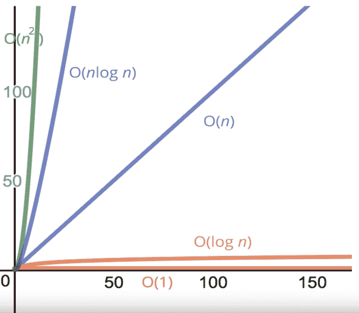
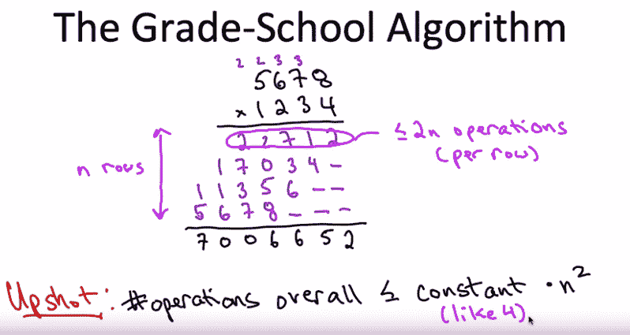
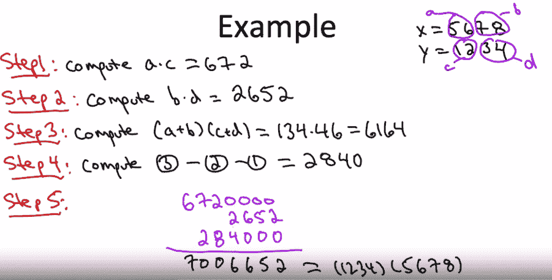
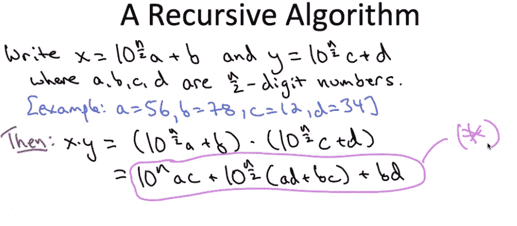
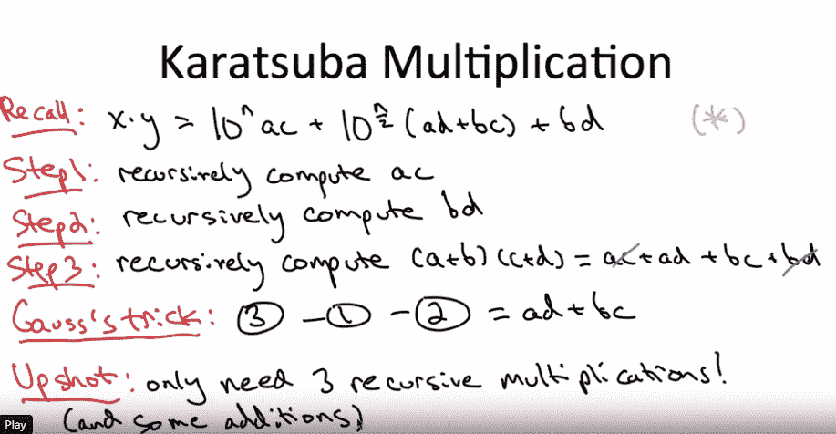

# 学习算法的简要介绍

> 原文：<https://towardsdatascience.com/algorithms-part-1-c1e148dfa3f?source=collection_archive---------27----------------------->

在这篇文章中，我将(1)介绍研究算法背后的基本推理，(2)介绍大 O 符号，(3)对 Karatsuba 的算法做一个简要的分析。

我的帖子大致遵循了 Tim Roughgarden 的算法课程，如果你想为理解数据结构和算法设计打下坚实的基础，我强烈推荐你学习这些课程。

1.  什么是算法，为什么要研究算法？

算法是一组指令，通常用于解决一类问题或执行计算。自从希腊数学家以来，这个概念就一直无处不在。例如，想想用于[长除法](https://en.wikipedia.org/wiki/Long_division)或[小学乘法](https://en.wikipedia.org/wiki/Multiplication_algorithm#Long_multiplication)的步骤。

对于更大的数据集，[时间复杂度](https://en.wikipedia.org/wiki/Time_complexity)的概念变得非常重要。这是因为我们编写代码的方式直接关系到我们的数据是如何被分析的，因此，我们可以得出结论。

2.大 O 符号

大 O 符号， **O(n)** ，被开发用来表达算法的**时间复杂度**。使用字母 O 是因为函数的增长率也被称为函数的**阶。**

算法的效率表示为输入长度 **n** 的函数。更正式的说法是，这被称为算法的**渐近增长率—** 我们关心的是当输入趋近于无穷大时，我们的算法的工作效率如何。

想想你在学校是怎么学乘法的。这个算法是“正确的”，因为只要你按照步骤操作，它总是会返回正确的结果。但是对于计算类似 12315432534535 x 35843958345 的乘积，它的性能会有多好呢？

考虑这个问题的一个很好的方法是可视化一些时间复杂性的基本函数。看看下面的备忘单，了解当输入变得非常大时，运行时间会如何比较:

我们可以看到从最快到最慢有一个等级*:

—常数时间: **O(1)**

—对数时间: **O(对数 n)**

—线性时间: **O(n)**

— **n** 日志时间: **O(nlog n)**

—二次时间: **O(n )**

*点击此处查看更多[详细列表](https://en.wikipedia.org/wiki/Computational_complexity_of_mathematical_operations)

关于 Big O shorthands 的重要说明:

*   算术运算是常数
    当我们考虑渐近增长时，这些较小的项变得无关紧要，并被完全忽略。为什么？因为增长是输入长度 **n.** 的函数，例如 **(n)** 、 **(n+150)** 、或 **(150n)** 的运算可以表示为 **O(n)**
*   变量赋值是恒定的
*   访问数组(通过索引)或对象(通过键)中的元素是不变的
*   在循环中，复杂度=(循环长度)x(循环内部复杂度)

3.看看一些众所周知的算法

作为我们的第一个例子，我们的小学算法在时间复杂度方面表现如何？

Section 1.2 in [http://www.algorithmsilluminated.org/](http://www.algorithmsilluminated.org/)

1.  我们从第一行的部分积开始:22，712。它需要*最多*，2 次运算(#1: 4 x (8，7，6，5)，#2:结转的加法(3，3，2，2)，所以我们可以说**总的**运算次数是≤ **2n**
2.  由于所有剩余的 **n** 行都发生了相同的精确运算(我们首先将顶部的行相乘，然后将进位相加),因此我们可以将计算所有部分乘积(上面所有蓝色数字)所需的工作加起来作为 **2n**
3.  最后一个操作是将每一行的总和相加，这是与步骤 2 相当的操作数，另一个 **2n** ，使我们的总操作时间达到 **4n** ，但是这是作为**时间复杂度**的函数的什么呢？

根据定义，大 O 不考虑常数算术函数，即加法和乘法因子。就像上一节的例子一样，如果你在图上画出 **n，n+150** ，**，**和 **150n** ， **150n** 增长得更快，但是在所有这些函数中总会有一个恒定的算术因子。然而，就渐近增长而言，我们所关心的是 **n** 与增长了多少——在这两个例子中，都是简单的 **O(n)** 。

所以，我们可以把上面的常数 4 去掉，我们看到年级学校算法是 **O(n )** 。

> 现在，我们必须经常问自己，我们能做得更好吗？

事实证明我们可以。实际上，复数乘法有多种算法，这里我们来看看其中的一种， [Karatsuba 乘法](https://en.wikipedia.org/wiki/Karatsuba_algorithm)，它产生了更快的运行时间 **O(log n)** 。

使用我们上面的例子，(1234) x (5678):

Section 1.3 in [http://www.algorithmsilluminated.org/](http://www.algorithmsilluminated.org/)

1.  步骤# 1–3 是如上所述的乘法。
2.  步骤 4 从步骤 3 的结果中减去步骤 1 和步骤 2 的结果
3.  步骤#5 添加如下的零，并添加来自#1、2 和 4 的结果:
    — #1: +4 个零(672+0000)
    — #2: +2 个零(2840+00)

如你所见，结果和我们的长乘法算法是一样的！

现在看来很明显，Karatsuba 的算法利用了[**递归函数**](https://en.wikipedia.org/wiki/Recursion_(computer_science)) **。**作为一种分治算法，这意味着我们获取原始输入(1234) x (5678)，将其分割成更小的块，在更小的块上执行工作，并使用来自这些块的答案来解决原始问题。

更一般地，我们可以用这些较小的数字来表示相关的递归调用， **a** 、 **b** 、 **c、**和 **d** :

Section 1.3 in [http://www.algorithmsilluminated.org/](http://www.algorithmsilluminated.org/)

我们可以快速查一下 **x** 是(12x100+34)= **1234** ， **y** 是(56 x 100 + 78)= **5678。按照上面最后一行展开这些表示，我们有了一个清晰的紫色(*)递归函数表达式:**

Section 1.3 in [http://www.algorithmsilluminated.org/](http://www.algorithmsilluminated.org/)

**关键见解**:回想之前，步骤#3 只在步骤#4 中需要，也就是说，我们可以从中减去步骤#1 和步骤# 2 的结果。如果我们展开步骤#3 (ac+ad+bc+bd ),很明显步骤#4(步骤# 3-步骤# 2-步骤#1)可以简化为上面的(ad+bc)*，只剩下 3 个递归调用，而不是 4 个！
*此快捷键为[复数乘法](https://en.wikipedia.org/wiki/Multiplication_algorithm#Complex_multiplication_algorithm)归于高斯。

在以后的文章中，我将尝试介绍合并排序算法和渐近分析。