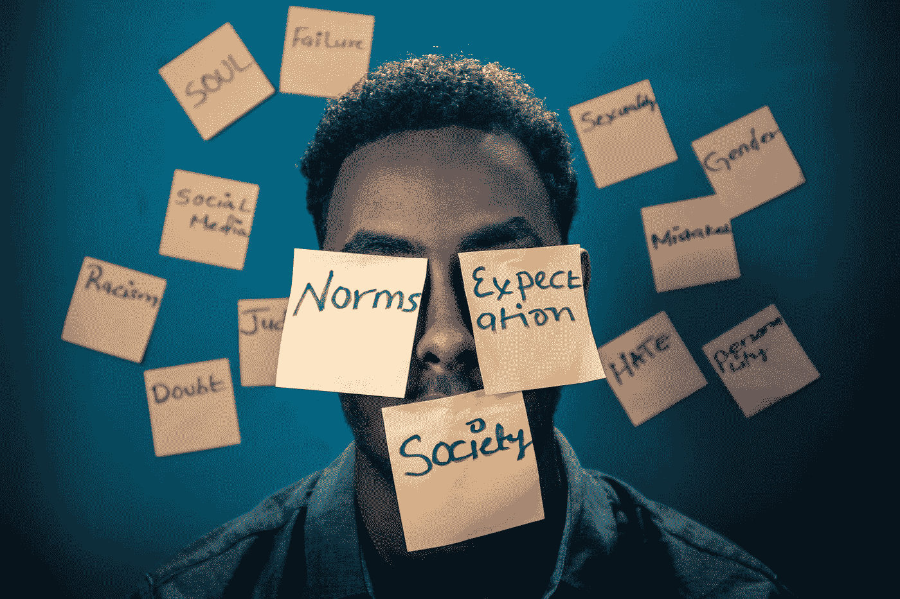

# 算法，中立的幻觉

> 原文：<https://towardsdatascience.com/algorithms-the-illusion-of-neutrality-8438f9ca8471?source=collection_archive---------24----------------------->

## 内部人工智能

## [可信人工智能之路](http://go.sas.com/9bnhdb)

# 从人类到算法

偏见是**人类的基本特征**。我们都有偏见，这是我们的本性，每天我们都根据自己的直觉做出无数的决定。我们都有先入为主的想法、偏见和观点。这很好，只要我们认识到这一点并为此负责。

除了数据处理能力和业务效率的大幅提高，人工智能的根本承诺是帮助减少人类决策的意识或无意识偏差。归根结底，这就是我们对算法的期望，不是吗？客观性，数学的超然而不是模糊的情绪，基于事实而不是本能的决定。算法应该提醒人们注意他们的认知盲点，这样他们才能做出更准确、更公正的决定。

至少理论上是这样的…

Bias, a human virus transmittable to computer — Photo by [Markus Spiske](https://unsplash.com/@markusspiske?utm_source=medium&utm_medium=referral) on [Unsplash](https://unsplash.com?utm_source=medium&utm_medium=referral)

事实上，偏见就像一种会传播和复制的 T4 病毒。人类的偏见被转移到人工智能和机器学习(ML)应用程序，主要是通过它们被馈送和训练的数据。人工智能从我们给它的任何东西中学习。这意味着决策的质量取决于训练数据的质量。但是训练数据可能是不完整的和不具有代表性的，它可能继承了先前决策者的偏见，或者它可能只是反映了世界上持续存在的普遍偏见。

模型的设计也可能引入偏差。从算法的角度来看，偏差可以理解为**过度简化**。模型可能过于僵化，因此无法把握数据中潜在的趋势和复杂性。然而，它们也可能对微小的波动非常敏感，以至于在捕捉信号的同时捕捉到大量噪声。在完全有偏模型和完全可变模型之间，有一个中间地带，熟练的数据科学家在设计和开发模型时必须找到。

问题是，偏差不仅会被**转移到**算法中，还会被**放大**。当有偏差的 ML 算法创建新数据并作为其持续训练的一部分重新注入到模型中时，就会发生这种情况。当有偏算法作为自动决策过程的一部分用于每分钟进行数百万次预测时，情况会变得更糟，从而将偏见带回到现实世界中。

# 从算法偏见到现实世界的歧视

最近，在 SAS Analytics 路演期间(# [Road2AI](http://go.sas.com/9bnhdb) )，一位与会者问我:*“如果我们接受人类天生有偏见，为什么我们应该期待算法有什么不同？”*

这是一个公平的问题，但我认为有理由为算法设定更高的标准。首先是因为**放大**。算法可以通过复制和放大已经存在的偏见使事情变得更糟。第二个原因是**问责**。当一个人做出决定时，这个人就要对这个决定的后果负责。当算法做出决定时，谁负责？

Biased algorithms lead to real world discrimination — Photo by [Yasin Yusuf](https://unsplash.com/@yasinyusuf?utm_source=medium&utm_medium=referral) on [Unsplash](https://unsplash.com?utm_source=medium&utm_medium=referral)

算法偏见有可能在现实世界中造成歧视和不平等。当我们看到偏见和刻板印象是多么容易不受控制地渗透到日常应用中时，这就更加令人担忧了。

直到去年，当你在文本中输入“CEO”时，iOS 会显示一个商人的图标。换句话说，它被设定为假设首席执行官可能是男性。同样，谷歌翻译似乎有很多内置的性别偏见，在将几个简单的句子从土耳其语翻译成英语时弹出来。看起来，医生、士兵和总统应该是他，护士、教师和歌手应该是她。更糟糕的是，他很勤奋，但她很懒。在这两种情况下，现在已经对模型进行了调整以纠正这种偏差，但不幸的是，这只是在事件发生之后。事后看来，这显然不应该发生，但毕竟，这只是一个有点**尴尬**和**负面宣传**的问题，不是吗？

然而，偏见对个人的影响可能要严重得多。

例如，人工智能可以用来伸张正义。它可以帮助法官评估被告再次犯罪的可能性，并建议是否给予假释或刑期。这可能有助于减少监狱人口和累犯率，但也可能增加歧视。事实证明，该系统实际上对少数族裔有偏见，他们被贴上高危惯犯标签的可能性是白人罪犯的两倍。

预测性警务也有同样的问题。ML 算法使用大量数据来预测特定个人犯罪的可能性。除了明显的隐私问题之外，这些算法也不能避免对少数族裔的偏见。这又提出了问责问题。谁对这些决定负责？我们如何确保使用的数据是准确的？我们如何证明没有人能完全理解的黑盒 ML 算法所做的决定是正确的？

在金融行业，大多数抵押贷款和保险定价决策都是由算法做出的。我们如何确保这些决定是公平和非歧视性的？换句话说，我们如何确保算法选择不是基于与受保护的人口统计变量(如种族和性别)相关的输入变量？

# 偏见也不利于商业

在人力资源领域，预先存在的人为偏见是不可否认的。因此，许多人力资源部门已经开始使用人工智能技术来解决这个问题，以增加劳动力的多样性，并通过使招聘过程更加公正来提高新员工的质量。但同样，算法偏差往往会产生相反的效果。最近，亚马逊[宣布](https://www.reuters.com/article/us-amazon-com-jobs-automation-insight/amazon-scraps-secret-ai-recruiting-tool-that-showed-bias-against-women-idUSKCN1MK08G)将停用其人工智能招聘工具，因为它对女性有偏见。让我们说，你正试图雇用一名工程师，使用一种利用历史数据训练的最大似然算法。如果培训数据是基于现有的在职人员，那么几乎肯定会包括大多数男性。因此，该算法很可能会推荐男性候选人，即使你删除了性别作为输入变量——公平地说，亚马逊已经这样做了。这导致了对女性的歧视，但也剥夺了公司雇佣更有技能的(女性)工程师的机会。在这种情况下，模型中的性别参数太强，因为用于建立模型的数据缺乏代表性。

Accuracy matters — Photo by [Vitolda Klein](https://unsplash.com/@little_klein?utm_source=medium&utm_medium=referral) on [Unsplash](https://unsplash.com?utm_source=medium&utm_medium=referral)

偏见的问题在于它会带来**不准确的结果和糟糕的决策**。不仅仅是“做好人”或者“做正确的事”。这也是为了确保对人工智能的投资能够带来预期的收益。它是关于确保商业决策是基于公正、准确的见解做出的。它是关于确保员工可以依赖人工智能应用程序来做出正确的决定。

最后，有必要积极主动地解决偏见问题，因为当歧视性做法，甚至是无意的做法被公开时，会造成声誉损害。这是一个保护你的品牌的问题。如今，人们理所当然地希望组织公平对待他们。对任何企业来说，失去客户的信任都是最糟糕的事情。

如果交付值得信赖、负责任和有道德的人工智能的能力成为一个竞争优势，我不会感到惊讶。它甚至可能发展成为组织推广其品牌的一种方式，就像他们对世界自然基金会和公平贸易这样的标签所做的那样。

# 反对偏见的战争

那么，我们如何减少或消除自动决策的偏差呢？

不幸的是，没有灵丹妙药。相反，组织需要不断努力，主动审查人工智能应用程序的设计、开发、部署和使用，并在必要时采取纠正措施。

第一步是提高那些参与开发人工智能应用程序的人的意识。这不仅仅意味着数据科学家(他们应该已经很清楚这个问题)。它也意味着领域专家和技术专家。所有这些都在端到端分析生命周期中发挥着作用。

Awareness, governance, oversight and audit in the quest for unbiased AI — Photo by [mari lezhava](https://unsplash.com/@marilezhava?utm_source=medium&utm_medium=referral) on [Unsplash](https://unsplash.com?utm_source=medium&utm_medium=referral)

第二步是建立流程来**审计**人工智能应用程序使用的模型的输入和输出。这应确保用于训练模型的数据具有代表性且没有偏差。在开发模型时，数据科学家应该结合逻辑来帮助识别和突出数据中的偏差。统计分析也可以与人工智能应用程序做出的预测一起使用，以寻找可能表明偏差的意外模式或趋势。

最后，围绕人工智能应用的使用建立一个强大的**治理**框架至关重要。这应包括一个多学科管理机构，负责:

*   定义组织愿意遵守的指导原则(或道德规范)。谷歌最终被迫这么做，但在此之前，它受到了一波抗议和员工辞职的打击，这些员工对该公司为美国国防部工作感到担忧。
*   加强实践和技术的一致性，跨部门和计划共享分析资产和人才。
*   定义明确的角色和职责。
*   对人工智能应用程序的输出进行监督，以衡量其准确性、无偏差性以及对数据主体和业务成果的影响。

除了道德问题之外，反对偏见的战争也是商业的当务之急。要保证 AI 应用的采用和预期价值的实现。有很多关于人工智能将如何取代人类的讨论，但我们还没有到那一步。事实上，我们离它还很远，但这并不意味着人工智能的世界没有危险。

正如苹果 ML 和 AI 战略高级副总裁、前谷歌 AI 主管约翰·詹南德雷亚(John Giannandrea)所说:“ [*忘记杀手机器人——因为偏见是真正的 AI 危险*](https://www.technologyreview.com/s/608986/forget-killer-robotsbias-is-the-real-ai-danger/) *”。*

更多信息，请阅读我关于这个主题的另外两篇博客:

*   [X-AI，水晶球和黑盒](/x-ai-black-boxes-and-crystal-balls-fd27a00752ec?source=friends_link&sk=134d1a420e0368e64577b3b7a6ae89db)
*   [伦理学，技术的新前沿](/ethics-the-new-frontier-of-technology-815454f0d158?source=friends_link&sk=f659b80ca31c9694abab235664b0c935)