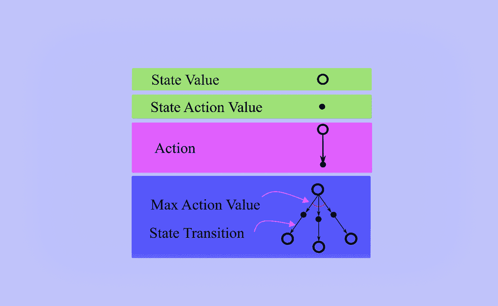
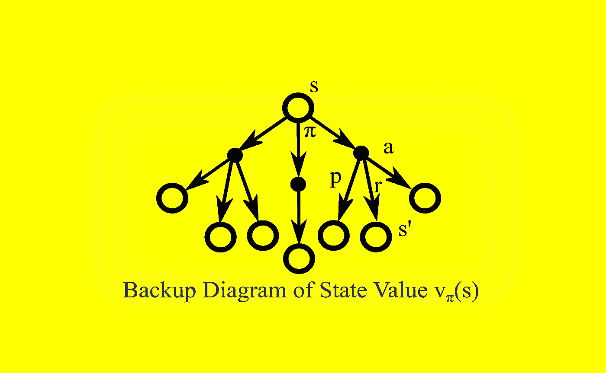
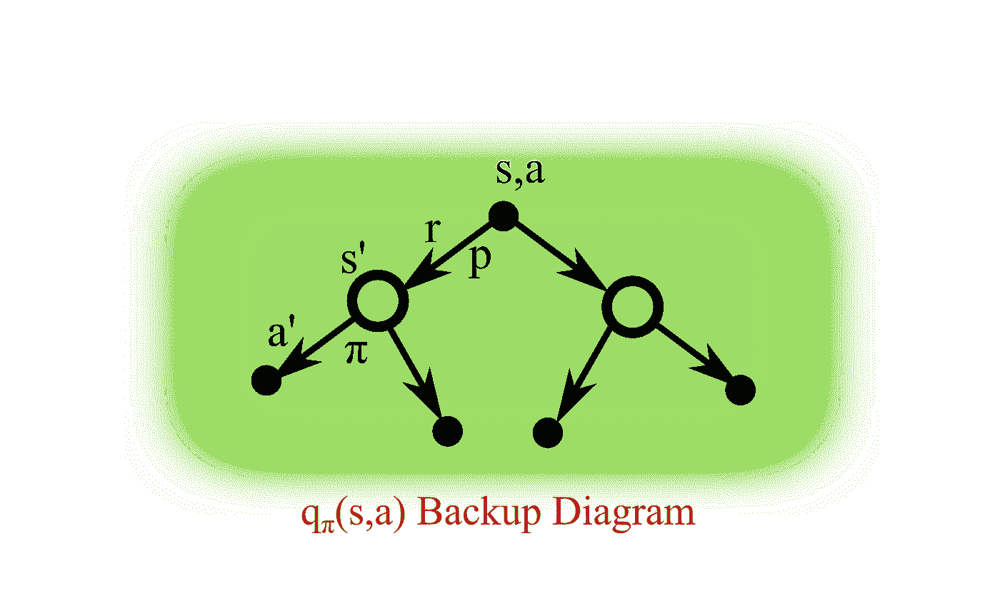
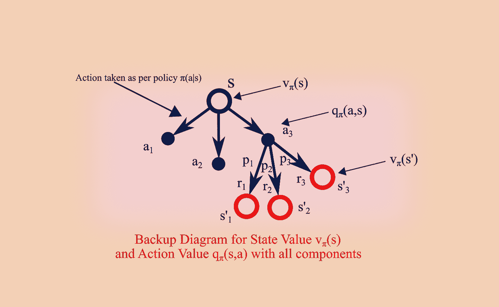
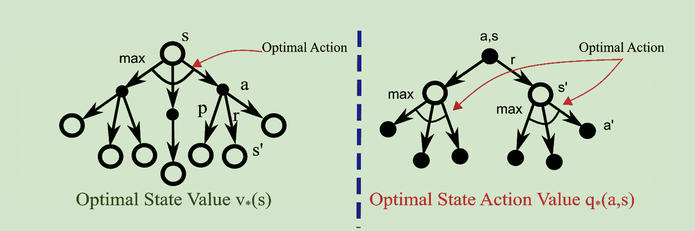
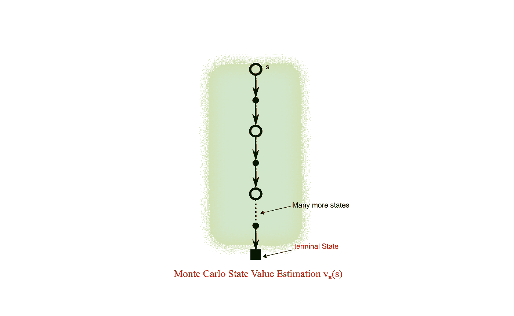
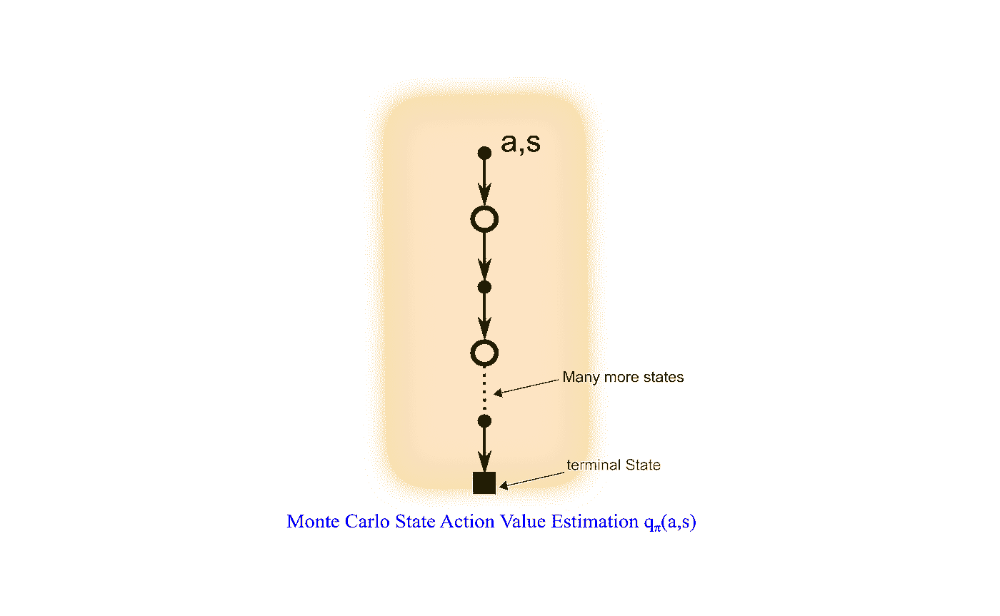
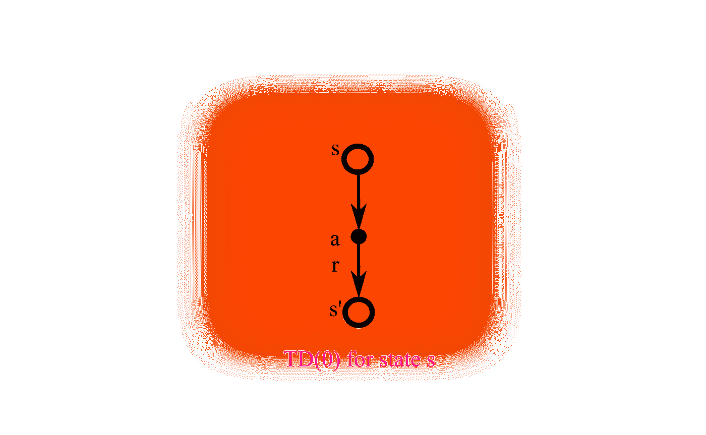
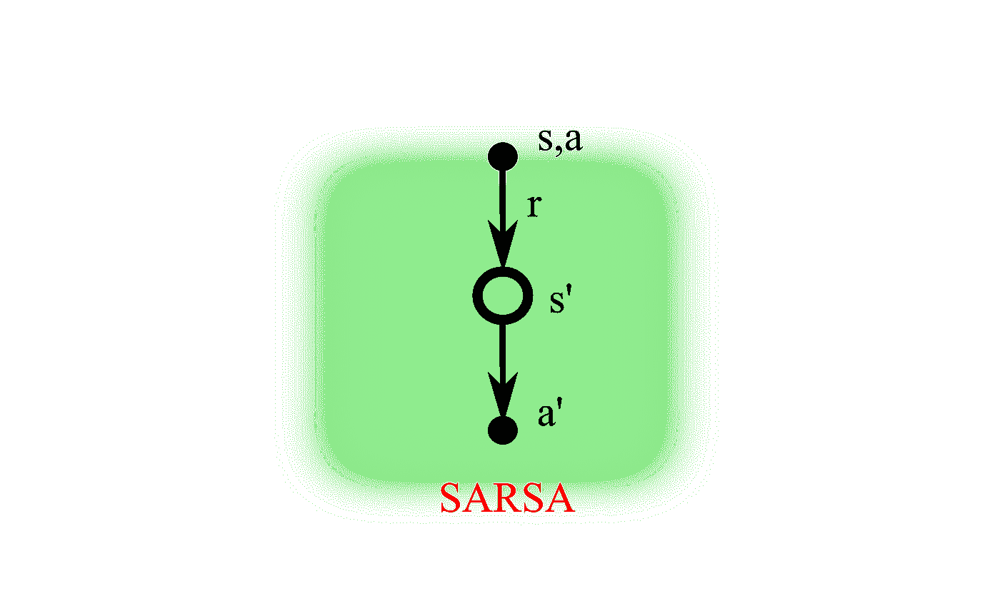

# 关于备份图表的所有信息

> 原文：<https://towardsdatascience.com/all-about-backup-diagram-fefb25aaf804?source=collection_archive---------14----------------------->

## 解释强化学习算法的图表

众所周知，一幅画胜过千言万语；备份图给出了强化学习中不同算法和模型的可视化表示。

备份过程(**更新操作**)通过表示状态、动作、状态转换、奖励等，是算法的图形化表示..价值函数(状态或状态动作)从它的后继状态或状态动作被**转移回**一个状态(或状态动作)。

在备份图中，状态值由空心圆表示，而状态-动作值或动作值由实心圆表示。动作由从状态开始的箭头表示。奖励通常显示在行动值之后。产生最大动作值动作显示为从一个状态开始的弧线。状态值、动作值、动作、最大动作值、状态转换的标准表示见下图。

# 随机策略π下的状态值函数

现在我将介绍如何使用备份图显示状态值。

1.  s 是起始状态，它是根节点
2.  从状态 s 可以有三个动作，如箭头所示，代理按照策略π采取动作
3.  状态动作值或动作用实线圆圈表示(惯例是从状态采取动作，采取动作后领取奖励)。
4.  一旦采取行动，如果是具有一定状态转移概率的随机环境，则代理可以结束于不同的状态(在确定性环境中，代理结束于特定行动的特定状态)。我已经展示了在采取最正确的行动后，代理可以进入的 3 种可能状态。3 个转换显示在蓝色箭头中，转换概率为 p。获得的回报为 r，这也取决于转换动态和采取的行动。代理转换到新状态 s’。

# 随机政策π下的国家行为价值函数

类似于状态值函数，我们可以为动作值函数或状态-动作值函数创建备份图。在这种情况下，根节点是实心圆，因为它是来自特定状态的特定动作。

在下面的备份图中，我展示了每个组件是如何连接的，以便更直观。这让我们对 MDP 有了更好的理解，因为我们可以把这个图扩展到整个状态空间。

1.  在状态 s 下，状态值为 vπ(s)
2.  从状态 s，代理可以采取 3 个动作(a1，a2，a3)
3.  对于所采取的动作，动作值为 qπ(s，a ),其中 a = {a1，a2，a3}
4.  这里，代理采取了行动 a3。它可以分别以转移概率 p1、p2 或 p3 到达状态 s’1、s’2 或 s’3(注意，如果代理选择动作 a2 或 a3，将会有不同的状态，并且相应的转移概率将是适用的。
5.  收集的奖励根据其落地状态显示为 r1、r2 或 r3。

# 最佳状态值和最佳动作值

下图显示了特定状态 s 的状态值的贝尔曼最优性方程，以及从状态 s 采取的动作 a 的状态动作值的贝尔曼最优性方程。根据贝尔曼最优性方程，这是确保最优性的状态的最大动作(在后续状态中产生最大状态值的动作)。

备份图可用于显示在等式中使用值函数的 RL 算法的图形表示。下面是几个更广为人知的算法，当我们参考备份图时很容易理解。

# 蒙特卡洛状态值

蒙特卡洛方法是一个非常简单的概念，当智能体与环境交互时，智能体学习状态和奖励。在这种方法中，代理生成经验样本，然后基于平均回报，为一个**状态**计算值。下面是蒙特卡罗(MC)方法的主要特征:

1.  没有模型(代理不知道状态 MDP 转换)
2.  经纪人**向**学习**被取样**的经验
3.  通过体验来自所有采样剧集的**平均**回报，学习策略π下的状态值 vπ(s )(值=平均回报)
4.  仅在**完成一集**后，值被更新(因为该算法收敛缓慢，并且更新发生在**集完成**后)
5.  没有自举
6.  仅可用于**偶发性问题**

# 蒙特卡洛状态作用值

在该方法中，代理生成经验样本，然后基于平均回报，为一个**状态-动作**计算值。所以这里的起点是状态-行动，终点是状态。

# 时间差 TD(0)

时域差分法是蒙特卡罗法和动态规划法的结合。

下面是蒙特卡罗(MC)方法的主要特征:

1.  没有模型(代理不知道状态 MDP 转换)
2.  代理人**从**采样的**经验中学习**(类似于 MC)
3.  像 DP 一样，TD 方法部分基于其他**学习估计**更新估计，而不等待最终结果(它们**像 DP 一样引导**)。
4.  它可以从**不完整事件**中学习，因此该方法也可以用于连续问题
5.  TD 将猜测更新为猜测，并根据实际经验修改猜测

TD(0)是 TD 学习的最简单形式。在这种形式的 TD 学习中，在每一步之后，用下一个状态的值来更新值函数，并且沿途获得奖励。

# 萨尔萨

用于控制或改进的 TD 算法之一是 SARSA。SARSA 的名字来源于这样一个事实，即代理从一个状态-动作值对向另一个状态-动作值对迈出一步，并在此过程中收集奖励 R(因此是 S( t)，A (t)，R( t+1)，S(t+1)和 A (t+1)元组创建了术语 **S，A，R，S，A** )。SARSA 是 **on-policy** 法。SARSA 使用动作值函数 Q 并遵循策略π。SARSA 备份图如下所示。

# 结论

备份图对于传达 RL 算法步骤非常有用。这提供了一种不用复杂的数学符号就能理解算法的方法。

## 感谢阅读。可以联系我@ [LinkedIn](http://www.linkedin.com/in/baijayantaroy) 。

只需每月 5 美元，就可以无限制地获取最鼓舞人心的内容…点击下面的链接，成为媒体会员，支持我的写作。谢谢大家！
[***https://baijayanta.medium.com/membership***](https://baijayanta.medium.com/membership)