# 关于分类变量编码的一切

> 原文：<https://towardsdatascience.com/all-about-categorical-variable-encoding-305f3361fd02?source=collection_archive---------0----------------------->

## 深入分析

## 将分类变量转换为用于机器学习模型构建的数字


Image by Author

> 最后更新:2023 年 2 月 4 日

大多数机器学习算法不能处理分类变量，除非我们将它们转换成数值。许多算法的性能因分类变量的编码方式而异。

范畴变量可以分为两类:名词性的(没有特定的顺序)和序数的(有些有序)。


Image by Author

标称变量的几个例子如下:

*   红色、黄色、粉色、蓝色
*   新加坡、日本、美国、印度、韩国
*   牛、狗、猫、蛇

序数变量的例子:

*   高、中、低
*   “非常同意”、“同意”、“中立”、“不同意”和“非常不同意”。
*   很好，还可以，很差

我们有许多方法可以将这些分类变量编码成数字，并在算法中使用它们。在这篇文章中，我将介绍其中的大部分，从基础到更高级的。我将包含这些编码:

> 1)一热编码
> 2)标签编码
> 3)序数编码
> 4)赫尔默特编码
> 5)二进制编码
> 6)频率编码
> 7)均值编码
> 8)证据权重编码
> 9)概率比编码
> 10)哈希编码
> 11)后向差分编码
> 12)留一编码
> 13)詹姆斯-斯坦编码
> 14)M-估计器编码(更新)
> 
> 15)温度计编码器(更新)

为了说明，我将使用这个数据框，它有两个独立的变量或特征(温度和颜色)和一个标签(目标)。它还有一个 Rec-No，这是记录的序列号。该数据框中共有 10 条记录。Python 代码如下所示。

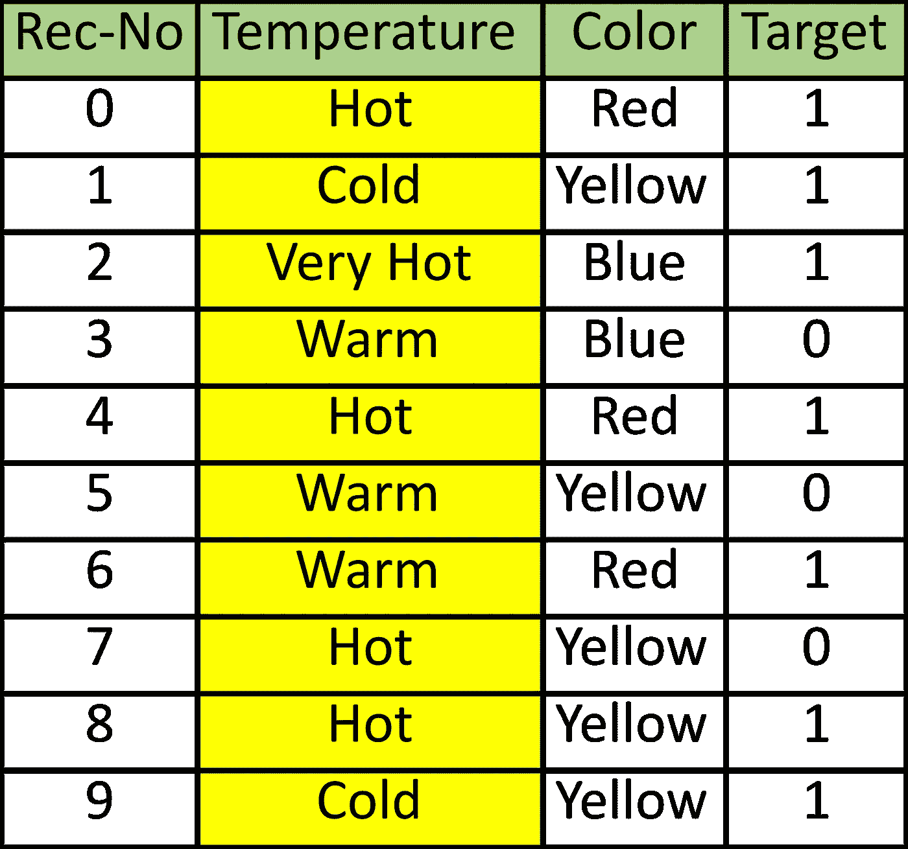

Image by Author

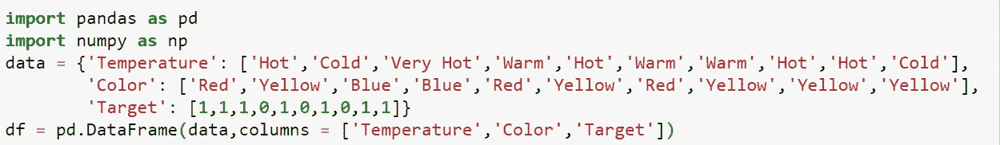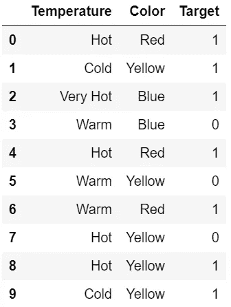

我们将使用 Pandas 和 Scikit-learn 和 category_encoders (Scikit-learn 贡献库)来展示 Python 中不同的编码方法。

# 一个热编码

在这种方法中，我们将每个类别映射到一个包含 1 和 0 的向量，表示该特征的存在或不存在。向量的数量取决于特征类别的数量。这种方法会产生许多列，如果特征的类别数非常高，这些列会显著降低学习速度。熊猫有 **get_dummies** 功能，相当好用。样本数据帧代码如下所示:

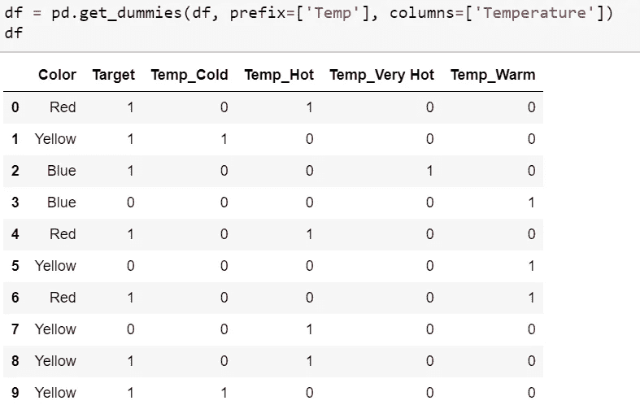

Scikit-learn 为此提供了 **OneHotEncoder** ，但是它没有创建额外的特性列(需要另一个代码，如下面的代码示例所示)。

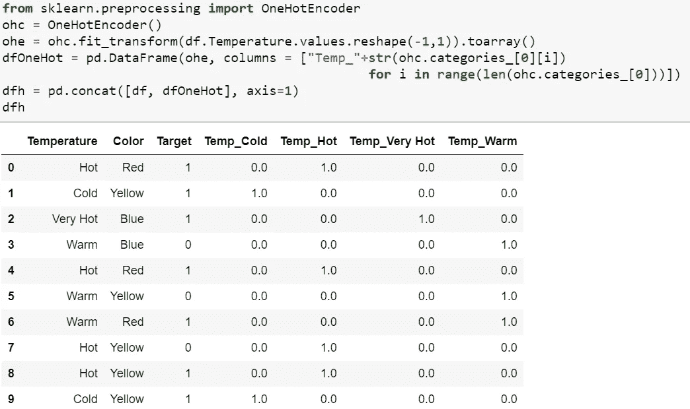

一个热门编码很受欢迎。我们可以用 N-1 (N=类别数)来表示所有类别，这足以对未包括的类别进行编码。通常，对于回归，我们使用 N-1(删除一个热编码新特性的第一列或最后一列)。不过，对于分类，建议使用所有 N 列，因为大多数基于树的算法基于所有可用变量构建树。在线性回归中应使用一个具有 N-1 个二进制变量的热编码，以确保自由度(N-1)的正确数量。线性回归在训练时可以访问所有特征，因此可以一起检查整个虚拟变量集。这意味着 N-1 个二元变量为线性回归提供了关于(完全代表)原始分类变量的完整信息。这种方法可以用于任何在训练期间同时查看**所有**特征**的机器学习算法——例如，支持向量机和神经网络以及聚类算法。**

**如果我们放弃的话，在基于树的方法中我们将永远不会考虑那个额外的标签。因此，如果我们在基于树的学习算法中使用分类变量，将它编码成 N 个二进制变量并且不丢弃是**的好习惯**。**

# **标签编码**

**在这种编码中，每个类别被赋予一个从 1 到 N 的值(其中 N 是该特征的类别数。这种方法的一个主要问题是，这些类之间没有关系或顺序，但算法可能会将它们视为某种顺序或某种关系。在下面的例子中，看起来(Cold**

**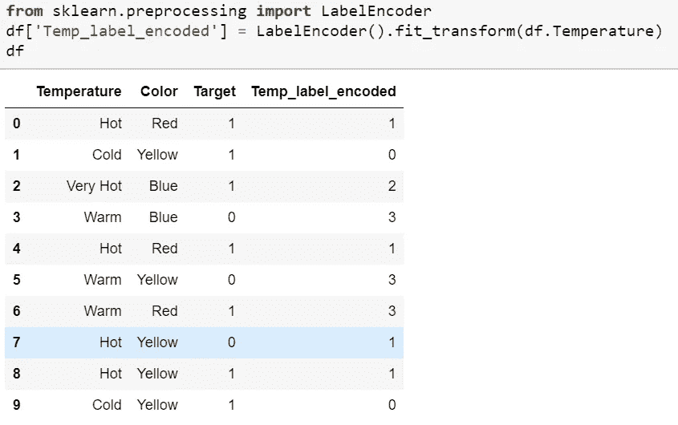**

**Pandas **因式分解**也执行相同的功能。**

**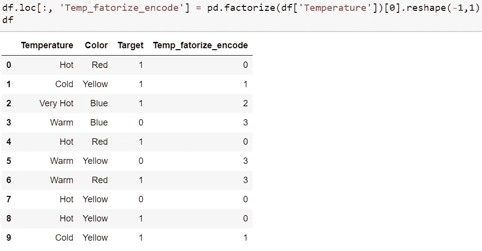**

# **顺序编码**

**我们进行顺序编码是为了确保变量的编码保留变量的顺序性质。正如我在本文开头提到的，这只对顺序变量是合理的。这种编码看起来几乎类似于标签编码，但略有不同，因为标签编码不会考虑变量是否是有序的，它将分配一个整数序列**

*   **按照数据顺序(熊猫被分配为热(0)、冷(1)、“非常热”(2)和热(3))或**
*   **按照字母顺序排序(scikit-learn 指定冷(0)、热(1)、“非常热”(2)和热(3))。**

**如果我们把温标看作顺序，那么顺序值应该是从冷到“非常热”序数编码将赋值为(冷(1)**

**使用 Pandas 引用这段代码，首先，我们需要通过字典指定变量的原始顺序。然后我们可以根据字典为变量映射每一行。**

**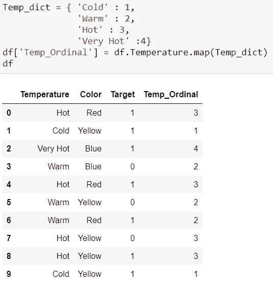**

**虽然这非常简单，但是需要编码来告诉顺序值以及按照顺序从文本到整数的实际映射。**

# **赫尔默特编码**

**在这种编码中，一个级别的因变量的平均值与所有先前级别的因变量的平均值进行比较。**

**category_encoders 中的版本有时被称为反向赫尔默特编码。一个级别的因变量平均值与所有**先前级别**的因变量平均值进行比较。因此，使用名称'**'反向'**,以区别于正向赫尔默特编码。**

**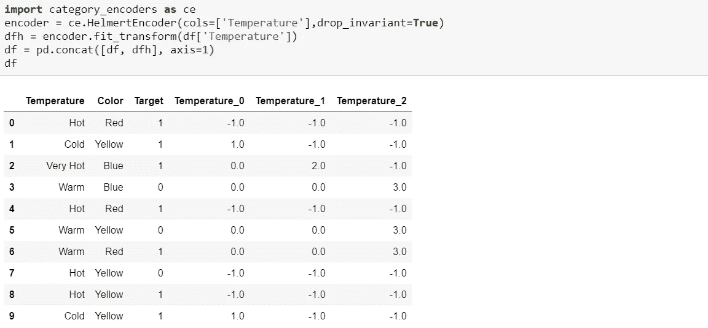**

# **二进制编码**

**二进制编码将类别转换为二进制数字。每个二进制数字创建一个特征列。如果有 **n** 个唯一的类别，那么二进制编码产生唯一的对数(基本 2)ⁿ特征。在这个例子中，我们有四个特征；因此，二进制编码的特征将是三个特征。与一个热编码相比，这将需要更少的特征列(对于 100 个类别，一个热编码将有 100 个特征，而对于二进制编码，我们将只需要 7 个特征)。**

**对于二进制编码，必须遵循以下步骤:**

*   **类别首先转换为从 1 开始的数字顺序(顺序是在类别出现在数据集中时创建的，并不意味着任何顺序性质)**
*   **然后这些整数被转换成二进制代码，例如，3 变成 011，4 变成 100**
*   **然后二进制数的数字形成单独的列。**

**请参考下图以获得更好的直觉。**

**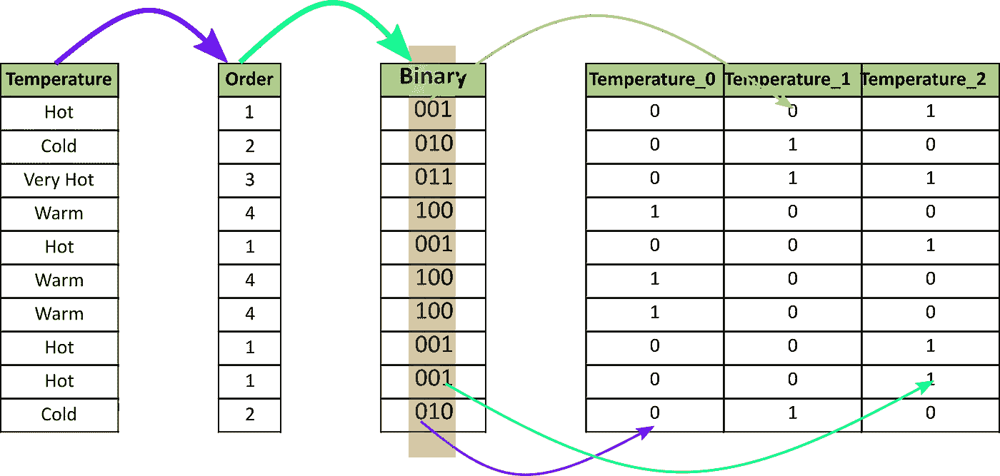**

**Image by Author**

**我们将为此使用 category_encoders 包，函数名为 **BinaryEncoder** 。**

**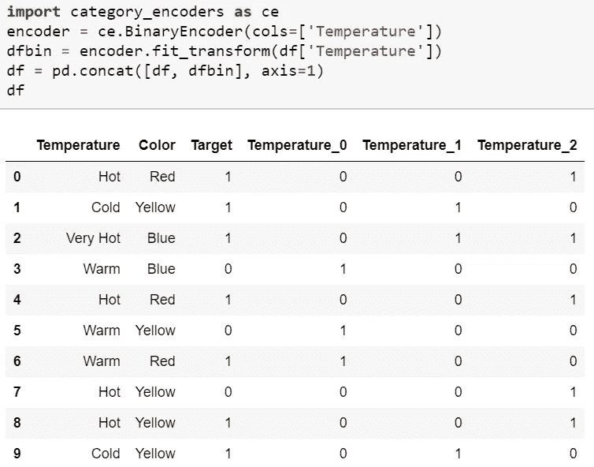**

# **频率编码**

**这是利用类别的频率作为标签的一种方式。在频率与目标变量多少有些关系的情况下，它有助于模型理解并根据数据的性质按正比例和反比例分配权重。为此分三步走:**

*   **选择要转换的分类变量**
*   **按类别变量分组，并获得每个类别的计数**
*   **将它与训练数据集连接起来**

**熊猫代码可以构造如下:**

**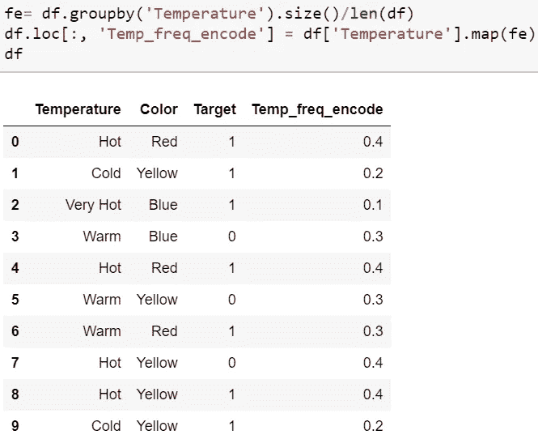**

# **平均编码**

**均值编码或目标编码是 Kagglers 采用的一种病毒编码方法。这有许多变化。在这里，我将涵盖基本版本和平滑版本。均值编码类似于标签编码，只是这里标签与目标直接相关。例如，特征标签中每个类别的平均目标编码由训练数据上目标变量的**平均值决定。这种编码方法显示了相似类别之间的关系，但是这种联系被**限制在类别和目标本身**之间。平均目标编码的优点是它**不影响数据量**并有助于更快的学习。通常，均值编码因过度拟合而臭名昭著；因此，在大多数情况下，交叉验证或其他方法的正则化是必须的。平均编码方法如下:****

1.  **选择要转换的分类变量。**

**2.按分类变量分组，并获得“目标”变量的总和。(“温度”中每个类别的 1 的总数)**

**3.按分类变量分组，并获得“目标”变量的总计数**

**4.将步骤 2 /步骤 3 的结果分开，并将其与列车重新连接。**

**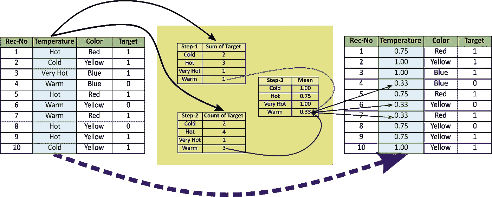**

**Mean Encoding: Image by Author**

**数据框的示例代码:**

**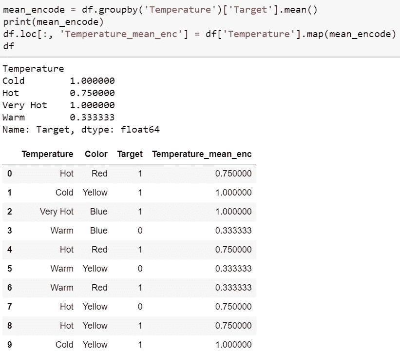**

**均值编码可以在标签中体现目标，而标签编码与目标不相关。在许多特征的情况下，均值编码可能被证明是一种简单得多的替代方法。均值编码倾向于对类进行分组，而标签编码中的分组是随机的。**

**在实践中，这种目标编码有许多变化，如平滑。平滑可以如下实现:**

**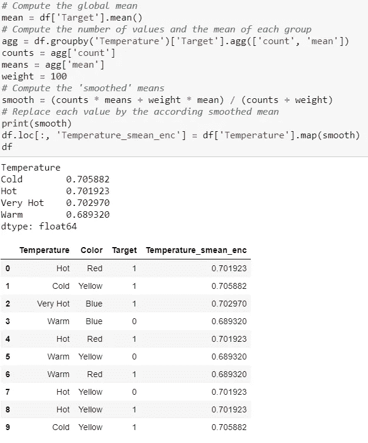**

# **证据权重编码**

**证据权重(WoE)衡量分组技术的"**强度"**以区分好坏。开发这种方法主要是为了建立一个预测模型来评估信贷和金融行业的贷款违约风险。证据权重(WOE)衡量**证据** **支持或破坏一个假设**的程度。**

**其计算如下:**

**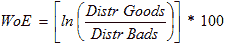**

**如果 P(货物)/ P(货物)= 1，则 WoE 为 0。也就是说，如果该组的结果是随机的。如果 P(Bads) > P(Goods)一组中的赔率将是< 1 and the WoE will be < 0; if, on the other hand, P(Goods) > P(Bads)，那么 WoE > 0。**

**WoE 非常适合逻辑回归，因为 Logit 变换只是概率的对数，即 ln(P(商品)/P(商品))。因此，通过在逻辑回归中使用 WoE 编码的预测因子，预测因子被准备和编码到相同的尺度。可以直接比较线性逻辑回归方程中的参数。**

**WoE 变换具有(至少)三个优点:
1)它可以变换自变量以建立与因变量的单调关系。它的作用不止于此——为了确保单调的关系，将其“重新编码”到任何有序的度量(例如 1，2，3，4…)就足够了，但是 WoE 变换在“逻辑”尺度上对类别进行排序，这对于逻辑回归来说是很自然的
2)对于具有太多(稀疏填充)离散值的变量，这些变量可以被分组到类别中(密集填充)， 权重系数可用于表达整个类别的信息
3)每个类别对因变量的(单变量)影响可跨类别和变量进行比较，因为权重系数是一个标准化值(例如，您可以将已婚人士的权重系数与体力劳动者的权重系数进行比较)**

**它也有(至少)三个缺点:
1)由于宁滨到几个类别
导致的信息损失(变化)2)它是一个“**单变量”度量，**因此它没有考虑独立变量之间的相关性
3)很容易根据如何创建类别来操纵(过度拟合)变量的效果**

**在代码下面，代码片段解释了如何构建代码来计算 WoE。**

**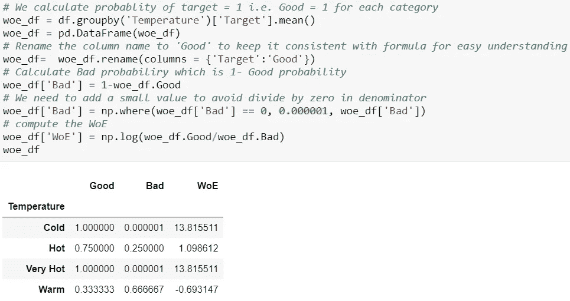**

**一旦我们计算出每个组的权重，我们就可以将其映射回数据帧。**

**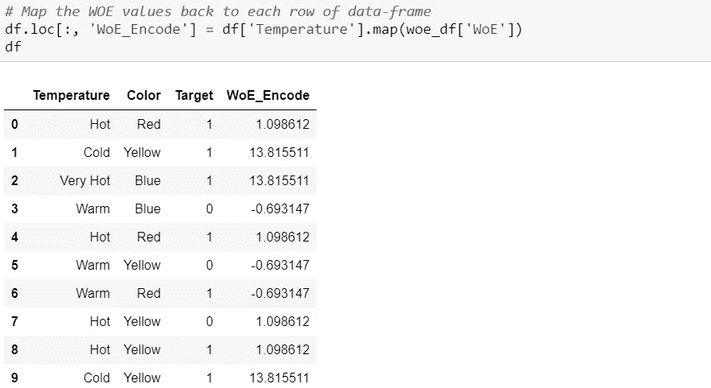**

# **概率比编码**

**概率比编码类似于证据权重(WoE ),唯一的区别是只使用好的和坏的概率比。对于每个标签，我们计算 target=1 的平均值，即为 1 的概率(P(1))，以及 target=0 的概率(P(0))。然后，我们计算比率 P(1)/P(0)并用该比率替换标签。我们需要为 P(0)添加一个最小值，以避免任何被零除的情况，在这种情况下，对于任何特定的类别，都没有 target=0。**

**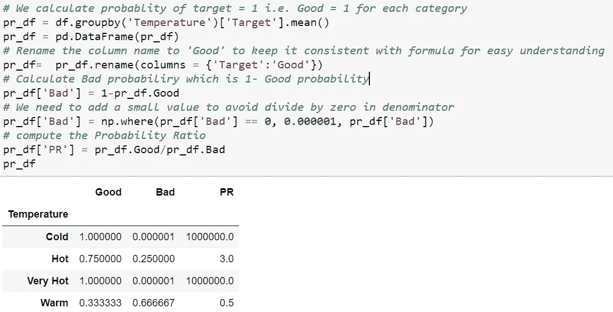****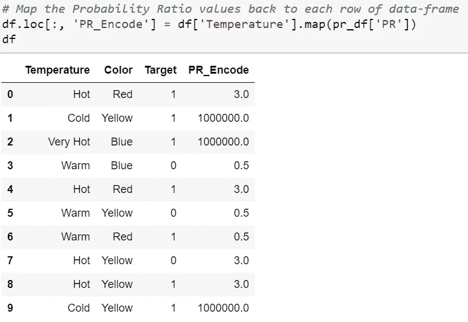**

## **散列法**

**哈希将分类变量转换到更高维的整数空间，其中分类变量的两个向量之间的距离大致由转换后的数值维空间保持。使用哈希，维度的数量将远远少于使用像一个热编码这样的编码的维度的数量。当分类的基数非常高时，这种方法是有利的。**

**这种编码在生产中广泛使用，当类别变化非常频繁时，例如在电子商务网站的情况下，产品类别会随着新产品的定期添加而不断变化。**

***(示例代码—我将在本文的未来版本中更新)***

## **后向差分编码**

**在后向差分编码中，将某一级的因变量的平均值与前一级的因变量的平均值进行比较。这种类型的编码对于名义变量或顺序变量可能是有用的。**

**这种技术属于分类特征的对比编码系统。K 个类别或级别的特征通常作为 K-1 个虚拟变量的序列进入回归。**

***(示例代码—将在本文的未来版本中更新)***

## **省略一个编码**

**这与目标编码非常相似，但在计算某个级别的平均目标以减少异常值时，会排除当前行的目标。**

***(示例代码—将在本文的未来版本中更新)***

## **詹姆斯-斯坦编码**

**对于特征值，James-Stein 估计器返回的加权平均值为:**

1.  **观察到的特征值的目标平均值。**
2.  **平均目标值(不考虑特征值)。**

**詹姆斯-斯坦编码器*将平均值向整体平均值收缩*。它是一个基于目标的编码器。然而，James-Stein 估计量有一个实际的限制——它只适用于正态分布。**

***(示例代码—我将在本文的未来版本中更新)***

## **m 估计编码**

**M-estimator 编码可用于分类编码，作为处理数据集中异常值或罕见类别的一种方式。在这种情况下，它可以用来处理分类变量中的类别不平衡。其思想是根据类别与总体类别频率的偏差为每个类别分配一个权重。然后，这个权重被用于调整分类变量的编码，给予代表不足的类别更多的重要性。**

**例如，假设您有一个包含 A、B 和 C 三个类别的分类变量，并且您希望使用一次性编码对其进行编码。标准的独热编码将为每个类别分配相同的权重。但是，如果类别 A 与 B 和 C 相比明显代表不足，您应该在编码中给它更多的权重。在这种情况下，您可以使用 M-estimator 编码，它根据为解决类别不平衡而选择的权重函数为每个类别分配权重。**

**值得注意的是，M-estimator 编码只是可用于处理分类变量中的类别不平衡的许多方法之一，它可能不是在所有情况下的最佳方法。是否使用它，以及如何使用它，取决于您正在处理的特定问题和数据集。**

```
import pandas as pd
import numpy as np

# sample data
data = {'Temperature': ['Hot','Cold','Very Hot','Warm','Hot','Warm','Warm','Hot','Hot','Cold'],
        'Color': ['Red','Yellow','Blue','Blue','Red','Yellow','Red','Yellow','Yellow','Yellow'],
        'Target': [1,1,1,0,1,0,1,0,1,1]}
df = pd.DataFrame(data,columns = ['Temperature','Color','Target'])

# count the frequency of each category
category_counts = df['Temperature'].value_counts()

# calculate the weight for each category based on deviation from the mean frequency
weights = (category_counts - category_counts.mean()).abs()
weights = weights / weights.sum()

# create a dictionary to map each category to its weight
mapping = dict(zip(weights.index, weights.values))

# map the categories to their weights
df['weights'] = df['Temperature'].map(mapping)

# calculate weighted encoding for each category
encoded = df.groupby('Temperature')['weights'].sum()
encoded = encoded / encoded.sum()

# map the weighted encoding back to the categories
df['encoded_temperature'] = df['Temperature'].map(encoded)
```

**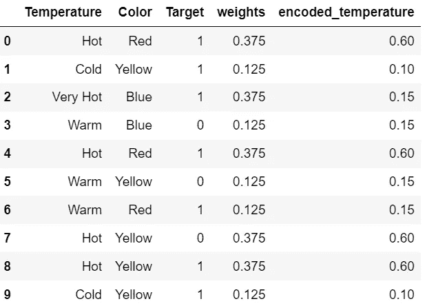**

**在这个例子中，**权重**变量是基于与平均频率的偏差分配给每个类别的权重。 **encoded_temperature** 变量是**温度**类别的加权编码，计算为每个类别的权重之和，并归一化为总和 1。**

## ****温度计编码器****

**温度计编码器用于将类别变量表示为数值，特别是对于类别具有固有顺序的序数变量。**

**编码的工作方式是为每个类别创建一个二进制表示，并将二进制值连接起来形成一个新的数值变量。表示中使用的二进制数字的数量取决于类别的数量。对于每个类别，如果该类别存在，则第一个数字设置为 1，其余数字设置为 0。**

**例如，如果有 5 个类别`A`、`B`、`C`、`D`和`E`，则温度计编码可以表示为 5 个二进制变量:**

*   **`A`由`[1, 0, 0, 0, 0]`表示**
*   **`B`由`[1, 1, 0, 0, 0]`表示**
*   **`C`由`[1, 1, 1, 0, 0]`表示**
*   **`D`由`[1, 1, 1, 1, 0]`表示**
*   **`E`由`[1, 1, 1, 1, 1]`表示**

**这种编码以比一键编码更直观的方式表示类别的顺序，并捕捉类别之间的内在关系。在模型需要理解类别之间的顺序关系的情况下，它会很有用。让我们用我们的颜色类别来解释熊猫代码。**

```
import pandas as pd

# sample data
data = {'color': ['Red','Yellow','Blue','Blue','Red','Yellow','Red','Yellow','Yellow','Yellow']}
df = pd.DataFrame(data)

# get the unique categories and their ranks
categories = df['color'].unique()
ranks = range(len(categories))

# create a dictionary to map each category to its rank
mapping = dict(zip(categories, ranks))

# map the categories to their ranks
df['ranks'] = df['color'].map(mapping)

# create the thermometer encoding for each category
encoded = pd.get_dummies(df['ranks'])
encoded = encoded.add_prefix('thermometer_')

# merge the encoding with the original data
df = pd.concat([df, encoded], axis=1)
```

**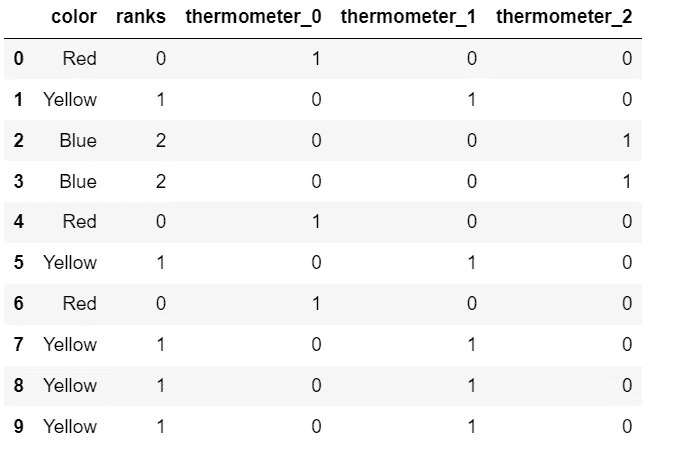**

# **常见问题:**

**我收到了许多关于使用或者没有目标时如何处理测试数据的询问。我在这里增加了一个 Faq 部分，希望能有所帮助。**

**常见问题 01:我应该使用哪种方法？**

****回答:**没有一种方法适用于所有问题或数据集。你可能要试几个看看，哪个效果更好。一般的指导方针是参考文章末尾显示的备忘单。**

****常见问题 02:在测试数据中没有任何目标值的情况下，如何为目标编码创建分类编码？****

****回答:**我们需要使用训练时创建的映射值。这个过程与缩放或归一化是一样的，其中我们使用训练数据来缩放或归一化测试数据。然后映射并在测试时间预处理中使用相同的值。我们甚至可以为每个类别创建一个字典并映射值，然后在测试时使用这个字典。在这里，我用平均编码来解释这一点。**

****训练时间****

**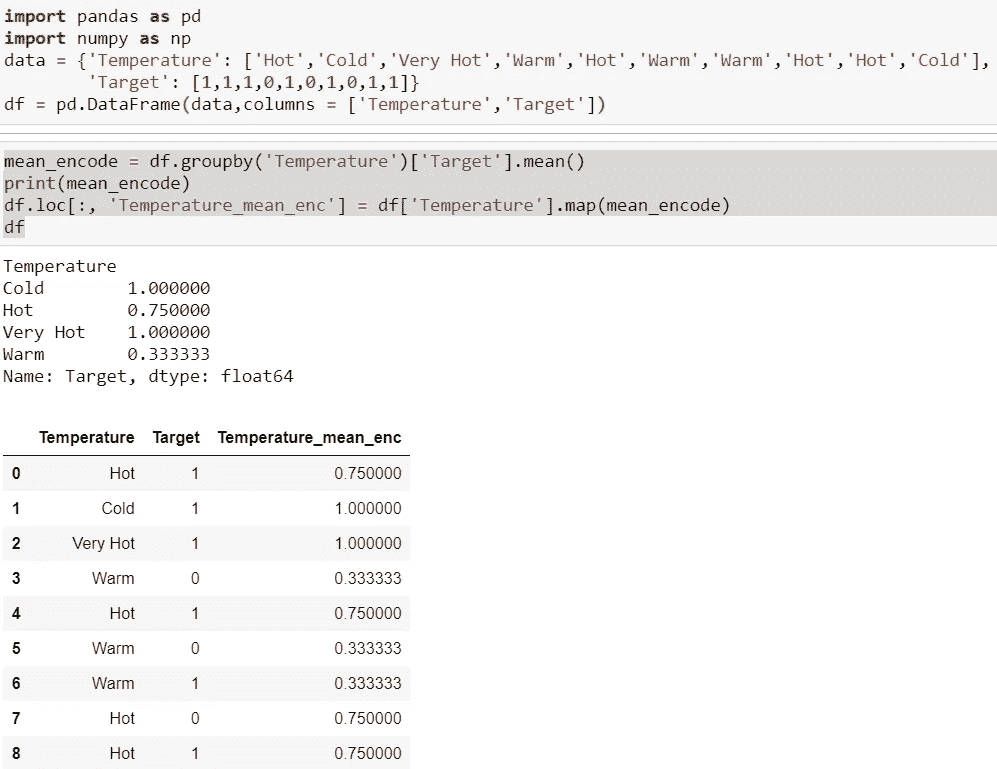**

****测试时间****

**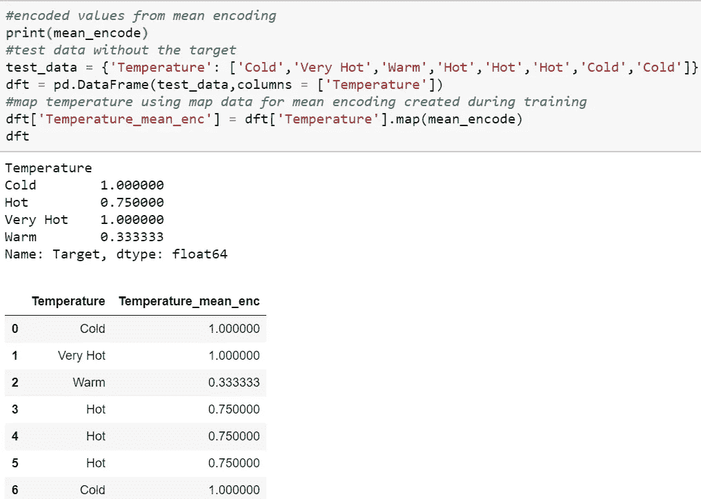**

# **结论**

**重要的是要理解，所有这些编码并不是在所有情况下或者对于所有机器学习模型的每个数据集都工作良好。数据科学家仍然需要实验，找出最适合他们具体情况的方法。如果测试数据有不同的类，这些方法中的一些将不起作用，因为特征不会相似。研究团体的基准出版物很少，但是哪一个最好还没有定论。我的建议是在较小的数据集上尝试每一种方法，然后决定在哪里重点调整编码过程。你可以使用下面的备忘单作为指导工具。**

****

**[Source](https://blog.featurelabs.com/encode-smarter/)**

## **感谢阅读。你可以在 [LinkedIn](http://www.linkedin.com/in/baijayantaroy) 上联系我。**

> ***每月只需 5 美元，就可以无限制地获取最鼓舞人心的内容……点击下面的链接，成为一名媒体会员，支持我的写作。谢谢大家！* [](https://baijayanta.medium.com/membership)**