# 关于丢失数据处理的所有内容

> 原文：<https://towardsdatascience.com/all-about-missing-data-handling-b94b8b5d2184?source=collection_archive---------1----------------------->

## 深入分析

## 缺失数据插补技术

Image by [Gerd Altmann](https://pixabay.com/users/geralt-9301/?utm_source=link-attribution&utm_medium=referral&utm_campaign=image&utm_content=3087397) from [Pixabay](https://pixabay.com/?utm_source=link-attribution&utm_medium=referral&utm_campaign=image&utm_content=3087397)

缺失数据是数据专业人员需要处理的日常问题。虽然已经有很多文章、博客、视频，但我发现很难在一个地方找到一条简明的综合信息。这就是为什么我把我的努力放在这里，希望它将对任何数据从业者或爱好者有用。

什么是缺失数据？缺失数据被定义为不可用的值，如果被观察到，这将是有意义的。丢失的数据可能是序列丢失、特征不完整、文件丢失、信息不完整、数据输入错误等。现实世界中的大多数数据集都包含缺失数据。在使用带有缺失数据字段的数据之前，您需要转换这些字段以用于分析和建模。像数据科学的许多其他方面一样，这实际上也可能是艺术多于科学。理解数据及其来源领域非常重要。

数据中缺少值不一定是一种挫折。尽管如此，这仍然是一个执行正确的特征工程来指导模型以正确的方式解释缺失信息的机会。有机器学习算法和软件包可以自动检测和处理缺失数据。但是，仍然建议通过分析和编码策略手动转换缺失的数据。首先，我们需要了解缺失数据的类型。失踪大致分为三类:

# **完全随机失踪(MCAR)**

当我们说数据是完全随机**缺失**时，我们的意思是缺失与被研究的观测值(完全观测变量(X)和部分缺失变量(Y))无关。例如，电池没电的体重秤、邮寄过程中可能丢失的问卷，或者实验室中可能损坏的血液样本。MCAR 是一个理想但不合理的假设。一般来说，当数据因设计、设备故障或样品在运输途中丢失或技术上不令人满意而丢失时，数据被视为 MCAR。MCAR 数据的统计优势是分析保持**无偏**。下面是 MCAR 的示意图，其中缺失与数据集变量 X 或 Y 无关。思念与 X 或 Y 无关，而是与其他原因 z 有关。

Image by Author

让我们来看一个移动数据的例子。这里，一个样本有一个缺失值，不是因为数据集变量，而是因为另一个原因。

Image by Author

# **随机失踪(MAR)**

当我们说数据随机**缺失**时，我们的意思是部分缺失变量(Y)上的缺失数据与分析模型中的一些其他完全观察到的变量(X)有关，而与 Y 本身的值无关。

MAR 的图示如下，其中缺失与数据集变量 X 有关，但与 y 无关。它可以有其他关系(Z)。它与丢失的信息没有特别的关系。例如，如果一个孩子因为生病而没有参加检查，这可能可以从关于孩子健康的其他数据中预测出来，但这与我们在孩子没有生病的情况下检查的内容无关。有些人可能认为标记不存在问题。但是，MAR 并不意味着可以忽略缺失的数据。

Image by Author

Image by Author

# 非随机缺失(MNAR)

如果数据字符不符合 MCAR 或 MAR，则属于非随机丢失(MNAR)类别。当数据**缺失而非随机**缺失时，缺失与缺失的内容特别相关，例如，一个人没有参加药物测试是因为他前一天晚上服用了药物。一个人没有参加英语水平测试，因为他的英语语言能力很差。MNAR 数据的情况是有问题的。在这种情况下，获得参数无偏估计的唯一方法是对缺失数据进行建模，但这需要对缺失变量有正确的理解和领域知识。然后，该模型可以合并到一个更复杂的模型中，用于估计缺失值。MNAR 的图示如下，其中缺失直接将**与变量 Y** 联系起来。它可以有其他关系(X & Z)。

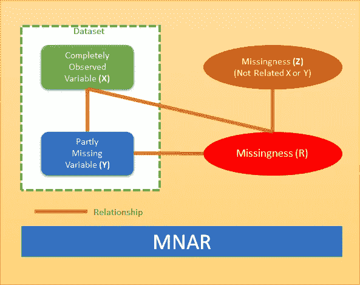

Image by Author

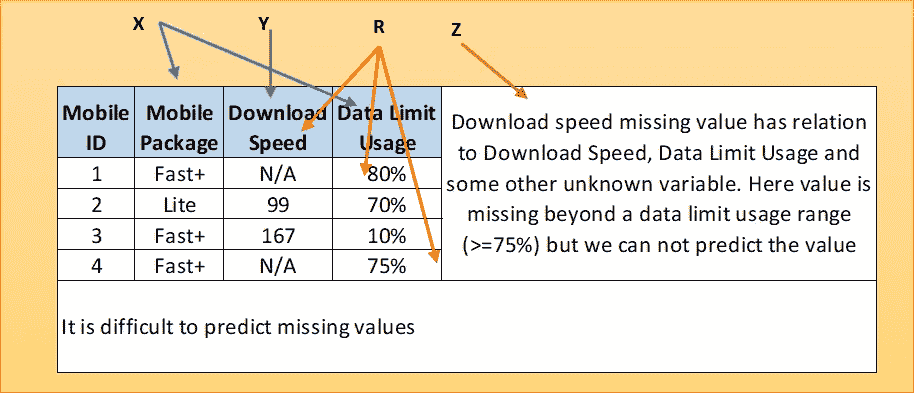

可以应用几种策略来处理缺失数据，以建立机器学习/统计模型。

# **试图获得缺失的数据。**

在类似调查的情况下，这在数据收集阶段是可能的，在这种情况下，在回答者离开房间之前，可以检查是否完整地捕获了调查数据。有时，可以从数据源获取数据，比如再次询问遗漏的问题以获得回答。在真实的场景中，这是解决丢失数据问题的一种不太可能的方式。

# **有教养的猜测**

这听起来很武断，并不是一个可取的做法，但人们有时可以根据其他响应推断出一个丢失的值。例如，对于相关的问题，如那些经常出现在矩阵中的问题，如果参与者的回答全是“2”，则假设缺失的值是 2。

# 丢弃数据

## 1)列表式(全病例分析 CCA)删除

处理缺失数据的最常见方法是忽略缺失数据的案例，并分析剩余数据。这种方法被称为完整案例(或可用案例)分析或列表式删除。

如果有足够大的样本，其中权力不是一个问题，并满足 MCAR 的假设，列表式删除可能是一个合理的策略。然而，当没有大样本或者 MCAR 假设不满足时，列表删除就不是最优策略。如果不能满足 MCAR 的要求，它还会引入偏见。

删除后参考下面的样本观察

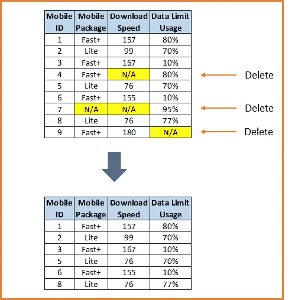

Image by Author

## 2)成对(可用案例分析 ACA)删除

在这种情况下，仅忽略缺失的观察值，并对存在的变量进行分析。如果数据集中的其他地方缺少数据，则使用现有的值。由于成对删除使用所有观察到的信息，它比列表删除保留更多的信息。

已知成对删除对 MCAR 或 MAR 数据的偏倚较小。然而，如果有许多遗漏的观察值，分析将是有缺陷的。成对删除的问题是，即使它采用了可用的案例，人们也不能比较分析，因为它们每次都是不同的。

Image by Author

## **3)删除变量**

如果某个变量缺少太多数据，可以选择从数据集中删除该变量或列。这方面没有经验法则，但要视情况而定，在完全放弃变量之前，需要对数据进行适当的分析。这应该是最后一个选项，我们需要检查删除变量后模型性能是否提高。

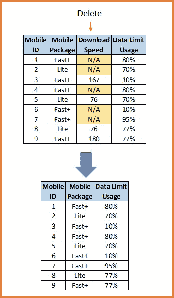

Image by Author

# 保留所有数据

任何插补技术都旨在产生一个完整的数据集，然后可以用于机器学习。我们有几种方法可以进行插补，以保留所有数据用于分析和构建模型。

## 1)平均值、中值和众数

在这种插补技术中，目标是用缺失值的统计估计值替换缺失数据。平均值、中间值或众数可用作插补值。

在均值替换中，使用变量的均值来代替同一变量的缺失数据值。这样做的好处是不会改变该变量的样本均值。均值替换的理论背景是均值是从正态分布中随机选择的观察值的合理估计。然而，对于非严格随机的缺失值，尤其是在不同变量的缺失值数量存在巨大差异的情况下，均值替换法可能会导致不一致的偏差。原始方差的失真和与数据集中剩余变量的协方差的失真是这种方法的两个主要缺点。

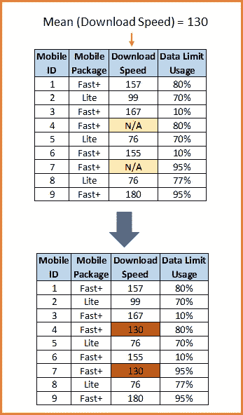

Image by Author

当变量具有偏态分布时，可以使用中位数。

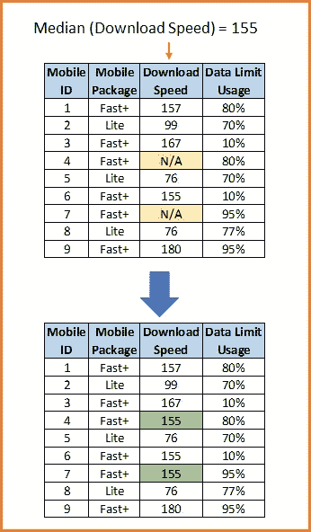

Image by Author

Mode 的基本原理是用最频繁出现的值替换缺失值的总体，因为这是最有可能发生的情况。

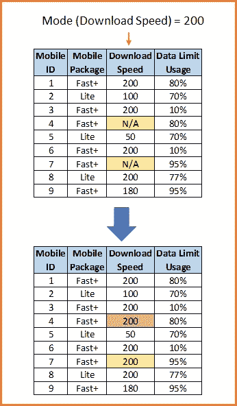

Image by Author

## 2)上次意见结转(LOCF)

如果数据是时间序列数据，最广泛使用的插补方法之一是结转最后一次观察值(LOCF)。每当缺少某个值时，就会用最后观察到的值替换它。这种方法是有利的，因为它易于理解和交流。尽管这种方法很简单，但它强烈假设结果的值不会因缺失数据而改变，这在许多情况下似乎不太可能。

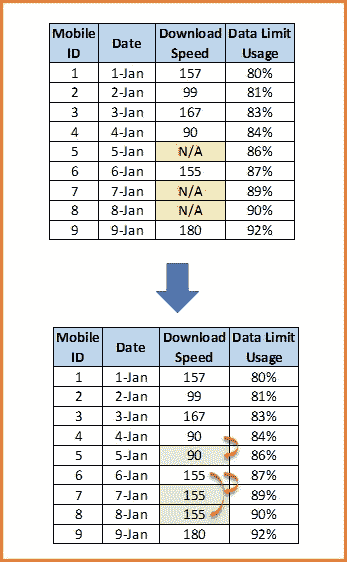

Image by Author

## 3)下一次观察向后进行(NOCB)

类似的方法如 LOCF，工作原理相反，在丢失值后进行第一次观察，然后 **c** 将其向后排列(“向后进行下一次观察”，或 NOCB)。

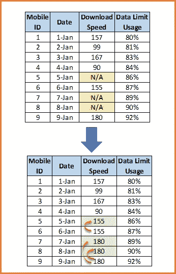

Image by Author

## 4)线性插值

插值是一种数学方法，它根据数据调整函数，并使用该函数来外推缺失的数据。最简单的插值类型是线性插值，即在缺失数据之前的值和值之间进行插值。当然，我们可能有一个非常复杂的数据模式，线性插值是不够的。有几种不同类型的插值。只是在熊猫中，我们有如下选项:“线性”、“时间”、“索引”、“值”、“最近”、“零”、“线性”、“二次”、“三次”、“多项式”、“样条”、“分段多项式”等等。

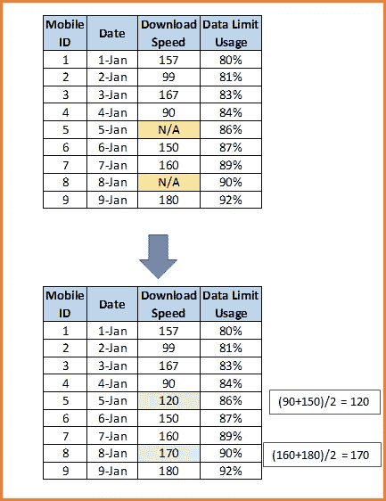

Image by Author

## 5)公共点插补

对于评定等级，使用中间点或最常选择的值。例如，在五分制中，用 3(中点)或 4(最常见的值)代替(在许多情况下)。它类似于平均值，但更适用于序数值。

## 6)添加类别以捕获 NA

对于分类变量，这可能是最广泛使用的缺失数据插补方法。这种方法包括将缺失数据视为变量的附加标签或类别。所有缺失的观察值都被分组到新创建的标签“缺失”中。它没有对价值缺失做任何假设。当丢失数据的数量很大时，它非常适合。

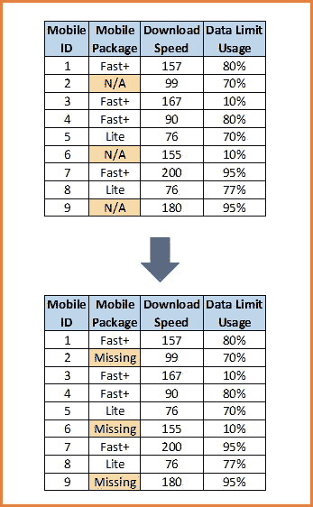

Image by Author

## 7)频繁的类别插补

用最常见的类别替换缺失值相当于均值/中值插补。它包括用变量中出现频率最高的标签或类别替换变量中所有缺失的值。

Image by Author

## 8)任意值插补

任意值插补包括用任意值替换变量中所有缺失值。理想情况下，任意值应不同于中值/平均值/众数，并且不在变量的正常值范围内。通常使用的任意值是 0，999，-999(或其他 9 的组合)或-1(如果分布为正)。有时，数据已经包含来自发起者的缺失值的任意值。这对于数值主要为正值的数字特征和一般的基于树的模型相当有效。当开箱即用的机器学习库和算法不太擅长处理缺失数据时，这曾经是一种更常见的方法。

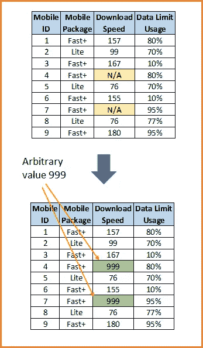

Image by Author

## 9)添加变量以捕获 NA

当数据不是完全随机缺失时，我们可以通过创建一个额外的变量来表示该观察数据是否缺失(1)来捕捉缺失的重要性(0)。附加变量是二进制的:它只取值 0 和 1，0 表示该观察值存在，1 表示该值缺失。通常，进行均值/中值插补是为了添加一个变量，以捕捉那些数据缺失的观察结果。

Image by Author

## 10)随机抽样插补

随机抽样插补法原则上类似于均值/中值插补法，因为它的目的是保留原始变量的统计参数，因为数据是缺失的。随机抽样包括从可用观测值池中随机抽取一个观测值，并使用随机抽取的值填充 NA。在随机抽样中，变量中存在的缺失值越多，随机观察的次数就越多。随机样本插补假设数据完全随机缺失(MCAR)。如果是这种情况，用从原始变量分布中提取的值替换丢失的值是有意义的。

# 多重插补

多重插补(MI)是一种处理缺失数据的统计技术。MI 的关键概念是使用观察数据的分布来估计缺失数据的一组似是而非的值。随机成分被纳入这些估计值，以显示其不确定性。创建多个数据集，然后单独但相同地进行分析，以获得一组参数估计值。估计被组合以获得一组参数估计。多重插补的好处在于，恢复缺失值的自然可变性包含了缺失数据导致的不确定性，从而产生有效的统计推断。作为处理一个以上缺失变量的灵活方法，应用链式方程多重插补(MICE)方法。有关 MI 和 MICE 的更多信息，请参考参考部分。下面是老鼠的示意图。

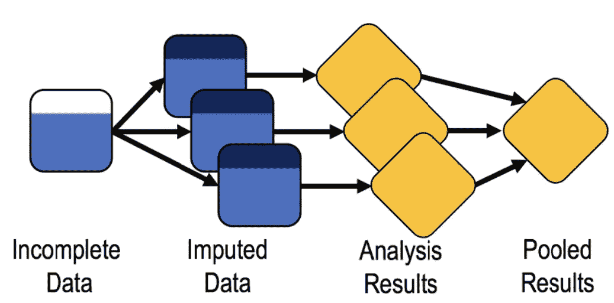

Image by Author

# **估算缺失数据的预测/统计模型**

这应该结合一些交叉验证方案来完成，以避免泄漏。这可能非常有效，并有助于最终的模型。这种预测模型有许多选择，包括神经网络。这里我列举了几个非常受欢迎的。

## 线性回归

在回归插补中，使用现有变量进行预测，然后代入预测值，就像实际获得的值一样。这种方法有几个优点，因为与列表或成对删除相比，插补保留了大量数据，避免了显著改变标准偏差或分布形状。然而，正如在均值替换中一样，虽然回归插补替换了从其他变量预测的值，但没有增加新的信息，同时样本量增加了，标准误差减少了。

## 随机森林

随机森林是一种适用于各种变量类型的非参数插补方法，适用于随机缺失和非随机缺失的数据。随机森林使用多个决策树来估计缺失值，并输出 OOB(随机)插补误差估计值。一个警告是，随机森林最适合大型数据集，在小型数据集上使用随机森林有过度拟合的风险。

## k-NN (k 近邻)

k-NN 基于最近的 K 近邻估算缺失的属性值。基于距离度量来确定邻居。一旦确定了 K 个邻域，就通过采用缺失属性的已知属性值的平均值/中值或模式来估算缺失值。

## 最大概似法

观测数据是从多元正态分布中抽取的样本这一假设相对容易理解。在使用可用数据估计参数之后，基于刚刚估计的参数来估计缺失数据。几种策略是使用最大似然法来处理缺失数据。

## 期望最大化

期望最大化(EM)是用于创建新数据集的最大似然方法。所有缺失值都用最大似然法估计的值进行估算。这种方法从期望步骤开始，在此期间估计参数(例如方差、协方差和均值)，可能使用列表删除。这些估计值随后用于创建回归方程来预测缺失的数据。最大化步骤使用这些等式来填充缺失的数据。然后用新的参数重复期望步骤，确定新的回归方程来“填充”缺失的数据。重复期望和最大化步骤，直到系统稳定。

## 灵敏度分析

敏感性分析被定义为研究如何将模型输出中的不确定性分配给其输入中的不同不确定性来源。当分析缺失数据时，对缺失数据进行额外的假设，这些假设通常适用于主要分析。然而，这些假设的正确性无法得到明确的验证。因此，国家研究委员会建议进行敏感性分析，以评估结果对 MAR 假设偏差的稳健性。

# 支持缺失值的算法

并不是所有的算法在数据缺失时都会失败。某些算法可以对缺失数据保持稳健，例如 k-最近邻，当值缺失时，这些算法可以忽略距离度量中的列。某些算法可以在构建预测模型时将缺失值用作唯一的不同值，例如分类树和回归树。像 XGBoost 这样的算法会考虑任何丢失的数据。如果你的插补效果不好，尝试一个对缺失数据稳健的模型。

# 推荐

缺失数据会降低模型的能力。一些缺失数据是意料之中的，目标样本量会增加以考虑到这一点。然而，这并不能消除潜在的偏见。在研究的设计和执行以及对结果数据的分析中，应更多地关注缺失数据。机器学习模型技术应仅在尽最大努力减少设计和预防技术中的缺失数据后执行。

强烈建议对缺失数据进行具有适当机制和假设的有效统计分析。大多数插补技术都会造成偏差。很难知道多重插补还是完全最大似然估计是最好的，但两者都优于传统方法。这两种技术最适用于大样本。一般来说，在分析有缺失数据的数据集时，多重插补是一种很好的方法。

> 只需每月 5 美元，就可以无限制地获取最鼓舞人心的内容……点击下面的链接，成为媒体会员，支持我的写作。谢谢大家！
> [***【https://baijayanta.medium.com/membership】***](https://baijayanta.medium.com/membership)

## 参考:

[https://www.ncbi.nlm.nih.gov/pmc/articles/PMC3668100/](https://www.ncbi.nlm.nih.gov/pmc/articles/PMC3668100/)

[https://leportella . com/English/2019/01/14/interpolation . html](https://leportella.com/english/2019/01/14/interpolation.html)

[https://www . research gate . net/publication/220579612 _ Missing _ Data _ attraction _ Techniques](https://www.researchgate.net/publication/220579612_Missing_Data_Imputation_Techniques)

http://www.stat.columbia.edu/~gelman/arm/missing.pdf

## 感谢阅读。可以联系我@ [LinkedIn](http://www.linkedin.com/in/baijayantaroy) 。