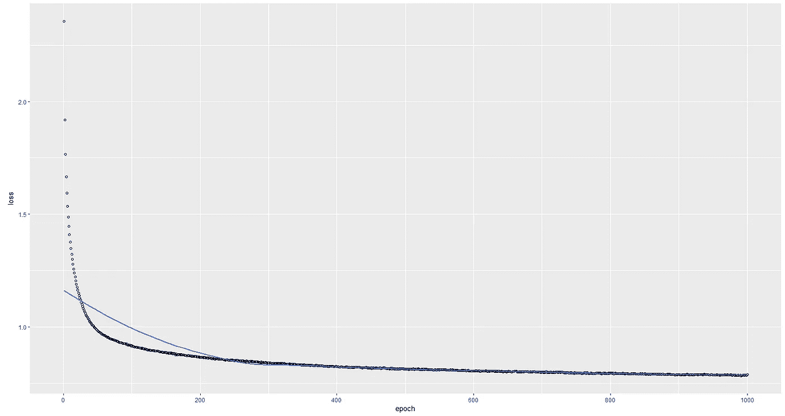

# 我想要的圣诞礼物就是人工智能:用 LSTMs 写出下一部圣诞大片

> 原文：<https://towardsdatascience.com/all-i-want-for-christmas-is-ai-write-the-next-christmas-hit-using-lstms-2e95ea3da25e?source=collection_archive---------35----------------------->

## 如何用一些奇怪的人工智能生成的圣诞歌词来给你的假期增添趣味

厌倦了失去[威猛的一击](https://www.whamageddon.com/)？你是否暗自希望克里斯蒂娜·阿奎莱拉从未出生？你害怕麦可·布雷每年的回归胜过一切吗？
嗯，事实证明在不久的将来我们可能会有*几十亿多*。

可怕吧。

**用 AI** 生成文本是数据科学家能够完成的最**完整和令人满意的任务**之一:我们处理**网页抓取**、**非结构化数据**、**预处理**、**数据探索**、**模型设计**、**超参数调优**、数小时的**培训**以及——最重要的是——我们能够获得最终的、可触知的结果

The most common words in the lyrics of the 20 most popular Christmas songs (from [Vivid Seats](https://www.vividseats.com/blog/most-common-words-in-popular-christmas-songs))

鉴于一年中的时间和圣诞颂歌主题的可预测性(这里是圣诞老人，那里是耶稣，红色，白色，四周是雪，圣诞树，快乐，幸福，我们完成了)，这里我们将尝试生成圣诞主题的歌词。

# 语言模型

自动生成歌词是一项琐碎的任务。生成文本序列的一般方法是训练一个模型，在给定所有先前单词/字符的情况下预测下一个单词/字符。为文本生成脚本提供动力的引擎被称为统计语言模型，或者简称为语言模型。

## 统计语言模型

**语言模型是一种概率模型，它可以预测序列中的下一个单词，给定之前单词本身的序列**、**、**试图捕捉它所训练的文本的统计结构(即潜在空间)。从技术上来说，它只是一系列单词 *P* ( *w1，w2，…，wₘ* )的**概率分布，从中我们迭代得出最有可能的下一个单词评估 *P* ( *wₙₑₓₜ | w1，w2，…，wₘ* )。这也是当谷歌自动完成我们奇怪的查询(提供更奇怪的建议)和我们无聊的圣诞祝福邮件时幕后发生的一部分。**

Apparently, Google Search doesn’t have a good opinion on Christmas songs either

## 基于字符的神经语言模型

语言模型也可以在**字符级别**开发。基于字符的语言模型的主要好处是它们的**小词汇量**和处理任何单词、标点符号和特定文本结构的**灵活性**。这是以拥有更大的模型和**更长的训练** **倍**为代价的。
如今用于构建语言模型的最常见的 ML 技术家族是**递归神经网络** (RNNs)，这是一种功能强大的神经网络，能够**记住**并通过其隐藏状态神经元处理过去的信息。

A simple example of RNN (with a single 3-units hidden layer) forward pass using the training sequence “hello”. For each (one-hot encoded) character in the sequence, the RNN predicts the next character assigning a confidence score to every character in the vocabulary ([“h”, “e”, “l”, “o”]). The objective of the network is to learn the set of weights that maximizes the green numbers in the output layer and minimize the red ones.

当足够的数据可用时，具有 [**长短期记忆**](https://en.wikipedia.org/wiki/Long_short-term_memory) (LSTM)味道的 rnn 更受欢迎，因为它们可以捕捉更复杂的文本依赖，并更好地处理[爆炸/消失梯度问题](https://medium.com/learn-love-ai/the-curious-case-of-the-vanishing-exploding-gradient-bf58ec6822eb)。

# 圣诞歌词生成器

为了生成我们的圣诞歌词，我们需要一个合适的数据源。对我们来说幸运的是，互联网上有大量的歌词网站，可以很容易地搜索到。

## 数据准备

一旦我们获得了数据源，我们就需要构建**语料库**，导入原始文本并应用一些普通的**文本预处理**，如(不需要的)标点删除和小写。
由于我们正在研究基于字符的语言模型，**文本必须映射到字符级**。因此，必须建立一个独特的**字符词汇表**。
我们神经网络的输入将是**字符序列**。因此，我们将语料库分成 *maxlen* 大小的序列，对每个*步骤*字符进行采样。

## 模型设计和培训

在本文中，我们将尝试构建最简单的基于字符的神经语言模型:一个 **128 大小的单层 LSTM，带有 softmax 激活**。
记住**输入**序列和输出必须是**一键编码**。

该网络被训练 1000 个时期，尽管在 500-600 个时期后损失似乎停止显著下降。

(根据您的硬件，这可能需要几个小时到几天的时间。为了在合理的时间框架内训练您的模型，您可以随意减少历元的数量)

The loss stops decreasing significantly after 500 epochs approximately

## 文本生成

一旦模型训练完毕，我们就可以开始预测了。给定一个字符序列，该模型使用它的权重来输出一个字符分布，从这里我们可以对下一个字符进行采样，只要我们愿意，就可以重复这个过程。**我们从输出分布中抽取下一个字符的方式至关重要**。

**如果我们总是选择最有可能的单词，语言模型训练目标会导致我们陷入循环**中，如*圣诞快乐。圣诞快乐。圣诞快乐*”。公平地说，这可以被认为是一首合法的圣诞颂歌，但可能不是我们想要在这里实现的。

**即使我们从分布中取样，我们仍然需要小心，因为最不可能的记号可能代表大部分的概率质量**。例如，让我们考虑一下，字符记号的底部 50%具有 25%的总概率。这意味着我们有 1/4 的机会去越野，导致不可阻挡的**误差传播**贯穿整个生成过程。

受统计热力学启发，**温度** **采样**是文本生成最常用的采样方法之一。这里的高温意味着更可能遇到低能态。因此，温度越低，模型对其首选越有信心，而温度高于 1 会降低信心。

## 结果

让我们看看使用 0.2 的温度和种子会得到什么:

> “感谢上帝今天是圣诞节
> 一天。感谢上帝，今天是圣诞节

在**第一个纪元**之后，我们实现了这样的东西:

> “感谢上帝，今天是圣诞节。感谢上帝，今天是圣诞节
> 
> e
> 
> 一个男孩爱上了这个女孩，但是他却爱上了这个女孩
> 
> 他把所有的人都带到了 tt
> 
> 以色列人在那里居住，所以他们在 etr 居住
> 
> awrmsesur ru uete errea […]" "

显然，该模型没有时间学习任何关于它所训练的语料库的语言。以下是《T21》10 个时代之后的歌词:

> “感谢上帝，今天是圣诞节。感谢上帝，今天是圣诞节，我不想要你这个小槲寄生和星星中的星星
> 
> 孩子们和星星们。我想要星星中的星星，星星和圣诞老人我想看圣诞树。[…]"

看起来 10 个时代足以理解如何将字符粘在一起以获得单词和句子，但仍然不足以学习语言本身的更高结构。请注意，生成的模型让**陷入了“星星”这个词的循环**，通常**无法生成有意义的东西**。
经过 **100 个时期**，我们得到:

> “感谢上帝，今天是圣诞节
> 一天。感谢上帝，今天是圣诞节，新年快乐，我会喜欢这个世界
> 
> 在槲寄生上的每一个角落，我都希望我能知道，我希望你能感受到你的血液，但我不能在圣诞节把我带回家
> 
> 当圣诞夜来临的时候，我想唱圣诞节早晨天空的歌，因为雪正在飘落……”

这已经是一个不识字的克里斯蒂娜·阿奎莱拉人能唱的了。圣诞颂歌的结构和反复出现的主题开始出现，同时还有令人毛骨悚然的废话，比如“*我希望你的窗户变成你的血*”这听起来更像黑色金属而不是圣诞节。
快进到 **1000 个纪元**:

> “感谢上帝，今天是圣诞节。感谢上帝，今天是圣诞节，你会成为你想要的人，祝你快乐。
> 
> 真是个又亮又丑的
> 和妈妈早知道了
> 我不要你的道听途说
> 我已经容不下你一个小屁孩了，命运
> 
> 我希望你身边有个男人。
> 她为雪搬运一件东西。圣诞节到了，圣诞节到了，圣诞节没有给我一首圣诞歌，圣诞钟声响起。[…]"

现在我们肯定有收获了！废话仍然存在，但歌词的整体质量是体面的，整个事情可能听起来有意义。
最后，我们可能会考虑用我们模型的超参数稍微调整一下**。例如，我们可以尝试对更长和/或更远的输入序列进行采样，在数据预处理阶段增加 *maxlen* 和 *step* 参数。直观地说，**增加输入序列的最大长度意味着给模型提供更多的上下文来学习**，所以我们期待更好的结果。
这是当 *maxlen* 从 70 增加到 120 时我们可以得到的结果:**

> “[……]打开我们天堂般的家
> 让通往天堂的路变得安全
> 关闭通往痛苦的道路。
> 
> 哦，来吧，摇一摇
> 一首圣诞歌的花
> 我整晚都有点醉
> 在一个正确的酒吧局，哈利路亚？
> 
> 我相信有圣诞老人，我相信我会在街上看到他把所有的玩具都搬出来
> 
> 格洛丽亚。透过天空的雪花看故事圣诞树，哦，圣诞节。
> 上帝之子出生之子而降
> 上帝之子出生之子而降
> 
> 我要送星星和雪
> ，我想要一只河马。[…]"

不确定它是否能被认为在质量上比前一个更好，但明年圣诞节我也会要一只河马。

# 结论

## 未来的发展

单层 LSTMs 只是神经语言建模的起点，因为[可以设计出更多的**复杂网络**](https://arxiv.org/abs/1810.04805) 来更好地解决文本生成的问题。
我们已经看到了**超参数如何在开发一个像样的文本生成器**中发挥重要作用。因此，我们可能会考虑在我们的网络中**堆叠更多(更大)的层**，以调整批量大小，并对**不同的序列长度和温度**进行更多实验。

## 进一步阅读

为了让每个人都能阅读，本文有意避免深入研究神经网络和 NLP 的数学和概率基础。这里有一个资源列表，您可以在其中探索我们留下的一些主题:

*   关于自然语言处理技术的现状: [BERT 解释说:自然语言处理技术语言模型的现状](/bert-explained-state-of-the-art-language-model-for-nlp-f8b21a9b6270)
*   字符感知神经语言模型: [Kim 等，2016](https://www.aaai.org/ocs/index.php/AAAI/AAAI16/paper/viewFile/12489/12017)
*   非常好的 NLM 基础教程:[字符级语言模型](/character-level-language-model-1439f5dd87fe)
*   RNNs 和语言模型与有趣的可视化和例子:[递归神经网络的不合理的有效性](http://karpathy.github.io/2015/05/21/rnn-effectiveness/)
*   语言建模概述:[统计语言建模和神经语言模型简介](https://machinelearningmastery.com/statistical-language-modeling-and-neural-language-models/)
*   我的灵感来源，在这里你可以找到歌词生成过程的更详细的描述:[使用语言模型和 LSTMs 生成德雷克说唱歌词](/generating-drake-rap-lyrics-using-language-models-and-lstms-8725d71b1b12)

请在评论区留下你的想法和建议，如果你觉得这有帮助，请分享！

 [## Tommaso Buonocore -软件工程师- AMC 医学研究 BV | LinkedIn

### 查看世界上最大的职业社区 LinkedIn 上 Tommaso Buonocore 的个人资料。托马索列出了 5 项工作…

www.linkedin.com](https://www.linkedin.com/in/tbuonocore/)