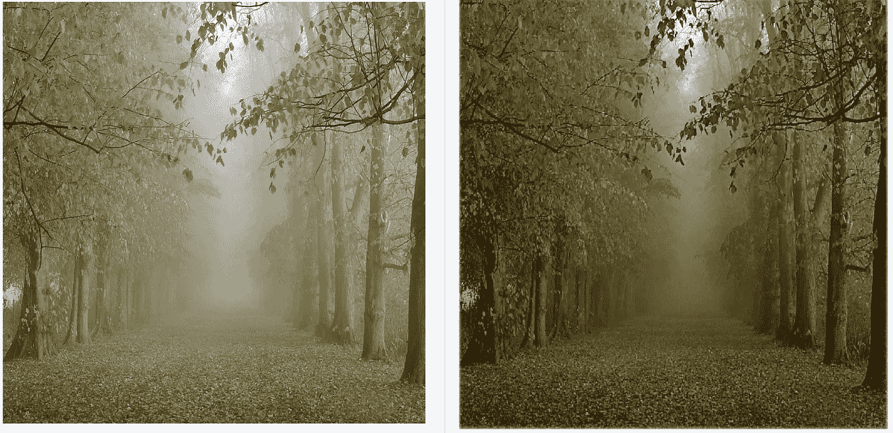

# 一体化图像去雾(AOD) —论文说明和 Tensorflow 实施

> 原文：<https://towardsdatascience.com/all-in-one-image-dehazing-aod-paper-explanation-tensorflow-implementation-bb97f6a6f1ef?source=collection_archive---------14----------------------->

## 李博一等对《网:一体化去雾网》论文的解读。艾尔。(ICCV 2017)以及在 Tensorflow 中实现相同功能的教程


# 介绍

雾霾会降低图像质量并限制可见度，尤其是在室外环境中。这因此影响了其他高级任务的性能，例如物体检测和识别。

李博一等人提出的 AOD 网络。艾尔。是一个端到端的 CNN 来消除图像的模糊。AOD 将模糊图像作为输入，并生成去模糊图像。

在这篇文章中，我解释了 AOD 网络论文的主要组成部分，并提供了在 Tensorflow 中实现 AOD 网络的分步指南。

你可以在这里找到完整的代码。


**Left:** Naturally hazy image of a forest scene. **Right:** De-hazed image generated by AOD-net.

# 论文解释

AOD 假定朦胧图像是根据下述大气散射模型产生的。

## **大气散射模型**

根据 ASM:


**Equation (1)**

其中，
I(x):观测到的雾天图像
J(x):原始图像
A:全球大气光照
t(x):传输矩阵

*A* 指整个场景中大气的自然光。
*t(x)* 代表物体到达相机的光量。
计算如下:


**Equation (2)**

其中，
β:散射系数(非负)
d(x):物体与观察者之间的距离(非负)

让我们试着理解这一点。

这个想法是大气在光线到达相机之前会散射来自物体的光线。散射的光量取决于大气属性(由β捕捉)以及物体与相机的距离(由 d(x)捕捉)。其余的光被传输(到达)相机。

由于β和 d(x)都是非负的，所以 t(x)的值在范围(0，1)内。0 表示没有来自对象的光到达相机(所有光都被散射)，1 表示来自对象的所有光到达相机(没有散射)。

β值越高，表示大气越倾向于散射光。此外，随着物体远离相机，更多的光被散射。

现在，给定透射值(对于每个像素)和全局大气光线，可以计算相机接收的光线。

如果 t(x)为 1，那么相机可以完美地看到来自物体的光(无散射)。
如果 t(x)为 0，那么相机只看到大气光(完全散射)。
否则，相机会看到物体发出的光和大气之间的线性插值。

## **问题表述**

现有的去雾工作是基于单独估计 *t(x)* 和 *A* 。这样做的关键问题是估计误差可能会累积。
AOD 的目的是用公式(1)的以下重新表述，以统一的方式估计这两个参数。


**Equation (3)**

在哪里，


**Equation (4)**

*t(x)* 和 *A* 被集成到一个变量 *K(x)* 中，该变量依赖于输入 *I(x)* 。一旦估计了 *K(x)* ，就可以使用等式(3)来计算去模糊图像。

因此，现在的目标是估计 *K(x)* 使得它最小化去模糊和原始图像之间的均方误差(MSE)。这是通过训练 CNN 来实现的。

## **网络设计**

该网络有两个模块。

第一个模块估计 *K(x)* 。注意，对于尺寸为 W x H x 3 的图像， *K(x)* 也具有尺寸 W x H x 3。
第二模块涉及使用等式(3)生成去模糊图像的元素式操作。

K 估计模块是关键的，因为它间接估计大气光和传输矩阵(隐含地计算图像中每个像素的深度)。

它由 5 个卷积层组成(带有 ReLU 激活)。
每层有 3 个过滤器，但内核大小不同(以生成多尺度特征)。此外，在进行卷积之前，先前层的激活与中间层连接，因为这补偿了卷积期间的信息丢失。

网络架构如下所示。


AOD-net Architecture

因此，整个管道看起来像这样:


AOD-net Prediction Pipeline. (Reference: [https://sites.google.com/site/boyilics/website-builder/project-page](https://sites.google.com/site/boyilics/website-builder/project-page))

**数据生成&培训**

为了训练 AOD 网络，作者生成了人工模糊的图像。基于等式(1)，来自 NYU2 深度数据库(包括每个像素的深度信息)的图像被人工模糊化，具有不同的值 *β* 和 *A* (从均匀随机分布中选择)。因此，对于大约 1500 幅地面真实图像，获得了大约 27K 的模糊图像。

该模型被训练了 10 个时期。权重用标准高斯分布初始化，权重衰减设置为 0.0001。梯度规范被剪切为 0.1。

**注:**该论文没有提到所使用的确切学习速率，也没有提到确切的优化算法。(我在实现中使用了 0.0001 的学习率和 Adam Optimizer)。

作者基于 [PSNR](https://en.wikipedia.org/wiki/Peak_signal-to-noise_ratio) 和 [SSIM](https://en.wikipedia.org/wiki/Structural_similarity) 指标，将 AOD 网络的性能与之前的去雾算法进行了比较。

现在让我们深入研究一下实现。

# TENSORFLOW 实现

## 数据准备

1.  在此下载训练 AOD 网[的数据集。有大约 1500 个清晰图像和大约 27K 的人工模糊图像。](https://docs.google.com/viewer?a=v&pid=sites&srcid=ZGVmYXVsdGRvbWFpbnxib3lpbGljc3xneDpjMjBjM2E3ZTAxZTM0NDU)
2.  将包含干净图像的文件夹重命名为“原始图像”，将包含模糊图像的文件夹重命名为“模糊图像”。
3.  “原始图像”中的每个图像都有一个格式为“NYU2_x.jpg”的文件名，其中 x 是一个整数。
    “hazy _ images”中的每个图像都有一个格式为“NYU2_x_y_z”的文件名，其中 x、y 和 z 是整数。
    对于给定的原始图像“NYU2_x.jpg”，人工生成的朦胧图像对于某些 y 和 z 命名为“NYU2_x_y_z”，每个原始图像对应的朦胧图像可以有多个。

## 数据加载

我们将使用 Tensorflow 数据集 API。

1.  从“orig_images”文件夹中读取原始图像路径并随机播放。将此列表分为两部分(90%-10%分割)，以生成分别用于训练和验证的图像路径列表。

```
orig_image_paths = glob.glob(orig_images_path + “/*.jpg”)
n = len(orig_image_paths) 
random.shuffle(orig_image_paths)

train_keys = orig_image_paths[:int(0.90*n)]
val_keys = orig_image_paths[int(0.90*n):]
```

2.创建一个字典，将每个原始图像路径映射到图像是用于“train”还是“val”。
请注意，训练集中使用的原始图像集不应与验证集重叠(即使对应的模糊图像不同)，以避免任何信息泄漏。

```
split_dict = {}
  **for** key **in** train_keys:
    split_dict[key] = 'train'
  **for** key **in** val_keys:
    split_dict[key] = 'val'
```

3.现在，迭代“hazy_images”文件夹中的所有图像路径，提取对应的原始图像的路径(用基本的字符串操作)。
如果原始图像路径对应于“列车”图像，则将 **<原始图像路径、模糊图像路径>** 添加到**列车数据**列表中。
否则，将其添加到 **val_data** 列表中。

```
train_data = []
  val_data = []

  hazy_image_paths = glob.glob(hazy_images_path + "/*.jpg")
  **for** path **in** hazy_image_paths:
    label = path.split('/')[-1]
    orig_path = orig_images_path + "/" + label.split('_')[0] + '_' + label.split('_')[1] + ".jpg"
    **if**(split_dict[orig_path] == 'train'):
      train_data.append([path,orig_path])
    **else**: val_data.append([path,orig_path])
```

4.使用 Tensorflow 数据集 API，创建训练和验证数据集。首先，通过对训练集的模糊图像路径应用 **from_tensor_slices()** 函数来创建 **train_ds_hazy** 数据集，随后是加载图像的映射函数(稍后解释)。
接下来，使用训练集的原始图像路径创建一个 **train_ds_orig** 数据集(以与之前相同的方式)。最后，压缩两个数据集以创建 **train_ds** 。

按照类似的过程创建 **val_ds** 。

```
train_ds_hazy = tf.data.Dataset.from_tensor_slices([data[0] **for** data **in** train_data]).map(**lambda** x: load_image(x))
  train_ds_orig = tf.data.Dataset.from_tensor_slices([data[1] **for** data **in** train_data]).map(**lambda** x: load_image(x))
  train_ds = tf.data.Dataset.zip((train_ds_hazy,train_ds_orig)).shuffle(100).repeat().batch(batch_size)

  val_ds_hazy = tf.data.Dataset.from_tensor_slices([data[0] **for** data **in** val_data]).map(**lambda** x: load_image(x))
  val_ds_orig = tf.data.Dataset.from_tensor_slices([data[1] **for** data **in** val_data]).map(**lambda** x: load_image(x))
  val_ds = tf.data.Dataset.zip((val_ds_hazy,val_ds_orig)).shuffle(100).repeat().batch(batch_size)
```

请注意，我们也说过数据集应该被混洗，数据应该以 **batch_size** 的批次提取。

5.现在，我们定义一个迭代器来迭代数据集元素。我们使用 **from_structure()** API，这样相同的迭代器可以用于训练和验证数据集。

```
iterator = tf.data.Iterator.from_structure(train_ds.output_types,train_ds.output_shapes)
```

然后我们定义 **train_init_op** 和 **val_init_op** 操作。运行这些操作告诉迭代器是分别从训练数据集还是验证数据集中选取数据。

```
train_init_op = iterator.make_initializer(train_ds)
val_init_op = iterator.make_initializer(val_ds)
```

6.最后，我们定义了 **next_element** 操作，可以调用它从迭代器中读取下一批数据。

```
next_element = iterator.get_next()
```

## 数据预处理

我们定义了 **load_image()** 函数，该函数将图像路径映射到预处理后的图像——准备好输入网络。
我们将图像的高度调整为 480 像素，宽度调整为 640 像素，并将像素值标准化为[0，1]。

```
**def** load_image(X):
  X = tf.io.read_file(X)
  X = tf.image.decode_jpeg(X,channels=3)
  X = tf.image.resize(X,(480,640))
  X = X / 255.0
  **return** X
```

## 网络、损耗和优化

1.  定义一个函数，该函数获取输入图像，并在将图像通过 AOD 网络架构后返回输出。

```
**def** haze_net(X):

  conv1 = Conv2D(3,1,1,padding="SAME",activation="relu",use_bias=**True**,kernel_initializer=tf.initializers.random_normal(),
                kernel_regularizer=tf.keras.regularizers.l2(weight_decay))(X)
  conv2 = Conv2D(3,3,1,padding="SAME",activation="relu",use_bias=**True**,kernel_initializer=tf.initializers.random_normal(),
                kernel_regularizer=tf.keras.regularizers.l2(weight_decay))(conv1)
  concat1 = tf.concat([conv1,conv2],axis=-1)

  conv3 = Conv2D(3,5,1,padding="SAME",activation="relu",use_bias=**True**,kernel_initializer=tf.initializers.random_normal(),
                kernel_regularizer=tf.keras.regularizers.l2(weight_decay))(concat1)
  concat2 = tf.concat([conv2,conv3],axis=-1)

  conv4 = Conv2D(3,7,1,padding="SAME",activation="relu",use_bias=**True**,kernel_initializer=tf.initializers.random_normal(),
                kernel_regularizer=tf.keras.regularizers.l2(weight_decay))(concat2)
  concat3 = tf.concat([conv1,conv2,conv3,conv4],axis=-1)

  conv5 = Conv2D(3,3,1,padding="SAME",activation="relu",use_bias=**True**,kernel_initializer=tf.initializers.random_normal(),
                kernel_regularizer=tf.keras.regularizers.l2(weight_decay))(concat3)
  K = conv5

  output = ReLU(max_value=1.0)(tf.math.multiply(K,X) - K + 1.0)
  *#output = output / 255.0*

  **return** output
```

注意:
-权重初始化(kernel_initializer)是用高斯分布(均值 0.0，标准差 0.02)完成的。
-使用参数为 0.0001 的 L2 正则化。
-每次卷积后应用 ReLU 激活。
-最大值为 1.0 的 ReLU 激活应用于元素倍增层之后。

2.分别为输入(模糊)图像和原始图像定义占位符 **X** 和 **Y** 。
定义**去雾 _X** 为网络通过 **X** 时的输出。

```
X = tf.placeholder(shape=(**None**,480,640,3),dtype=tf.float32)
Y = tf.placeholder(shape=(**None**,480,640,3),dtype=tf.float32)
dehazed_X = haze_net(X)
```

3.定义原始图像和去模糊图像之间的网络损耗 MSE。

```
loss = tf.reduce_mean(tf.square(dehazed_X-Y))
```

4.定义**优化器**操作。
a)定义 Adam 优化器，将**<learning _ rate>**设置为 0.001 **。b)传递可训练变量列表，并计算每个变量的梯度。
c)裁剪范数 0.1 上的梯度
d)通过应用裁剪的梯度更新可训练变量。**

```
# Step (a)
optimizer = tf.train.AdamOptimizer(learning_rate)# Step (b)
trainable_variables = tf.trainable_variables()
gradients_and_vars = 
optimizer.compute_gradients(loss,trainable_variables)# Step (c)
clipped_gradients = [(tf.clip_by_norm(gradient,0.1),var) **for** gradient,var **in** gradients_and_vars]# Step (d)
optimizer = optimizer.apply_gradients(gradients_and_vars)
```

## 培养

1.  定义 **tf。训练时，避免存储模型权重。**

```
saver = tf.train.Saver()
```

2.初始化所有全局变量。

3.在每个时期，运行 **train_init_op** ，以便迭代器从训练数据集中读取数据。

4.定义需要处理的批次数量，这相当于训练样本数量除以批次大小。

5.对于每个批次，运行优化器操作并存储相应的损失(MSE)。每 1000 次迭代打印一次批次损失，以检查损失是否在减少。

```
**with** tf.device('/gpu:0'):
  **with** tf.Session() **as** sess:

    sess.run(tf.global_variables_initializer())
    **for** epoch **in** range(n_epochs):

      sess.run(train_init_op)
      batches = len(train_data) // batch_size
      epoch_loss = 0.0
      **for** batch **in** range(batches):

        batch_data = sess.run(next_element)
        *#print(batch_data[0].shape,batch_data[1].shape)*
        *#print(np.max(batch_data[0]),np.max(batch_data[1]))*
        batch_loss, _ = sess.run([loss,optimizer],feed_dict={X:batch_data[0],
                                                            Y:batch_data[1]})
        epoch_loss += batch_loss / float(batches)
        **if** batch % 1000 == 0:
          print("Training loss at batch **%d**: **%f\n**"%(batch,batch_loss))

      train_loss = epoch_loss
```

6.要评估验证数据集的性能，重复相同的过程，只是不运行**优化器**操作。
此外，每 100 批后，显示模糊、原始和去模糊图像(由网络生成),以供目视检查。

```
sess.run(val_init_op)
      batches= len(val_data) // batch_size
      epoch_loss = 0.0
      **for** batch **in** range(batches):
        batch_data = sess.run(next_element)
        batch_loss = sess.run(loss,feed_dict={X:batch_data[0],
                                             Y:batch_data[1]})
        epoch_loss += batch_loss / float(batches)
        **if** batch % 100 == 0:
          print("Validation loss at batch **%d**: **%f\n**"%(batch,batch_loss))
          **for** j **in** range(batch_size//2):
            x = batch_data[0][j].reshape((1,)+batch_data[0][j].shape)
            y = batch_data[1][j].reshape((1,)+batch_data[1][j].shape)
            dehazed_x = sess.run(dehazed_X,feed_dict={X:x,Y:y})
            print("Image Number: **%d\n**"%(j))
            showImage(x[0])
            showImage(y[0])
            showImage(dehazed_x[0])
      val_loss = epoch_loss
```

6.在每个时期之后，保存模型权重。

```
saver.save(sess,'./models/model_checkpoint_' + str(epoch) + '.ckpt')
```

## 结果

我对网络进行了 10 个时期的训练，并在验证集上实现了大约 0.018 的 MSE。然而，在 3-4 个周期后，我没有观察到明显的改善。

下面是一些自然朦胧图像的定性结果(不是人工生成的朦胧)。


**Left:** Naturally hazy image. **Right:** De-hazed image generated by AOD-net.


**Left:** Naturally hazy image. **Right:** De-hazed image generated by AOD-net.


**Left:** Naturally hazy image. **Right:** De-hazed image generated by AOD-net.



**Left:** Naturally hazy image. **Right:** De-hazed image generated by AOD-net.

可以在[这里](https://github.com/tusharsircar95/All-In-One-Image-Dehazing-Tensorflow)找到整个代码以及经过训练的模型。是可以在 GoogleCollab 上运行的 Python 笔记本。

干杯！:D

# 参考

1.  [https://sites . Google . com/site/boy ilics/website-builder/project-page](https://sites.google.com/site/boyilics/website-builder/project-page)
2.  【https://github.com/TheFairBear/PyTorch-Image-Dehazing (py torch 实现)