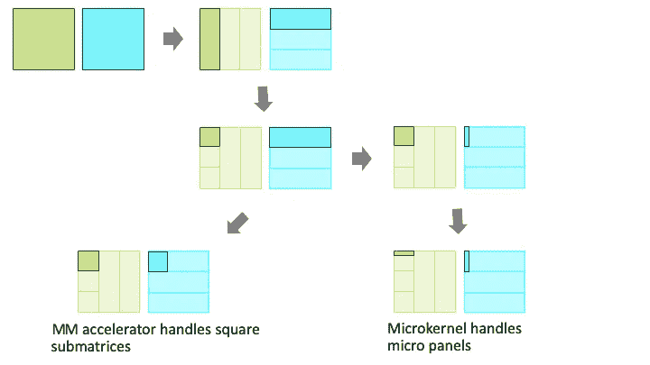
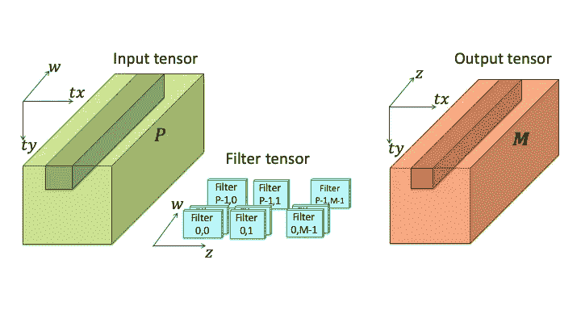
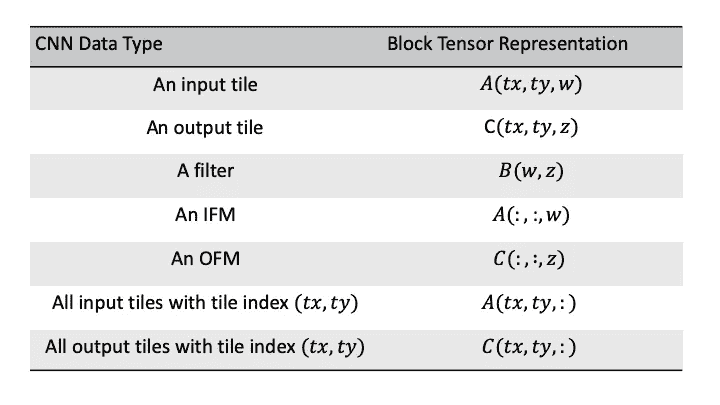
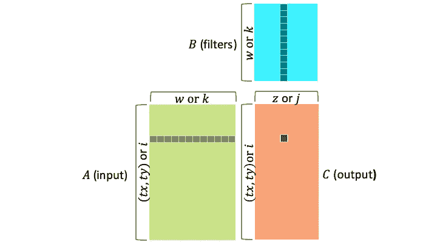
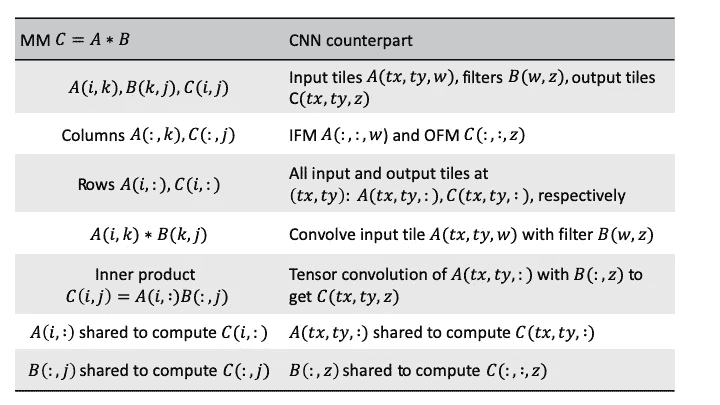
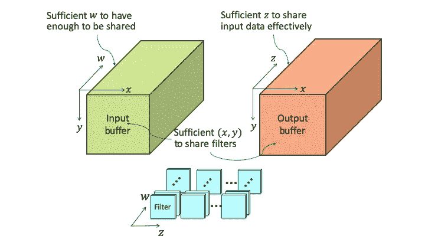
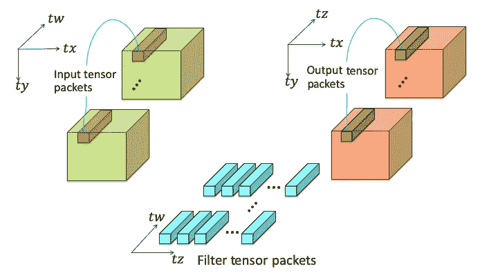
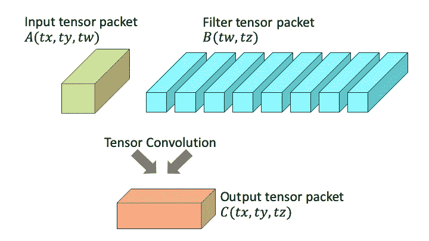
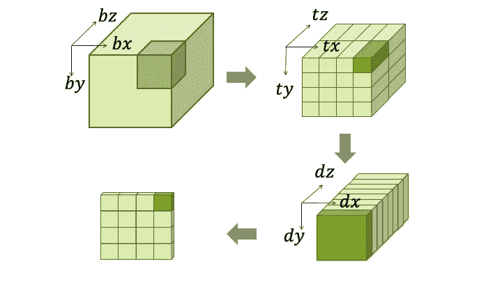
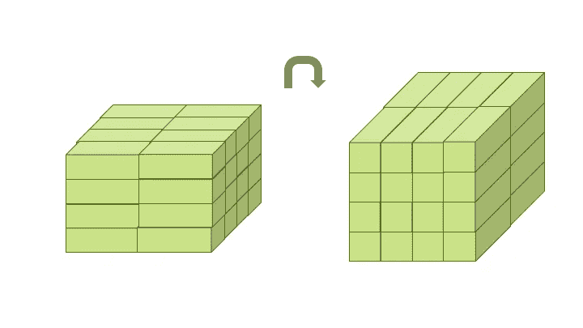

# 所有张量都暗暗希望做自己

> 原文：<https://towardsdatascience.com/all-tensors-secretly-wish-to-be-themselves-1ccc836df41c?source=collection_archive---------16----------------------->

Photo by [Olav Ahrens Røtne](https://unsplash.com/@olav_ahrens?utm_source=unsplash&utm_medium=referral&utm_content=creditCopyText)on [Unsplash](https://unsplash.com/search/photos/rubix-cube?utm_source=unsplash&utm_medium=referral&utm_content=creditCopyText)

16 绝不是个大数字。计算一个卷积神经网络(CNN)需要多少 MAC 单元才能在 64 个时钟周期内从 16 深度 3×3 张量卷积中产生 16 个 16×16 区块的输出通道？

如果不使用快速算法，将需要至少 9216 个 MAC 单元。9，216 个 MAC 单元通常用于构建 96×96 脉动阵列，但是计算 96×96 矩阵乘法(MM)至少需要 96 个时钟的等待时间。将需要一长串 96×96×96 的矩阵乘法来保持脉动阵列被占用。

欢迎来到人工智能中的张量世界。现在是时候习惯维度的诅咒了。

# **张量与矩阵**

这篇文章的标题是受 Charles F. Van Loan 教授在他 2010 年关于张量展开的[演讲](http://www.cs.cornell.edu/cv/SummerSchool/Unfold.pdf)中的一句话的启发和回应。

> *所有张量都暗暗希望自己是矩阵！*

这一陈述表明了张量研究团体通过首先将张量展开成矩阵，然后利用成熟的矩阵理论框架来研究张量的愿望。即使张量被认为是所有主要人工智能框架中最基本的数据类型，将张量展平到矩阵以利用高度优化的矩阵乘法(MM)或 MM 加速器(MMA)库也是一种行业标准做法。矩阵一般被 AI 界认为是张量的特例。

传统智慧可能会说:

1.  MM 中有非常好的并行性和数据共享模式可以利用。
2.  矩阵比张量更适合可编程硬件。
3.  有一个本机硬件加速解决方案，脉动阵列，用于 MM。

然而，

1.  CNN 在结构上相当于 MMs。没有必要展平张量来利用 MM 等价的并行性和数据共享模式。
2.  当沿着存储器层级向上攀升时，矩阵针对时间局部性被递归地分块，并且针对空间局部性被打包。它们最终成为微面板，即小块行或列，由软件微内核或 GPU 着色器内核使用。
3.  在我对谷歌的 256x256 脉动阵列的 TPU v1 的[评论](https://medium.com/@CPLu/should-we-all-embrace-systolic-array-df3830f193dc)中，解决了脉动阵列的方形诅咒的可扩展性问题。此后，使用多个相对较小的脉动阵列似乎成为主流。由于这个原因，矩阵在成为可以被脉动阵列消耗的正方形矩阵形状之前，必须被类似地分块和打包。

因此，来自展平张量的矩阵实际上被分块并打包成适当的结构，以实现高性能执行，如下图所示。前者可以称为平面展开，后者称为块展开。由于几十年来对高性能 MM 实现的研究、构建和利用块矩阵框架的努力，矩阵通常成为 CNN 和 AI 的默认数据类型。

Block-unfolding of a MM

按照传统观点，CNN 中的特征映射被强制为某个矩阵的列，卷积滤波器被展平为列中的一些连续矩阵元素。由于平面展开，失去了在空间和时间上重复使用特征图中相邻像素的可能性。

# 阻止张量救援

MM 中递归矩阵块展开的一个关键特征是当矩阵靠近硬件的裸机时，高级时间和空间局部性被保留。看看 CNN 中的数据位置是否也能以张量的形式保存下来，这应该是很有趣的。

合理的设计选择是将特征地图划分为分块，并保持分块结构以重复使用过滤器，利用小分块的快速算法，并实现细粒度的 SIMD 式并行。在接近裸机时，张量应保持为张量，以保持要素地图中的切片结构和数据位置不变。

此外，必须解决输入特征地图和输出特征地图之间的位置模式。前者允许共享来自多个输入要素地图的数据，以便计算多个输出要素地图。后者使更多的受众能够共享输入要素地图。问题是你不能共享所有的特征图，因为产生一个输出像素并不需要所有的输入特征图，并且将所有的特征图保存在芯片上是不切实际的。总结一下，所有维度都需要进行一定程度的划分或分块，这样的考虑导致张量被划分成更小的，成为**块张量**。

块张量是指其项是张量的张量。它是块矩阵的对等物。块张量的概念可用于解决维数灾难并保持 CNN 中的数据局部性，类似于高性能计算(HPC)行业如何采用 MM 的块矩阵概念。**张量包**，相当于 MM 中的微面板或子方阵，被定义为基本张量单元，必须对其进行原子处理以利用所有维度的空间局部性。由张量包组成的**张量块**被定义为必须在计算单元和外部存储器之间整体传输的张量单元，以促进张量包之间的时间局部性。

原子张量包操作被定义为从最小足够数量的输入通道产生最小足够数量的最小足够大小的瓦片的输出通道。由于张量中的维数灾难，即使每个张量包在每个维度上都很小，处理这样的张量包也会变得很费力。它可以在张量块内迭代或同时应用，以解决更大的问题。这些想法在文章的其余部分得到了半正式的阐述。

# 块张量形式的 CNN

CNN 的输入 *A* 和输出 *C* 分别由多个输入特征图(IFM)和输出特征图(ofm)组成。它们可以被认为是三维张量，特征图的维度为 *x* ， *y* ，索引 IFM 的输入深度为 *w* ，索引 ofm 的输出深度为 *z* 。为了实现细粒度的 SIMD 并行性并利用具有空间局部性的快速算法，每个特征图可以沿着 *x* 和 *y* 维度进一步划分成瓦片。复合索引( *tx* ， *ty* )分别用于识别输入图块和输出图块。对于每一对唯一的 IFM *w* 和 OFM *z* ，都有一个滤波器 *B* ( *w* ， *z* )，通常由 3×3 的滤波器参数组成。输入和输出张量成为图块的块张量，如下图所示

CNN in terms of block tensors of tiles

平铺的 CNN 可以用张量理论符号更紧凑和精确地表示如下:

冒号表示从该维度获取所有数据。 *A* (:，:， *w* ) 代表 IFM *w* ，因为它从 IFM 中取出所有的图块。

# CNN 在结构上等同于 MMs

传统观点认为，我们必须将张量展开成矩阵，以利用 MMs 中的并行性和数据共享模式。然而，实际上是反过来的。就并行性和数据共享模式而言，CNN 在结构上等同于 MMs，如下所示，这就是 MMs 在 CNN 中如此普遍使用的原因。

CNNs are structurally equivalent to MMs

由于 *C* 中的行的计算是独立的，所以 *A* 的行可以被阻塞。等效地，特征图可以被平铺，因为像素可以被独立计算。

> MM 等效并行度和数据共享模式相对于切片保持不变。

同一要素地图中的输出切片共享相同的过滤器，但不共享相同的输入切片。沿着输出维度的输出切片共享相同的输入切片，但不共享相同的过滤器。MMs 和 CNN 之间的等价性可以在下表中用张量理论符号更简洁地描述:

# 深度也需要平铺(阻塞)

现在，片上存储器的成像尺寸受到限制，我们希望在片上数据块中的 IFM、ofm 和滤波器之间充分利用 CNN 中的 MM 等效数据共享模式。数据块的几何结构应该是什么样的？它必须有足够的( *x* 、 *y* ) 来重用过滤器，足够的 *w* 来共享足够的输入数据，以及足够的 *z* 来有效地共享输入数据，如下图所示:

On-chip buffers must have sufficient coverages along all dimensions

这个观察导致除了阻塞 *x* 和*y* 维度之外，阻塞 *w* 和 *z* 维度，这个我们已经做过了。这是为了确保输入和输出数据块分别覆盖足够数量的 IFM 和 ofm。引入新的索引 *tw* 和 *tz* 分别标识一组 IFM 和一组 ofm。我们将输入张量包 *A* ( *tx* ， *ty* ， *tw* )定义为来自 IFM 组 *tw 的一组( *tx* ， *ty* )对齐的图块。* 同样，我们将 *C* ( *tx* ， *ty* ， *tz* ) 定义为一组来自 OFM 组 *tz* 的( *tx* ， *ty* )对齐瓷砖。 *B* ( *tw* ， *tz* ) 代表一组滤波器，每组用于一对来自组 *tw* 的 IFM 和来自组 *tz* 的 OFM。它被称为滤子张量包。输入、输出和过滤张量现在是张量包的块张量，如下所示

CNN in terms of block tensors of tensor packets

> MM 等价并行性和数据共享模式相对于张量包保持不变。

软件中的**张量微内核**或硬件中的**张量包引擎**可以被设计成处理将输入张量包 *A* ( *tx* ， *ty* ， *tw* ) 与过滤张量包 *B* ( *tw* ， *tz* ) 进行卷积的原子操作

Atomic tensor packet operation

假设输入和输出图块分别为 6x6 和 4x4，并使用 8 作为 IFM 组和 OFM 组的大小。在不使用 3×3 卷积的快速算法的情况下，在 4 个时钟内完成该运算需要 2304 个 MAC 单元。2304 路并行度在所有尺寸中相当平均地投入，包括沿特征图的 *x* 和**y，输入深度 *w* ，输出深度 *z* 。使用诸如 4x4 之类的小块尺寸的分块使得能够使用诸如 Winograd 之类的快速算法，从而仅使用 576 个 MAC 单元就可以实现 2，304 路并行。**

# **张量的递归分块**

**张量包是计算单元整体消费的基本单位。为了保持切片之间的数据局部性和平铺结构，我们在全张量和张量包之间引入了一个中间块级别，张量块，，以包括我们希望整体带到芯片上的张量包。当有足够的计算单元、片上存储器和提供带宽时，它是片间时间局部性和空间局部性的基本单元。一个张量块沿 *x* 、*、* **、*、*、**、*、*、**、*、*、 *z* 、*、*、**维度用( *bx* 、 *by* 、*BZ**、*、*。*****

**下面是一个张量递归分块的例子。整体张量是 4x4 瓦片的 4x 4 块张量的 4x2 块张量，4x 4 瓦片的 1x1x8 块张量，其中( *dx* ， *dy* )是在瓦片内寻找像素的偏移， *dz* 是标识组内特定特征图的索引。**

****

**Recursive blocking of tensors to preserve locality in a feature map**

**张量块线性存储在内存中。我们不需要担心它们是如何准确排序的。对于张量块，将有两种不同的块展开顺序，一种优化为将张量块存储到 DRAM，另一种优化为将其呈现给计算单元。如下所示，将需要软件和/或硬件中的转置机制来动态地从一种格式转置到另一种格式。**

****

**Transposition of a tensor block**

**执行转置的等待时间可以由双缓冲来覆盖。当张量块被呈现给计算单元时，它被展开成( *tx* 、 *ty* )主顺序的张量包，因此张量包可以在( *x* 、 *y* )域中并行处理，计算单元相应地排列。**

# **所有张量都暗暗希望做自己**

**Van Loan 教授在关于块张量的块展开的[演讲](https://www.cs.cornell.edu/cv/OtherPdf/CVLTahoe.pdf)中也说过:**

> ***块展开保留了数据的结构和局部性。…在我看来，分块最终会在张量计算中产生与矩阵计算相同的影响。***

**张量被分块展开成用于多维中的时间局部性的张量块，使得当被带到芯片上时，数据可以在多维中共享。张量块被进一步分块展开成张量包，这些张量包在所有维度上具有最低限度的足够覆盖。在本例中，处理这样的张量包需要 2304 路并行处理。MM 等价并行和数据共享模式应用于张量块中的张量包。**

**据我们所知，这篇文章中所讨论的可能是计算史上第一次尝试在裸机上采用块张量的概念。对于处理高分辨率视频/图像的应用，可以实现跨越 *x* 和 *y* 维度的可扩展和更大的并行性。CNN 凭借其革命性的力量和在张量中的根深蒂固，可能会成为 block tensors 的第一个杀手级应用。**

> **所有张量都暗暗希望自己是 block 张量，期待自己的潜力得到释放，实现 AI 硬件的突破。**