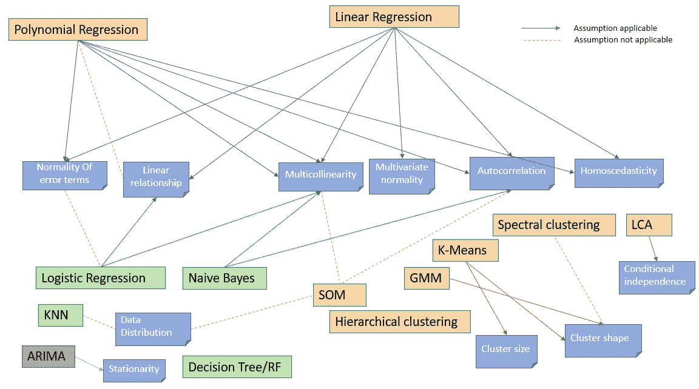

# 所有恼人的假设

> 原文：<https://towardsdatascience.com/all-the-annoying-assumptions-31b55df246c3?source=collection_archive---------8----------------------->

## 在这篇文章中，我试图收集和映射常见数据科学算法的假设。

假设是恼人的小事，如果你要成功地实现任何模型，就需要坚持这些假设。大多数模型，无论多么基本，都有一套假设，在本文中，我试图将它们映射成一种模式，以便于理解。

让我从一张我尝试构建的假设图开始。从这里开始，我们可以轻松地浏览与每个部分相关的假设。

Assumption Map

我们开始吧..

# 回归

线性回归和多项式回归都有一组共同的假设，如果它们的实现是有益的，就需要满足这些假设。

1.  **线性关系:**线性回归需要**自变量和因变量之间的关系是线性的。**这种线性假设**最好用散点图来检验。**然而，显然**线性假设对多项式回归无效。**
2.  **多元正态:**回归分析要求所有变量都是多元正态。这种假设最好用**直方图或 Q-Q 图来检验。** **正态性可通过拟合优度检验进行检查，如 Kolmogorov-Smirnov 检验。当数据不是正态分布时，非线性变换(例如，对数变换)可以解决这个问题。**
3.  **多重共线性:**回归假设数据中很少或没有多重共线性。**当自变量之间的相关性过高时，会出现多重共线性。**您可以使用相关矩阵来检查变量之间是否相关。您可以删除一组相关的列，同时保留另一组。
4.  **自相关:R** 回归分析要求数据中很少或没有自相关。**当残差不是相互独立的时候，就会出现自相关。**虽然散点图可以让你检查自相关，你可以用**德宾-沃森测试来测试自相关的线性回归模型。**
5.  **同方差:**同方差描述了一种情况，其中**误差项在独立变量的所有值上都是相同的。**散点图是检查数据是否同方差的好方法(意味着回归线上的残差相等)。如果存在同方差，非线性校正可能会解决问题。
6.  误差项必须是**正态分布**。

> 像套索、脊、弹性网等分离方法不过是试图平衡偏差与方差的正则化技术。因此，这些技术没有任何独立的假设。
> 
> SVR 对输入数据也相当宽容，并且没有任何独立的假设。

# 使聚集

广泛使用的聚类算法有四种:****k-means 聚类分析、潜在类分析、*和*自组织映射。****

1.  ***K 均值聚类**方法考虑了关于聚类**的两个假设——首先，聚类是球形的，其次，聚类具有相似的大小。**当算法处理数据并形成聚类时，球形假设有助于分离聚类。如果违背了这一假设，所形成的簇可能不是人们所期望的。另一方面，对群集大小的假设有助于决定群集的边界。*
2.  *某些相似性度量(例如欧几里德距离)假设变量在聚类内是不相关的。*
3.  *在**谱聚类**中，数据点被视为图形的节点。因此，聚类被视为一个图划分问题。然后，节点被映射到一个低维空间，该空间可以很容易地被分离以形成集群。**需要注意的重要一点是，没有对集群的形状/形式进行假设。***
4.  ***层次聚类没有自己独立的假设。***
5.  *与其他聚类算法类似， **GMM 对数据的格式和形状有一些假设。如果不满足这些标准，绩效可能会显著下降。***
6.  *LCA 以**“条件独立性”为标准定义潜在类别这意味着，在每个潜在类别中，每个变量在统计上独立于其他变量。例如，在对应于不同医学综合征的潜在类别中，一种症状的存在/不存在被视为与所有其他症状的存在/不存在无关。对于某些应用程序，条件独立性可能是一个不合适的假设。例如，一个人可能有两个非常相似的项目，因此对它们的响应可能总是相关联的。对于这种情况和某些相关情况，潜在类模型的扩展是存在的。***
7.  *与多变量技术相比，**非参数 SOM** 程序有许多优点。**首先，它们不假设变量的分布，也不要求变量之间的独立性。**其次，它们更容易实现，能够解决非常复杂的非线性问题。最后，它们可以更有效地处理噪音和缺失数据、非常小的维度和无限大小的样本。*

# *分类*

*常见的分类器类型有: ***逻辑回归、朴素贝叶斯分类器、KNN、随机森林****

1.  ***逻辑回归**用于预测从属变量，这些变量属于有限数量的类别之一(将二项式情况下的从属变量视为[伯努利试验](https://en.wikipedia.org/wiki/Bernoulli_trial)的结果)，而非连续结果。**鉴于这种差异，违反了线性回归的假设。特别是残差不能正态分布。***
2.  *结果的 logit 和每个预测变量之间存在**线性关系。回想一下，logit 函数是`logit(p) = log(p/(1-p))`，其中 p 是结果的概率。这可以通过目视检查每个预测值和 logit 值之间的散点图来检查。***
3.  *预测值之间没有高度相关性(即**多重共线性**)。这可以通过可视化厨师的距离值来检查。*
4.  *在**朴素贝叶斯分类器**的情况下，假设**预测器/特征是独立的**。这里做的另一个假设是所有的**预测因素对结果有相同的影响。***
5.  ***KNN 是一种*非参数懒惰学习*算法。那是一个非常简洁的陈述。当你说一项技术是非参数化的，这意味着它没有对底层数据分布做任何假设。***
6.  *在**决策树**中，由于我们没有概率模型，只有二分分裂，我们根本不需要**做任何假设**。那是关于决策树的，但它也适用于**随机森林。**不同之处在于，对于随机森林，我们使用引导聚合。它下面没有模型，唯一依赖的假设是**采样具有代表性**。但这通常是一个常见的假设。*

> *集成方法是一种元算法，它将几种机器学习技术结合到一个预测模型中，以便**减少** **方差**(bagging)**偏差** (boosting)，或者**提高预测** (stacking)。因此，这些也没有任何单独的假设。*

# *时间序列分析*

*ARIMA 模型基于**平稳性**的假设工作(即它们必须具有恒定的方差和[均值](https://www.statisticshowto.datasciencecentral.com/mean/))。如果你的模型是不稳定的，你需要在使用 ARIMA 之前对它进行变换。*

*随着我对数据科学的了解越来越多，我会继续更新这篇文章，直到那时，干杯。*

# *参考资料:*

1.  *[https://www . research gate . net/publication/263084866 _ An _ Introduction _ to _ Self-Organizing _ Maps](https://www.researchgate.net/publication/263084866_An_Introduction_to_Self-Organizing_Maps)*

*2.[https://cdn1 . SPH . Harvard . edu/WP-content/uploads/sites/59/2016/10/Harvard-lecture-series-session-5 _ LCA . pdf](https://cdn1.sph.harvard.edu/wp-content/uploads/sites/59/2016/10/harvard-lecture-series-session-5_LCA.pdf)*

*3.[https://www . analyticsvidhya . com/blog/2015/12/complete-tutorial-time-series-modeling/](https://www.analyticsvidhya.com/blog/2015/12/complete-tutorial-time-series-modeling/)*

*4.维基百科(一个基于 wiki 技术的多语言的百科全书协作计划ˌ也是一部用不同语言写成的网络百科全书ˌ 其目标及宗旨是为全人类提供自由的百科全书)ˌ开放性的百科全书*

*5.[https://www . statistics solutions . com/assumptions-of-linear-regression/](https://www.statisticssolutions.com/assumptions-of-linear-regression/)*

*6.大量堆栈溢出问题*

*7.[https://cdn1 . SPH . Harvard . edu/WP-content/uploads/sites/59/2016/10/Harvard-lecture-series-session-5 _ LCA . pdf](https://cdn1.sph.harvard.edu/wp-content/uploads/sites/59/2016/10/harvard-lecture-series-session-5_LCA.pdf)*

*8.[https://towards data science . com/spectral-clustering-ABA 2640 CD 5b](/spectral-clustering-aba2640c0d5b)*

*9.[https://towards data science . com/naive-Bayes-classifier-81d 512 f 50 a7c](/naive-bayes-classifier-81d512f50a7c)*

*10.[https://saravananthirumuruganathan . WordPress . com/2010/05/17/a-detailed-introduction-to-k-nearest-neighbor-KNN-algorithm/](https://saravananthirumuruganathan.wordpress.com/2010/05/17/a-detailed-introduction-to-k-nearest-neighbor-knn-algorithm/)*

*11.[https://www . statistics solutions . com/assumptions-of-logistic-regression/](https://www.statisticssolutions.com/assumptions-of-logistic-regression/)*