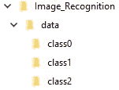

# 构建第一个图像分类器的所有步骤(带代码)

> 原文：<https://towardsdatascience.com/all-the-steps-to-build-your-first-image-classifier-with-code-cf244b015799?source=collection_archive---------1----------------------->

## 从创建数据集到测试您的程序准确性


Photo by [Temple Cerulean](https://unsplash.com/@templecerulean?utm_source=medium&utm_medium=referral) on [Unsplash](https://unsplash.com?utm_source=medium&utm_medium=referral)

如果你想创建一个图像分类器，但不知道从哪里开始，按照这个快速指南来理解概念，并能够训练一个卷积神经网络来识别任何你想要的图像！

为了实现这一点，提供的代码是用 Python (3.x)编写的，我们将主要使用 Keras 库。

首先，如果你对什么是神经网络毫无概念，我只能用快速指南鼓励你去发现这个概念。例如，这是我写的最后一篇:

[](/first-neural-network-for-beginners-explained-with-code-4cfd37e06eaf) [## 第一个为初学者讲解的神经网络(带代码)

### 理解并创造一个感知机

towardsdatascience.com](/first-neural-network-for-beginners-explained-with-code-4cfd37e06eaf) 

现在，我们将重点关注卷积神经网络，它保持了关于列和神经元、输入和输出的相同想法，同时简单地添加了一种提取图像中信息的方法。

## 什么是卷积神经网络？

这种类型的神经网络由一些操作之前的深度神经网络组成。

> O 总之，请记住，图像只是一个数字矩阵，如果图像只有灰度级，则为 2 维，如果图像包含颜色，则为 3 维(第三维适用于所有 RGB 级别)。

首先，当一个图像被提供给算法时，它首先在初始图像上应用一个小的过滤器，并在图像上的任何地方使用它。这一步称为卷积。


Figure 1 — Convolution of a 5x5 image by a 3x3 filter

在图 1 中，初始图像是绿色的，滤镜是黄色的，并将初始图像的每个数字乘以相应滤镜的数字。

在这个操作之后，一个新的矩阵(红色)被获得。通过将红色矩阵的像素与模型进行比较，程序可以确定在第一图像上是否存在对应于模型的物体。

例如，仅在一行像素上获得大数字意味着初始图像在那里包含一行。

下一步叫做汇集。它是关于取每个区域的最高值，并仅使用那些值形成新的矩阵。它降低了矩阵的空间维数，从而有助于神经网络更快地运行。


Figure 2 — Example of Pooling operation

在图 2 中，您可以看到图像的维度被分为 4 个部分，每个部分都有其最高值。新形成的图像更小。

此外，在该过程中使用激活函数来归一化所有获得的值。在下面的例子中，我们将使用 ReLU。

最后，可以使用最后一个步骤来提高精度，该步骤被称为下降。它迫使神经网络在学习阶段随机禁用一些神经元。我们也将在我们的例子中实现这个函数。

现在你已经知道了卷积的基础，我们可以开始构建一个了！

## 准备数据

只有当你想使用你自己的数据，或者在网上找不到的数据，来建立一个可能更适合你需要的卷积神经网络时，这一部分才是有用的。否则，下面是直接使用来自 Keras 的数据集的代码:

```
**from** keras.datasets **import** mnist #replace mnist with any dataset(x_train, y_train), (x_test, y_test) = mnist.load_data()
```

这里，我们简单地调用函数 load_data 来为训练和测试阶段设置数据集。您可以用任何想要使用的数据集替换“mnist”(在两行中都进行更改)。

如果您想创建自己的数据集，以下是步骤:

首先，你需要收集大量的图像。越多越好。请记住为每个班级保留大约相同数量的图像。例如，对于我的 2D 象棋分类器，每个可能的棋子(和空棋子)有 160 张图像，所以总共大约有**2000 张图像**(这并不多)，但是数据集的大小取决于项目(我的 2D 棋子总是有相同的方面，而猫有许多品种、不同的大小、不同的姿势……)。

还有一个强大的工具可以帮助你创建更多的数据，叫做**数据增强**。它只是简单地修改一张图片，然后通过翻转、旋转或裁剪，返回大量新的独特的图片，所有这些都基于第一张图片。



Figure 3 — Example of a folder tree

最后，确保你所有的数据都被分类到一个专门的文件夹中，每个类都有自己的子文件夹。

现在，在主文件夹中，我们将创建一个 python 程序来设置所有数据。

Preparing the data

在第 14 行，您可以将列表更改为您需要的任何类，但是保持您之前用于子文件夹的相同名称。

最后，在运行程序后，数据被设置在文件中，并准备使用。

## 构建卷积神经网络

The convolutional neural network

如果您决定使用导入的数据集，将第 9 & 10 行替换为我们之前看到的内容，将第 44 行替换为:

```
model.fit(x_train, y_train, batch_size=32, epochs=40, verbose=1, validation_data=(x_test, y_test))
```

**在第 37 行**，将 **Dense()** 的参数修改为你所拥有的班级数。这是神经网络可能输出的数量。

对于每个卷积层，你可以看到我们总是首先加上它的神经元数量和滤波器大小。然后，我们涉及到激活函数，最后使用池化方法。我们还在第 30 行添加了一个 Dropout 来看看如何做。

此外，在第一个“正常”隐藏层之前，我们添加了函数 **Flatten()** ，该函数将之前卷积的所有信息转换为神经元的输入。在这一点上，剩下的只是包含来自基本神经网络的层和神经元。

在这里，你建立了自己的分类器！

## 预测图像类别

现在，你可以使用你的神经网络来预测任何你想要的图像。简单地写一个包含这几行的小脚本:

```
**import** cv2
**import** tensorflow **as** tfCATEGORIES = ["bishopB", "bishopW", "empty", "kingB", "kingW",
			"knightB", "knightW", "pawnB", "pawnW",
			"queenB", "queenW", "rookB", "rookW"]**def** prepare(file):
    IMG_SIZE = 50
    img_array = cv2.imread(file, cv2.IMREAD_GRAYSCALE)
    new_array = cv2.resize(img_array, (IMG_SIZE, IMG_SIZE))
    return new_array.reshape(-1, IMG_SIZE, IMG_SIZE, 1)model = tf.keras.models.load_model("CNN.model")
image = "test.jpg" #your image path
prediction = model.predict([image])
prediction = list(prediction[0])
print(CATEGORIES[prediction.index(max(prediction))])
```

函数 prepare(file)允许我们使用任何大小的图像，因为它会自动将图像调整到我们在第一个程序中定义的大小。

如果您在数据程序中修改了图像尺寸，也请在此处修改。

就是这样！您只是构建了适合您自己图像的图像分类器。当然，不要犹豫修改你看到的任何一行代码，因为你的神经网络的准确性可能会根据这些参数而有很大的不同。以下是其中的一部分:

*   模型:你可以很容易地在你的神经网络中添加或删除一些层，改变神经元的数量，甚至是激活函数。你有你想要添加的任何东西的模型。
*   数据:获得的精度不是你所期望的？也许你可以添加更多的数据，主要是验证你所有的图像都存储在他们的好文件夹。
*   IMG 大小:在程序中为数据集定义，它表征了网络将要处理的图像的大小。不要尝试太大的数字，因为高质量的图像会导致更长的训练阶段。此外，即使是著名的数据库，如 MNIST，包含的图像也非常少(MNIST 为 28x28)。不要忘记在最后一个程序中修改整形函数的 IMG 大小。
*   Keras 使用的新参数，如回调。一个叫做“早期停止”的方法可以帮助你提高训练阶段的长度，主要是避免过度适应。

有了这个指南，我们刚刚够你创建和理解你的第一个卷积神经网络。如果你愿意，还有许多其他参数或方面可以发现，所以不要犹豫，继续前进。

> 感谢阅读！
> 
> 我希望这个小指南有用，如果你有任何问题和/或建议，请在评论中告诉我。