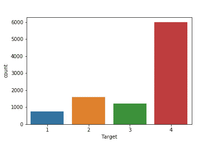
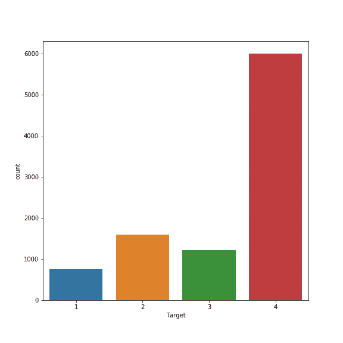
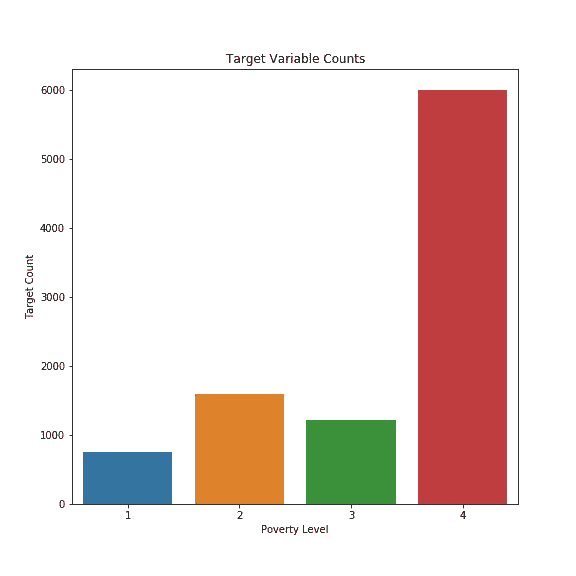
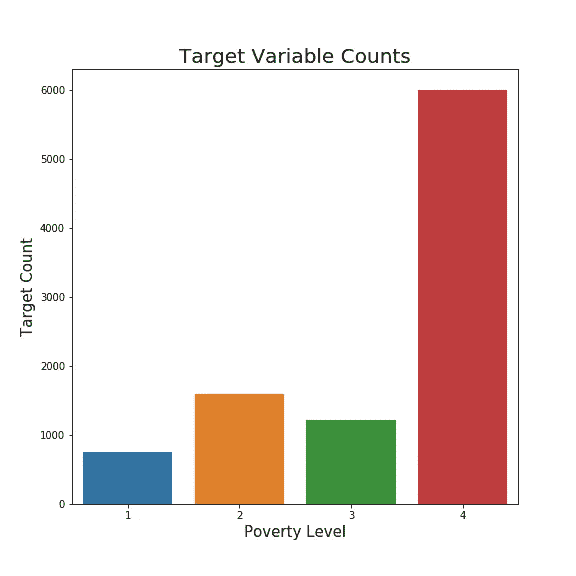
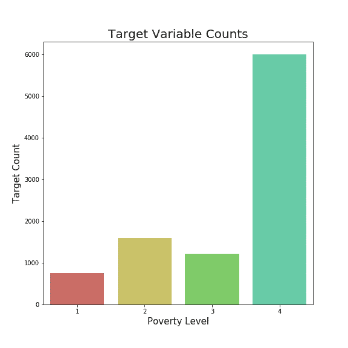
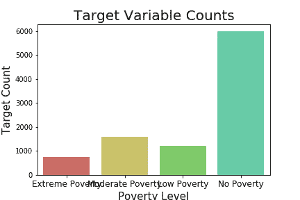
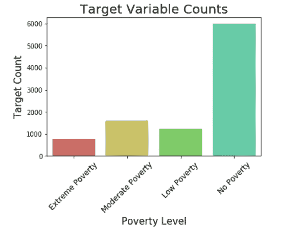
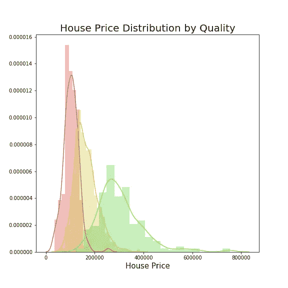
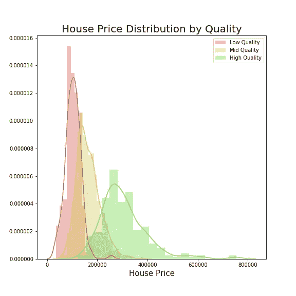
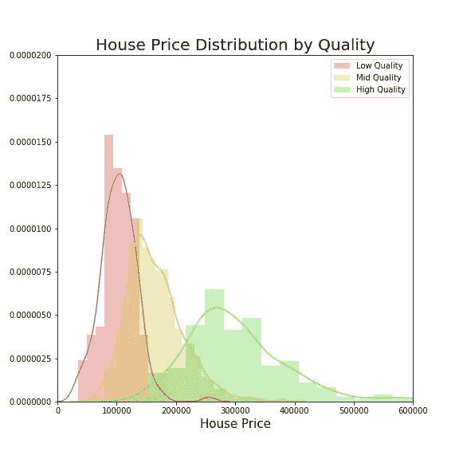

# 在 Seaborn 中，您可以自定义图表和图形的所有方式

> 原文：<https://towardsdatascience.com/all-the-ways-you-can-customize-your-charts-and-graphs-in-seaborn-9be90fa6f5b5?source=collection_archive---------26----------------------->

一个关于如何使图形美观易懂的代码演示

Photo by [Amaury Salas](https://unsplash.com/@eseamau?utm_source=medium&utm_medium=referral) on [Unsplash](https://unsplash.com?utm_source=medium&utm_medium=referral)

# 介绍

在数据科学领域，Jupyter 笔记本是一种非常流行的数据探索和实验工具。由于笔记本的性质，它们也允许数据很容易地图形化和可视化。可视化数据可能是一个很好的探索工具，但当您想要与他人共享您的工作时，它也变得很重要。为了与他人分享你的工作，特别是与管理人员，你最好知道如何制作一些好看的、能被理解的图表。

# Seaborn 图书馆

谈到可视化，我个人的选择是 [seaborn](https://seaborn.pydata.org/) 。Seaborn 是一个建立在 [Matplotlib](https://matplotlib.org/) 基础上的库，使它更容易使用，也更吸引人。如果你不太熟悉 Matplotlib，在 seaborn 中定制你的绘图会很困难，因为它使用 Matplotlib 的语法来改变图形的部分。下面，我有你需要的所有代码，让你的图表容易理解。您可以使用 Matplotlib 和 seaborn 做很多事情，这肯定不是包罗万象的，但它应该会给您一个很好的起点。

# 数据

对于这些例子，我从 Kaggle 获取了一些容易获得的数据。我从[哥斯达黎加贫困挑战](https://www.kaggle.com/c/costa-rican-household-poverty-prediction)和[房价回归挑战](https://www.kaggle.com/c/house-prices-advanced-regression-techniques)中抓取数据。

# 形象化

## 基本图形

首先，我们将导入我们将使用的库，并制作一个简单的图表。我们将查看我们正在处理的第一个数据集的目标变量贫困水平的计数。

从一行代码中，我们得到了一个漂亮的图形。这里没有太多的信息，但至少看起来不错。虽然可能有点小。让我们添加另一行代码来更改图形的大小，使其稍微大一点。

现在更容易看到了。在 figsize 参数中，你可以放入任何你想要的尺寸来改变你的图形的大小。它只需要一个类似于(height，width)的参数。

## 标记图表

现在我们已经有了一个很容易看到的大小合适的图表，我们需要让图表的目的更清楚一点。我们只需要几行代码就可以添加标题和轴标签。

现在我们到了这样一个点，有些人并不真正知道发生了什么，但看了这个图表，就对我们正在做的事情有了一些了解。尽管如此，阅读那些微小的字体还是有点困难。让我们解决这个问题。

对我来说，这看起来是一个非常易读的图表。我们所有的东西都有清晰的标签，而且足够大，所以看起来很像样。

## 设计

现在，图表已经清楚了正在发生的事情，我们可以做一些调整，使它更有吸引力，并添加更多的细节。我们可以做到这一点的第一个方法是改变我们的图表使用的调色板。

我们的图表现在有点不同了。Seaborn 支持许多不同的配色方案。你可以在这里查看它们。一旦设置了配色方案，它就为笔记本的其余部分设置好了。因此，您可以在顶部设置一次，或者为每个图形更改它。

我们还可以添加一些细节，使我们的图表更加清晰。你可能想知道哪个贫困水平是好的，哪个是坏的。因为我们只是把它们标为数字，所以稍微澄清一下可能会有好处。

现在我们已经明确了每个目标标签的含义。让我们回到我们的小图表，画出同样的东西。

这是一个非常不专业的图表。我们所有的标签相互重叠，很难阅读。幸运的是，有一个简单的方法可以让它看起来更好。我们要给我们的标签一个小小的转变。

就这样，我们的图形又可读了。这可以很好地服务于长标签，或者只是让图形看起来更好一点。

接下来，我们将深入研究其他数据。我们将使用我们已经看过的工具绘制三个不同质量水平的房价分布图。

我们这里有一个非常漂亮的图表。唯一的问题是，我们无法知道哪个分布是哪个。与上一张图不同，我们不能在 x 轴上标记我们的组。相反，我们需要在图表中添加一个图例。

有了图例，我们可以知道哪个分布与哪个质量组相关，我们的图表又有意义了。

最后，我们将看看如何操作图的维度。如果我们不太关心高质量组的长尾，并且希望放大主要分布，我们可以设置不同于默认的轴限制。这里，我们将 y 轴设置为略高于默认值，并将 x 轴设置为 600，000。

我们的图表向我们展示了现在分布的主要部分。如果有一两个异常值使你很难读懂其余的图表，这可能是有用的。

# 结论

这些只是一些提示和技巧，帮助你定制你的海伯恩情节。你还可以用它做更多的事情。如果您想了解更多自定义图形的方法，请通读 Matplotlib 文档。我希望这是有帮助的，你的图表现在可以与世界分享了。