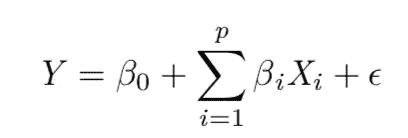
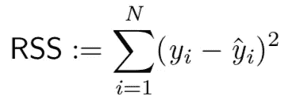
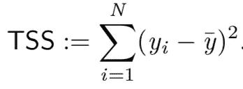
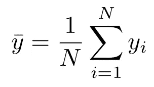
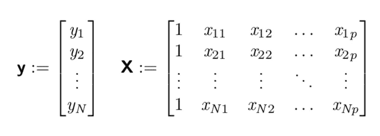

# 面试前你需要知道的关于线性回归的所有代数知识

> 原文：<https://towardsdatascience.com/all-you-need-to-know-about-linear-regression-to-be-interview-ready-fc58a00a0b8c?source=collection_archive---------7----------------------->

Photo by [John Moeses Bauan](https://unsplash.com/@johnmoeses?utm_source=medium&utm_medium=referral) on [Unsplash](https://unsplash.com?utm_source=medium&utm_medium=referral)

线性回归是数据科学中最简单也是最重要的算法之一。无论你面试的是数据科学、数据分析、机器学习还是量子研究领域的工作，你最终都可能不得不回答关于 LR 的特定代数问题。以下是你需要知道的，让你对自己的 LR 知识充满信心。

*注:本文全是理论，无编码。它还假设您已经至少对代数有一点熟悉。*

# **知道自己的假设**

虽然本文假设您已经对 LR 有所了解，但是让我们提醒一下公式和假设。给定 N 个观察值，一个输出向量 Y(维数为 Nx1)和 p 个输入 x1，X2，…，Xp(每个输入向量的维数为 Nx1)， **LR 假设回归函数 E(Y|X)在输入**中是线性的。y 因此统计:

其中**ε是误差项**。线性假设实际上是 LR**唯一严格必要的假设**在本文后面，我们将看到我们可以添加更多的假设来推断更多的结果。

虽然上面的公式看起来很简单，但找到系数(β)并不总是很容易——继续向前，我们将把β称为系数的估计值。

# 了解关键指标的定义

以下是你绝对需要知道(牢记)的 3 个指标:

*   **RSS** 是残差平方和

其中 *y_i* 为观测值 *i* 的输出， *ŷ_i* 为观测值 i *:* 的估计输出

*   TSS 是平方和的总和

在哪里

*   **R 平方**，它是 X 和 Y 之间线性关系的量度

只要你知道这些公式，你就应该能够通过逻辑推理推断出所有其他的结果。

# **知道答案:如何(何时)计算它**

正如我们之前所说，LR 的关键是找到系数的估计值。我们通过**最小化 RSS 找到这些。为此，让我们定义 X 和 Y 为**

注意，为了考虑截距β_ 0，我们必须在输入矩阵中添加一列 1。我们的最小化问题等价于求解:

因此，我们可以计算右边项的**梯度**:

对于我们的估计 hat 应该等于 0。

**假设 X** ⊤ **X 是非奇异的，**这给了我们一个显式解 **:**

这是一个你需要知道的公式，但是你也应该能够证明它，就像上面做的那样。非奇点的假设是这里的关键。我们还推断出 y 估计的公式:

知道**维 Nx1** (1 个输入变量)中的显式解也是有用的:

其中 *x* 在这里是一个向量(不是矩阵)——当你已经有了更一般的解决方案时，很容易记住:X⊤X 成为输入的方差(在一维中，求一个项的倒数等于除以那个项)，X⊤y 成为协方差项。你也可以通过在一维空间做类似的计算来计算这个解。

# 熟悉假设检验(假设正态误差)

在采访中，对 LR 有一些统计概念也很重要。

本节假设你已经掌握了统计测试的基础知识(包括 [t 统计](https://en.wikipedia.org/wiki/T-statistic)、 [f 统计](https://en.wikipedia.org/wiki/F-distribution)和[假设检验](https://en.wikipedia.org/wiki/Statistical_hypothesis_testing))。

假设正常误差，即

(别忘了ε在这里是矢量！)那么我们的估计解满足:

因此

这就把我们带到了

这一发现有助于评估系数β_ j 为零的**零假设**:我们可以计算 **t-score**

**在零假设**下，t_j 遵循具有 N-p-1 个自由度的 t 分布，而**对于足够大的 N**遵循正态分布。

计算这个分数可以帮助你评估零假设。例如，**找到高于 1.96 的|t_j|分数将确保系数β_ j 不为空的 5%显著性。**

您还可以计算给定系数的**置信区间**:近似的**(1–2 * alpha)-置信区间**由下式给出

我们使用标准正态曲线下的面积来计算:

我们还可以通过计算 F-stat 来检验假设**,即每个系数都为零**

在无效假设下，遵循 F(p，N-p-1)分布。因此，F 的大值构成了反对零假设的证据。

# 红利 1:我们为什么要做最小二乘法？

当我们寻找β的最优估计时，我们本能地跳到了最小二乘优化，但是为什么呢？首先，我们可以证明(我们不会在这里，查看[这篇文章](http://www.unm.edu/~lspear/geog525/24linreg2.pdf)了解更多细节)最小二乘估计量是无偏的，即

接下来，实际上有一个定理证明最小二乘估计量**具有最小方差**。这就是[高斯-马尔可夫定理](https://en.wikipedia.org/wiki/Gauss–Markov_theorem):它表明**最佳无偏估计量是最小二乘**。

# **加成 2:当** X⊤X **排名不全怎么办？**

首先，我们来看看这是什么时候发生的。让我们提醒自己，X 的维数是(N，p+1)。那么 X⊤X 就是(p+1，p+1)。我们可以证明 **X⊤X 是全排名的当且仅当 x 是排名 p+1，** **这迫使 N > p** 。这里可以看到证明[。这意味着这些特征是线性独立的(但不一定不相关)。](https://math.stackexchange.com/questions/691812/proof-of-when-is-a-xtx-invertible)

当情况并非如此时(当我们的特征多于观察值时)，我们可以使用**收缩方法**如岭回归。的确，当我们在 X⊤X 的对角线上增加一项时，问题就变得可行了。对于**岭回归**的例子:

有一个解决方案:

的确，因为 X⊤X，是[正半定的](https://en.wikipedia.org/wiki/Definiteness_of_a_matrix)，它的特征值都是正的，在对角线上加一个正项就使它全秩了。所以这使得问题非奇异。这就是我们必须对 p > > N 的情况应用**正则化技术**的原因之一